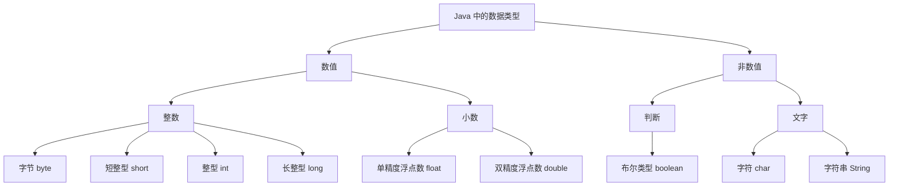

# 第二章 变量和数据类型

## 课前回顾

1. **什么是程序？**

   程序就是为了解决某个问题或者实现某个目标而编写的一系列有序指令的集合

2. **Java 程序是如何执行的？**

   Java 是一门高级语言，计算机不能够直接识别我们编写的 Java 程序。因此，Java 提供了 JVM（Java Virtual Machine，Java 虚拟机），JVM 能够将 class 文件转换为计算机能够识别的指令，而我们编写的源程序是 java 文件，所以还需要使用编译器将我们编写的源程序编译为 class 文件

   ```text
   javac java文件的位置  =>  类名.class
   java 类名             =>  告诉 JVM 应该加载指定类名的类进入 JVM，
                           然后执行该类的 main 方法，程序开始执行
   ```

3. **Java 程序是如何实现跨平台的？**

   首先，要执行 Java 程序，必须要具备 Java 运行时环境，也就是 JRE，而 JRE 中就包含有 JVM，而 JVM 能够将 class 文件翻译为当前平台能够识别的指令。因此，不管什么平台，只要安装 JRE，都会具备 JVM，只要具备 JVM，就能将 class 文件翻译为当前平台能够识别的指令。

   ```text
   windows => 安装 windows 版的 JRE
   linux   => 安装 linux 版的 JRE
   ```

4. **所有 Java 程序执行的入口是什么？**

   ```java
   public static void main(String[] args) {
   }
   ```

## 主要内容

| 主要内容 | 要求 |
| :--- | :--- |
| 使用 InteliJ Idea 创建工程 | 熟悉 |
| Java 中的数据类型 | **重点** |
| 变量的定义与使用 | **重点** |
| 运算符 | 熟悉 |
| 数据类型转换 | **重点** |
| Scanner 的基本使用 | 熟悉 |

## 课程目标

- 熟悉使用 InteliJ Idea 创建工程
- 掌握 Java 中的 8 种基本数据类型
- 掌握变量的本质及运用
- 掌握数据类型之间的相互转换
- 熟练使用 Scanner

---

## 第一节 使用 InteliJ Idea 创建工程

演示

---

## 第二节 Java 中的数据类型

### 1. 数据的概念

数据就是信息的符号表示。

> 华为手机　荣耀　999.9元　2年
>
> 刘德华　帅　20　185　富豪

### 2. 数据类型

**生活中我们常见的数据类型**



> a　abcde　他长得很帅

**Java 中的数据类型分为 基本数据类型 和 引用数据类型 两大类**

> 💡 补充：图中 `String`（字符串）虽然画在「非数值」一侧，但它属于**引用数据类型**，不在 8 种基本数据类型之列。

**Java 中的基本数据类型**

| 大类型 | 类型名称 | 英文 | 占用空间 | 取值范围 |
| :--- | :--- | :--- | :--- | :--- |
| 整型 | 字节 | byte | 1字节 | $-2^{7} \sim 2^{7}-1$ |
| 整型 | 短整型 | short | 2字节 | $-2^{15} \sim 2^{15}-1$ |
| 整型 | 整型 | int | 4字节 | $-2^{31} \sim 2^{31}-1$ |
| 整型 | 长整型 | long | 8字节 | $-2^{63} \sim 2^{63}-1$ |
| 小数 | 单精度浮点数 | float | 4字节 | $-2^{127} \sim 2^{127}-1$ |
| 小数 | 双精度浮点数 | double | 8字节 | $-2^{1023} \sim 2^{1023}-1$ |
| 判断 | 布尔类型 | boolean | 1字节 | true 或者 false |
| 文字 | 字符 | char | 2字节 | 键盘能敲出来的单个文字或符号 |

> a　男　1

其中，字节是计算机存储数据的基本计量单位。计算机中最小单位是位，英文（Bit），位与字节的单位换算关系为：

```text
1 B = 8 bit
```

**常用计量单位换算**

| 类型名称 | 英文名称 | 缩写 | 单位换算 |
| :--- | :--- | :--- | :--- |
| 字节 | Byte | B | - |
| 千字节 | KiloByte | KB | 1KB = 1024B |
| 兆字节 | MegaByte | MB | 1MB = 1024KB |
| 吉字节 | GigaByte | GB | 1GB = 1024MB |
| 太字节 | TeraByte | TB | 1TB = 1024GB |
| 拍字节 | PetaByte | PB | 1PB = 1024TB |

---

## 第三节 变量的定义与使用

> 每年的 10 月 24 日都是程序员节日

### 1. 变量的概念

- 从字面意思看，变量就是会变化的量。
- 从计算机专业角度看，变量就是一个内存空间地址的表示。

**在 Java 中，内存分为栈内存和堆内存两大块**

### 2. 变量的声明

**语法**

```java
数据类型 变量名;
变量名 = 变量值;

数据类型 变量名 = 变量值;
```

**示例**

```java
/**
 * 变量的定义
 * @author wu
 */
public class Example1 {

    public static void main(String[] args) {
        //数据类型 变量名;
        //变量名 = 变量值;
        byte b; //告诉计算机在栈上开辟一块1个字节大小的空间，并将这块空间命名为b
        b = 10; //告诉计算机将整数10放入开辟好的空间b中
        //数据类型 变量名 = 变量值;
        //告诉计算机在栈上开辟一块2个字节大小的空间，并将这块空间命名为s，
        //然后将整数5放入这块空间中
        short s = 5;
        //告诉计算机在栈上开辟一块4个字节大小的空间，并将这块空间命名为age
        //然后将整数20放入这块空间中
        int age = 20;
        //将整数25放入名为age的内存空间中
        age = 25;
        long time = 20210312;
        //在Java中，浮点数默认是双精度浮点数。如果要给一个单精度浮点数变量赋值，需要在变量值
        //后面加上一个f或者F，表示是单精度浮点数
        float f = 10.0F;
        double score = 65.5;
        //在Java的布尔类型变量，编译完成后就不存在了。因为Java在C++基础上开发的，而C++中使用
        //0 与 非0表示假和真。而JVM是执行Java程序的场所，在JVM规范中有明确说明，单个boolean
        //类型的变量，在编译的过程中会被翻译为int类型的变量，此时占用4个字节的空间。对于boolean
        //类型的数组，在翻译的过程中会被翻译为byte类型的数组，此时每个变量占用1个字节的空间。
        boolean isNice = true;
        //char类型变量能否存在汉字？
        //能。Java采用的是Unicode编码，而Unicode编码中收录的汉字占用的是2个字节，我们的char类型
        //变量也是占用2个字节的空间，因此，在Unicode编码中收录的汉字可以使用char类型变量存储。而
        //在Unicode编码中未收录的汉字不一定能够使用char类型变量存储。
        char sex = '男';
        //Java语言是严格区分大小写的
        int number = 5;
        int NUMBER = 5;

        String myName = "张帅";
        String xingMing = "张华";

    }
}
```

**在 Java 中变量名必须保证唯一**

### 3. 变量的命名规则

- **变量名只能以字母、下划线和 `$` 开始，其余部分由任意多的字母、数字、下划线和 `$` 组成。**
- **变量名不能是 Java 中的保留字（关键字）。**
- Java 语言是严格区分大小写的

```java
//Java语言是严格区分大小写的
int number = 5;
int NUMBER = 5;
```

### 4. 变量的命名规范

在 Java 中，变量名采用的是驼峰命名法。变量名组成的第一个单词的首字母小写，其余单词首字母均大写。

---

## 第四节 运算符

### 1. 常规运算符（+ - * /）

**示例**

```java
/**
 * 运算符操作 + - * /
 * @author wu
 */
public class Example2 {

    public static void main(String[] args) {
        //变量在使用之前必须完成初始化操作。换言之就是给变量赋值。
//        int a, b;
//        a = 5;
//        b = 10;
        int a = 5, b = 10;//可以在一行代码中同时声明多个变量并完成赋值
        int c = a + b;
        System.out.println("a + b = " + c);
        int d = b - a;
        System.out.println("b - a = " + d);
        int e = a * b; //注意：在Java中乘法使用的是*
        System.out.println("a * b = " + e);
        int f = b / a; //注意：在Java中除法使用的是/
        System.out.println("b / a = " + f);
    }
}
```

### 2. 取模（%）

**示例**

```java
int a = 10 % 3; //求10除以3的余数
System.out.println("10 % 3 = " + a);
```

**案例**

给定一个数，如 5678，求组成这个数的每一位数字

**代码实现**

```java
//21 % 10 = 1
//5678 / 10 = 567
//5678 / 100 = 56
//5678 / 1000 = 5
int number = 5678;
int ge = number % 10;
//在Java中，两个整数相除，得到的结果一定是整数
int shi = number / 10 % 10;
int bai = number / 100 % 10;
int qian = number / 1000;
System.out.println("个位：" + ge); //ctrl + d 复制一行代码
System.out.println("十位：" + shi);
System.out.println("百位：" + bai);
System.out.println("千位：" + qian);
```

**在 Java 中，两个整数相除，得到的结果一定是整数**

### 3. ++ 和 --

**示例**

```java
//++运算符分为前置++和后置++
int count = 0;
count++;//表示自加1 => count = 1;
++count;//表示自加1 => count = 2;
//如果一行代码中，只有++运算符，没有其他运算符，那么不论++在前，还是在后执行结果都是一样的
//因为++运算符在变量的后面，因此，先将变量count的值赋值给变量number1,然后变量count自加1
int number1 = count++; //number1 = 2 count = 3;
//因为++运算符在变量的前面，因此，变量count先自加1，然后将count变量赋值给变量number2
int number2 = ++count; //count = 4  number2 = 4;
System.out.println(number1);
System.out.println(number2);
```

**面试题：分析下面代码的执行过程**

```java
int c = 10;
//在java中运算都是从左往右依次执行，因此c++先执行，++c后执行。
//c++ => c = 10; => c = 11;
//++c => c = 12
int d = c++ + ++c;
System.out.println(d); //22 11+11? 10+12?
```

> 💡 补充：`c++ + ++c` 从左往右取值，先取 `c++` 的值为 10（取完后 c 变为 11），再取 `++c` 的值为 12（c 先自增到 12），因此 `d = 10 + 12 = 22`。

### 4. += 、-= 、*= 、/= 、%=

**示例**

```java
/**
 * 运算符操作 += -= *= /= %=
 */
public class Example4 {

    public static void main(String[] args) {
        int number1 = 10;
        //将number1 + 10 的结果赋值给number1
        number1 = number1 + 10;
        number1 += 10;//与上一行代码的作用是一样的


        double d1 = 20.0;
        d1 = d1 / 2;
        d1 /= 2; //与上一行代码的作用是一样的

        int result1 = 10;//整数
        double add = 2.0;//浮点数
        result1 = (int)(result1 + add); // 10 + 2.0 => 10.0 + 2.0 => 12.0 双精度浮点数 占用8个字节空间，因此不能给占用4个字节空间的变量result1赋值
        result1 += add; //说明 += 还具有其他的功能：具有强制转换的功能
    }
}
```

---

## 第五节 数据类型转换

### 1. 自动类型转换

相互兼容的多种数据类型在运算时，小转大即为自动类型转换。如：`10 + 0.5 => 10.0 + 0.5`

### 2. 强制类型转换

相互兼容的多种数据类型在运算时，大转小即为强制类型转换。如：`68.5 + 1.5 => (int)70.0 => 70`

**强制类型转换语法规则：**

```java
(目标数据类型) 变量名
```

**在 Java 中，数值类型互相兼容，在进行运算时，必须保证表达式中的参与运算的数据的所有数据类型保持一致**

### 3. 案例

小明考试的时候考了 59 分，小明感觉很憋屈，于是奋发图强，然后下一次考试比上一次考试多考了 1.5 分，请问小明本次考试考了多少分？

### 4. 代码实现

```java
/**
 * 小明考试的时候考了59分，小明感觉很憋屈，于是奋发图强，然后下一次考试比上一次考试多考了1.5分，
 * 请问小明本次考试考了多少分？
 */
public class Example5 {

    public static void main(String[] args) {
        int score = 59;
        //自动类型转换
        double nextScore = score + 1.5; // 59 + 1.5 => 59.0 + 1.5 => 60.5
        System.out.println(nextScore);
        //强制类型转换
        int nScore = (int)(score + 1.5); // 59 + 1.5 => 59.0 + 1.5 => 60.5
        System.out.println(nScore);
    }
}
```

---

## 第六节 Scanner 的基本使用

### 1. Scanner 的作用

提供一种与用户交互的方式，用户可以在控制台输入一些数据，程序来获取这些数据

### 2. 常用方法

| 方法名 | 解释说明 |
| :--- | :--- |
| `nextDouble()` | 获取用户从控制台输入的浮点数，如果输入的不是数字，就会出错 |
| `nextFloat()` | 获取用户从控制台输入的浮点数，如果输入的不是数字，就会出错 |
| `nextInt()` | 获取用户从控制台输入的整数，如果输入的不是整数，就会出错 |
| `nextByte()` | 获取用户从控制台输入的整数，如果输入的不是整数，就会出错 |
| `nextShort()` | 获取用户从控制台输入的整数，如果输入的不是整数，就会出错 |
| `nextLong()` | 获取用户从控制台输入的整数，如果输入的不是整数，就会出错 |
| `nextBoolean()` | 获取用户从控制台输入的 boolean 值，只能输入 true 或者 false，否则就会出错 |
| `next()` | 获取用户从控制台输入的字符串 |

### 3. 案例

从控制台输入 3 位学生的成绩，然后计算平均分

### 4. 代码实现

```java
import java.util.Scanner;

/**
 * 从控制台输入3位学生的成绩，然后计算平均分
 */
public class Example7 {

    public static void main(String[] args) {
        Scanner sc = new Scanner(System.in);
        System.out.println("请输入3位学生成绩（每一位学生成绩可以使用空格隔开）：");
        int score1 = sc.nextInt();
        int score2 = sc.nextInt();
        int score3 = sc.nextInt();
        int avg = (score1 + score2 + score3) / 3;//在Java中，两个整数相除，得到的结果一定是整数
        System.out.println(avg);
    }
}
```
