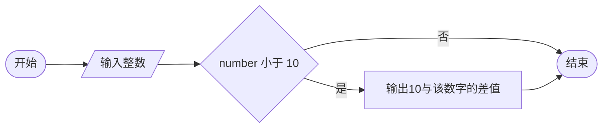
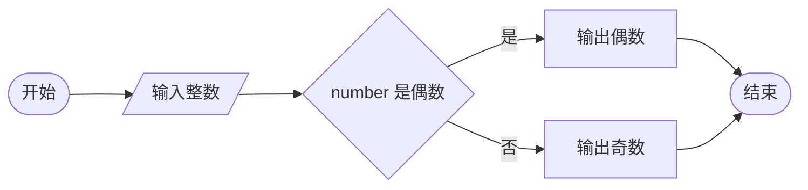
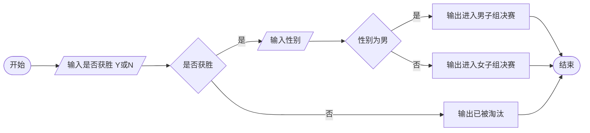
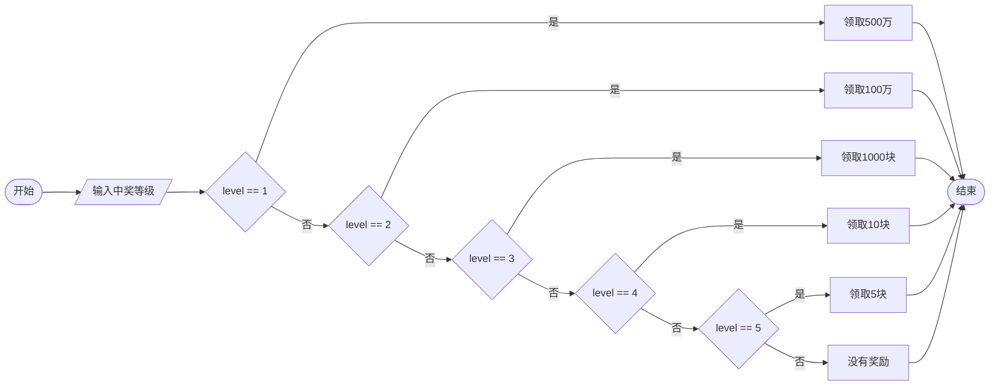
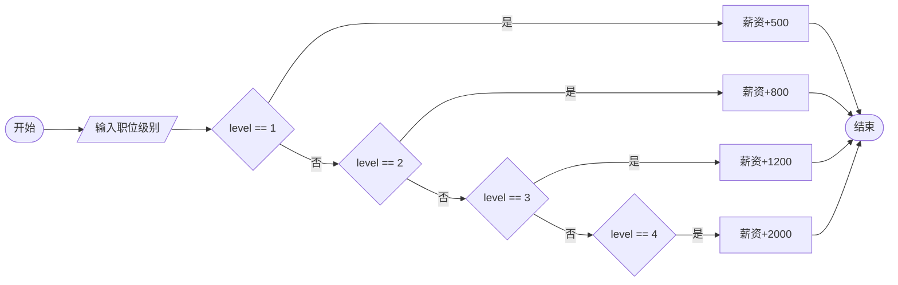

# 第三章 选择结构

## 课前回顾

**1. Java 中的 8 种基本数据类型及内存占用情况**

| 整数 | | | | 小数 | | 布尔值 | 字符 |
| :--- | :--- | :--- | :--- | :--- | :--- | :--- | :--- |
| byte | short | int | long | float | double | boolean | char |
| 1 | 2 | 4 | 8 | 4 | 8 | 4 | 2 |

**2. 变量的定义语法及使用规则**

```java
//1 数据类型  变量名;
//  变量名 = 变量的值;
int a; //告诉计算机在内存空开辟一块4个字节的内存空间，并将这块空间命名为a
a = 5; //告诉计算机将5放入内存空间a中

//2 数据类型 变量名 = 变量的值;
double score = 90.5; //告诉计算机在内存中开辟一块8个字节的内存空间，并将这块空间命名为score，然后将90.5放入这块空间中

//变量在使用之前必须经过初始化操作，也就是变量在使用之前必须赋值
int age1, age2;
int totalAge = age1 + age2;//编译器会报错，因为变量age1和age2没有初始化
```

**3. 变量的命名规则**

- 变量名必须以字母、下划线、`$` 开始，其余部分由任意多的字母、数字、下划线和 `$` 组成。
- 变量名不能使用 Java 中的保留字（关键字）

**4. 前置 ++ 和后置 ++ 的区别**

```java
int a = 10;
a++;//++a;
//在一行代码中，如果只有++运算符，没有其他的运算符，那么++在前在后没有区别。
//在表达式中，除了++运算符之外还有其他的运算符时，++在前就先自加，然后再利用自加后的结果参与运算。++在后，就先利用本身的值参与运算，运算完之后再自加
int b = a++ + ++a;
// a++因为是后置++，因此先将变量a的值（11）拿来参与运算，++a因此是前置++，因此先自加，将得到的结果（13）拿来参与运算，
//因此结果是11+13=24
//++a => a=14   a++=> a=15
int c = ++a + a++;//14 + 14 =28
```

**5. 数据类型转换规则**

- 自动类型转换：小转大　`10L => 10.0f`
- 强制类型转换：大转小　`65.5 => (int)65`

**6. Scanner 的基本使用**

```java
import java.util.Scanner;

Scanner sc = new Scanner(System.in);
//从控制台获取一个字符串
String name = sc.next();
//从控制台获取一个整数
int age = sc.nextInt();
//从控制台获取一个单精度浮点数
float rate = sc.nextFloat();
```

## 主要内容

| 主要内容 | 要求 |
| :--- | :--- |
| 关系运算符 | 熟悉 |
| 逻辑运算符 | 熟悉 |
| 流程图 | 熟悉 |
| if 选择结构 | **重点** |
| 嵌套 if 选择结构 | **重点** |
| 多重 if 选择结构 | **重点** |
| 逻辑短路 | **重点** |
| switch 选择结构 | **重点** |
| Scanner 输入验证 | **重点** |

## 课程目标

- 会使用关系运算符和逻辑运算符
- 会绘制流程图
- 掌握所有选择结构的运用
- 掌握逻辑短路的两种触发情况

---

## 第一节 关系运算符和逻辑运算符

### 1. 关系运算符

关系运算符包含 `> < >= <= != ==`

```java
boolean result = 2 > 3;

boolean result1 = 10 == 10;
```

关系运算符比较的结果是一个布尔值

### 2. 逻辑运算符

逻辑运算符包含

- **逻辑与 `&&`**：主要用来衔接多个条件，表示这些条件必须要同时满足时结果才为真（只要衔接的条件有一个为假，结果为假）
- **逻辑或 `||`**：主要用来衔接多个条件，表示这些条件必须要同时不满足时结果才为假（只要衔接的条件有一个为真，结果为真）
- **逻辑非 `!`**：主要用于单个条件的取反

```java
boolean result = 2 > 3 && 5 > 4;//false

boolean result1 = 2 > 3 || 5 > 4; //true

boolean result2 = !(2 > 3); //true
```

---

## 第二节 流程图

### 1. 什么是流程图

流程图就是使用统一的标准图形来描述程序执行的过程

### 2. 为什么要使用流程图

流程图简单直观，能够很方便的为程序员编写代码提供思路

### 3. 流程图的基本元素

| 图形 | 元素 | 含义 |
| :--- | :--- | :--- |
| 圆角矩形 | 流程开始/结束 | 表示流程的开始或者结束 |
| 矩形 | 流程 | 表示一个处理步骤 |
| 菱形 | 条件 | 表示需要判断的条件 |
| 平行四边形 | 输入 | 表示数据的输入 |
| 双竖线矩形 | 子流程 | 表示调用另外一个子流程 |
| 箭头 | 流程线 | 表示流程执行的方向 |

---

## 第三节 if 选择结构

### 1. 基本 if 选择结构

**语法**

```java
if(条件){ //如果条件满足，则执行代码块
    //代码块
}
```

**案例**

从控制台输入一个整数，如果该数字小于 10，则输出 10 与该数字的差值。

**流程图**



**代码实现**

```java
import java.util.Scanner;

/**
 * 从控制台输入一个整数，如果该数字小于10，则输出10与该数字的差值。
 */
public class Example1 {

    public static void main(String[] args) {
        Scanner sc = new Scanner(System.in);
        System.out.println("请输入一个整数：");
        int number = sc.nextInt();
        if(number < 10){
            int diff = 10 - number;
            System.out.println("10与该数字的差值是：" + diff);
        }
    }
}
```

### 2. if-else 选择结构

**语法**

```java
if(条件){ //如果条件满足，则执行代码块1
    //代码块1
} else { //否则，执行代码块2
    //代码块2
}
```

**案例**

从控制台输入一个整数，如果该数字是偶数，则输出输入的数字 "是偶数"，否则输出输入的数字 "是奇数"。

**流程图**



**代码实现**

```java
import java.util.Scanner;

public class Example2 {

    public static void main(String[] args) {
        Scanner sc = new Scanner(System.in);
        System.out.println("请输入一个整数：");
        int number = sc.nextInt();
        if(number % 2 == 0){
            System.out.println("是偶数");
        } else {
            System.out.println("是奇数");
        }
    }
}
```

**三元一次运算符（条件 ? 表达式1 : 表达式2）**

`?` 表示的意思是询问前面的条件是否满足，如果满足，则使用表达式1。`:` 表示否则，即条件不满足，使用表达式2

```java
import java.util.Scanner;

/**
 * 从控制台输入一个整数，如果该数字是偶数，则输出输入的数字"是偶数"，否则输出输入的数字"是奇数"。
 */
public class Example2 {

    public static void main(String[] args) {
        Scanner sc = new Scanner(System.in);
        System.out.println("请输入一个整数：");
        int number = sc.nextInt();
//        if(number % 2 == 0){
//            System.out.println("是偶数");
//        } else {
//            System.out.println("是奇数");
//        }
        System.out.println((number % 2 == 0) ? "是偶数" : "是奇数");
    }
}
```

**三元一次运算符执行效率相较于 if-else 选择结构来说较为低下，不建议大家常用**

### 3. 嵌套 if 选择结构

**语法**

```java
if(条件1){//如果条件1满足，则执行其后大括号中的代码块
    if(条件2){ //在满足条件1的基础上再满足条件2
        //代码块
    } else {//该结构可以省略不写，表示其他情况不做任何处理
        //代码块
    }
} else {//该结构可以省略不写，表示其他情况不做任何处理
    if(条件3){ //在不满足条件1的基础上再满足条件3
        //代码块
    } else {//该结构可以省略不写，表示其他情况不做任何处理
        //代码块
    }
}
```

**案例**

在半决赛中，如果取得胜利，则可以进入决赛。否则，输出 "已被淘汰"。如果是男子，则输出 "进入男子组决赛"；否则，输出 "进入女子组决赛"。

**流程图**



**代码实现**

```java
import java.util.Scanner;

/**
 * 在半决赛中，如果取得胜利，则可以进入决赛。否则，输出"已被淘汰"。
 * 如果是男子，则输出"进入男子组决赛"；否则，输出"进入女子组决赛"。
 */
public class Example3 {

    public static void main(String[] args) {
        Scanner sc = new Scanner(System.in);
        System.out.println("请输入是否获胜(Y/N)：");
        String win = sc.next();
        //比较字符串相同使用字符串的equals方法
        if("Y".equals(win)){
            System.out.println("请输入性别：");
            String sex = sc.next();
            if("男".equals(sex)){
                System.out.println("进入男子组决赛");
            } else {
                System.out.println("进入女子组决赛");
            }
        } else {
            System.out.println("已被淘汰");
        }
    }
}
```

**练习**

从控制台输入一个整数，如果该整数小于 10，则将该整数乘以 3，再加上 5，输出最后得到的结果是奇数还是偶数；否则，直接输出该整数是奇数还是偶数

```java
import java.util.Scanner;

/**
 * 从控制台输入一个整数，如果该整数小于10，则将该整数乘以3，再加上5，
 * 输出最后得到的结果是奇数还是偶数；否则，直接输出该整数是奇数还是偶数
 */
public class Example4 {

    public static void main(String[] args) {
        Scanner sc = new Scanner(System.in);
        System.out.println("请输入一个整数");
        int m = sc.nextInt();
        if(m < 10){
            int n = m * 3 + 5;
            if(n % 2 == 0){
                System.out.println("是偶数1");
            } else {
                System.out.println("是奇数1");
            }
        } else {
            if(m % 2 == 0){
                System.out.println("是偶数2");
            } else {
                System.out.println("是奇数2");
            }
        }
    }
}
```

### 4. 多重 if 选择结构

**语法**

```java
if(条件1){//如果条件1满足，则执行代码块1
    //代码块1
} else if(条件2){ //如果条件2满足，则执行代码块2。这样的结构可以有多个
    //代码块2
} //else if结构可能有多个

else {//否则，执行代码块3。该结构可以省略不写，表示其他情况不做任何处理
    //代码块3
}
```

**案例**

小明去买了 1 注彩票，如果中了一等奖，则可以领取 500 万；如果中了二等奖，则可以领取 100 万；如果中了三等奖，则可以领取 1000 块；如果中了四等奖，则可以领取 10 块；如果中了五等奖，则可以领取 5 块；否则，没有奖励。

**流程图**



**代码实现**

```java
import java.util.Scanner;

/**
 * 小明去买了1注彩票，如果中了一等奖，则可以领取500万；如果中了二等奖，则可以领取100万；
 * 如果中了三等奖，则可以领取1000块；如果中了四等奖，则可以领取10块；如果中了五等奖，
 * 则可以领取5块；否则，没有奖励。
 */
public class Example5 {

    public static void main(String[] args) {
        Scanner sc = new Scanner(System.in);
        System.out.println("请输入中奖等级：");
        int level = sc.nextInt();
        if(level == 1){
            System.out.println("领取500万");
        } else if(level == 2){
            System.out.println("领取100万");
        } else if(level == 3){
            System.out.println("领取1000块");
        } else if(level == 4){
            System.out.println("领取10块");
        } else if(level == 5){
            System.out.println("领取5块");
        } else {
            System.out.println("没有奖励");
        }
    }
}
```

**练习**

考试成绩一般分为优、良、中、差四个等级。划分标准为：90~100 为优秀，80~90 为良好，60~80 为中等，60 以下为差生。从控制台输出一个分数，并输出该分数所属等级

```java
import java.util.Scanner;

/**
 * 考试成绩一般分为优、良、中、差四个等级。
 * 划分标准为：90~100为优秀，80~90为良好，60~80为中等，60以下为差生。
 * 从控制台输出一个分数，并输出该分数所属等级
 */
public class Example6 {

    public static void main(String[] args) {
        Scanner sc = new Scanner(System.in);
        System.out.println("请输入成绩：");
        int score = sc.nextInt();
        if(score >= 80 && score <= 90){
            System.out.println("良好");
        } else if(score >= 60 && score < 80){
            System.out.println("中等");
        } else if(score > 90){
            System.out.println("优秀");
        } else {
            System.out.println("差生");
        }
    }
}
```

### 5. 逻辑短路

**逻辑与短路**

使用逻辑与衔接的多个条件中，只要其中一个条件为假，那么该条件之后的所有条件将得不到执行，从而形成逻辑与短路。

**逻辑或短路**

使用逻辑或衔接的多个条件中，只要其中一个条件为真，那么该条件之后的所有条件将得不到执行，从而形成逻辑或短路。

---

## 第四节 switch 选择结构

### 1. 概念

switch 表示开关的意思，为了帮助理解，下面以线路为例，进行解释说明

```text
线路 ──○──○──○──○──○──○──○──○──○──▶
       开关 开关 开关 开关 开关 开关
```

上图中表示一条带有多个开关的线路，当开关打开时，该开关所控制的灯即被点亮。

### 2. 语法规则

```java
switch(表达式){ //作用在表达式的结果上
    case 常量1: //如果表达式的结果为常量1，表示该开关被打开，那么代码块1将被执行
        //代码块1
        break;//表示开关已经做完事情，跳出switch
    case 常量2://如果表达式的结果为常量2，表示该开关被打开，那么代码块2将被执行
        //代码块2
        break;//表示开关已经做完事情，跳出switch
    case 常量3://如果表达式的结果为常量3，表示该开关被打开，那么代码块3将被执行
        //代码块3
        break;//表示开关已经做完事情，跳出switch
    default://如果表达式的结果不在常量1、常量2、常量3中，表示该开关被打开，那么代码块4将被执行
        //代码块4
        break;//表示开关已经做完事情，跳出switch
}
```

### 3. switch 支持的数据类型

```java
byte  short  int  char  Enum  String
```

**switch 选择结构从 JDK1.7 开始才支持 String 类型**

### 4. 案例

某公司在年终决定对研发部工作人员根据职位级别进行调薪，调薪信息如下：

| 职位级别 | 调薪幅度 |
| :--- | :--- |
| 1 级 | +500 |
| 2 级 | +800 |
| 3 级 | +1200 |
| 4 级 | +2000 |

请从控制台输入员工当前薪水和职位级别，并计算出年终调薪后的薪资。

**流程图**



**代码实现**

```java
import java.util.Scanner;

/**
 * 某公司在年终决定对研发部工作人员根据职位级别进行调薪，调薪信息如下：
 * 1级            +500
 * 2级            +800
 * 3级            +1200
 * 4级            +2000
 * 请从控制台输入员工当前薪水和职位级别，并计算出年终调薪后的薪资。
 */
public class Example8 {

    public static void main(String[] args) {
        Scanner sc = new Scanner(System.in);
        System.out.println("请输入当前薪资：");
        int salary = sc.nextInt();
        System.out.println("请输入职位级别：");
        int level = sc.nextInt();
        switch (level){
            case 1:
                salary += 500;
//                break;
            case 2:
                salary += 800;
//                break;
            case 3:
                salary += 1200;
//                break;
            case 4:
                salary += 2000;
//                break;
        }
        System.out.println("年终调薪后薪资为：" + salary);
    }
}
```

### 5. 常见误区

**（1）case 中没有 break 语句**

```java
//case中没有break语句。
int level = 2;
switch(level){//switch作用在level上，而level的值是2，因此会执行case2
    case 1:
        salary += 500;
        //break;
    case 2:
        salary += 800;//得到执行，因为该case中没有break语句，因此会一次往下执行
        //break;
    case 3:
        salary += 1200;//得到执行
        //break;
    case 4:
        salary += 2000;//得到执行
        //break;
}
System.out.println("年终调薪后的薪资为：" + salary);
```

**（2）case 后面的常量重复**

```java
//case后面的常量重复，编译时会报异常
int level = 2;
switch(level){//switch作用在level上，而level的值是2，因此会执行case2
    case 1:
        salary += 500;
        break;
    case 2: //重复的case
        salary += 800;
        break;
    case 2://重复的case
        salary += 1200;
        break;
    case 4:
        salary += 2000;
        break;
}
System.out.println("年终调薪后的薪资为：" + salary);
```

### 6. 练习

一年有 12 个月，4 个季节，其中 1、2、3 月份为春季，4、5、6 月份为夏季，7、8、9 月份为秋季，10、11、12 为冬季，从控制台输入月份，输出该月所属季节。

```java
import java.util.Scanner;

/**
 * 一年有12个月，4个季节，其中1、2、3月份为春季，4、5、6月份为夏季，
 * 7、8、9月份为秋季，10、11、12为冬季，从控制台输入月份，输出该月所属季节。
 */
public class Example9 {

    public static void main(String[] args) {
        Scanner sc = new Scanner(System.in);
        System.out.println("请输入月份：");
        int month = sc.nextInt();
        switch ((month - 1) / 3){
            case 0:
                System.out.println("春季");
                break;
            case 1:
                System.out.println("夏季");
                break;
            case 2:
                System.out.println("秋季");
                break;
            case 3:
                System.out.println("冬季");
                break;

        }
//        switch (month){
//            case 1:
//            case 2:
//            case 3:
//                System.out.println("春季");
//                break;
//            case 4:
//            case 5:
//            case 6:
//                System.out.println("夏季");
//                break;
//            case 7:
//            case 8:
//            case 9:
//                System.out.println("秋季");
//                break;
//            case 10:
//            case 11:
//            case 12:
//                System.out.println("冬季");
//                break;
//
//        }
    }
}
```

---

## 总结

### 1. 选择结构

基本 if 选择结构、if-else 选择结构、嵌套 if 选择结构、多重 if 选择结构、switch 选择结构

### 2. switch 选择结构和多重 if 选择结构的异同

**相同点：**

它们都可以用来处理多分支的情况

**不同点：**

switch 选择结构只适用于可穷举的情况，使用场景有限。而多重 if 选择结构适用于 switch 选择结构的所有场景，但多重 if 选择结构还支持对区间的描述。

---

## Scanner 输入验证

思考：当需要用户输入一个整数时，用户输入了一个字符串，如何处理这类似的问题？

```java
import java.util.Scanner;

/**
 *当需要用户输入一个整数时，用户输入了一个字符串，如何处理这类似的问题？
 */
public class Example10 {

    public static void main(String[] args) {
        Scanner sc = new Scanner(System.in);
        System.out.println("请输入一个整数：");
        //校验Scanner存储的数据中是否有下一个整数，如果Scanner中没有数据，
        //则让用户输入,用户输入后再判断是否是整数
        if(sc.hasNextInt()){ //sc.hasNextDouble();
            int number = sc.nextInt();//将Scanner中存储的整数取出来
            System.out.println(number);
        } else {
            System.out.println("不要瞎整");
        }
    }
}
```
