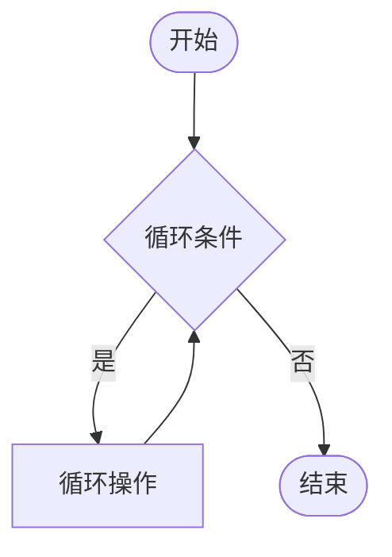
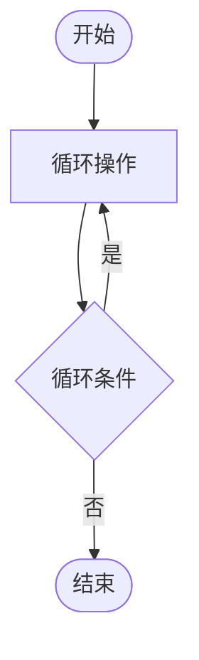

# 第四章 循环结构

## 课前回顾

**1. 选择结构都有哪几种**

基本 if 选择结构、if-else 选择结构、嵌套 if-else 选择结构、多重 if-else 选择结构、switch 选择结构

**2. 描述逻辑短路**

- 逻辑与短路：在使用逻辑与衔接的多个条件中，如果其中一个条件为假，那么该条件之后的所有条件均得不到执行，从而形成逻辑与短路
- 逻辑或短路：在使用逻辑或衔接的多个条件中，如果其中一个条件为真，那么该条件之后的所有条件均得不到执行，从而形成逻辑与短路

**3. switch 选择结构支持哪些数据类型？有无注意事项？**

```java
byte  int  short  char  String  Enum  Byte  Integer  Short
```

需要注意的是，switch 选择结构如果使用 String，则需要满足 JDK 必须在 JDK 7 及以上

## 主要内容

| 主要内容 | 要求 | |
| :--- | :--- | :--- |
| 程序调试 | **重点** | |
| while 循环 | **重点** | 难点 |
| do-while 循环 | **重点** | 难点 |
| for 循环 | **重点** | 难点 |
| break | **重点** | 难点 |
| continue | **重点** | 难点 |

## 课程目标

- 掌握程序调式
- 掌握 while、do-while 及 for 循环的使用
- 掌握 break 和 continue 流程控制

---

## 第一节 程序调试

### 1. 什么是程序调试

当程序出现问题时，我们希望程序能够暂停下来，然后通过我们操作使代码逐行执行，观察整个过程中变量的变化是否按照我们设计程序的思维变化，从而找问题并解决问题，这个过程称之为程序调试

### 2. 为什么需要程序调试

人无完人，考虑问题不可能面面俱到，尤其是在编写复杂程序的时候，如果程序运行出了问题，定位问题就是关键了，要定位问题就需要使用程序调试

### 3. 如何进行程序调试

- 首先在有效的代码上下断点
- 然后以 DEBUG 模式启动程序
- 程序启动后，通过操作使程序代码逐行执行，观察变量的值的变化，从而找出问题并解决问题

### 4. 程序调试演示

---

## 第二节 循环结构

### 1. 什么是循环

循环就是同样的事情反复做多次

### 2. 为什么要使用循环

思考如下代码存在什么问题？

```java
public class Example1{

    public static void main(String[] args){
        System.out.println("Hello World");//1
        System.out.println("Hello World");//2
        System.out.println("Hello World");//3
        System.out.println("Hello World");//4
        System.out.println("Hello World");//5
        System.out.println("Hello World");//6
        System.out.println("Hello World");//7
        System.out.println("Hello World");//8
        System.out.println("Hello World");//9
        System.out.println("Hello World");//10
    }
}
```

重复的编码出现多次，在 Java 中，这样的情况我们称之为代码冗余。那么如何减少这种重复的冗余代码？这就需要使用到循环结构了。

```java
public class Example2{

    public static void main(String[] args){
        int i=0;
        while (i < 10){
            System.out.println("Hello World");
            i++;
        }
    }
}
```

对比之前的代码，冗余部分已经完全被去掉了，但是实现的功能却完全是一样的

### 3. 循环三要素

- 定义循环变量并赋初值
- 循环条件
- 循环变量的更新

---

## 第三节 while 循环

### 1. 语法

```java
while(循环条件){
    //循环操作
}
```

### 2. 执行流程图



### 3. 案例

打印 0-9 之间的所有整数

### 4. 代码实现

```java
/**
 * 打印0-9之间的所有整数
 */
public class Example3 {

    public static void main(String[] args) {
        //1.定义循环变量并赋初值
        int i = 0;
        //2.添加循环条件
        while(i < 10){
            System.out.println(i);
            //3.循环变量更新
            ++i;
        }
    }
}
```

演示 while 循环执行过程

断点调试

### 5. 总结

while 循环的特征就是先判断，后执行。如果一开始条件就不满足，那么 while 循环可能一次也不执行

**练习**

1. 在控制台输出 100 以内能够被 3 整除的所有整数。

```java
/**
 * 在控制台输出100以内能够被3整除的所有整数
 * 9 % 3 = 0
 */
public class Example4 {

    public static void main(String[] args) {
        int i = 0; //定义循环变量并赋上初值
        while (i < 100){//循环条件
            if(i % 3 == 0){//能够被3整除
                System.out.println(i);
            }
            i++;//循环变量的更新
        }
    }
}
```

2. 水仙花数是指一个 3 位数，它每位上的数字的 3 次幂之和等于它本身（例如：1³ + 5³ + 3³ = 153），水仙花数的取值范围在 100~1000 之间。请设计一道程序，求出所有的水仙花数并在控制台打印出来

```java
/**
 * 水仙花数是指一个 3 位数，它每位上的数字的 3次幂之和等于它本身（例如：1³ + 5³+ 3³ = 153），
 * 水仙花数的取值范围在100~1000之间。请设计一道程序，求出所有的水仙花数并在控制台打印出来
 */
public class Example5 {

    public static void main(String[] args) {
        int number = 100;
        while(number < 1000){
            //101  => 101 % 10
            int ge = number % 10;
            //111 => 111 / 10 = 11 % 10 = 1
            int shi = number / 10 % 10;
            // 501 => 501 / 100 = 5
            int bai = number / 100;
            if(ge * ge * ge + shi * shi * shi + bai * bai * bai == number){
                System.out.println(number);
            }
            number++;
        }

        // 3 = 27                         4 = 64
        // 7 = 49 * 7 = 343               0 = 0
        // 0 = 0      1 = 1               7 = 343
    }
}
```

---

## 第四节 do-while 循环

### 1. 语法

```java
do {
    //循环操作
} while(循环条件);
```

### 2. 执行流程图



### 3. 案例

从控制台录入学生的成绩并计算总成绩，输入 0 时退出

### 4. 代码实现

```java
import java.util.Scanner;

/**
 * 从控制台录入学生的成绩并计算总成绩，输入0时退出
 */
public class Example6 {

    public static void main(String[] args) {
        Scanner sc = new Scanner(System.in);
        int totalScore = 0; //默认总成绩为0
        int score; //定义循环变量，但是没有赋初值
        do{
            System.out.println("请输入成绩：");
            score = sc.nextInt(); //第一次执行时，对循环变量score赋上初始值
//            totalScore = totalScore + score;
            totalScore += score;
        } while (score != 0);
        System.out.println("总成绩为：" + totalScore);
    }
}
```

演示 do-while 循环执行过程

断点调试

**练习**

从控制台输入一个数字，如果该数字不能被 7 整除，则重新输入，直到输入的数字能够被 7 整除为止。

```java
import java.util.Scanner;

/**
 * 从控制台输入一个数字，如果该数字不能被7整除，则重新输入，直到输入的数字能够被7整除为止。
 */
public class Example7 {

    public static void main(String[] args) {
        Scanner sc = new Scanner(System.in);
        int number;//定义循环变量，但没有赋初值
        do{
            System.out.println("请输入一个整数：");
            number = sc.nextInt();
        } while(number % 7 != 0);
        System.out.println(number);
    }
}
```

### 5. 总结

do-while 循环的特征就是先执行，后判断。do-while 循环最少会执行一次

---

## 第五节 for 循环

### 1. 语法

```java
for(定义循环变量并赋初值;循环条件;循环变量的更新){
    //循环操作
}
```

### 2. 执行流程图


### 3. 案例

求 1~10 的累加和

### 4. 代码实现

```java
/**
 * 求1~10的累加和
 */
public class Example8 {

    public static void main(String[] args) {
        int total = 0;
        int i = 1;
        while(i <= 10){
            total += i;
            i++;
        }
        System.out.println(total);

        int sum = 0;//和，默认为0
        for(int m = 1; m <= 10; m++){//变量m的作用范围仅限于整个for循环结构
            sum += m;
        }
        System.out.println(sum);
    }
}
```

演示 for 循环执行过程

断点调试

**练习**

1. 求 6 的阶乘（6! = 1 x 2 x 3 x 4 x 5 x 6）

```java
/**
 * 求6的阶乘（6! = 1 x 2 x 3 x 4 x 5 x 6）
 */
public class Example9 {

    public static void main(String[] args) {
        int result = 1;
        for(int i=1; i<=6; i++){
            result = result * i;
//            result *= i;
        }
        System.out.println(result);
    }
}
```

2. 求 100 以内既能被 2 整除又能被 9 整除的所有整数的和

```java
/**
 * 求100以内既能被2整除又能被9整除的所有整数的和
 */
public class Example10 {

    public static void main(String[] args) {
        int sum = 0;
        for(int i=1; i<100; i++){
            if((i % 2 == 0) && (i % 9 == 0)){
                sum = sum + i;
//                sum += i;
            }
        }
        System.out.println(sum);
    }
}
```

### 5. 总结

for 循环的特征是先判断，后执行；如果一开始条件就不满足，那么 for 循环可能一次也不执行。循环次数确定的情况下，通常使用 for 循环；循环次数不确定的情况下通常使用 while 循环和 do-while 循环

---

## 第六节 流程控制

### 1. break 关键字

**应用场景**

break 只能应用于 while 循环、do-while 循环、for 循环和 switch 选择结构

**作用**

- break 应用在循环结构中时，表示终止 break 所在的循环，执行循环结构下面的代码，通常与 if 选择结构配合使用
- break 应用在 switch 选择结构时，表示终止 break 所在的 switch 选择结构

**案例**

获取一个 10 以内的随机整数，然后从控制台输入一个整数，如果输入的整数与随机整数不相等，则重新输入，直到输入的整数与随机整数相等为止

**代码实现**

```java
import java.util.Scanner;

/**
 * 获取一个10以内的随机整数，然后从控制台输入一个整数，如果输入的整数与随机整数不相等，
 * 则重新输入，直到输入的整数与随机整数相等为止
 */
public class Example11 {

    public static void main(String[] args) {
        //Math.random(); 表示的意思是随机获取一个0~1之间的随机浮点数，能够取到0，但是取不到1
        //[0,1)
        double random = Math.random();// [0,1)浮点数
//        int number = (int)(random * 10); //[0, 10)浮点数
        double number = random * 10; //[0, 10)浮点数
        //[10,20)  random * 10 + 10
        int randomNumber = (int)number;
        Scanner sc = new Scanner(System.in);
//        int inputNumber; //定义循环变量，没有赋初值
//        do{
//            System.out.println("请输入一个0~10之间的整数：");
//            inputNumber = sc.nextInt();
//        }while (randomNumber != inputNumber);
        while(true){//死循环
            System.out.println("请输入一个0~10之间的整数：");
            int inputNumber = sc.nextInt();
            if(randomNumber == inputNumber){
                break;//循环中使用break表示终止break所在的循环
            }
        }
    }
}
```

**练习**

从控制台输入一个数字，判断该数字是否是素数（素数的特征：只能被 1 和本身整除，如素数 3 只能被 1 和 3 整除）。要求使用 break 实现

```java
import java.util.Scanner;

/**
 * 从控制台输入一个数字，判断该数字是否是素数
 * （素数的特征：只能被1和本身整除，如素数3 只能被1和3整除）。
 * 要求使用 break 实现
 */
public class Example12 {

    public static void main(String[] args) {
        // 5  2 3 4
        // 6  2 3 4 5
        // 7  2 3 4 5 6
        Scanner sc = new Scanner(System.in);
        System.out.println("请输入一个整数：");
        int number = sc.nextInt();
        boolean isPrime = true; //任何数都默认是素数
        for(int i=2; i<number; i++){
            //只要2~number-1范围内，任意一个数能够被number整除，
            //则说明该数不是素数
            if(number % i == 0){
                isPrime = false;
                break;
            }
        }
        if(isPrime){
            System.out.println(number + "是素数");
        } else {
            System.out.println(number + "是和数");
        }
    }
}
```

### 2. continue 关键字

**应用场景**

continue 只能应用在循环结构中（while 循环、do-while 循环和 for 循环）

**作用**

表示跳过本次循环，进入下一次循环，通常与 if 选择结构配合使用

**案例**

打印 1~10 之间的所有偶数

**代码实现**

```java
/**
 * 打印1~10之间的所有偶数
 */
public class Example13 {

    public static void main(String[] args) {
        for(int i=1; i<=10; i++){
//            if(i % 2 == 0){
//                System.out.println(i);
//            }
            //当i是奇数时，跳过本次循环，直接进入下一次循环
            if(i % 2 == 1) continue; //如果if语句后面只有一条语句，那么{}可以省略
            System.out.println(i);
        }

        int m = 1;
        while (m <= 10){
            if(m % 2 == 1) {
                m++;
                continue;
            }
            System.out.println(m);
            m++;
        }
    }
}
```

**练习**

从控制台录入一位学生的成绩，如果成绩低于 60 分，则将输入的成绩加 5 分，知道成绩及格为止。要求使用 continue 实现。

```java
import java.util.Scanner;

/**
 * 从控制台录入一位学生的成绩，如果成绩低于60分，则将输入的成绩加5分，直到成绩及格为止。
 * 要求使用 continue 实现。
 */
public class Example14 {

    public static void main(String[] args) {
        Scanner sc = new Scanner(System.in);
        System.out.println("请输入学生成绩：");
        int score = sc.nextInt();
        if(score < 60){
            while (true){
                score += 5;
                if(score < 60) continue;
                else break;
            }
        }
    }
}
```
