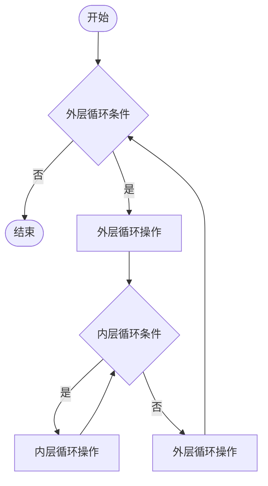
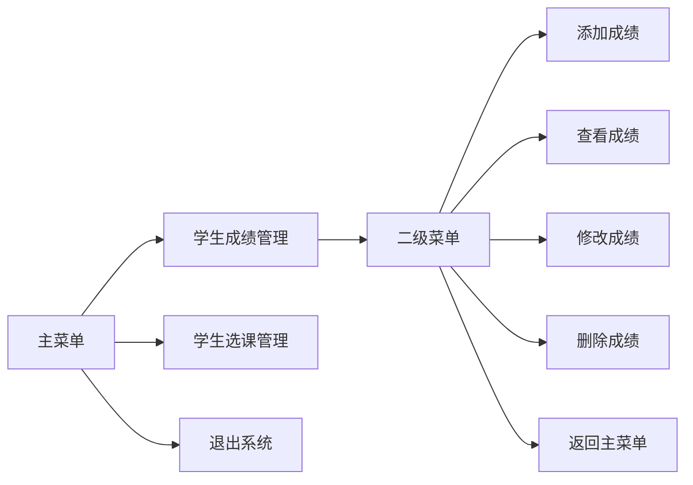

# 第五章 多重循环

## 课前回顾

**1. 程序调试的步骤是什么？**

首先在有效代码中下断点，然后使用 F8 单步执行，观察变量的值的变化是否按照我们设计思维变化，从而找出问题，并解决问题

**2. 循环结构有几种，分别有什么特点？**

while 循环、do-while 循环、for 循环。while 循环和 for 循环都是先判断后执行，如果条件一开始就不满足，那么 while 循环和 for 循环可能一次都不执行。do-while 循环是先执行再判断，因此，do-while 循环至少都会执行一次

**3. 循环三要素分别是什么？**

定义循环变量并赋初值，循环操作，循环变量的更新

**4. 循环中 break 和 continue 有什么区别？**

- break 在循环中的作用就是终止 break 所在的循环，执行循环下面的代码。通常与 if 选择结构配合使用
- continue 在循环中的作用就是跳过本次循环，进入下一次循环。通常与 if 选择结构配合使用

## 主要内容

| 主要内容 | 要求 | |
| :--- | :--- | :--- |
| 二重循环 | **重点** | 难点 |
| Java 中的标号（标签） | 熟悉 | |

## 课程目标

- 掌握多重循环的使用
- 熟悉 Java 中的标号

---

## 第一节 二重循环

### 1. 什么是二重循环

二重循环就是一个循环结构中又包含另外一个循环结构

```java
while(外层循环条件){
    //外层循环操作
    while(内层循环条件){
        //内层循环操作
    }
    //外层循环操作
}
while(外层循环条件){
    //外层循环操作
    for(循环变量初始化;内层循环条件;循环变量更新){
        //内层循环操作
    }
    //外层循环操作
}
//省略其他循环结构组合
```

### 2. 执行流程图



### 3. 应用场景

**打印乘法表**

```text
1x1=1
1x2=2  2x2=4
1x3=3  2x3=6  3x3=9
1x4=4  2x4=8  3x4=12 4x4=16
1x5=5  2x5=10 3x5=15 4x5=20 5x5=25
1x6=6  2x6=12 3x6=18 4x6=24 5x6=30 6x6=36
1x7=7  2x7=14 3x7=21 4x7=28 5x7=35 6x7=42 7x7=49
1x8=8  2x8=16 3x8=24 4x8=32 5x8=40 6x8=48 7x8=56 8x8=64
1x9=9  2x9=18 3x9=27 4x9=36 5x9=45 6x9=54 7x9=63 8x9=72 9x9=81
```

**分析**

a. 乘法表需要打印 9 行

b. 每一行中的列数都是跟行号一致

**代码实现**

```java
/**
 * 打印乘法表
 * a. 乘法表需要打印9行
 * b. 每一行中的列数都是跟行号一致
 */
public class Example1 {

    public static void main(String[] args) {
        for(int i=1; i<=9; i++){//打印9行
            for(int j=1; j<=i; j++){//j<=i表示列数的最大值就是行号
                //print表示在同一行中打印，也就是不会换行
                System.out.print( j + " x " + i + " = " + i*j + "\t");
            }
            System.out.println();
        }
    }
}
```

**打印矩形**

```text
**********
**********
**********
**********
```

**分析**

a. 矩形一共打印 4 行

b. 每一行都有 10 列

**代码实现**

```java
/**
 * 打印实心矩形
 * a. 矩形一共打印4行
 * b. 每一行都有10列
 */
public class Example2 {

    public static void main(String[] args) {
        for(int i=0; i<4; i++){//外层循环控制行数
            for(int j=0; j<10; j++){//内层循环控制列数
                System.out.print("*");
            }
            System.out.println();
        }
    }
}
```

**思考如何打印空心矩形？**

```text
**********
*&&&&&&&&*
*&&&&&&&&*
**********
```

**分析**

a. 矩形一共打印 4 行

b. 每一行都有 10 列

c. 矩形的第一行和最后一行都是 `*`，第一列和最后一列也是 `*`

**代码实现**

```java
/**
 * 打印空心矩形
 * a. 矩形一共打印4行
 * b. 每一行都有10列
 * c. 矩形的第一行和最后一行都是'*'，第一列和最后一列也是'*'
 */
public class Example3 {

    public static void main(String[] args) {
        for(int i=0; i<4; i++){
            for(int j=0; j<10; j++){
                if(i == 0 || i == 3 || j == 0 || j == 9){
                    System.out.print("*");
                } else {
                    System.out.print(" ");
                }
            }
            System.out.println();
        }
    }
}
```

**打印三角形**

```text
&&&&*
&&&***
&&*****
&*******
*********
```

**分析**

a. 三角形一共 5 行

b. 三角形的第一行的列数与三角形的行数一致

c. 三角形的每一行的空白数量 = 三角形的总行数 - 行号

d. 三角形的每一行的 `*` 数量 = (行号 - 1) * 2 + 1

**代码实现**

```java
/**
 * 打印三角形
 * a. 三角形一共5行
 * b. 三角形的第一行的列数与三角形的行数一致
 * c. 三角形的每一行的空白数量 = 三角形的总行数 - 行号
 * d. 三角形的每一行的'*'数量  = (行号 - 1) * 2 + 1
 */
public class Example4 {

    public static void main(String[] args) {
        int totalLines = 25; //总行数
        for(int i=1; i<=totalLines; i++){
            int whiteSpaceCount = totalLines - i; //空白数量 = 三角形的总行数 - 行号
            for(int m=0; m<whiteSpaceCount; m++){
                System.out.print(" ");
            }
            int starCount = (i - 1) * 2 + 1;// '*'数量  = (行号 - 1) * 2 + 1
            for(int n=0; n<starCount; n++){
                System.out.print("*");
            }
            System.out.println();
        }
    }
}
```

**思考如何打印倒三角形？**

```text
*********
&*******
&&*****
&&&***
&&&&*
```

**分析**

a. 三角形一共 5 行

b. 三角形最后一行的空白数量 = 行号 - 1

c. 最后一行的 `*` 数量 = （总行数 - 行号）* 2 + 1

**代码实现**

```java
/**
 * 打印倒三角形
 * a. 三角形一共5行
 * b. 三角形最后一行的空白数量 = 总行数 - 1
 * c. 最后一行的'*'数量 = （总行数  - 行号）* 2 + 1
 */
public class Example5 {

    public static void main(String[] args) {
        int totalLines = 15;
        for(int i=1; i<=totalLines; i++){
            int whiteSpaceCount = i - 1;//空白数量 = 行号 - 1
            for(int m = 0; m<whiteSpaceCount; m++){
                System.out.print(" ");
            }
            int starCount = (totalLines - i) * 2 + 1;//'*'数量 = （总行数  - 行号）* 2 + 1
            for(int n=0; n<starCount; n++){
                System.out.print("*");
            }
            System.out.println();
        }
    }
}
```

**打印菱形**

```text
*
***
*****
*******
&*****
&&***
&&&*
```

**分析**

a. 菱形的总行数一定是奇数

b. 上三角形（包含对称轴在内）

**代码实现**

```java
/**
 * 打印菱形
 */
public class Example6 {

    public static void main(String[] args) {
        int totalLines = 27;
        //先打印上三角形
        int topLines = totalLines / 2 + 1; //上三角形总行数
        for(int i=1; i<=topLines; i++){
            int whiteSpaceCount = topLines - i; //空白数量 = 上三角形的总行数 - 行号
            for(int m=0; m<whiteSpaceCount; m++){
                System.out.print(" ");
            }
            int starCount = (i - 1) * 2 + 1;// '*'数量  = (行号 - 1) * 2 + 1
            for(int n=0; n<starCount; n++){
                System.out.print("*");
            }
            System.out.println();
        }
        //再打印下三角形
        int downLines = totalLines - topLines; //下三角形总行数
        for(int i=1; i<=downLines; i++){
            //每一行的空白数量与行号相同
            for(int m=0; m<i; m++){
                System.out.print(" ");
            }
            //每一行的'*'数量 = (downLines - 行号) * 2 + 1
            int starCount = (downLines - i) * 2 + 1;
            for(int n=0; n<starCount; n++){
                System.out.print("*");
            }
            System.out.println();
        }
    }
}
```

### 4. 练习

求 2~100 内的所有质数

**分析**

a. 求质数的范围 2~100

b. 判断这个范围内的每一个数是否是质数

c. 质数的特征：一个数除了 1 和它本身之外，不能被任何数整除。换言之，就是从 2 开始，到这个数 -1 为止，没有任何一个数能够被这个数整除。

**代码实现**

```java
/**
 * 求2~100内的所有质数
 * a. 求质数的范围2~100
 * b. 判断这个范围内的每一个数是否是质数
 * c. 质数的特征：一个数除了1和它本身之外，不能被任何数整除。换言之，就是从2开始，到这个数-1为止，没有任何一个数能够被这个数整除。
 *  3  1 2 3
 *  4  1 2 3 4
 *  6  1 2 3 4 5 6
 */
public class Example7 {

    public static void main(String[] args) {
        for(int i=2; i<=100; i++){
            if(i == 2) {
                System.out.println(i + "是质数");
            } else {
                boolean isPrime = true; //默认 i 是质数
                for(int j=2; j<i; j++){
                    //如果一个数模上另外一个数结果为零，则表示这个数能够被另一个数整除
                    if(i % j == 0){ //如果 i 能够被任意一个 j 整除，则说明 i 不是质数
                        isPrime = false;
                        break;
                    }
                }
                if(isPrime){
                    System.out.println( i + "是质数");
                }
            }
        }
    }
}
```

---

## 第二节 Java 中的标号（标签 label）

### 1. 语法规则

```java
标号名称: 循环结构
```

### 2. 作用

标号的作用就是给代码添加一个标记，方便后面使用。通常应用在循环结构中，与 break 语句配合使用

### 3. 应用场景

有如下菜单：



实现其中返回主菜单的功能

### 4. 代码实现

```java
import java.util.Scanner;

/**
 * 实现返回主菜单
 */
public class Example8 {

    public static void main(String[] args) {
        Scanner sc = new Scanner(System.in);
        while (true){
            System.out.println("=========================");
            System.out.println("1.学生成绩管理");
            System.out.println("2.学生选课管理");
            System.out.println("3.退出系统");
            System.out.println("=========================");
            System.out.println("请选择菜单编号：");
            int menuNo = sc.nextInt();
            if(menuNo == 1){
                childMenu:while(true){
                    System.out.println("**************************");
                    System.out.println("1.添加成绩");
                    System.out.println("2.查看成绩");
                    System.out.println("3.修改成绩");
                    System.out.println("4.删除成绩");
                    System.out.println("5.返回主菜单");
                    System.out.println("**************************");
                    System.out.println("请选择菜单编号：");
                    int number = sc.nextInt();
                    switch (number){
                        case 1:
                            System.out.println("你选择添加成绩");
                            break;
                        case 2:
                            System.out.println("你选择查看成绩");
                            break;
                        case 3:
                            System.out.println("你选择修改成绩");
                            break;
                        case 4:
                            System.out.println("你选择删除成绩");
                            break;
                        case 5:
                            System.out.println("你选择返回主菜单");
                            break childMenu; //java中的标号，可以理解为一个代码的标记
                    }
                }
            } else if(menuNo == 2){

            } else {
                System.out.println("感谢使用本人开发的系统");
                break; //终止break所在的循环
            }
        }
    }
}
```
