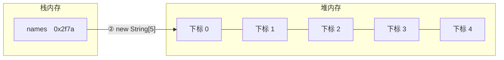

# 第六章 数组

## 主要内容

| 主要内容 | 要求 | |
| :--- | :--- | :--- |
| 数组的概念 | 熟悉 | |
| 数组的作用 | 熟悉 | |
| 数组的定义 | **重点** | |
| 数组的常用操作 | **重点** | 难点 |
| 数组的拷贝和扩容 | **重点** | |

## 章节目标

- 掌握数组的内存模型
- 掌握数组的定义
- 掌握数组的常用操作

---

## 第一节 数组

### 1. 数组的概念

数组是编程语言中的一种常见的数据结构，能够存储一组相同类型的数据。

### 2. 数组的作用

存储一组相同类型的数据，方便进行数理统计（求最大值、最小值、平均值以及总和），也可以进行信息的展示

### 3. 数组的定义

**语法**

```java
数据类型[] 数组名;
数组名 = new 数据类型[数组的长度];
数组名 = new 数据类型[]{元素1, 元素2, ..., 元素n};

数据类型[] 数组名 = new 数据类型[数组的长度];

数据类型[] 数组名 = {元素1, 元素2, ..., 元素n};
```

**内存模型**



栈内存中存放的是数组名，数组名保存的是数组在堆内存中的首地址（如上图的 0x2f7a）；堆内存中开辟的连续空间才是真正存放数组元素的地方。

**代码演示**

```java
/**
 * 数组的定义
 */
public class Example1 {

    public static void main(String[] args) {
        //回顾变量的定义：  数据类型 变量名;
        //1.数组的定义： 数据类型[] 数组名;
        String name; //存储一个名字
        String[] names; //存储很多名字

        //回顾变量的赋值： 变量名 = 变量的值;
        //数组的赋值： 数组名 = new 数据类型[数组的长度];
        name = "刘德华";
        names = new String[10];

        //回顾变量的定义： 数据类型 变量名 = 变量的值;
        //2.数组的定义： 数据类型[] 数组名 = new 数据类型[数组的长度];
        double score = 90.5;
        double[] scores = new double[5];

        //3.数组的定义： 数据类型[] 数组名 = {元素1,元素2, ....};
        int[] numbers = {1, 2, 3, 4, 5};
        //4.数组的定义： 数据类型[] 数组名 = new 数据类型[]{元素1,元素2, ....};
        byte[] bytes = new byte[]{1,2,3,4,5};

        int[] ages; //首先定义了一个数组但是并没有赋值
        ages = new int[]{1,2,3,4,5};


        byte[] arr1 = new byte[10];
        short[] arr2 = new short[10];
        int[] arr3 = new int[10];
        long[] arr4 = new long[10];
        float[] arr5 = new float[10];
        double[] arr6 = new double[10];
        boolean[] arr7 = new boolean[10];
        char[] arr8 = new char[10];


        double[] classScores = new double[5];//开辟了一块5个空间的数组
        classScores = new double[7];
    }
}
```

上面的代码中有定义数组：`double[] scores = new double[5];` 思考数组中存储的元素是什么？

双精度浮点数数组中的默认值为 0.0，单精度浮点数数组中的默认值为 0.0f。boolean 类型数组默认元素为 false。char 类型数组中的默认元素为 `'\u0000'`，整形数组默认元素为 0

思考 `char[] sexArr = {'M', 'F', 'O'};` 和 `char[] sexArr = new char[]{'M', 'F', 'O'};` 有什么区别？

第一种方式只能在定义数组同时赋值时使用，第二种方式可以在定义数组时直接使用，也可以先定义数组，然后再赋值时使用

### 4. 数组的基本要素

- **标识符**

  也就是数组的名称，只是在数组中的一个专业术语，本质就是一个变量名

- **数组元素**

  也就是数组中的每一块空间存储的数据

- **元素类型**

  也就是数组存放的数据类型

- **元素下标**

  数组中每一个元素所处的位置就是数组元素的下标，数组元素下标从 0 开始，因此，数组元素下标的最大值为数组长度 - 1

### 5. 数组的特性

数组的长度一旦定义就不能发生改变，除非给数组重新赋值，才能改变数组的大小

### 6. 数组元素赋值

**语法**

```java
数组名[元素下标] = 元素值;
```

**示例**

```java
int[] ages; //首先定义了一个数组但是并没有赋值
ages = new int[]{1,2,3,4,5};

byte[] arr1 = new byte[10];
short[] arr2 = new short[10];
int[] arr3 = new int[10];
long[] arr4 = new long[10];
float[] arr5 = new float[10];
double[] arr6 = new double[10];
boolean[] arr7 = new boolean[10];
char[] arr8 = new char[10];

double[] classScores = new double[5];//开辟了一块5个空间的数组
classScores = new double[7]; //重新给数组赋值，数组的长度发生改变
```

**案例**

从控制台录入 5 个你最喜欢的人的名字，然后使用随机数来获取一个下标并根据下标输出你可能喜欢的人的名字

**代码实现**

```java
import java.util.Scanner;

/**
 * 从控制台录入5个你最喜欢的人的名字，然后使用随机数来获
 * 取一个下标并根据下标输出你可能喜欢的人的名字
 */
public class Example2 {

    public static void main(String[] args) {
        Scanner sc = new Scanner(System.in);
        String[] names = new String[5];
        for(int i=0; i<5; i++){
            System.out.println("请输入你最喜欢的人的名字：");
            names[i] = sc.next();
        }
        int index = (int)(Math.random() * 5);
        System.out.println(names[index]);
    }
}
```

---

## 第二节 数组操作

### 1. 遍历数组

数组的遍历是指将数组中的元素全部查看一遍

**示例**

```java
/**
 * 数组遍历
 */
public class Example3 {

    public static void main(String[] args) {
        int[] numbers = { 1, 2, 3, 4, 5, 6};
        //数组的长度： 数组名.length  其中 '.'读作 的
        for(int i=0; i<numbers.length; i++){
            //访问数组中的元素： 数组名[元素下标]
            System.out.println(numbers[i]);
        }
    }
}
```

### 2. 求最值

**案例**

求出数列 54,38,79,65,30,83,62 的最大值。

### 3. 修改数组中的元素

**案例**

现有数列 10,12,17,32,39,50，要求将该数列中所有能够被 3 整除的元素进行平方，然后再放回该元素所处位置

**分析**

a. 首先应该将数组中的所有元素全部查看一遍

b. 查看过程中，验证每一个元素是否能够被 3 整除

c. 如果能够被 3 整除，则将该元素平方，然后放入该元素所处的位置

**代码实现**

```java
/**
 * 现有数列10,12,17,32,39,50，要求将该数列中所有能够被3整除的元素进行平方，
 * 然后再放回该元素所处位置
 * a. 首先应该将数组中的所有元素全部查看一遍
 * b. 查看过程中，验证每一个元素是否能够被3整除
 * c. 如果能够被3整除，则将该元素平方，然后放入该元素所处的位置
 */
public class Example5 {

    public static void main(String[] args) {
        int[] numbers = {10,12,17,32,39,50};
        for(int i=0; i<numbers.length; i++){
            if(numbers[i] % 3 == 0){ //被3整除
//                int result = numbers[i] * numbers[i];
//                numbers[i] = result;
//                numbers[i] = numbers[i] * numbers[i];
                numbers[i] *= numbers[i];
            }
        }
    }
}
```

### 4. 向数组中添加元素

**案例**

在某机票代售点有 A、B、C、D、E 5 人正排队购票，B 的好朋友 F 现在也来排队购票，发现 B 正在排队，于是插队至 B 的后面，请使用数组的相关知识完成程序设计。

**分析**

a. 构建一个字符串数组存储 ABCDE 5 人

b. F 来插队，插队到 B 的后面，那么 B 后面的人所处位置相当于往后挪动一位

**代码实现**

```java
/**
 * 在某机票代售点有A、B、C、D、E 5人正排队购票，B的好朋友F现在也来排队购票，
 * 发现B正在排队，于是插队至B的后面，请使用数组的相关知识完成程序设计。
 * a. 构建一个字符串数组存储ABCDE5人
 * b. F来插队，插队到B的后面，那么B后面的人所处位置相当于往后挪动一位
 */
public class Example6 {

    public static void main(String[] args) {
        // A B C D E
        // A B F C D E
        String[] personArr = {"A","B","C","D","E"};
        String[] newArr = new String[personArr.length + 1]; //新建一个数组，长度比原来的数组多1
        int index = 2; //F的位置
        for(int i=0; i<index; i++){
            newArr[i] = personArr[i];//将personArr数组中的元素直接拷贝过来
        }
        newArr[index] = "F";
        for(int i=index; i<personArr.length; i++){
            newArr[i+1] = personArr[i];//将personArr数组中B后面的元素挪动过来，但位置需要加1
        }
        personArr = newArr;
        for(int i=0; i<personArr.length;i++){
            System.out.println(personArr[i]);
        }
    }
}
```

### 5. 删除数组中的元素

**案例**

在前面的案例中，购票人 C 因为中途有事而离开，排队的人员减少了一个。请使用数组的相关知识完成程序设计。

**分析**

a. 使用数组存储目前排队的人 ABFCDE

b. C 离开后，排队的人员减少了 1 个，C 后面的人向前挪动一位

**代码实现**

```java
/**
 * 在前面的案例中，购票人C因为中途有事而离开，排队的人员减少了一个。请使用数组的相关知识完成程序设计。
 * a. 使用数组存储目前排队的人ABFCDE
 * b. C离开后，排队的人员减少了1个，C后面的人向前挪动一位
 */
public class Example7 {

    public static void main(String[] args) {
        String[] personArr = {"A","B","F","C","D","E"};
        //A B F C D E
        //A B F D E
        String[] newArr = new String[personArr.length - 1];
        int index = 3; //C的位置
        for(int i=0; i<index; i++){
            newArr[i] = personArr[i];
        }
        for(int i=index+1; i<personArr.length; i++){
            newArr[i-1] = personArr[i];
        }
        personArr = newArr;
        for(int i=0; i<personArr.length; i++){
            System.out.println(personArr[i]);
        }
    }
}
```

### 6. 数组拷贝

**语法**

```java
System.arraycopy(原数组, 拷贝的开始位置, 目标数组, 存放的开始位置, 拷贝的元素个数);
```

**示例**

Example6 —— 添加元素时使用数组拷贝代替 for 循环

```java
/**
 * 在某机票代售点有A、B、C、D、E 5人正排队购票，B的好朋友F现在也来排队购票，
 * 发现B正在排队，于是插队至B的后面，请使用数组的相关知识完成程序设计。
 * a. 构建一个字符串数组存储ABCDE5人
 * b. F来插队，插队到B的后面，那么B后面的人所处位置相当于往后挪动一位
 */
public class Example6 {

    public static void main(String[] args) {
        // A B C D E
        // A B F C D E
        String[] personArr = {"A","B","C","D","E"};
        String[] newArr = new String[personArr.length + 1]; //新建一个数组，长度比原来的数组多1
        int index = 2; //F的位置
//        for(int i=0; i<index; i++){
//            newArr[i] = personArr[i];//将personArr数组中的元素直接拷贝过来
//        }
        //数组拷贝
        System.arraycopy(personArr, 0, newArr, 0, index);
        newArr[index] = "F";
//        for(int i=index; i<personArr.length; i++){
//            newArr[i+1] = personArr[i];//将personArr数组中B后面的元素挪动过来，但位置需要加1
//        }
        System.arraycopy(personArr, index, newArr, index+1, personArr.length - index);
        personArr = newArr;
        for(int i=0; i<personArr.length;i++){
            System.out.println(personArr[i]);
        }
    }
}
```

Example7 —— 删除元素时使用数组拷贝代替 for 循环

```java
/**
 * 在前面的案例中，购票人C因为中途有事而离开，排队的人员减少了一个。请使用数组的相关知识完成程序设计。
 * a. 使用数组存储目前排队的人ABFCDE
 * b. C离开后，排队的人员减少了1个，C后面的人向前挪动一位
 */
public class Example7 {

    public static void main(String[] args) {
        String[] personArr = {"A","B","F","C","D","E"};
        //A B F C D E
        //A B F D E
        String[] newArr = new String[personArr.length - 1];
        int index = 3; //C的位置
//        for(int i=0; i<index; i++){
//            newArr[i] = personArr[i];
//        }
        System.arraycopy(personArr, 0, newArr, 0, index);
//        for(int i=index+1; i<personArr.length; i++){
//            newArr[i-1] = personArr[i];
//        }
        System.arraycopy(personArr, index+1, newArr, index, personArr.length - index - 1);
        personArr = newArr;
        for(int i=0; i<personArr.length; i++){
            System.out.println(personArr[i]);
        }
    }
}
```

### 7. 数组扩容

**语法**

```java
数据类型[] 标识符 = Arrays.copyOf(原数组, 新数组的长度);
```

**示例**

```java
import java.lang.reflect.Array;
import java.util.Arrays;

/**
 * 数组扩容
 */
public class Example8 {

    public static void main(String[] args) {
        String[] personArr = {"A","B","C","D","E"};
        //数组扩容： 第一个参数表示要扩容的数组 第二个参数表示，扩容后的新的数组的长度
        //作用： 新建一个数组，并将原数组的所有元素全部拷贝至新数组中
        //newArr = {"A","B","C","D","E", null}
        String[] newArr = Arrays.copyOf(personArr, personArr.length + 1);
        int index = 2;
        // A B C D E null => A B C C D E
        System.arraycopy(newArr, index, newArr, index+1, personArr.length - index);
        //A B C C D E => A B F C D E
        newArr[index] = "F";
        personArr = newArr;
        for(int i=0; i<personArr.length; i++){
            System.out.println(personArr[i]);
        }
    }
}
```
