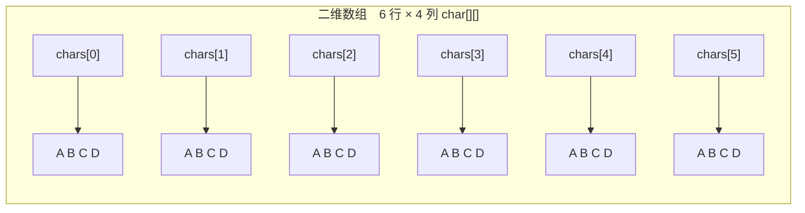

# 第七章 二维数组

## 课前回顾

**1. 数组的定义方式都有哪几种**

```java
数据类型[] 数组名;
数组名 = new 数据类型[数组的长度];

数据类型[] 数组名 = new 数据类型[数组的长度];

数据类型[] 数组名 = {数组的元素1,数组的元素2,......,数组的元素n}; //只能在定义数组时直接赋值的时候使用

//既能在定义数组时直接赋值的时候使用，也可以在重新给数组赋值时使用
数据类型[] 数组名 = new 数据类型[]{数组的元素1,数组的元素2,......,数组的元素n};

double[] scores; //存储成绩的数组
scores = new double[]{90, 91, 92};
```

**2. 基本数据类型的数组中默认值分别是什么**

| byte[] | short[] | int[] | long[] | double[] | float[] | boolean[] | char[] | String[] |
| :--- | :--- | :--- | :--- | :--- | :--- | :--- | :--- | :--- |
| 0 | 0 | 0 | 0 | 0.0 | 0.0f | false | `'\u0000'` | null |

**3. 数组有哪些特征**

数组一旦赋值，长度就固定下来了，不可再改变。数组的最大下标是数组的长度 - 1。数组下标从 0 开始。

**4. Arrays 类是如何对数组进行扩容的**

```java
int[] numbers = {1,2,3,4};
numbers = Arrays.copyOf(numbers, numbers.length + 10);
```

**5. 如何将数组中的元素拷贝至另一个数组**

```java
double[] scores = {66.5, 80, 87.5, 90};
double[] target = new double[10];//新建了一个长度为10的双精度浮点数数组，默认元素值为0.0
System.arraycopy(scores, 0, target, 3, scores.length);
```

## 主要内容

| 主要内容 | 要求 |
| :--- | :--- |
| 数组排序 | **重点** |
| 二分查找 | **重点** |
| 二维数组 | **重点** |

## 章节目标

- 掌握数组的冒泡排序
- 掌握二分查找
- 熟悉二维数组

---

## 第一节 数组排序

### 1. 什么是数组排序

数组排序指的是数组中的元素按从大到小或者从小到大的顺序依次排列。因此数组排序分为升序排列和降序排列两种

### 2. 冒泡排序

**解释说明**

- 每一次遍历数组，都能从数组的元素中获取一个最值（最大值、最小值）。
- 在每一次遍历数组时，比较数组中相邻两个元素的大小，根据排序需要交换元素的位置。

**示例**

将数列 10,70,55,80,25,60 进行降序排列

**分析**

a. 第 1 次遍历：从 0 开始，到数组的末尾，依次比较相邻两个元素的大小，如果前一个元素比后一个元素小，则交换他们的位置。此时交换完了的序列为：70,55,80,25,60,10

b. 第 2 次遍历：从 0 开始，到数组的长度 -1，依次比较相邻两个元素的大小，如果前一个元素比后一个元素小，则交换他们的位置。此时交换完了的序列为：70,80,55,60,25

c. 第 3 次遍历：从 0 开始，到数组的长度 -2，依次比较相邻两个元素的大小，如果前一个元素比后一个元素小，则交换他们的位置。此时交换完了的序列为：80,70,60,55

d. 第 4 次遍历：从 0 开始，到数组的长度 -3，依次比较相邻两个元素的大小，如果前一个元素比后一个元素小，则交换他们的位置。此时交换完了的序列为：80,70,60

e. 第 5 次遍历：从 0 开始，到数组的长度 -4，依次比较相邻两个元素的大小，如果前一个元素比后一个元素小，则交换他们的位置。此时交换完了的序列为：80,70

f. 第 6 次遍历：从 0 开始，到数组的长度 -5，依次比较相邻两个元素的大小，如果前一个元素比后一个元素小，则交换他们的位置。此时交换完了的序列为：80

**代码实现**

```java
import java.util.Arrays;

/**
 * 将数列10,70,55,80,25,60进行降序排列
 *
 * a.第1次遍历：从0开始，到数组的末尾，依次比较相邻两个元素的大小，如果前一个元素比后一个元素小，则交换他们的位置。此时交换完了的序列为：70,55,80,25,60,10
 * b.第2次遍历：从0开始，到数组的长度 -1，依次比较相邻两个元素的大小，如果前一个元素比后一个元素小，则交换他们的位置。此时交换完了的序列为：70,80,55,60,25
 * c.第3次遍历：从0开始，到数组的长度-2，依次比较相邻两个元素的大小，如果前一个元素比后一个元素小，则交换他们的位置。此时交换完了的序列为：80,70,60,55
 * d.第4次遍历：从0开始，到数组的长度-3，依次比较相邻两个元素的大小，如果前一个元素比后一个元素小，则交换他们的位置。此时交换完了的序列为：80,70,60
 * e.第5次遍历：从0开始，到数组的长度-4，依次比较相邻两个元素的大小，如果前一个元素比后一个元素小，则交换他们的位置。此时交换完了的序列为：80,70
 * f.第6次遍历：从0开始，到数组的长度-5，依次比较相邻两个元素的大小，如果前一个元素比后一个元素小，则交换他们的位置。此时交换完了的序列为：80
 */
public class Example1 {

    public static void main(String[] args) {
        //10,70,55,80,25,60
        //70,55,80,25,60,10
        //70,80,55,60,25
        //80,70,60,55
        //80,70,60
        //80,70
        //80
        int[] numbers = {10,70,55,80,25,60};
        for(int i=0; i<numbers.length; i++){//控制遍历次数
            for(int j=0; j<numbers.length - i - 1; j++){
                if(numbers[j] < numbers[j+1]){
                    int temp = numbers[j]; //使用临时变量保存其中一个元素的值
                    numbers[j] = numbers[j+1];
                    numbers[j+1] = temp;
                }
            }
        }
//        for(int i=0; i<numbers.length; i++){
//            System.out.println(numbers[i]);
//        }
        System.out.println(Arrays.toString(numbers));
    }
}
```

### 3. 工具类的排序操作

**语法**

```java
Arrays.sort(数组名); //将数组中的元素进行升序排列

Arrays.toString(数组名);//将数组中的元素组装为一个字符串
```

**示例**

```java
import java.util.Arrays;

/**
 * Arrays.sort()使用
 */
public class Example2 {

    public static void main(String[] args) {
        //字符能够排序，排序是按照字典的顺序进行排序
        char[] chars = {'c','a','g','p','f'};
        Arrays.sort(chars);//对数组进行升序排列
        System.out.println(Arrays.toString(chars));
        String[] names = {"zhangsan", "zhangsi", "lisi","lisan", "lisiabc", "lisib"};
        Arrays.sort(names);
        System.out.println(Arrays.toString(names));
    }
}
```

### 4. 二分查找法

**解释说明**

二分查找法又称为折半查找，顾名思义，每一次都会将数组从中间分为两个区间，利用中间元素与要查找的目标元素比较大小。从而确定目标元素所处的区间。依次往复执行，直到找到目标元素为止。

**二分查找只适用于已经排好序的数组**

**案例**

从数列 95,93,87,86,79,72,60,53 中快速找出元素 60 所处位置

**分析**

a. 首先将数组从中间位置一分为二，然后利用中间位置的元素与 60 进行比较，从而确定 60 所处的目标区间

| 下标 | 0 | 1 | 2 | **3** | 4 | 5 | 6 | 7 |
| :--- | :--- | :--- | :--- | :--- | :--- | :--- | :--- | :--- |
| 元素 | 95 | 93 | 87 | **86** | 79 | 72 | 60 | 53 |

middle = (0 + 7) / 2 = 3，numbers[3] = 86

**86 > 60，因此 60 在后半区间**

b. 再将目标区间从中间位置一分为二，然后利用中间位置的元素与 60 进行比较，从而确定 60 所处的目标区间

| 下标 | 4 | **5** | 6 | 7 |
| :--- | :--- | :--- | :--- | :--- |
| 元素 | 79 | **72** | 60 | 53 |

middle = (4 + 7) / 2 = 5，numbers[5] = 72

**72 > 60，因此 60 在后半区间**

c. 再将目标区间从中间位置一分为二，然后利用中间位置的元素与 60 进行比较，从而确定 60 所处的目标区间

| 下标 | **6** | 7 |
| :--- | :--- | :--- |
| 元素 | **60** | 53 |

middle = (6 + 7) / 2 = 6，numbers[6] = 60，找到目标元素，所处位置为 6

**代码实现**

```java
/**
 * 从数列95,93,87,86,79,72,60,53中快速找出元素60所处位置
 */
public class Example3 {

    public static void main(String[] args) {
        int[] numbers = {95,93,87,86,79,72,60,53};
        int target = 60; //要查找的目标元素
        int start = 0;//区间取值的最小值
        int end = numbers.length - 1;//区间取值的最大值
        while (start < end){ //开始位置比结束位置小，就一直不停的循环
            int middle = (start + end) / 2;
            if(numbers[middle] > 60){//说明目标元素在后半区间
                start = middle + 1; //改变区间开始的位置
            } else if(numbers[middle] < 60){//说明目标元素在前半区间
                end = middle - 1; //改变区间结束的位置
            } else {
                System.out.println("目标元素" + target + "所处位置：" + middle);
                break;
            }
        }
    }
}
```

---

## 第二节 二维数组

### 1. 数组的本质

数组从本质上来说只有一维，二维数组是指在一维数组中再放入一个一维数组。三维数组、四维数组依次类推。



二维数组的外层数组存放的是一个个内层数组的地址，内层数组才是真正存放数据的地方。

### 2. 二维数组的定义

**语法**

```java
数据类型[][] 数组名 = new 数据类型[数组的长度][数组的长度];
```

**示例**

```java
/**
 * 二维数组定义
 */
public class Example4 {

    public static void main(String[] args) {
        //定义了一个长度为10的二维数组，每一个空间中只能存放长度为3的字符串数组
        String[][] personInfos = new String[10][3];
        //定义了一个长度为5的二维数组，每一个空间中只能存放长度为2的double数组
        double[][] agesAndScores = new double[5][2];
        agesAndScores[0] = new double[]{18, 60};
        agesAndScores[1] = new double[]{19, 65};
        agesAndScores[2] = new double[]{28, 90};
        agesAndScores[3] = new double[]{22, 55};
        agesAndScores[4] = new double[]{21, 60};
        //定义了一个长度为5的二维数组，每一个空间中可以存放任意长度的字符串数组
        String[][] infos = new String[5][];
        infos[0] = new String[]{"刘德华"};
        infos[1] = new String[]{"张学友", "很牛逼"};
        infos[2] = new String[]{"张三", "学渣", "整天不务正业","吃喝嫖赌样样会"};
    }
}
```

**案例**

从控制台录入 5 首音乐信息（包括名称、歌手、出版年月），并将这些信息存储在数组中。

**代码实现**

```java
import java.util.Scanner;

/**
 * 从控制台录入5首音乐信息（包括名称、歌手、出版年月），并将这些信息存储在数组中。
 */
public class Example5 {

    public static void main(String[] args) {
        String[][] musicInfos = new String[5][3];
        Scanner sc = new Scanner(System.in);
        for(int i=0; i<musicInfos.length;i++){
            System.out.println("请输入歌曲名称：");
            String name  = sc.next();
            System.out.println("请输入歌曲歌手：");
            String singer  = sc.next();
            System.out.println("请输入歌曲出版年月：");
            String date  = sc.next();
            musicInfos[i] = new String[]{name, singer, date};
        }
    }
}
```

### 3. 练习

1. 从控制台录入 10 所高校信息（包括高校名称、所处位置、创办年月），并将这些信息存储在数组中。

2. 某学校一年级共有 3 个班，第一个班 10 人，第二个班 8 人，第三个班 7 人，现要求从控制台录入这 3 个班学生的成绩和年龄，并计算出每个班的平均成绩和平均年龄。
