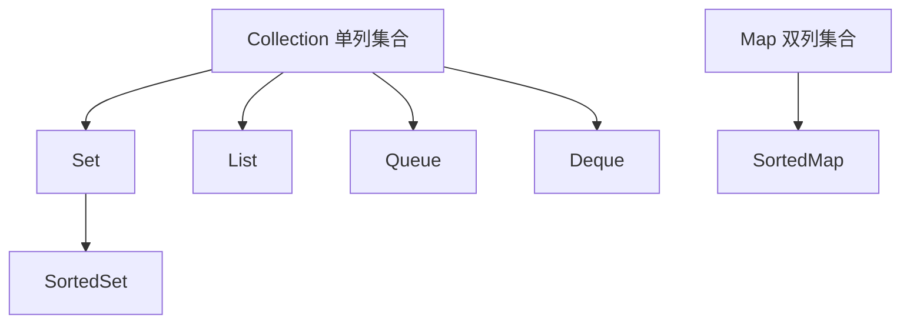
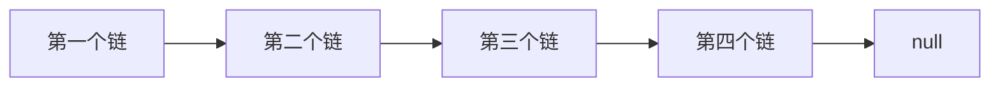
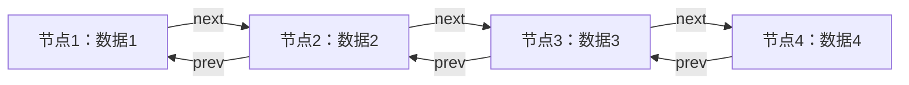
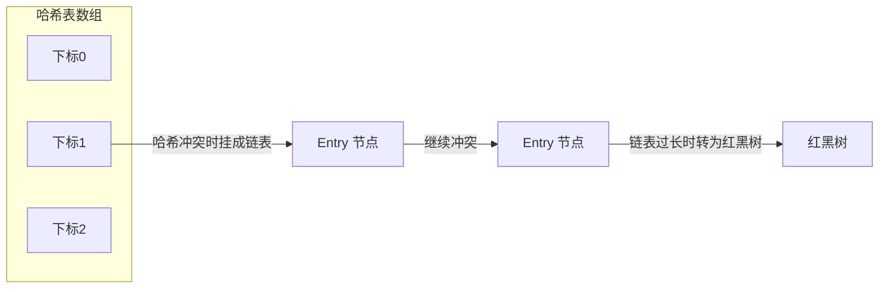

# 第一章 集合

## 章节内容

| 章节内容 | 要求 |
| :--- | :--- |
| 集合框架体系 | **重点** |
| Collection 接口 | **重点** |
| Iterable 接口 | **重点** |
| Iterator 接口 | **重点** |
| 泛型 | **重点** |
| List 接口 | **重点** |
| Set 接口 | **重点** |
| Queue 接口 | **重点** |
| Map 接口 | **重点** |
| 数据结构 | **重点** |
| Comparable 接口 | **重点** |
| Comparator 接口 | **重点** |

> 💡 补充：原课件这张表里"要求"一列把"重点"重复排了三遍，这里按同系列笔记的写法合并为一列。

## 章节目标

- 掌握集合框架体系
- 掌握 Collection 集合的使用
- 掌握 List 集合的实现原理
- 掌握 Iterator 的实现原理
- 掌握 Set 集合的实现原理
- 掌握 Queue 的使用
- 掌握 Map 集合的实现原理
- 掌握集合中涉及到的数据结构
- 掌握泛型的使用
- 掌握排序器的使用

---

## 第一节 集合框架介绍

### 1. 集合与集合框架

**集合来自官方的说明**

```text
A collection — sometimes called a container — is simply an object that groups
multiple elements into a single unit. Collections are used to store, retrieve,
manipulate, and communicate aggregate data.
```

集合（有时称为容器）只是一个将多个元素分组为一个单元的对象。集合用于存储，检索，操作和传达聚合数据。

```text
A collections framework is a unified architecture for representing and
manipulating collections.
```

集合框架是用于表示和操作集合的统一体系结构。

### 2. 为什么要使用集合框架

回想我们之前所学的数组，数组也能存储元素，也能对元素进行增删改查操作。那么数组与集合之间有什么区别呢？

**使用数组实现增删改查**

```java
package com.cyx.collection;

import java.util.Arrays;

public class ArrayUtil {

    //使用数组来存储数据，因为不知道存储什么样的数据，所以使用Object数组
    //支持存储所有类型的数据
    private Object[] elements;

    private int size;//数组中存储的元素个数

    public ArrayUtil() {
       this(16);
    }

    public ArrayUtil(int capacity) {
        elements = new Object[capacity];
    }

    public int size(){
        return size;
    }

    public void add(Object o){
        //数组中存储满了，数组需要扩容才能存储新的元素
        if(size == elements.length){
            //4 >> 1    0100 >> 1 => 010 = 2
            int length = elements.length + elements.length >> 1;
            elements = Arrays.copyOf(elements, length);
        }
        elements[size++] = o;
    }

    public void delete(Object o){
        if(o == null) return;
        int index = -1;//要删除的元素的下标
        for(int i=0; i< size; i++){
            if(o.equals(elements[i])){
                index = i;
                break;
            }
        }
        // 1 2 3 4 5
        // 1 2 4 5
        System.arraycopy(elements, index + 1, elements, index, size-index-1);
        size--;
    }

    public void update(int index, Object o){
        if(index < 0 || index >= size){
            throw new ArrayIndexOutOfBoundsException("下标越界了");
        }
        elements[index] = o;
    }

    public Object get(int index){
        if(index < 0 || index >= size){
            throw new ArrayIndexOutOfBoundsException("下标越界了");
        }
        return elements[index];
    }
}
```

```java
package com.cyx.collection;

import java.util.AbstractCollection;

public class ArrayUtilTest {

    public static void main(String[] args) {
        ArrayUtil util = new ArrayUtil();
        util.add(1);
        util.add(2);
        util.add(3);
        util.add(4);
        util.add(5);
        for(int i=0; i<util.size(); i++){
            Object o = util.get(i);
            System.out.println(o);
        }
        System.out.println("=================");
        util.update(1, 10);
        for(int i=0; i<util.size(); i++){
            Object o = util.get(i);
            System.out.println(o);
        }
        System.out.println("=================");
        util.delete(4);
        for(int i=0; i<util.size(); i++){
            Object o = util.get(i);
            System.out.println(o);
        }
        System.out.println("=================");

    }
}
```

使用数组对元素进行增删改查时，需要我们自己编码实现。而集合是 Java 平台提供的，也能进行增删改查，已经有了具体的实现。我们不需要再去实现，直接使用 Java 平台提供的集合即可，这无疑减少了编程的工作量。同时 Java 平台提供的集合无论是在数据结构还是算法设计上都具有更优的性能。

### 3. 集合框架接口体系



集合接口体系中有两个顶层接口 Collection 和 Map，Collection 接口属于单列集合（可以理解为一次存储一个元素），Map 接口属于双列集合（可以理解为一次存入两个相关联的元素）。

---

## 第二节 Collection 接口

### 1. Collection 接口常用方法

```java
int size();  //获取集合的大小
boolean isEmpty();//判断集合是否存有元素
boolean contains(Object o);//判断集合中是否包含给定的元素
Iterator<E> iterator();//获取集合的迭代器
Object[] toArray();//将集合转换为数组
<T> T[] toArray(T[] a);//将集合转换为给定类型的数组并将该数组返回
boolean add(E e);//向集合中添加元素
boolean remove(Object o);//从集合中移除给定的元素
void clear();//清除集合中的元素
boolean containsAll(Collection<?> c);//判断集合中是否包含给定的集合中的所有元素
boolean addAll(Collection<? extends E> c);//将给定的集合的所有元素添加到集合中
```

### 2. AbstractCollection

AbstractCollection 实现了 Collection 接口，属于单列集合的顶层抽象类。

**源码解读**

AbstractCollection 类并没有定义存储元素的容器，因此，其核心的方法都是空实现。这些空实现的方法都交给其子类来实现。

---

## 第三节 Iterator 迭代器

### 1. 什么是迭代器

集合是用来存储元素的，存储元素的目的是为了对元素进行操作，最常用的操作就是检索元素。为了满足这种需要，JDK 提供了一个 Iterable 接口（表示可迭代的），供所有单列集合来实现。

```java
public interface Collection<E> extends Iterable<E>
```

可以看出，Collection 接口是 Iterable 接口的子接口，表示所有的单列集合都是可迭代的。

Iterable 接口中有一个约定：

```java
Iterator<T> iterator();//获取集合的迭代器
```

因此所有单列集合必须提供一个迭代元素的迭代器。而迭代器 Iterator 也是一个接口。其中约定如下：

```java
boolean hasNext();//判断迭代器中是否有下一个元素
E next();//获取迭代器中的下一个元素
default void remove();//将元素从迭代器中移除，默认是空实现
```

可能你对迭代器还是没有印象。那么你可以对比如下场景来理解迭代器：

一位顾客在超市买了许多商品，当他提着购物篮去结算时，收银员并没有数商品有多少件，只需要看购物篮中还有没有下一个商品，有就取出来结算，直到购物篮中没有商品为止。收银员的操作就是一个迭代过程，购物篮就相当于一个迭代器。

### 2. 自定义Collection 集合

先不使用泛型，自己动手实现一个单列集合。

**代码实现**

```java
package com.cyx.collection;

import java.util.AbstractCollection;
import java.util.Arrays;
import java.util.Iterator;

public class MyCollection extends AbstractCollection {

    private Object[] elements;

    private int size;

    public MyCollection(){
        this(16);
    }

    public MyCollection(int capacity){
        elements = new Object[capacity];
    }

    @Override
    public boolean add(Object o) {
        //数组中存储满了，数组需要扩容才能存储新的元素
        if(size == elements.length){
            //4 >> 1    0100 >> 1 => 010 = 2
            int length = elements.length + elements.length >> 1;
            elements = Arrays.copyOf(elements, length);
        }
        elements[size++] = o;
        return true;
    }

    @Override
    public Iterator iterator() {
        return new CollectionIterator();
    }

    @Override
    public int size() {
        return size;
    }

    class CollectionIterator implements Iterator{

        private int cursor; //光标，实际上就是下标

        @Override
        public boolean hasNext() {
            return cursor < size;
        }

        @Override
        public Object next() {
            if(cursor >= size || cursor < 0){
                throw new ArrayIndexOutOfBoundsException("下标越界了");
            }
            return elements[cursor++];
        }

        @Override
        public void remove() {
            if(cursor > size || cursor < 0){
                throw new ArrayIndexOutOfBoundsException("下标越界了");
            }
            System.arraycopy(elements, cursor, elements, cursor - 1, size - cursor);
            cursor--;//光标向前移动一位
            size--;//存储个数减去1
        }
    }
}
```

**测试**

```java
package com.cyx.collection;

import java.util.Iterator;

public class MyCollectionTest {

    public static void main(String[] args) {
        MyCollection collection = new MyCollection();
        collection.add("a");
        collection.add("b");
        collection.add("c");
        collection.add("d");
        collection.add("e");
        System.out.println("集合大小："+ collection.size());
        //遍历方式一
        Iterator iterator = collection.iterator();
        while (iterator.hasNext()){
            String s = (String) iterator.next();
            System.out.println(s);
        }
        System.out.println("==============================");
        collection.remove("c");
        System.out.println("集合大小："+ collection.size());
        //遍历方式二
        for(Object o: collection){
            System.out.println(o);
        }
        boolean exists = collection.contains("c");
        System.out.println("集合中是否包含元素c：" + exists);

        MyCollection c = new MyCollection();
        c.add(5);
        c.add(4);
        c.add(3);
        c.add(2);
        c.add(1);
        //遍历方式
        for(Iterator iter = c.iterator(); iter.hasNext();){
            Integer i = (Integer) iter.next();
            System.out.println(i);
        }
    }
}
```

上面的集合中，存储的都是字符串，在使用迭代器遍历元素时，将元素强制转换为字符串，这时程序能够正常运行。当集合中存储多种数据类型时，强制类型转换将出现异常。比如在上面的 `main` 方法末尾继续追加：

```java
MyCollection c1 = new MyCollection();
c1.add(5);
c1.add(4.0);
c1.add("3");
c1.add(2.0f);
c1.add(new Object());
for(Iterator iter = c1.iterator(); iter.hasNext();){
    Integer i = (Integer) iter.next();
    System.out.println(i);
}
```

运行程序时就将得到如下异常：

```text
Exception in thread "main" java.lang.ClassCastException: java.lang.Integer cannot be cast to
java.lang.String
	at com.cyx.collection.CollectionExceptionTest.main(CollectionExceptionTest.java:14)
```

如果集合中只能存储同一种数据，那么这种强制类型转换的异常将得到解决。如何限制集合只能存储同一种数据呢？这就需要使用到泛型。

---

## 第四节 泛型

### 1. 什么是泛型

**泛型来自官方的说明**

```text
In a nutshell, generics enable types (classes and interfaces) to be parameters
when defining classes, interfaces and methods. Much like the more familiar
formal parameters used in method declarations, type parameters provide a way for
you to re-use the same code with different inputs. The difference is that the
inputs to formal parameters are values, while the inputs to type parameters are
types.
```

简言之，泛型在定义类，接口和方法时使类型（类和接口）成为参数。与方法声明中使用的更熟悉的形式参数非常相似，类型参数为你提供了一种使用不同输入重复使用相同代码的方法。区别在于形式参数的输入是值，而类型参数的输入是类型。

从上面的描述中可以看出：泛型就是一个变量，只是该变量只能使用引用数据类型来赋值，这样能够使同样的代码被不同数据类型的数据重用。

### 2. 如何使用泛型

包含泛型的类定义语法：

通常使用的泛型变量： E T K V

```java
访问修饰符 class 类名<泛型变量> {

}
```

包含泛型的接口定义语法：

```java
访问修饰符 interface 接口名<泛型变量>{

}
```

方法中使用新的泛型语法：

```java
访问修饰符 泛型变量 返回值类型 方法名(泛型变量 变量名,数据类型1, 变量名1,...,数据类型n, 变量名n){

}
```

使用泛型改造自定义集合 MyCollection。

**代码实现**

```java
package com.cyx.collection;

import java.util.AbstractCollection;
import java.util.Arrays;
import java.util.Iterator;
//定义了泛型变量T，在使用MyCollection创建对象的时候，就需要使用具体的数据类型来替换泛型变量
public class MyCollection<T> extends AbstractCollection<T> {

    private Object[] elements;

    private int size;

    public MyCollection(){
        this(16);
    }

    public MyCollection(int capacity){
        elements = new Object[capacity];
    }

    @Override
    public boolean add(T o) {
        //数组中存储满了，数组需要扩容才能存储新的元素
        if(size == elements.length){
            //4 >> 1    0100 >> 1 => 010 = 2
            int length = elements.length + elements.length >> 1;
            elements = Arrays.copyOf(elements, length);
        }
        elements[size++] = o;
        return true;
    }

    @Override
    public Iterator<T> iterator() {
        return new CollectionIterator();
    }

    @Override
    public int size() {
        return size;
    }

    class CollectionIterator implements Iterator<T>{

        private int cursor; //光标，实际上就是下标

        @Override
        public boolean hasNext() {
            return cursor < size;
        }

        @Override
        public T next() {
            if(cursor >= size || cursor < 0){
                throw new ArrayIndexOutOfBoundsException("下标越界了");
            }
            return (T) elements[cursor++];
        }

        @Override
        public void remove() {
            if(cursor >= size || cursor < 0){
                throw new ArrayIndexOutOfBoundsException("下标越界了");
            }
            System.arraycopy(elements, cursor, elements, cursor-1, size - cursor);
            if(cursor == size){//表示移除的是最后一个元素，光标就会向前移动一位
                cursor--;
            }
            size--;//存储个数减去1
        }
    }
}
```

> 💡 补充：与上面未使用泛型的版本相比，改动点是类声明、`add`、`iterator` 以及内部迭代器的 `next` 都换成了泛型变量 `T`。`elements` 仍然声明为 `Object[]`，所以 `next()` 中要写成 `(T) elements[cursor++]` 做一次强转；另外 `remove()` 里的下标判断由 `cursor > size` 改成了 `cursor >= size`，并且只有移除的是最后一个元素时才让光标前移。

使用泛型后，测试类 `MyCollectionTest` 中改写/新增的部分如下：

```java
//在JDK7及以上版本，new 对象时如果类型带有泛型，可以不写具体的泛型。
//在JDK7以下版本，在new 对象时如果类型带有泛型，必须写具体的泛型。
MyCollection<String> c2 = new MyCollection<>();
c2.add("admin");
c2.add("user");
for(Iterator<String> iter = c2.iterator(); iter.hasNext();){
    String s = iter.next();
    System.out.println(s);
}

//当创建MyCollection对象没有使用泛型时，默认是Object类型
MyCollection c1 = new MyCollection();
c1.add(5);
c1.add(4.0);
c1.add("3");
c1.add(2.0f);
c1.add(new Object());
for(Iterator iter = c1.iterator(); iter.hasNext();){
    Object i = iter.next();
    System.out.println(i);
}
```

### 3. 泛型通配符

当使用泛型类或者接口时，如果泛型类型不能确定，可以通过通配符 `?` 表示。例如 Collection 接口中的约定：

```java
boolean containsAll(Collection<?> c);//判断集合是否包含给定集合中的所有元素
```

**示例**

```java
package com.cyx.collection;


public class MyCollectionTest {

    public static void main(String[] args) {
        MyCollection<String> c = new MyCollection<>();
        c.add("a");
        c.add("b");
        c.add("c");
        c.add("d");
        c.add("e");

        MyCollection<String> c1 = new MyCollection<>();
        c1.add("b");
        c1.add("c");
        c1.add("d");

        boolean contains1 = c.containsAll(c1);
        System.out.println(contains1);

        MyCollection<Integer> c2 = new MyCollection<>();
        c2.add(1);
        c2.add(2);
        c2.add(3);
        boolean contains2 = c.containsAll(c2);
        System.out.println(contains2);
        //泛型使用通配符的集合不能存储数据，只能读取数据
        MyCollection<?> c3 = new MyCollection<>();
//        c3.add(1);
//        c3.add("");
    }
}
```

### 4. 泛型上限

**语法**

```java
<? extends 数据类型>
```

在使用泛型时，可以设置泛型的上限，表示只能接受该类型或其子类。当集合使用泛型上限时，因为编译器只知道存储类型的上限，但不知道具体存的是什么类型，因此，该集合不能存储元素，只能读取元素。

**示例**

```java
package com.cyx.collection;

public class GenericUpperLimit {

    public static void main(String[] args) {
        //定义了一个泛型上限为Number的集合 Integer Double Short Byte Float Long
        MyCollection<? extends Number> c = new MyCollection<>();
        //添加元素时，使用的是占位符? extends Number来对泛型变量进行替换，当传入参数时，
        //无法确定该参数应该怎么来匹配? extends Number，因此不能存入数据
//        c.add((Integer)1);
//        c.add(1.0);
    }
}
```

### 5. 泛型下限

**语法**

```java
<? super 数据类型>
```

在使用泛型时，可以设置泛型的下限，表示只能接受该类型及其子类或该类型的父类。当集合使用泛型下限时，因为编译器知道存储类型的下限，至少可以将该类型对象存入，但不知道有存储的数据有多少种父类，因此，该集合只能存储元素，不能读取元素。

**示例**

```java
package com.cyx.collection;

import java.util.Collection;
import java.util.List;

public class GenericLowerLimit {

    public static void main(String[] args) {
        //集合中存储元素的类型可以是Number的子类、Number类、Number的父类
        MyCollection<? super Number> c = new MyCollection<>();
        //虽然存储元素的类型可以是Number的父类，但是由于父类类型无法确定具体多少种，
        //因此在使用添加功能时，编译器会报错
//        c.add(new Object());
        //但是集合中可以存储Number类
        c.add(1.0);
    }
}
```

> 💡 补充：`? super Number` 表示泛型类型是 `Number` 或 `Number` 的父类型（如 `Object`、`Serializable`），并不包含 `Number` 的子类；原文"该类型及其子类或该类型的父类"的说法不太准确。至于示例中 `c.add(1.0)` 能编译通过、注释掉的 `c.add(new Object())` 不能通过，是因为 `add` 的形参类型是占位符 `? super Number`，编译器只能确定"集合至少能接收 Number 类型"，虽然 `Object` 也是 `Number` 的父类，但编译器无法确定该集合元素的实际类型能否接收它。

---

## 第五节 List 接口

### 1. 特性描述

```text
A List is an ordered Collection (sometimes called a sequence). Lists may contain
duplicate elements.
```

列表是有序的集合（有时称为序列）。 列表可能包含重复的元素。

```text
The Java platform contains two general-purpose List implementations. ArrayList,
which is usually the better-performing implementation, and LinkedList which
offers better performance under certain circumstances.
```

Java 平台包含两个常用的 List 实现。 ArrayList 通常是性能较好的实现，而 LinkedList 在某些情况下可以提供更好的性能。

**List 接口常用方法**

```java
E get(int index); //获取给定位置的元素
E set(int index, E element);//修改给定位置的元素
void add(int index, E element);//在给定位置插入一个元素
E remove(int index);//移除给定位置的元素
int indexOf(Object o);//获取给定元素第一次出现的下标
int lastIndexOf(Object o);//获取给定元素最后一次出现的下标
ListIterator<E> listIterator();//获取List集合专有的迭代器
ListIterator<E> listIterator(int index);//获取List集合专有的迭代器，从给定的下标位置开始的迭代器
List<E> subList(int fromIndex, int toIndex);//获取List集合的一个子集合
```

### 2. ArrayList

**示例及源码解读**

```java
package com.cyx.list;

import java.util.ArrayList;
import java.util.Iterator;
import java.util.List;
import java.util.ListIterator;

public class ArrayListTest {

    public static void main(String[] args) {
        //集合有序是指存储顺序与遍历时取出来的顺序一致
        ArrayList<String> list = new ArrayList<>();
        list.add("a");//第一次调用 size =0;
        list.add("a");
        list.add("b");
        list.add("c");
        list.add("d");
        list.add(2, "n");// a a b c d => a a b b c d => a a n b c d
        String old = list.set(1, "g");
        System.out.println(old);
        System.out.println("====================");
        for(String str: list){
            System.out.println(str);
        }
        System.out.println("====================");
        Iterator<String> iter = list.iterator();
        while (iter.hasNext()){
            String s = iter.next();
            System.out.println(s);
        }
        System.out.println("====================");
        ListIterator<String> listIterator = list.listIterator();
        while (listIterator.hasNext()){
            String s = listIterator.next();
            System.out.println(s);
        }
        System.out.println("====================");
        ListIterator<String> prevIterator = list.listIterator(list.size());
        while (prevIterator.hasPrevious()){
            String s = prevIterator.previous();
            System.out.println(s);
        }
        System.out.println("====================");

        List<String> subList = list.subList(2, 4);
        for(String str: subList){
            System.out.println(str);
        }
        System.out.println("====================");

        int size = list.size();
        for(int i=0; i<size; i++){
            String s = list.get(i);
            System.out.println(s);
        }
        System.out.println("===================");
        ArrayList<Integer> numbers = new ArrayList<>();
        numbers.add(1);
        numbers.add(2);
        numbers.add(3);
        numbers.add(4);
        //移除下标为3这个位置的元素
        numbers.remove(3);//这是移除下标为3这个位置的元素还是移除3这个元素？
        //移除3这个元素
        numbers.remove((Integer) 3);
        for(Integer number: numbers){
            System.out.println(number);
        }
        numbers.add(2);
        numbers.add(2);
        int index1 = numbers.indexOf(2);
        int index2 = numbers.lastIndexOf(2);
        System.out.println(index1);
        System.out.println(index2);
    }
}
```

- ArrayList 继承于 AbstractList，AbstractList 继承于 AbstractCollection
- `ensureCapacityInternal(int minCapacity)` 确保数组有足够的容量来存储新添加的数据
- `void grow(int minCapacity)` 实现数组扩容，扩容至原来的 1.5 倍
- `ListItr` 可以从前到后对集合进行遍历，也可以从后往前对集合进行遍历，还可以向集合中添加元素，修改元素。而 `Itr` 只能从前到后对集合进行遍历。

ArrayList 底层采用的是数组来存储元素，根据数组的特性，ArrayList 在随机访问时效率极高，在增加和删除元素时效率偏低，因为在增加和删除元素时会涉及到数组中元素位置的移动。ArrayList 在扩容时每次扩容到原来的 1.5 倍。

### 3. LinkedList

**示例及源码解读**

**单向链表**



```java
package com.cyx.list;

/**
 * 自定义单向链表
 * @param <T> 泛型变量
 */
public class MyNode<T> {

    private T data; //链中存储的数据

    private MyNode<T> next; //下一个链

    public MyNode(T data, MyNode<T> next) {
        this.data = data;
        this.next = next;
    }

    public T getData() {
        return data;
    }

    public void setData(T data) {
        this.data = data;
    }

    public MyNode<T> getNext() {
        return next;
    }

    public void setNext(MyNode<T> next) {
        this.next = next;
    }
}
```

```java
package com.cyx.list;

public class MyNodeTest {

    public static void main(String[] args) {
        MyNode<String> first = new MyNode<>("第一个链", null);
        MyNode<String> second = new MyNode<>("第二个链", null);
        first.setNext(second);
        MyNode<String> third = new MyNode<>("第三个链", null);
        second.setNext(third);
        MyNode<String> fourth = new MyNode<>("第四个链", null);
        third.setNext(fourth);
        MyNode<String> nextNode = first;
        while (nextNode != null){
            System.out.println(nextNode.getData());
            nextNode = nextNode.getNext();
        }
        System.out.println("===================");
        MyNode<Integer> number4 = new MyNode<>(4, null);
        MyNode<Integer> number3 = new MyNode<>(3, number4);
        MyNode<Integer> number2 = new MyNode<>(2, number3);
        MyNode<Integer> number1 = new MyNode<>(1, number2);
        MyNode<Integer> next = number1;
        while (next != null){
            System.out.println(next.getData());
            next = next.getNext();
        }
    }
}
```

**双向链表**



```java
package com.cyx.list;

/**
 * 自定义双向链表
 * @param <T>
 */
public class DeNode<T> {

    private T data; //链中存储的数据

    private DeNode<T> prev;//前一个链

    private DeNode<T> next;//后一个链

    public DeNode(T data, DeNode<T> prev, DeNode<T> next) {
        this.data = data;
        this.prev = prev;
        this.next = next;
    }

    public T getData() {
        return data;
    }

    public void setData(T data) {
        this.data = data;
    }

    public DeNode<T> getPrev() {
        return prev;
    }

    public void setPrev(DeNode<T> prev) {
        this.prev = prev;
    }

    public DeNode<T> getNext() {
        return next;
    }

    public void setNext(DeNode<T> next) {
        this.next = next;
    }
}
```

```java
package com.cyx.list;

public class DeNodeTest {

    public static void main(String[] args) {
        DeNode<Integer> number1 = new DeNode<>(1, null, null);
        DeNode<Integer> number2 = new DeNode<>(2, number1, null);
        number1.setNext(number2);
        DeNode<Integer> number3 = new DeNode<>(3, number2, null);
        number2.setNext(number3);
        DeNode<Integer> number4 = new DeNode<>(4, number3, null);
        number3.setNext(number4);
        DeNode<Integer> nextNode = number1;
        while (nextNode != null){
            System.out.println(nextNode.getData());
            nextNode = nextNode.getNext();
        }
        System.out.println("==================");
        DeNode<Integer> prevNode = number4;
        while (prevNode != null){
            System.out.println(prevNode.getData());
            prevNode = prevNode.getPrev();
        }
    }
}
```

- LinkedList 继承于 AbstractSequentialList，AbstractSequentialList 继承于 AbstractList，AbstractList 继承于 AbstractCollection
- `void addFirst(E e)` 将数据存储在链表的头部
- `void addLast(E e)` 将数据存储在链表的尾部
- `E removeFirst()` 移除链表头部数据
- `E removeLast()` 移除链表尾部数据

```java
package com.cyx.list;

import java.util.LinkedList;
import java.util.Stack;

public class LinkedListTest {

    public static void main(String[] args) {
        LinkedList<String> list = new LinkedList<>();
        list.add("第一个字符串");
        list.add("第二个字符串");
        list.addLast("第三个字符串");
        list.addFirst("第四个字符串");
        String first = list.removeFirst();//将第一个链移除
        String last = list.removeLast(); //将最后一个链移除
        System.out.println(first);
        System.out.println(last);
        first = list.getFirst();
        last = list.getLast();
        System.out.println(first);
        System.out.println(last);
    }
}
```

LinkedList 底层采用的是双向链表来存储数据，根据链表的特性可知，LinkedList 在增加和删除元素时效率极高，只需要链之间进行衔接即可。在随机访问时效率较低，因为需要从链的一端遍历至链的另一端。

### 4. 栈

**代码实现**

```java
package com.cyx.list;

import java.util.ArrayList;

/**
 * 自定义栈：后进先出
 */
public class MyStack<T> extends ArrayList<T> {

    public void push(T t){
        add(t);
    }

    public T pop(){
        if(size() == 0) throw new IllegalArgumentException("栈里没有数据啦");
        T t = get(size() - 1);
        remove(t);
        return t;
    }
}
```

```java
package com.cyx.list;

import java.util.PriorityQueue;
import java.util.Stack;

public class MyStackTest {

    public static void main(String[] args) {
        MyStack<Integer> stack = new MyStack<>();
        stack.push(1);
        stack.push(2);
        stack.push(3);
        stack.push(4);
        stack.push(5);
        while (!stack.isEmpty()){
            System.out.println(stack.pop());
        }
        Stack<String> s = new Stack<>();
    }
}
```

**练习**

从控制台录入5位学生信息：姓名，性别，年龄，成绩，并将这些学生信息以","衔接起来，然后存储至文本中。然后再从文本中将这些信息读取至集合中。

```java
package com.cyx.list;

public class Student {

    private String name;

    private String sex;

    private int age;

    private double score;

    public Student(String name, String sex, int age, double score) {
        this.name = name;
        this.sex = sex;
        this.age = age;
        this.score = score;
    }

    public String getName() {
        return name;
    }

    public void setName(String name) {
        this.name = name;
    }

    public String getSex() {
        return sex;
    }

    public void setSex(String sex) {
        this.sex = sex;
    }

    public int getAge() {
        return age;
    }

    public void setAge(int age) {
        this.age = age;
    }

    public double getScore() {
        return score;
    }

    public void setScore(double score) {
        this.score = score;
    }

    @Override
    public String toString() {
        return name + "," + sex +"," + age + "," + score;
    }
}
```

```java
package com.cyx.list;

import java.io.*;
import java.util.ArrayList;
import java.util.List;
import java.util.Scanner;

/**
 * 从控制台录入5位学生信息：姓名，性别，年龄，成绩，并将这些学生信息以","衔接起来，
 * 然后存储至文本中。然后再从文本中将这些信息读取至集合中。
 */
public class Exercise {

    public static void main(String[] args) {
        List<Student> students = new ArrayList<>();
        Scanner sc = new Scanner(System.in);
        for(int i=0; i<5; i++){
            System.out.println("请输入姓名：");
            String name = sc.next();
            System.out.println("请输入性别：");
            String sex = sc.next();
            System.out.println("请输入年龄：");
            int age = sc.nextInt();
            System.out.println("请输入成绩：");
            double score = sc.nextDouble();
            students.add(new Student(name, sex, age, score));
        }
        saveStudents(students, "F:\\stu\\stu.txt");

        List<Student> read =  readStudents("F:\\stu\\stu.txt");
        for(Student stu: read){
            System.out.println(stu);
        }
    }

    public static List<Student> readStudents(String path){
        List<Student> students = new ArrayList<>();
        try (FileReader reader = new FileReader(path);
            BufferedReader br =new BufferedReader(reader);){
            String line;
            while ((line = br.readLine()) != null){
                String[] arr = line.split(",");
                //name + "," + sex +"," + age + "," + score;
                String name = arr[0];
                String sex = arr[1];
                int age = Integer.parseInt(arr[2]);// Float.parseFloat()
                double score = Double.parseDouble(arr[3]);
                students.add(new Student(name, sex, age, score));
            }
        } catch (FileNotFoundException e) {
            e.printStackTrace();
        } catch (IOException e) {
            e.printStackTrace();
        }
        return students;
    }

    public static void saveStudents(List<Student> students, String path){
        File file = new File(path);
        File parent = file.getParentFile();
        if(!parent.exists()) parent.mkdirs();
        try (FileWriter writer = new FileWriter(file);
             BufferedWriter bw =new BufferedWriter(writer);){
            for(Student stu: students){
                bw.write(stu.toString());
                bw.newLine();
            }
            bw.flush();
        } catch (IOException e) {
            e.printStackTrace();
        }
    }
}
```

---

## 第六节 Queue 接口

### 1. 特性描述

```text
A Queue is a collection for holding elements prior to processing. Besides basic
Collection operations, queues provide additional insertion, removal, and
inspection operations.
```

队列是用于在处理之前保存元素的集合。 除了基本的收集操作外，队列还提供其他插入，移除和检查操作。

```text
Queues typically, but not necessarily, order elements in a FIFO (first-in-first-
out) manner. Among the exceptions are priority queues, which order elements
according to their values — see the Object Ordering section for details).
Whatever ordering is used, the head of the queue is the element that would be
removed by a call to remove or poll. In a FIFO queue, all new elements are
inserted at the tail of the queue. Other kinds of queues may use different
placement rules. Every Queue implementation must specify its ordering
properties.
```

队列通常但不是必须以 FIFO（先进先出）的方式对元素进行排序。 优先队列除外，它们根据元素的值对元素进行排序（有关详细信息，请参见"对象排序"部分）。 无论使用哪种排序，队列的开头都是将通过调用 remove 或 poll 删除的元素。 在 FIFO 队列中，所有新元素都插入到队列的尾部。 其他种类的队列可能使用不同的放置规则。 每个 Queue 实现必须指定其排序属性。

```text
It is possible for a Queue implementation to restrict the number of elements
that it holds; such queues are known as bounded. Some Queue implementations in
java.util.concurrent are bounded, but the implementations in java.util are not.
```

队列实现有可能限制其持有的元素数量； 这样的队列称为有界队列。 java.util.concurrent 中的某些 Queue 实现是有界的，但 java.util 中的某些实现不受限制。

**Queue 接口常用方法**

```java
boolean add(E e);//向队列中添加一个元素，如果出现异常，则直接抛出异常
boolean offer(E e);//向队列中添加一个元素，如果出现异常，则返回false
E remove();//移除队列中第一个元素，如果队列中没有元素，则将抛出异常
E poll();//移除队列中第一个元素，如果队列中没有元素，则返回null
E element();//获取队列中的第一个元素，但不会移除。如果队列为空，则将抛出异常
E peek();//获取队列中的第一个元素，但不会移除。如果队列为空，则返回null
```

### 2. LinkedBlockingQueue

LinkedBlockingQueue 是一个 FIFO 队列，队列有长度，超出长度范围的元素将无法存储进队列。

**用法示例**

```java
package com.cyx.queue;

import java.util.concurrent.LinkedBlockingQueue;

public class LinkedBlockingQueueTest {

    public static void main(String[] args) {
        //构建队列时，我们通常都会给队列设置一个容量，因为默认容量太大了
        LinkedBlockingQueue<String> queue = new LinkedBlockingQueue<>(5);
//        String first = queue.element();//获取队列中的第一个元素，如果队列为空，则抛出异常
//        System.out.println(first);
        String first = queue.peek();//获取队列中的第一个元素，如果队列为空，则返回null
        System.out.println(first);
        queue.add("a");
        queue.add("b");
        queue.add("c");
        queue.add("d");
        queue.add("e");
//        queue.add("f");//放入第6个元素将抛出异常
        boolean success = queue.offer("f"); //放入第6个元素不会抛出异常，只会返回false，表明放入失败
        System.out.println(success);

        queue.remove();
        queue.remove();
        queue.remove();
        queue.remove();
        queue.remove();
        System.out.println("================");
//        queue.remove();//移除第6个元素将抛出异常
        while (!queue.isEmpty()){
            String s = queue.poll();
            System.out.println(s);
        }
        String s = queue.poll();//移除第6个元素不会抛出异常，但会返回null值
        System.out.println(s);
    }
}
```

### 3. PriorityQueue

PriorityQueue 是一个有排序规则的队列，存入进去的元素是无序的，队列有长度，超出长度范围的元素将无法存储进队列。需要注意的是，如果存储的元素如果不能进行比较排序，也未提供任何对元素进行排序的方式，运行时会抛出异常

**用法示例**

```java
package com.cyx.queue;

import java.util.PriorityQueue;

public class PriorityQueueTest {

    public static void main(String[] args) {
        PriorityQueue<Integer> queue = new PriorityQueue<>();
        queue.offer(1);
        queue.offer(4);
        queue.offer(3);
        queue.offer(5);
        queue.offer(2);
        for(Integer number: queue){
            System.out.println(number);
        }
        System.out.println("================");
        while (!queue.isEmpty()){
            Integer number = queue.poll();
            System.out.println(number);
        }
    }
}
```

思考：如果 PriorityQueue 队列中存储的是对象，会怎么排序？上面的代码不变，在末尾继续追加：

```java
PriorityQueue<User> userQueue = new PriorityQueue<>();
userQueue.offer(new User("张三", 0));
userQueue.offer(new User("李四", 1));
userQueue.offer(new User("金凤", 3));
userQueue.offer(new User("龙华", 2));
```

如果对象不能进行比较，则不能排序，运行时会报异常。要解决这个问题，需要使用 Java 平台提供的比较器接口。

---

## 第七节 比较器接口

### 1. 比较器接口的作用

在使用数组或者集合时，我们经常都会遇到排序问题，比如将学生信息按照学生的成绩从高到低依次排列。数字能够直接比较大小，对象不能够直接比较大小，为了解决这个问题，Java 平台提供了 Comparable 和 Comparator 两个接口来解决。

### 2. Comparable 接口

```text
This interface imposes a total ordering on the objects of each class that
implements it.  This ordering is referred to as the class's natural ordering,
and the class's  compareTo method is referred to as its natural comparison
method.
```

接口对实现该接口的每个类的对象强加了总体排序。 此排序称为类的自然排序，而该类的 compareTo 方法被称为其自然比较方法

**示例**

```java
package com.cyx.queue;

public class User implements Comparable<User>{

    private String name;

    private int level; //等级  0-普通用户  1-vip1  2-vip2

    public User(String name, int level) {
        this.name = name;
        this.level = level;
    }

    @Override
    public String toString() {
        return "User{" +
                "name='" + name + '\'' +
                ", level=" + level +
                '}';
    }

    @Override
    public int compareTo(User o) {
        if(level == o.level) return 0;
        else if(level < o.level) return -1;
        else return 1;
    }
}
```

```java
package com.cyx.queue;

import java.util.PriorityQueue;

public class PriorityQueueTest {

    public static void main(String[] args) {
        PriorityQueue<Integer> queue = new PriorityQueue<>();
        queue.offer(1);
        queue.offer(4);
        queue.offer(3);
        queue.offer(5);
        queue.offer(2);
        for(Integer number: queue){
            System.out.println(number);
        }
        System.out.println("================");
        while (!queue.isEmpty()){
            Integer number = queue.poll();
            System.out.println(number);
        }

        PriorityQueue<User> userQueue = new PriorityQueue<>();
        userQueue.offer(new User("张三", 0));
        userQueue.offer(new User("李四", 1));
        userQueue.offer(new User("金凤", 3));
        userQueue.offer(new User("龙华", 2));
        while (!userQueue.isEmpty()){
            User user = userQueue.poll();
            System.out.println(user);
        }
    }
}
```

```java
package com.cyx.compare;

public class Student implements Comparable<Student>{

    private String name;

    private int age;

    public Student(String name, int age) {
        this.name = name;
        this.age = age;
    }

    @Override
    public String toString() {
        return "Student{" +
                "name='" + name + '\'' +
                ", age=" + age +
                '}';
    }

    @Override
    public int compareTo(Student o) {
        if(age == o.age) return name.compareTo(o.name);
        else if(age < o.age) return 1;
        else return -1;
    }
}
```

```java
package com.cyx.compare;

import java.util.ArrayList;
import java.util.Arrays;
import java.util.Collections;
import java.util.List;

public class ComparableTest {

    public static void main(String[] args) {
        Student[] students = {
                new Student("张三", 25),
                new Student("李四", 21),
                new Student("王五", 23),
                new Student("龙华", 28)
        };
        Arrays.sort(students);
        for(Student s: students){
            System.out.println(s);
        }
        System.out.println("===================");
        List<Student> studentList = new ArrayList<>();
        studentList.add(new Student("张三", 25));
        studentList.add(new Student("李四", 21));
        studentList.add(new Student("王五", 23));
        studentList.add(new Student("龙华", 28));
        //对集合排序
        Collections.sort(studentList);
        for(Student s: studentList){
            System.out.println(s);
        }
        System.out.println("==========================");
        String[] strings = {"d","b","a","c"};
        Arrays.sort(strings);
        for(String str: strings){
            System.out.println(str);
        }
    }
}
```

### 3. Comparator 接口

```text
A comparison function, which imposes a total ordering on some collection of
objects. Comparators can be passed to a sort method (such as Collections.sort or
Arrays.sort) to allow precise control over the sort order.
```

比较功能，对某些对象集合施加总排序。 可以将比较器传递给排序方法（例如 Collections.sort 或 Arrays.sort），以实现对排序顺序的精确控制。

**示例**

```java
package com.cyx.compare;

public class Course {

    private String name;

    private int score;

    public Course(String name, int score) {
        this.name = name;
        this.score = score;
    }

    public String getName() {
        return name;
    }

    public int getScore() {
        return score;
    }

    @Override
    public String toString() {
        return "Course{" +
                "name='" + name + '\'' +
                ", score=" + score +
                '}';
    }
}
```

```java
package com.cyx.compare;

import java.util.*;

public class ComparatorTest {

    public static void main(String[] args) {
        Course[] courses = {
                new Course("Java", 5),
                new Course("Html", 3),
                new Course("JavaScript", 2),
                new Course("JDBC", 6)
        };
//        Comparator<Course> c = new Comparator<Course>() {
//            @Override
//            public int compare(Course o1, Course o2) {
//                return 0;
//            }
//        };
//        Comparator<Course> c = (Course o1, Course o2) -> {
//            return 0;
//        };
        Comparator<Course> c = (o1, o2) -> {
            int score1 = o1.getScore();
            int score2 = o2.getScore();
            if(score1 == score2) return o1.getName().compareTo(o2.getName());
            else if(score1 < score2) return -1;
            else return 1;
        };
        Arrays.sort(courses, c);
        for(Course course: courses){
            System.out.println(course);
        }
        System.out.println("=================");
        List<Course> courseList = new ArrayList<>();
        courseList.add( new Course("Java", 5));
        courseList.add( new Course("Html", 3));
        courseList.add( new Course("JavaScript", 2));
        courseList.add( new Course("JDBC", 6));
        Collections.sort(courseList, c);
        for(Course course: courseList){
            System.out.println(course);
        }
    }
}
```

Comparable 接口是由数组或者集合中的对象的类所实现，实现后对象就拥有比较的方法，因此称为内排序或者自然排序。Comparator 接口是外部提供的对两个对象的比较方式的实现，对象本身并没有比较的方式，因此被称为外排序器

---

## 第八节 Map 接口

### 1. 特性描述

```text
A Map is an object that maps keys to values. A map cannot contain duplicate
keys: Each key can map to at most one value.
```

Map 集合是将键映射到值的对象。 映射不能包含重复的键：每个键最多可以映射到一个值。

```text
The Java platform contains three general-purpose Map implementations: HashMap,
TreeMap, and LinkedHashMap.
```

Java 平台包含三个常用 Map 的实现：HashMap，TreeMap 和 LinkedHashMap。

**Map 接口常用方法**

```java
int size(); //获取集合的大小
boolean isEmpty();//判断集合是否为空
boolean containsKey(Object key);//判断集合中是否包含给定的键
boolean containsValue(Object value);//判断集合中是否包含给定的值
V get(Object key);//获取集合中给定键对应的值
V put(K key, V value);//将一个键值对放入集合中
V remove(Object key);//将给定的键从集合中移除
void putAll(Map<? extends K, ? extends V> m);//将给定的集合添加到集合中
void clear();//清除集合中所有元素
Set<K> keySet();//获取集合中键的集合
Collection<V> values();//获取集合中值的集合
Set<Map.Entry<K, V>> entrySet();//获取集合中键值对的集合
```

**Entry 接口常用方法**

```java
K getKey(); //获取键
V getValue();//获取值
V setValue(V value);//设置值
boolean equals(Object o);//比较是否是同一个对象
int hashCode();//获取哈希码
```

Map 接口中的内部接口 Entry 就是 map 存储的数据项，一个 Entry 就是一个键值对。

```java
package com.cyx.map;

public class MyEntry<K,V> {

    private K key;

    private V value;

    private MyEntry<K, V> next;

    public MyEntry(K key, V value, MyEntry<K, V> next) {
        this.key = key;
        this.value = value;
        this.next = next;
    }

    public MyEntry<K, V> getNext() {
        return next;
    }

    public void setNext(MyEntry<K, V> next) {
        this.next = next;
    }

    public K getKey() {
        return key;
    }

    public void setKey(K key) {
        this.key = key;
    }

    public V getValue() {
        return value;
    }

    public void setValue(V value) {
        this.value = value;
    }
}
```

```java
package com.cyx.map;

public class MyMap<K,V> {

    private MyEntry<K,V>[] elements;

    private int size;

    private float loadFactor = 0.75f; //负载因子

    public MyMap() {
        this(16);
    }

    public MyMap(int capacity) {
        this.elements = new MyEntry[capacity];
    }

    public V put(K key, V value){
        int currentSize = size + 1;
        if(currentSize >= elements.length * loadFactor){
            MyEntry<K,V>[] entries = new MyEntry[currentSize<<1];
            for(MyEntry<K,V> entry: entries){
                int hash = entry.getKey().hashCode();
                int index = hash & (entries.length - 1);
                entries[index] = entry;
            }
            elements = entries;
        }
        int hash = key.hashCode();
        int index=  hash & (elements.length - 1);
        MyEntry<K,V> addEntry = new MyEntry<>(key, value, null);
        if(elements[index] == null){
            elements[index] = addEntry;
        } else {
            MyEntry<K,V> existEntry = elements[index];
            while (existEntry.getNext() != null){
                existEntry = existEntry.getNext();
            }
            existEntry.setNext(addEntry);
        }
        size++;
        return elements[index].getValue();
    }

    public V get(K key){
        for(MyEntry<K,V> entry: elements){
            if(entry == null) continue;
            K k = entry.getKey();
            if(k.equals(key)) return entry.getValue();
            MyEntry<K, V> temp =entry.getNext();
            while (temp != null){
                if(temp.getKey().equals(key)) return temp.getValue();
                temp = temp.getNext();
            }
        }
        return null;
    }


    public int size(){
        return size;
    }

    public boolean isEmpty(){
        return size == 0;
    }
}
```

```java
package com.cyx.map;


public class Test {

    public static void main(String[] args) {
        MyMap<Integer, String> map = new MyMap<>();
        map.put(1, "a");
        map.put(2, "b");
        map.put(3, "c");
        map.put(17, "d");
        map.put(33, "e");
    }
}
```

### 2. HashMap

```text
Hash table based implementation of the Map interface. This implementation
provides all of the optional map operations, and permits null values and the
null key. (The HashMap class is roughly equivalent to Hashtable, except that it
is unsynchronized and permits nulls.) This class makes no guarantees as to the
order of the map; in particular, it does not guarantee that the order will
remain constant over time.
```

基于哈希表的 Map 接口的实现。此实现提供所有可选的映射操作，并允许空值和空键。（HashMap 类与 Hashtable 大致等效，不同之处在于它是不同步的，并且允许为 null。）该类不保证映射的顺序。 特别是，它不能保证顺序会随着时间的推移保持恒定。

HashMap 存储的是一组无序的键值对。存储时是根据键的哈希码来计算存储的位置，因为对象的哈希码是不确定的，因此 HashMap 存储的元素是无序的。

**示例及源码解读**

```java
package com.cyx.map;

import java.util.*;

public class HashMapTest {

    public static void main(String[] args) {
        //HashMap采用的是数组、链表以及红黑树来存储数据。
        //链表的设计主要是针对于Hash碰撞而引发存储位置冲突
        //红黑树的设计主要是针对于链表过长，遍历速度太慢
        HashMap<Integer, String> map = new HashMap<>();
        map.put(1, "a");
        map.put(2, "b");
        map.put(3, "c");
        map.put(4, "d");
        map.put(17, "e");
        String value = map.get(1);
        System.out.println(value);
        System.out.println(map.size());
        System.out.println(map.isEmpty());
        System.out.println(map.containsKey(3));
        System.out.println(map.containsValue("e"));
        System.out.println(map.remove(17));
        HashMap<Integer,String> map1 = new HashMap<>();
        map1.put(5, "CN");
        map1.put(6, "US");
        map1.put(7, "EN");
        map.putAll(map1);
        System.out.println(map.size());
        Set<Integer> keySet = map.keySet();
        for(Integer i: keySet){
            System.out.println(i);
        }
        System.out.println("=============");
        Collection<String> values = map.values();
        for(String str: values){
            System.out.println(str);
        }
        System.out.println("=============");
        Set<Map.Entry<Integer, String>> entries = map.entrySet();
        for(Map.Entry<Integer,String> entry: entries){
            Integer key = entry.getKey();
            String val = entry.getValue();
            System.out.println(key+"=>" + val);
        }
        System.out.println("=============");
        map.clear();
        System.out.println(map.size());
    }
}
```

HashMap 采用的是数组加单向链表加红黑树的组合来存储数据。



### 3. TreeMap

```text
A Red-Black tree based NavigableMap implementation. The map is sorted according
to the natural ordering of its keys, or by a Comparator provided at map creation
time, depending on which constructor is used.
```

基于红黑树的 NavigableMap 实现。根据集合存储的键的自然排序或在映射创建时提供的 Comparator 来对键进行排序，具体取决于所使用的构造方法。

**示例及源码解读**

```java
package com.cyx.map;

import java.util.Comparator;
import java.util.LinkedHashMap;
import java.util.Set;
import java.util.TreeMap;

public class TreeMapTest {

    public static void main(String[] args) {
//        TreeMap<Computer, Integer> map = new TreeMap<>();
//        map.put(new Computer("联想", 3000), 1);
//        map.put(new Computer("外星人", 30000), 2);
//        Set<Computer> set = map.keySet();
//        for(Computer comp: set){
//            System.out.println(comp);
//        }

//        Comparator<Computer> c = new Comparator<Computer>() {
//            @Override
//            public int compare(Computer o1, Computer o2) {
//                return 0;
//            }
//        };
//        Comparator<Computer> c = (Computer o1, Computer o2) -> {
//                return 0;
//        };
//        Comparator<Computer> c = (o1, o2) -> {
//            return Double.compare(o1.getPrice(), o2.getPrice());
//        };
        Comparator<Computer> c = (o1, o2) -> Double.compare(o1.getPrice(), o2.getPrice());
//        Comparator<Computer> c = Comparator.comparingDouble(Computer::getPrice);

        TreeMap<Computer, Integer> map1 = new TreeMap<>(c);
        map1.put(new Computer("联想", 3000), 1);
        map1.put(new Computer("外星人", 30000), 2);
        Set<Computer> set = map1.keySet();
        for(Computer comp: set){
            System.out.println(comp);
        }
    }
}
```

### 4. LinkedHashMap

```text
Hash table and linked list implementation of the Map interface, with predictable
iteration order. This implementation differs from HashMap in that it maintains a
doubly-linked list running through all of its entries. This linked list defines
the iteration ordering, which is normally the order in which keys were inserted
into the map (insertion-order). Note that insertion order is not affected if a
key is re-inserted into the map.
```

Map 接口的哈希表和链表实现，具有可预测的迭代顺序。 此实现与 HashMap 的不同之处在于，它维护一个贯穿其所有条目的双向链表。 此链表定义了迭代顺序，通常是将键插入映射的顺序（插入顺序）。 请注意，如果将键重新插入到映射中，则插入顺序不会受到影响。

**示例及源码解读**

```java
package com.cyx.map;

import java.util.LinkedHashMap;
import java.util.Map;

public class LinkedHashMapTest {

    public static void main(String[] args) {
        LinkedHashMap<String,String> map = new LinkedHashMap<>();
        map.put("CN", "中华人名共和国");//第一次是放入
        map.put("EN", "英国");
        map.put("US", "美国");
        map.put("AU", "澳大利亚");
        map.put("CN", "中国");//第二次是修改
        for(String key: map.keySet()){
            System.out.println(key);
        }
        for(Map.Entry<String,String> entry: map.entrySet()){
            System.out.println(entry.getKey() + "=>" +entry.getValue());
        }
    }
}
```

> 💡 补充：示例里第一次 `put("CN", "中华人名共和国")` 的字符串是原课件的笔误，应为"中华人民共和国"；紧接着的 `put("CN", "中国")` 会覆盖同一个键的值。

---

## 第九节 Set 接口

### 1. 特性描述

```text
A Set is a Collection that cannot contain duplicate elements. It models the
mathematical set abstraction. The Set interface contains only methods inherited
from Collection and adds the restriction that duplicate elements are prohibited.
Set also adds a stronger contract on the behavior of the equals and hashCode
operations, allowing Set instances to be compared meaningfully even if their
implementation types differ. Two Set instances are equal if they contain the
same elements.
```

集合是一个集合，不能包含重复的元素。 它为数学集合抽象建模。 Set 接口仅包含从 Collection 继承的方法，并增加了禁止重复元素的限制。 Set 还为 equals 和 hashCode 操作的行为增加了更紧密的约定，即使它们的实现类型不同，也可以有意义地比较 Set 实例。 如果两个 Set 实例包含相同的元素，则它们相等。

```text
The Java platform contains three general-purpose Set implementations: HashSet,
TreeSet, and LinkedHashSet. HashSet, which stores its elements in a hash table,
is the best-performing implementation; however it makes no guarantees concerning
the order of iteration.
```

Java 平台包含三个通用的 Set 实现：HashSet，TreeSet 和 LinkedHashSet。 HashSet 将其元素存储在哈希表中，是性能最好的实现。 但是，它不能保证迭代的顺序。

**示例及源码解读**

```java
package com.cyx.set;

import java.util.HashSet;
import java.util.Iterator;

public class HashSetTest {

    public static void main(String[] args) {
        HashSet<String> set = new HashSet<>();
        set.add("a");
        set.add("a");
        set.add("b");
        System.out.println(set.size());
        for(String str: set){
            System.out.println(str);
        }
        HashSet<String> hashSet = new HashSet<>();
        hashSet.add("C");
        hashSet.add("D");
        hashSet.add("E");
        set.addAll(hashSet);
        System.out.println("===================");
        for(String str: set){
            System.out.println(str);
        }
        System.out.println(set.contains("C"));
        System.out.println(set.remove("E"));
        Iterator<String> iterator = set.iterator();
        while (iterator.hasNext()){
            System.out.println(iterator.next());
        }
    }
}
```

### 2. HashSet

```text
This class implements the Set interface, backed by a hash table (actually a
HashMap instance). It makes no guarantees as to the iteration order of the set;
in particular, it does not guarantee that the order will remain constant over
time. This class permits the null element.
```

此类实现 Set 接口，该接口由哈希表（实际上是 HashMap 实例）支持。 它不保证集合的迭代顺序。 特别是，它不能保证顺序会随着时间的推移保持恒定。 此类允许使用 null 元素。

**示例及源码解读**

代码与上面「1. 特性描述」中给出的 `com.cyx.set.HashSetTest` 完全相同（原课件在此处重复贴了同一段代码），这里不再重复。

### 3. TreeSet

```text
A NavigableSet implementation based on a TreeMap. The elements are ordered using
their natural ordering, or by a Comparator provided at set creation time,
depending on which constructor is used.
```

基于 TreeMap 的 NavigableSet 实现。 元素使用其自然顺序或在集合创建时提供的 Comparator 进行排序，具体取决于所使用的构造方法。

**示例及源码解读**

```java
package com.cyx.set;


public class Car /*implements Comparable<Car>*/ {

    private String brand;

    private double price;

    public Car(String brand, double price) {
        this.brand = brand;
        this.price = price;
    }

    public String getBrand() {
        return brand;
    }

    public void setBrand(String brand) {
        this.brand = brand;
    }

    public double getPrice() {
        return price;
    }

    public void setPrice(double price) {
        this.price = price;
    }

    @Override
    public String toString() {
        return "Car{" +
                "brand='" + brand + '\'' +
                ", price=" + price +
                '}';
    }


//    @Override
//    public int compareTo(Car o) {
//        return Double.compare(price, o.price);
//    }
}
```

```java
package com.cyx.set;

import java.util.Comparator;
import java.util.TreeSet;

public class TreeMapTest {

    public static void main(String[] args) {
//        TreeSet<Car> cars = new TreeSet<>();
//        cars.add(new Car("奥迪", 100000));
//        cars.add(new Car("保时捷", 150000));
//        cars.add(new Car("大众", 50000));
//        for(Car c: cars){
//            System.out.println(c);
//        }
        Comparator<Car> c = (c1, c2)->Double.compare(c1.getPrice(), c2.getPrice());
        TreeSet<Car> cars = new TreeSet<>(c);
        cars.add(new Car("奥迪", 100000));
        cars.add(new Car("保时捷", 150000));
        cars.add(new Car("大众", 50000));
        for(Car car: cars){
            System.out.println(car);
        }
    }
}
```

> 💡 补充：这段代码演示的是 TreeSet，但原课件的文件名和类名都写成了 `TreeMapTest`，这里保留原样，以便与源码目录对应。

### 4. LinkedHashSet

```text
Hash table and linked list implementation of the Set interface, with predictable
iteration order. This implementation differs from HashSet in that it maintains a
doubly-linked list running through all of its entries. This linked list defines
the iteration ordering, which is the order in which elements were inserted into
the set (insertion-order). Note that insertion order is not affected if an
element is re-inserted into the set.
```

Set 接口的哈希表和链表实现，具有可预测的迭代顺序。 此实现与 HashSet 的不同之处在于，它维护在其所有条目中运行的双向链接列表。 此链表定义了迭代顺序，即将元素插入到集合中的顺序（插入顺序）。 请注意，如果将元素重新插入到集合中，则插入顺序不会受到影响。

**示例及源码解读**

```java
package com.cyx.set;

import java.util.LinkedHashSet;

public class LinkedHashSetTest {

    public static void main(String[] args) {
        LinkedHashSet<String> strings = new LinkedHashSet<>();
        strings.add("D");
        strings.add("C");
        strings.add("B");
        strings.add("A");
        for(String str: strings){
            System.out.println(str);
        }
    }
}
```
