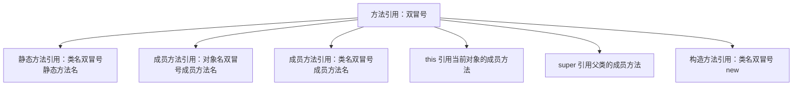
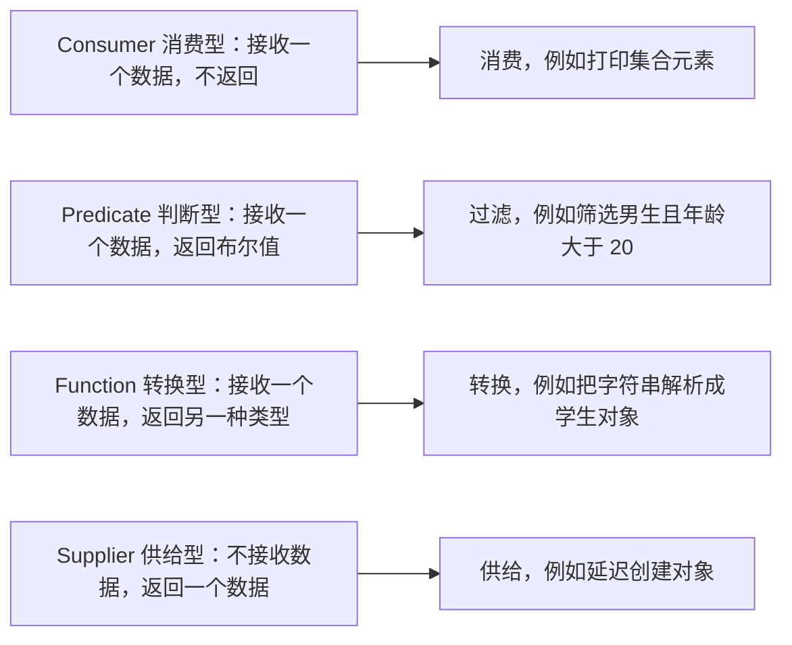
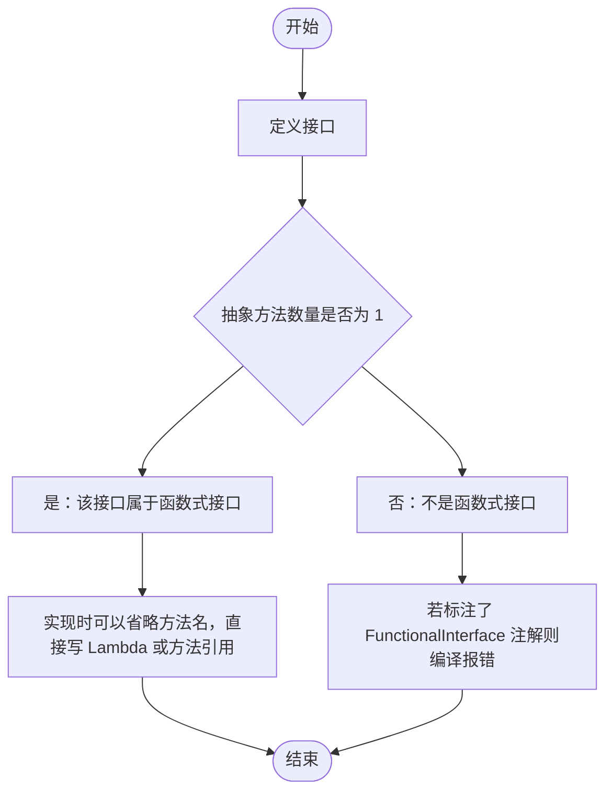
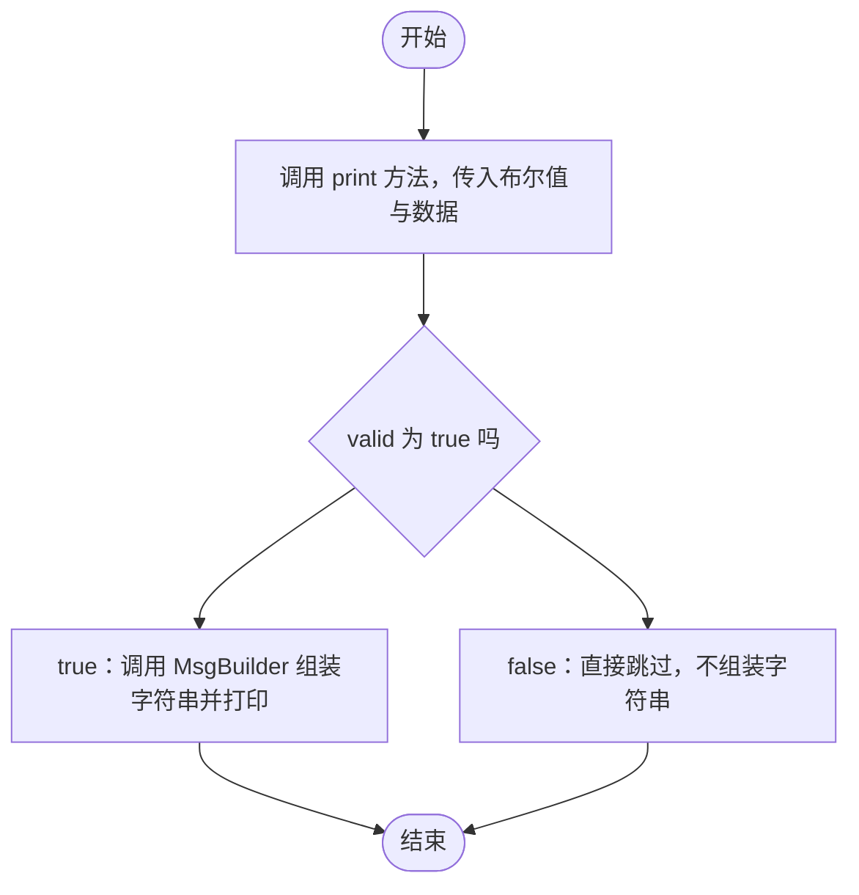

# 第二章 函数式接口和方法引用

## 课前回顾

### 1. ArrayList 和 LinkedList 有什么区别

ArrayList 底层采用的是数组来存储数据，根据数组的特性，ArrayList 在随机访问时效率极高，但在增加或者删除元素时效率偏低，因为增加和删除元素会涉及到元素位置的移动。而 LinkedList 底层采用的是双向链表来存储数据，根据链表的特性，LinkedList 在增加和删除元素时效率极高，因为只需要将链断开后重新接上即可，不会涉及到元素位置的移动。但是在随机访问时效率偏低，因为需要从链的一端到另一端依次查看。

### 2. HashMap 是如何存储数据的？请说明为什么要这样来存储数据？

HashMap 底层采用的是数组、链表以及红黑树来存储数据。采用数组是因为需要使用到键的哈希码来计算在数组中存储的位置，这样来查找也比较快。采用链表的原因是因为不同的键的哈希码计算出来在数组中的位置可能相同，这种称之为哈希碰撞，为了解决这个问题，因此采用链表，将冲突的键对应的数据以链表的形式存储在同一个数组位置。采用红黑树的原因是因为哈希碰撞发生次数过多的时候会导致链表长度过长，从而导致在查找时效率偏低，为了提升查询效率，因此采用了红黑树。

### 3. Queue 接口中的 remove() 方法和 poll() 方法有什么区别？

remove() 方法在队列为空时会抛出异常，poll() 方法在队列为空时不会抛出异常，而是返回 null

### 4. ListIterator 和 Iterator 有什么区别？

ListIterator 只是 List 集合的专用迭代器，而 Iterator 是 Collection 集合使用的迭代器。

ListIterator 可向前遍历，也可以向后遍历，而 Iterator 只能向后遍历。

### 5. Comparable 和 Comparator 有什么区别？

Comparable 是自然排序接口，实现该接口的类所构建的对象能够与其他对象进行比对，对象自身拥有比较的方法，因此称为自然排序。而 Comparator 是外排序接口，实现该接口时需要提供对两个对象的比较方式，对象本身没有比较的方法，比较的方式是外部提供的，因此称为外排序器。常用场景如：TreeMap、TreeSet、PriorityQueue

### 6. Set 集合有什么特性？

Set 集合只能存储一组唯一的元素。因为 Set 采用的是 Map 来存储数据，而 Map 中的键一定是唯一的，因此 Set 中存储的元素是唯一的。

## 章节内容

| 章节内容 | 要求 |
| :--- | :--- |
| 函数式接口 | **重点** |
| 方法引用 | **重点** |

## 章节目标

- 掌握 Consumer 接口的使用
- 掌握 BiConsumer 接口的使用
- 掌握 Predicate 接口的使用
- 掌握 Function 接口的使用
- 掌握静态方法引用
- 掌握成员方法引用
- 掌握构造方法引用

---

## 第一节 方法引用

### 1. 应用场景

**方法引用来自官方的说明**

```text
You use lambda expressions to create anonymous methods. Sometimes, however, a
lambda expression does nothing but call an existing method. In those cases,
it's often clearer to refer to the existing method by name. Method references
enable you to do this; they are compact, easy-to-read lambda expressions for
methods that already have a name.
```

你使用 lambda 表达式创建匿名方法。但是，有时 lambda 表达式除了调用现有方法外什么也不做。在这种情况下，通常更容易按名称引用现有方法。方法引用使你可以执行此操作；它们是紧凑的，对于已经具有名称的方法 lambda 表达式更易于阅读。

**示例**

```java
package com.cyx.functional;

public interface Actor {

    /**
     * 演员表演节目
     * @param item
     */
    void perform(String item);
}
```

```java
package com.cyx.functional;

public class ActorTest {

    public static void main(String[] args) {
        Actor actor = item -> System.out.println(item);
        actor.perform("跳舞");
    }
}
```

**分析**

上面的示例中，Lambda 表达式的作用就是调用 System.out 中的 println(String msg) 方法，这个方法已经有具体的实现，如果能够直接引用这个方法，那么代码将变得更为简洁。

### 2. 方法引用符

双冒号 `::` 为方法引用符，而它所在的表达式被称为方法引用。如果 Lambda 表达式赋值的方法已经在某个类中有具体的实现，那么则可以通过双冒号来引用该方法作为 Lambda 表达式的替代者。

**示例**

```java
package com.cyx.functional;

public class ActorTest {

    public static void main(String[] args) {
        Actor actor = System.out::println;
        actor.perform("跳舞");
    }
}
```

**解释说明**

Actor 接口中的 void perform(String item) 方法在实现时用的 System.out 中的 public void println(String x) 方法。Lambda 表达式可以根据实现的接口方法推导省略，方法引用也可以根据实现的接口方法进行推导省略。void perform(String item) 方法中带有一个字符串类型的参数，public void println(String x) 方法来实现时就可以接收这个字符串参数。

方法引用与 Lambda 表达式一样，只能应用于函数式接口。方法有静态方法、成员方法和构造方法之分，方法引用因此也分为静态方法引用、成员方法引用和构造方法引用。

**方法引用形式一览**

| 形式 | 语法 | 说明 | 本章示例 |
| :--- | :--- | :--- | :--- |
| 静态方法引用 | `类名::静态方法名` | 引用某个类的静态方法 | `MathUtil::minus` |
| 成员方法引用 | `对象名::成员方法名` | 引用某个具体对象的成员方法 | `printer::print` |
| 成员方法引用 | `类名::成员方法名` | 抽象方法只有一个引用类型参数，且只需调用该参数的成员方法 | `Person::dance`　`Person::sing` |
| this 引用 | `this::成员方法名` | 引用当前对象的成员方法 | `this::takePhoto` |
| super 引用 | `super::成员方法名` | 引用父类的成员方法 | `super::analysisBusyness` |
| 构造方法引用 | `类名::new` | 引用某个类的构造方法 | `Student::new` |



### 3. 静态方法引用

**语法**

```java
类名::方法名
```

**示例**

```java
package com.cyx._static;

public interface Calculator {

    int calculate(int a, int b);

}
```

```java
package com.cyx._static;

public class MathUtil {

    public static int add(int a, int b){
        return a + b;
    }

    public static int minus(int a, int b){
        return a - b;
    }

    public static int multiply(int a, int b){
        return a * b;
    }

    public static int divided(int a, int b){
        return a / b;
    }
}
```

```java
package com.cyx._static;

public class CalculatorTest {

    public static void main(String[] args) {
//        Calculator c = new Calculator() {
//            @Override
//            public int calculate(int a, int b) {
//                return MathUtil.minus(a, b);
//            }
//        };
//        Calculator c = (int a, int b) -> {
//            return MathUtil.minus(a, b);
//        };
//        Calculator c = (a, b) -> MathUtil.minus(a, b);
        Calculator c = MathUtil::minus;
        int result = c.calculate(1, 10);
        System.out.println(result);

        Calculator c1 = MathUtil::multiply;
        int result1 = c1.calculate(1, 10);
        System.out.println(result1);
    }
}
```

> 💡 补充：上面 `CalculatorTest` 中注释掉的匿名内部类、Lambda 表达式两种写法，是课件为了演示「匿名内部类 → Lambda 表达式 → 方法引用」的推导过程而保留的，实际生效的只有 `Calculator c = MathUtil::minus;` 这一行。

### 4. 成员方法引用

**语法**

```java
对象名::方法名
```

**示例**

```java
package com.cyx._static.member;

public interface Printable {

    void print(String msg);
}
```

```java
package com.cyx._static.member;

public class Printer {

    public void print(String msg){
        System.out.println(msg);
    }
}
```

```java
package com.cyx._static.member;

public class Computer {

    private Printer printer;

    public Computer(Printer printer) {
        this.printer = printer;
    }

    public void print(String msg){
//        Printable printable = new Printable() {
//            @Override
//            public void print(String msg) {
//                printer.print(msg);
//            }
//        };
//        Printable printable = (String message) -> {
//                printer.print(message);
//            };
//        Printable printable = message -> printer.print(message);
        Printable printable = printer::print;
        printable.print(msg);
    }
}
```

```java
package com.cyx._static.member;

public class ComputerTest {

    public static void main(String[] args) {
        Computer c = new Computer(new Printer());
        c.print("This is method reference");
    }
}
```

**注意**：如果函数式接口的抽象方法中只有一个引用数据类型的参数，且实现过程只需要调用该类型中定义的成员方法，那么可以使用静态引用的方式直接引用该成员方法

> 💡 补充：这里的「静态引用的方式」指的是**用类名当前缀**的写法（`类名::成员方法名`，如 `Person::dance`），它本质仍属于成员方法引用，并不是前面讲的静态方法引用；因为此时方法体里只用到形参 `p` 自己的成员方法，所以 `p -> p.dance()` 可以推导成 `Person::dance`。

**示例**

```java
package com.cyx._static.member._static;

public class Person {

    public void sing(){
        System.out.println("唱歌");
    }

    public void dance(){
        System.out.println("跳舞");
    }
}
```

```java
package com.cyx._static.member._static;

public interface Actor {

    void perform(Person p);

}
```

```java
package com.cyx._static.member._static;

public class ActorTest {

    public static void main(String[] args) {
//        Actor a = new Actor() {
//            @Override
//            public void perform(Person p) {
//                p.dance();
//            }
//        };

//        Actor a = (Person p) -> {
//            p.dance();
//        };
//        Actor a = p -> p.dance();
        Actor a = Person::dance;
        a.perform(new Person());

        Actor actor = Person::sing;
        actor.perform(new Person());
    }
}
```

### 5. this 引用成员方法

**语法**

```java
this::方法名
```

**示例**

```java
package com.cyx._static.member._this;

public interface Camera {

    void takePhoto(String name);
}
```

```java
package com.cyx._static.member._this;

public class Person {

    public void takePhoto(String name){
        System.out.println("给" + name + "拍照");
    }

    public void travel(String name){
//        Camera c = new Camera() {
//            @Override
//            public void takePhoto(String name) {
//                Person.this.takePhoto(name);
//            }
//        };
//        Camera c = (String str) -> {
//            Person.this.takePhoto(str);
//        };
//        Camera c = str -> Person.this.takePhoto(str);
        Camera c = this::takePhoto;
        c.takePhoto(name);
    }

}
```

```java
package com.cyx._static.member._this;

public class PersonTest {

    public static void main(String[] args) {
        Person p = new Person();
        p.travel("金字塔");
    }
}
```

> 💡 补充：注释里出现的 `Person.this.takePhoto(...)` 是**匿名内部类**中引用外部类当前对象的写法；改成 Lambda 或方法引用后，不再有内部类的「外部实例」概念，直接写 `this::takePhoto` 即可。

### 6. super 引用父类成员方法

**语法**

```java
super::方法名
```

**示例**

```java
package com.cyx._static.member._super;

public interface Customer {
    /**
     * 交流业务
     */
    void communicateBusyness();

}
```

```java
package com.cyx._static.member._super;

public class SoftEngineer {

    public void analysisBusyness(){
        System.out.println("分析业务");
    }
}
```

```java
package com.cyx._static.member._super;

public class JavaProgrammer extends SoftEngineer{


    public void communicateWithCustomer(){
//        Customer c = new Customer() {
//            @Override
//            public void communicateBusyness() {
//                JavaProgrammer.super.analysisBusyness();
//            }
//        };
//        Customer c = () -> {
//            JavaProgrammer.super.analysisBusyness();
//        };
//        Customer c = () -> JavaProgrammer.super.analysisBusyness();
        Customer c = super::analysisBusyness;
        c.communicateBusyness();
    }

}
```

```java
package com.cyx._static.member._super;

public class JavaProgrammerTest {

    public static void main(String[] args) {
        JavaProgrammer programmer = new JavaProgrammer();
        programmer.communicateWithCustomer();
    }
}
```

### 7. 构造方法引用

**语法**

```java
类名::new
```

**示例**

```java
package com.cyx._static.constructor;

public class Student {

    private String name;

    private String sex;

    public Student(String name, String sex) {
        this.name = name;
        this.sex = sex;
    }

    @Override
    public String toString() {
        return "Student{" +
                "name='" + name + '\'' +
                ", sex='" + sex + '\'' +
                '}';
    }
}
```

```java
package com.cyx._static.constructor;

public interface StudentBuilder {

    Student build(String name, String sex);
}
```

```java
package com.cyx._static.constructor;

public class StudentBuilderTest {

    public static void main(String[] args) {
//        StudentBuilder builder = new StudentBuilder() {
//            @Override
//            public Student build(String name, String sex) {
//                return new Student(name, sex);
//            }
//        };

//        StudentBuilder builder = (String name, String sex) -> {
//            return new Student(name, sex);
//        };

//        StudentBuilder builder = (name, sex) -> new Student(name, sex);
        StudentBuilder builder = Student::new;
        Student stu = builder.build("张三", "男");
        System.out.println(stu);
    }
}
```

> 💡 补充：`StudentBuilder` 接口中的 `Student build(String name, String sex)` 带了两个字符串参数，正好和 `Student(String name, String sex)` 这个构造方法的参数列表对应，所以可以写成 `Student::new`。

---

## 第二节 函数式接口

**四大函数式接口对照（本章重点）**

| 接口 | 抽象方法 | 数据流向 | 其他方法 | 典型场景 | 本章相关写法 |
| :--- | :--- | :--- | :--- | :--- | :--- |
| `Consumer<T>` | `void accept(T t)` | 接收一个数据，无返回值 | `andThen` | 消费数据：遍历、打印 | `System.out::println` |
| `BiConsumer<T,U>` | `void accept(T t, U u)` | 接收两个数据，无返回值 | `andThen` | 消费键值对：遍历 Map | `counties.forEach((s1, s2) -> ...)` |
| `Function<T,R>` | `R apply(T t)` | 接收一个数据，返回另一种类型的对象 | `andThen` | 类型转换、解析、映射 | `Integer::parseInt`　`Student::new` |
| `Predicate<T>` | `boolean test(T t)` | 接收一个数据，返回布尔值 | `and`　`or`　`negate` | 条件检测、数据过滤 | `p1.and(p2)` |
| `Supplier<T>` | `T get()` | 不接收数据，返回一个数据 | 无 | 供给数据：延迟产生对象、对象工厂 | `Student::new` |



> 💡 补充：本章课件只讲了 Consumer、BiConsumer、Predicate、Function 四个接口。`Supplier<T>`（供给型接口，`T get()`，不接收参数只返回数据）同属 JDK8 的核心函数式接口，课件未涉及，这里一并列出便于对照。

### 1. 什么是函数式接口

**函数式接口来自官方的说明**

```text
A functional interface is any interface that contains only one abstract
method. (A functional interface may contain one or more default methods or
static methods.) Because a functional interface contains only one abstract
method, you can omit the name of that method when you implement it.
```

函数式接口是仅包含一种抽象方法的任何接口。（一个函数式接口可能包含一个或多个默认方法或静态方法。）由于一个函数式接口仅包含一个抽象方法，因此在实现该方法时可以省略该方法的名称。

**示例**

```java
package com.cyx.functional;

@FunctionalInterface
public interface Hello {

    void sayHello(String name);

    static void show(){}

    default void print(){}

//    private void test(){}
}
```

JDK8 专门为函数式接口提供了一个注解标识 `@FunctionalInterface`，该注解只能使用在接口类型的定义上，表明这是一个函数式接口，编译器在编译时就会对该接口进行检测：接口中是否只有一个抽象接口方法。如果有多个抽象接口方法或者一个抽象接口方法也没有，则将报编译错误。

> 💡 补充：`static` 方法、`default` 方法、`private` 方法都不属于抽象方法，因此它们保留与否都不影响 `@FunctionalInterface` 的校验；课件在后续示例中把 `private void test(){}` 注释掉，是为了突出「接口中只剩一个抽象方法」这一点（顺带一提，接口中的 `private` 方法需要 JDK 9 及以上才支持）。

**注意**：如果接口类型上没有 @FunctionalInterface 注解，但接口中只有一个抽象方法，这个接口也是函数式接口。这与 @Override 注解一样，即使方法上面没有写，同样是属于方法重写



### 2. 函数式编程

函数式编程是一种编程方式，在 Java 中，简单来说就是一个变量能够存储一个函数。而能够实现这种赋值操作的只有 Lambda 表达式

**示例**

```java
package com.cyx.functional;

public class HelloTest {

    public static void main(String[] args) {
//        Hello hello = name -> System.out.println(name);
        Hello hello = System.out::println;
        hello.sayHello("Marry");
    }
}
```

### 3. Lambda 表达式延迟执行

**应用场景**

在某种条件下才会处理数据

**示例**

```java
package com.cyx.lambda.lazy;

public interface MsgBuilder {

    String buildMsg(String...infos);

}
```

```java
package com.cyx.lambda.lazy;

public class PrintUtil {


    public static void print(boolean valid, String msg){
        if(valid){
            System.out.println(msg);
        }
    }

    private static String build(String...infos){
        StringBuilder builder = new StringBuilder();
        for(String info: infos){
            builder.append(info);
        }
        return builder.toString();
    }

    public static void print(boolean valid, String...infos){
        if(valid){
//            MsgBuilder builder = new MsgBuilder() {
//                @Override
//                public String buildMsg(String... infos) {
//                    return PrintUtil.build(infos);
//                }
//            };
//            MsgBuilder builder = (String... arr) -> {
//                return PrintUtil.build(arr);
//            };
//            MsgBuilder builder = arr -> PrintUtil.build(arr);
            MsgBuilder builder = PrintUtil::build;
            System.out.println(builder.buildMsg(infos));
        }
    }
}
```

```java
package com.cyx.lambda.lazy;

public class PrintTest {

    public static void main(String[] args) {
        String name = "Marry";
        String desc = " is friendly";
        //不会打印任何信息，但是此时已经完成了字符串的组装，这是属于性能上的浪费
        PrintUtil.print(false, name + desc);
        //不会打印任何信息，但是也未构建字符串
        PrintUtil.print(false, name, desc);
        //会打印信息时才会构建字符串
        PrintUtil.print(true, name, desc);
    }
}
```

`PrintTest` 中三次调用的差别如下：

| 调用 | 是否打印 | 是否组装了字符串 |
| :--- | :--- | :--- |
| `PrintUtil.print(false, name + desc)` | 否 | 是（`name + desc` 在调用前就已算完，属于性能浪费） |
| `PrintUtil.print(false, name, desc)` | 否 | 否（可变参数只是传了引用，`valid` 为 false 时 `build` 不会被调用） |
| `PrintUtil.print(true, name, desc)` | 是 | 是（只有真正要打印时才组装字符串） |



> 💡 补充：延迟执行能省下无谓的计算，前提是**数据要以「方法引用 / Lambda」的形式传进去**（这里是 `String...` 可变参数 + `PrintUtil::build`），而不是在调用 `print` 之前就把参数算好。

### 4. Consumer 接口

```java
void accept(T t);//接收一个被消费的数据
```

**解释说明**

Consumer 顾名思义就是消费者的意思。可以消费一个被接收到的数据，至于如何消费，就需要看这个接口被如何实现。

**示例**

```java
package com.cyx.consumer;

import java.util.Arrays;
import java.util.HashSet;
import java.util.List;
import java.util.Set;
import java.util.function.Consumer;

public class ConsumerTest {

    public static void main(String[] args) {
//        Consumer<String> c1 = new Consumer<String>() {
//            @Override
//            public void accept(String s) {
//                System.out.println(s);
//            }
//        };

//        Consumer<String> c1 = (String s) -> {
//            System.out.println(s);
//        };

//        Consumer<String> c1 =  s -> System.out.println(s);

        Consumer<String> c1 =  System.out::println;
        c1.accept("这是被消费的信息");

//        Consumer<String> c2 = new Consumer<String>() {
//            @Override
//            public void accept(String s) {
//                System.out.println(s.charAt(0));
//            }
//        };
        Consumer<String> c2 = s -> System.out.println(s.charAt(0));
        c2.accept("This is a consumer");

        Consumer<String> c3 = c1.andThen(c2);
        c3.accept("先打印再取第一个字符");
        //将数组转换为集合
        List<Integer> numbers = Arrays.asList(1, 2, 3, 4, 5);
//        numbers.forEach(new Consumer<Integer>() {
//            @Override
//            public void accept(Integer integer) {
//                System.out.println(integer);
//            }
//        });
//
//        numbers.forEach(integer -> System.out.println(integer));
        numbers.forEach(System.out::println);

        Set<String> names = new HashSet<>();
        names.add("admin");
        names.add("test");
        names.add("developer");
//        names.forEach(new Consumer<String>() {
//            @Override
//            public void accept(String s) {
//                System.out.println(s);
//            }
//        });
        names.forEach(System.out::println);
    }
}
```

### 5. BiConsumer 接口

```java
void accept(T t, U u);//接收两个被消费的数据
```

**解释说明**

BiConsumer 也是一个消费者，只是这个消费者可以一次性消费两个数据（一般是键值对）。至于如何消费，就需要看这个接口被如何实现。

**示例**

```java
package com.cyx.consumer;

import java.util.HashMap;
import java.util.Map;
import java.util.function.BiConsumer;

public class BiConsumerTest {

    public static void main(String[] args) {
//        BiConsumer<String,Integer> bc = new BiConsumer<String, Integer>() {
//            @Override
//            public void accept(String s, Integer integer) {
//                System.out.println(s + "=>" + integer);
//            }
//        };
        BiConsumer<String,Integer> bc = (s, i) -> System.out.println(s + "=>" + i);
        bc.accept("a", 1);

        Map<String,String> counties = new HashMap<>();
        counties.put("CN", "中国");
        counties.put("EN", "英国");
        counties.put("US", "美国");
//        counties.forEach(new BiConsumer<String, String>() {
//            @Override
//            public void accept(String s1, String s2) {
//                System.out.println(s1 + "=>" + s2);
//            }
//        });
        counties.forEach((s1, s2)-> System.out.println(s1 + "=>" + s2));
    }
}
```

### 6. Predicate 接口

```java
boolean test(T t);//检测是否满足条件
default Predicate<T> and(Predicate<? super T> other);//条件之间的逻辑与衔接
default Predicate<T> negate();//条件取反
default Predicate<T> or(Predicate<? super T> other);//条件之间的逻辑或衔接
```

**解释说明**

Predicate 是条件的意思，可以检测给定数据是否满足条件，也可以与其他条件进行衔接。至于如何检测，就需要看这个接口被如何实现。

**示例**

```java
package com.cyx.predicate;

import java.util.function.Predicate;

public class PredicateTest {

    public static void main(String[] args) {
//        Predicate<String> p1 = new Predicate<String>() {
//            @Override
//            public boolean test(String s) {
//                return s.contains("中国");
//            }
//        };
        Predicate<String> p1 = s -> s.contains("中");
        boolean result1 = p1.test("中华人民共和国");
        System.out.println(result1);

        Predicate<String> p2 = s -> s.indexOf("啊") > 0;
        boolean result2 = p2.test("中华人民共和国");
        System.out.println(result2);

        Predicate<String> p3 = p1.negate();//取反
        System.out.println(p3.test("中华人民共和国"));

        Predicate<String> p4 = p1.and(p2); //逻辑与衔接
        System.out.println(p4.test("中华人民共和国"));

        Predicate<String> p5 = p1.or(p2);//逻辑或衔接
        System.out.println(p5.test("中华人民共和国"));
    }
}
```

**练习**

学生有姓名、性别和年龄。现有一个集合内存储有 10 名学生信息，请找出其中性别为男，年龄在 20 岁以上的学生，并在控制台进行输出

**代码实现**

```java
package com.cyx.predicate;

public class Student {

    private String name;

    private String sex;

    private int age;

    public Student(String name, String sex, int age) {
        this.name = name;
        this.sex = sex;
        this.age = age;
    }

    public String getName() {
        return name;
    }

    public void setName(String name) {
        this.name = name;
    }

    public String getSex() {
        return sex;
    }

    public void setSex(String sex) {
        this.sex = sex;
    }

    public int getAge() {
        return age;
    }

    public void setAge(int age) {
        this.age = age;
    }

    @Override
    public String toString() {
        return "Student{" +
                "name='" + name + '\'' +
                ", sex='" + sex + '\'' +
                ", age=" + age +
                '}';
    }
}
```

```java
package com.cyx.predicate;

import java.util.Arrays;
import java.util.List;
import java.util.function.Consumer;
import java.util.function.Predicate;

public class Exercise {

    public static void main(String[] args) {
        List<Integer> numbers = Arrays.asList(1, 2, 3, 4, 5);

        List<Student> students = Arrays.asList(
                new Student("管理员1","男", 20),
                new Student("管理员2","女", 21),
                new Student("管理员3","男", 22),
                new Student("管理员4","女", 23),
                new Student("管理员5","男", 24),
                new Student("管理员6","女", 18),
                new Student("管理员7","男", 16),
                new Student("管理员8","女", 19),
                new Student("管理员9","男", 20),
                new Student("管理员0","女", 23)
        );
//        Predicate<Student> p1 = new Predicate<Student>() {
//            @Override
//            public boolean test(Student student) {
//                return "男".equals(student.getSex());
//            }
//        };
        Predicate<Student> p1 = stu -> "男".equals(stu.getSex());
        Predicate<Student> p2 = stu -> stu.getAge() > 20;
        Predicate<Student> p3 = p1.and(p2);
//        students.forEach(new Consumer<Student>() {
//            @Override
//            public void accept(Student student) {
//                if(p3.test(student)){
//                    System.out.println(student);
//                }
//            }
//        });

        students.forEach(student -> {
            if(p3.test(student)){
                System.out.println(student);
            }
        });
    }
}
```

> 💡 补充：题目说的是「年龄在 20 岁以上」，代码里写的是 `stu.getAge() > 20`（不含 20 岁）；按这组数据，筛出来的只有 22 岁的「管理员3」和 24 岁的「管理员5」。若按大于等于 20 理解，则 20 岁的「管理员1」「管理员9」也会被选出。

### 7. Function 接口

```java
R apply(T t); //将一个对象转换为另一种数据类型的对象
default <V> Function<T, V> andThen(Function<? super R, ? extends V> after);//复合转换
```

**解释说明**

Function 是功能的意思，可以将一种数据类型的对象转换为另一种数据类型的对象，至于如何转换，就需要看这个接口被如何实现。

**示例**

```java
package com.cyx.function;

import java.util.function.Function;

public class FunctionTest {

    public static void main(String[] args) {
//        Function<String,Integer> f1 = new Function<String, Integer>() {
//            @Override
//            public Integer apply(String s) {
//                return Integer.parseInt(s);
//            }
//        };
//        Function<String,Integer> f1 = s -> Integer.parseInt(s);

        Function<String,Integer> f1 = Integer::parseInt;
        Integer i = f1.apply("123");
        System.out.println(i);

//        Function<Integer,Double> f2 = new Function<Integer, Double>() {
//            @Override
//            public Double apply(Integer integer) {
//                return integer * 10.0;
//            }
//        };
        Function<Integer,Double> f2 = integer -> integer * 10.0;
        System.out.println(f2.apply(i));

        Function<String,Double> f3 = f1.andThen(f2);
        double d = f3.apply("5");
        System.out.println(d);
    }
}
```

**练习**

现有文本存储学生信息如下：

```text
谢霆锋,男,37
刘德华,男,52
郭富城,男,46
张学友,男,40
```

要求将学生信息从文本中读取出来并转换为学生对象，然后存储在集合中。

**代码实现**

```java
package com.cyx.function;

import java.io.BufferedReader;
import java.io.FileNotFoundException;
import java.io.FileReader;
import java.io.IOException;
import java.util.ArrayList;
import java.util.List;
import java.util.function.Function;

public class Exercise {

    public static void main(String[] args) {
        String path = "F:/stu.txt";
//        Function<String, Student> function = new Function<String, Student>() {
//            @Override
//            public Student apply(String s) {
//                return new Student(s.split(","));
//            }
//        };
        Function<String, Student> function = s -> new Student(s.split(","));
        List<Student> students = readStudent(path, function);
        students.forEach(System.out::println);
        System.out.println("========================");
//        Function<String[], Student> f = new Function<String[], Student>() {
//            @Override
//            public Student apply(String[] strings) {
//                return new Student(strings);
//            }
//        };
//        Function<String[], Student> f =  strings -> new Student(strings);
        Function<String[], Student> f =  Student::new;
        List<Student> stus = readStudent1(path, f);
        stus.forEach(System.out::println);
    }

    public static List<Student> readStudent1(String path, Function<String[], Student> function){
        List<Student> students = new ArrayList<>();
        try (FileReader reader = new FileReader(path);
             BufferedReader br = new BufferedReader(reader)) {
            String line;
            while ((line = br.readLine()) != null){
                String[] arr = line.split(",");
                Student stu = function.apply(arr);
                students.add(stu);
            }
        } catch (FileNotFoundException e) {
            e.printStackTrace();
        } catch (IOException e) {
            e.printStackTrace();
        }
        return students;
    }

    public static List<Student> readStudent(String path, Function<String, Student> function){
        List<Student> students = new ArrayList<>();
        try (FileReader reader = new FileReader(path);
             BufferedReader br = new BufferedReader(reader)) {
            String line;
            while ((line = br.readLine()) != null){
                Student stu = function.apply(line);
                students.add(stu);
            }
        } catch (FileNotFoundException e) {
            e.printStackTrace();
        } catch (IOException e) {
            e.printStackTrace();
        }
        return students;
    }


    private static class Student {

        private String name;

        private String sex;

        private int age;

        public Student(String[] arr) {
            this.name = arr[0];
            this.sex = arr[1];
            this.age = Integer.parseInt(arr[2]);
        }

        public String getName() {
            return name;
        }

        public void setName(String name) {
            this.name = name;
        }

        public String getSex() {
            return sex;
        }

        public void setSex(String sex) {
            this.sex = sex;
        }

        public int getAge() {
            return age;
        }

        public void setAge(int age) {
            this.age = age;
        }

        @Override
        public String toString() {
            return "Student{" +
                    "name='" + name + '\'' +
                    ", sex='" + sex + '\'' +
                    ", age=" + age +
                    '}';
        }
    }
}
```

> 💡 补充：这道练习里用到了两种不同的转换器——`Function<String, Student>` 把「一行文本」直接变成学生对象，`Function<String[], Student>` 把「切分后的字符串数组」变成学生对象，后者正好可以写成构造方法引用 `Student::new`。文件路径写成了 `F:/stu.txt`，实际运行时需要按自己的磁盘位置改掉，并且文件要按 `姓名,性别,年龄` 的格式存好。
