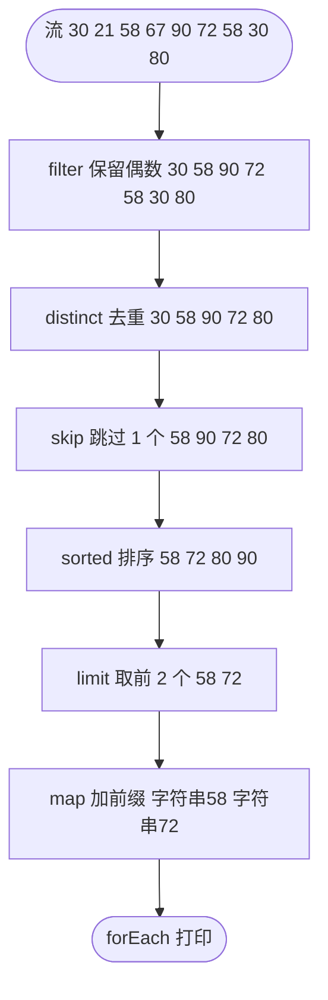
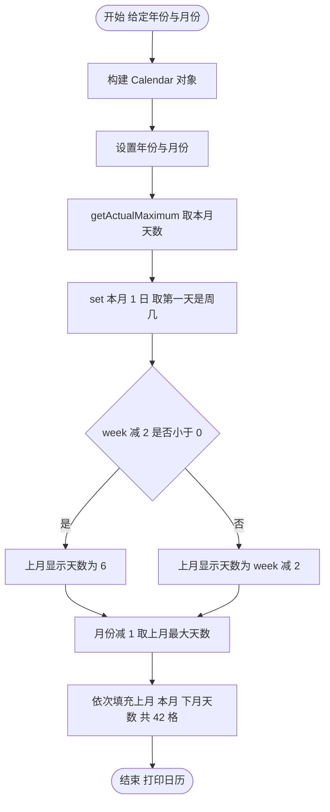

# 第三章 Stream流及常用API

## 课前回顾

### 1. 如何使用方法引用

因为方法有静态方法、成员方法和构造方法之分，因此方法引用也分为静态方法引用、成员方法引用以及构造方法引用。

```java
//静态方法引用
类名::方法名;

//成员方法引用
对象名::方法名;
this::方法名;
super::方法名;

//构造方法引用
类名::new
```

### 2. 描述 Consumer、Predicate、Function 接口的作用

`Consumer` 是消费者意思，主要用来消费数据。`Predicate` 接口是条件的意思，主要用于检测数据是否满足条件。`Function` 是功能的意思，主要用来转换数据类型。

## 章节内容

| 章节内容 | 要求 |
| :--- | :--- |
| Stream 流 | **重点** |
| 自动装箱和拆箱 | **重点** |
| Date 类 | 熟悉 |
| Calendar 类 | **重点** |

## 章节目标

- 掌握 Stream 流的使用
- 掌握自动装箱和拆箱
- 熟悉 Date 类
- 掌握 Calendar 类的使用

---

## 第一节 Stream 流

### 1. 管道

> A pipeline is a sequence of aggregate operations.
>
> 管道就是一系列的聚合操作。

> A pipeline contains the following components:
>
> 管道包含以下组件：

> A source: This could be a collection, an array, a generator function, or an I/O channel.
>
> 源：可以是集合，数组，生成器函数或 I/O 通道。

> Zero or more intermediate operations. An intermediate operation, such as filter, produces a new stream.
>
> 零个或多个中间操作。诸如过滤器之类的中间操作产生新的流。

> A terminal operation. A terminal operation, such as forEach, produces a non-stream result, such as a primitive value (like a double value), a collection, or in the case of forEach, no value at all.
>
> 终结操作。终结操作（例如 forEach）会产生非流结果，例如原始值（如 double 值）、集合，或者对于 forEach 而言根本没有任何值。

一条完整的管道可以概括为「源 → 零个或多个中间操作 → 终结操作」三段：


### 2. 如何获取 Stream 流

**流**

> A stream is a sequence of elements. Unlike a collection, it is not a data structure that stores elements. Instead, a stream carries values from a source through a pipeline.
>
> 流是一系列元素。与集合不同，它不是存储元素的数据结构。取而代之的是，流通过管道携带来自源的值。

> The filter operation returns a new stream that contains elements that match its predicate (this operation's parameter).
>
> 筛选器操作返回一个新流，该流包含与筛选条件（此操作的参数）匹配的元素。

**获取流的方式**

| 所属 | 方法签名 | 说明 |
| :--- | :--- | :--- |
| `Collection` 接口 | `default Stream<E> stream();` | 从集合获取流 |
| `Stream` 接口 | `public static<T> Stream<T> of(T... values);` | 根据给定的若干值获取流 |
| `Stream` 接口 | `public static <T> Stream<T> concat(Stream<? extends T> a, Stream<? extends T> b);` | 将两个流拼接形成一个新的流 |
| `Arrays` 工具类 | `Arrays.stream(数组);` | 从数组获取流（面试题、日历练习中用到） |
| `Map` 接口 | `map.entrySet().stream();` | 先转成 `Set` 再获取流（示例中用到） |

**示例**

```java
package com.cyx.stream;


import java.util.Arrays;
import java.util.HashMap;
import java.util.List;
import java.util.Map;
import java.util.stream.Stream;

public class StreamTest {

    public static void main(String[] args) {
        List<Integer> numbers1 = Arrays.asList(1, 2, 3, 4, 5);
        Stream<Integer> s1 = numbers1.stream();

        Stream<Integer> s2 = Stream.of(6, 7, 8, 9, 10);

        Stream<Integer> s3 = Stream.concat(s1, s2);

        Map<String,Integer> map = new HashMap<>();
        map.put("a", 1);
        map.put("b", 2);
        Stream<Map.Entry<String,Integer>> s4 = map.entrySet().stream();
    }
}
```

### 3. Stream 流中间聚合操作

**Stream 接口**

| 方法签名 | 说明 |
| :--- | :--- |
| `Stream<T> filter(Predicate<? super T> predicate)` | 根据给定的条件过滤流中的元素 |
| `<R> Stream<R> map(Function<? super T, ? extends R> mapper)` | 将流中元素进行类型转换 |
| `Stream<T> distinct()` | 去重 |
| `Stream<T> sorted()` | 排序，如果存储元素没有实现 `Comparable` 或者相关集合没有提供 `Comparator` 将抛出异常 |
| `Stream<T> limit(long maxSize)` | 根据给定的上限，获取流中的元素 |
| `Stream<T> skip(long n)` | 跳过给定数量的元素 |
| `IntStream mapToInt(ToIntFunction<? super T> mapper)` | 将流中元素全部转为整数 |
| `LongStream mapToLong(ToLongFunction<? super T> mapper)` | 将流中元素全部转为长整数 |
| `DoubleStream mapToDouble(ToDoubleFunction<? super T> mapper)` | 将流中元素全部转为双精度浮点数 |

**示例**

```java
package com.cyx.stream;

import java.util.Arrays;
import java.util.List;
import java.util.Optional;
import java.util.Set;
import java.util.function.Function;
import java.util.function.IntFunction;
import java.util.function.Predicate;
import java.util.stream.Collectors;
import java.util.stream.Stream;

public class AggregateOperation {

    public static void main(String[] args) {
        List<String> numbers = Arrays.asList("30","21","58","67","90","72");
//        Stream<String> s = numbers.stream();
//        Optional<String> first = s.findFirst();
//        System.out.println(first.get());
//        Optional<String> optional = s.max(String::compareTo);
//        String max = optional.get();
//        System.out.println(max);
//        System.out.println(s.count());
//        numbers.stream().map(new Function<String, Integer>() {
//            @Override
//            public Integer apply(String s) {
//                return Integer.parseInt(s);
//            }
//        }).anyMatch(new Predicate<Integer>() {
//            @Override
//            public boolean test(Integer integer) {
//                return integer % 2 == 1;
//            }
//        });
        boolean exist1 = numbers.stream().map(Integer::parseInt).anyMatch(number->number % 2 ==1);
        System.out.println(exist1);

        boolean exist2 = numbers.stream().map(Integer::parseInt).allMatch(number->number%2 ==1);
        System.out.println(exist2);

        boolean exist3 = numbers.stream().map(Integer::parseInt).noneMatch(number->number%2 ==1);
        System.out.println(exist3);
    }

    private static void operation(){
//        List<Integer> numbers = Arrays.asList(30,21,58,67,90,72);
//        for(Integer number: numbers){
//            if(number % 2 == 0){
//                System.out.println(number);
//            }
//        }

        Stream<Integer> s1 = Stream.of(30,21,58,67,90,72,58,30,80);
//        Stream<Integer> s2 = s1.filter(new Predicate<Integer>() {
//            @Override
//            public boolean test(Integer integer) {
//                return integer % 2 == 0;
//            }
//        });
        Stream<String> s2 = s1.filter(number -> number % 2 == 0).distinct().skip(1).sorted().limit(2).map(integer-> "字符串"+ integer);
        s2.forEach(System.out::println);
        //将流中的元素收集为一个List集合，此时流就已经消亡了
//        List<Integer> existNumbers = s2.collect(Collectors.toList());

        //再使用流进行收集操作时就将报错
//        Set<Integer> set = s2.collect(Collectors.toSet());

//        Integer[] arr = s2.toArray(new IntFunction<Integer[]>() {
//            @Override
//            public Integer[] apply(int value) {
//                return new Integer[value];
//            }
//        });
        //再使用流进行收集操作时就将报错
//        Integer[] arr = s2.toArray(Integer[]::new);
//        for(Integer number: arr){
//            System.out.println(number);
//        }

    }
}
```

> 💡 补充：`AggregateOperation` 类把中间操作与终结操作写在同一个文件里——中间操作在 `operation()` 方法中，终结操作在 `main()` 方法中。其中 `s1.filter(...).distinct().skip(1).sorted().limit(2).map(...)` 就是一条典型的中间操作链，链上的每个方法都返回**新的流**，因此可以继续链式调用。

**中间操作链的数据流向**

以 `Stream.of(30,21,58,67,90,72,58,30,80)` 为例，逐个中间操作后流中的元素变化如下：



**数字流的转换示例**

```java
package com.cyx.stream;

import java.util.Arrays;
import java.util.function.IntFunction;
import java.util.stream.DoubleStream;
import java.util.stream.IntStream;
import java.util.stream.LongStream;
import java.util.stream.Stream;

public class NumberStream {

    public static void main(String[] args) {
        Stream<String> s1 = Stream.of("1","2","3","4");
//        IntStream s2 = s1.mapToInt(new ToIntFunction<String>() {
//            @Override
//            public int applyAsInt(String value) {
//                return Integer.parseInt(value);
//            }
//        });
//        IntStream s2 = s1.mapToInt(value->Integer.parseInt(value));
        IntStream s2 = s1.mapToInt(Integer::parseInt);
        int[] arr = s2.toArray();
        System.out.println(Arrays.toString(arr));

        LongStream s3 = Stream.of("1","2","3","4").mapToLong(Long::parseLong);
        long[] arr2 = s3.toArray();
        System.out.println(Arrays.toString(arr2));

        DoubleStream s4 = Stream.of("1","2","3","4").mapToDouble(Double::parseDouble);
        double[] arr3 = s4.toArray();
        System.out.println(Arrays.toString(arr3));

        int[] intArr1 = {1, 2, 3, 4, 5};
//        Integer[] intArr2 = Arrays.stream(intArr1).mapToObj(new IntFunction<Integer>() {
//            @Override
//            public Integer apply(int value) {
//                return value;
//            }
//        }).toArray(new IntFunction<Integer[]>() {
//            @Override
//            public Integer[] apply(int value) {
//                return new Integer[value];
//            }
//        });
//        Integer[] intArr2 = Arrays.stream(intArr1).mapToObj(value -> value).toArray(Integer[]::new);
        Integer[] intArr2 = Arrays.stream(intArr1).boxed().toArray(Integer[]::new);

        Integer[] intArr3 = {1,2,3,4,5};
        int[] intArr4 = Arrays.stream(intArr3).mapToInt(Integer::intValue).toArray();
    }
}
```

### 4. Stream 流终结操作

**Stream 接口**

| 方法签名 | 说明 |
| :--- | :--- |
| `void forEach(Consumer<? super T> action)` | 遍历操作流中元素 |
| `<A> A[] toArray(IntFunction<A[]> generator)` | 将流中元素按照给定的转换方式转换为数组 |
| `<R, A> R collect(Collector<? super T, A, R> collector)` | 将流中的元素按照给定的方式搜集起来 |
| `Optional<T> min(Comparator<? super T> comparator)` | 根据给定的排序方式获取流中最小元素 |
| `Optional<T> max(Comparator<? super T> comparator)` | 根据给定的排序方式获取流中最大元素 |
| `Optional<T> findFirst()` | 获取流中第一个元素 |
| `long count()` | 获取流中元素数量 |
| `boolean anyMatch(Predicate<? super T> predicate)` | 检测流中是否存在给定条件的元素 |
| `boolean allMatch(Predicate<? super T> predicate)` | 检测流中元素是否全部满足给定条件 |
| `boolean noneMatch(Predicate<? super T> predicate)` | 检测流中元素是否全部不满足给定条件 |

**示例**

终结操作的示例与上一节同属 `AggregateOperation` 类（终结操作写在 `main()` 方法中），涉及 `findFirst`、`max`、`count`、`anyMatch`、`allMatch`、`noneMatch` 等，完整源码已在上文给出，此处不再重复。

> 💡 补充：终结操作执行之后流就**消亡**了，不能再对同一个流对象做第二次终结操作，否则会抛出异常。示例中被注释掉的 `s2.collect(Collectors.toList())` 之后再 `s2.collect(Collectors.toSet())`，注释里写的「再使用流进行收集操作时就将报错」说的正是这一点。

**补充：收集器与装箱相关方法**

| 方法 | 说明 |
| :--- | :--- |
| `Collectors.toList()` | 把流中的元素收集为一个 `List` 集合 |
| `Collectors.toSet()` | 把流中的元素收集为一个 `Set` 集合 |
| `<U> Stream<U> mapToObj(IntFunction<? extends U> mapper)` | 把基本类型流中的元素转换为对象流中的元素（面试题用到） |
| `Stream<Integer> boxed()` | 把基本类型流装箱为包装类型流（面试题用到） |
| `Optional<T> reduce(BinaryOperator<T> accumulator)` | 归约：把流中的元素反复结合起来得到一个值（**补充**，PDF 原文未展开） |

### 5. Stream 流聚合操作与迭代器的区别

> Aggregate operations, like forEach, appear to be like iterators. However, they have several fundamental differences:
>
> 聚合操作（如 forEach）似乎像迭代器。但是，它们有几个基本差异：

| 基本差异 | 说明 |
| :--- | :--- |
| 使用内部迭代 | 聚合操作不包含诸如 `next` 的方法来指示它们处理集合的下一个元素。使用内部委托，你的应用程序确定要迭代的集合，而 JDK 确定如何迭代该集合。通过外部迭代，你的应用程序既可以确定要迭代的集合，又可以确定迭代的方式。但是，外部迭代只能顺序地迭代集合的元素。内部迭代没有此限制，它可以更轻松地利用并行计算的优势，这涉及将问题分为子问题，同时解决这些问题，然后将解决方案的结果组合到子问题中。 |
| 处理流中的元素 | 聚合操作从流中而不是直接从集合中处理元素。因此，它们也称为流操作。 |
| 支持将行为作为参数 | 你可以将 lambda 表达式指定为大多数聚合操作的参数。这使你可以自定义特定聚合操作的行为。 |

**面试题**

使用 Stream 流将一个基本数据类型的数组转换为包装类型的数组，再将包装类型的数组转换为基本数据类型数组。

```java
int[] intArr1 = {1, 2, 3, 4, 5};
//        Integer[] intArr2 = Arrays.stream(intArr1).mapToObj(new IntFunction<Integer>() {
//            @Override
//            public Integer apply(int value) {
//                return value;
//            }
//        }).toArray(new IntFunction<Integer[]>() {
//            @Override
//            public Integer[] apply(int value) {
//                return new Integer[value];
//            }
//        });
//        Integer[] intArr2 = Arrays.stream(intArr1).mapToObj(value -> value).toArray(Integer[]::new);
Integer[] intArr2 = Arrays.stream(intArr1).boxed().toArray(Integer[]::new);

Integer[] intArr3 = {1,2,3,4,5};
int[] intArr4 = Arrays.stream(intArr3).mapToInt(Integer::intValue).toArray();
```

> 💡 补充：这段面试题代码同时出现在配套源码 `chapter20/src/com/cyx/stream/NumberStream.java` 的末尾，课件把它单独截出来当作面试题。

---

## 第二节 包装类

### 1. 什么是包装类

> There are, however, reasons to use objects in place of primitives, and the Java platform provides wrapper classes for each of the primitive data types. These classes "wrap" the primitive in an object.
>
> 不论怎样，总有理由使用对象代替原始数据类型，并且 Java 平台为每种原始数据类型提供了包装类。这些类将「原始数据类型」包装在对象中。

| 基本数据类型 | 包装类 | 基本数据类型 | 包装类 |
| :--- | :--- | :--- | :--- |
| `int` | `Integer` | `char` | `Character` |
| `byte` | `Byte` | `boolean` | `Boolean` |
| `short` | `Short` | `float` | `Float` |
| `long` | `Long` | `double` | `Double` |

### 2. 自动装箱和拆箱

**自动装箱**

> Often, the wrapping is done by the compiler—if you use a primitive where an object is expected, the compiler boxes the primitive in its wrapper class for you.
>
> 通常，包装是由编译器完成的——如果你在期望一个对象的地方使用原始数据类型，则编译器会为你将原始数据类型放入其包装类中。

**自动装箱方法**

```java
包装类名.valueOf(原始数据类型的值);
```

**示例**

```java
//变量num期望获取一个整数对象，但赋值时给定的是一个基本数据类型int值，此时编译器将会将int值5进行包装
//调用的是Integer.valueOf(5)
Integer num = 5;
```

**自动拆箱**

> Similarly, if you use a number object when a primitive is expected, the compiler unboxes the object for you.
>
> 类似地，如果在期望使用基本数据类型的情况下使用包装类型，则编译器会为你解包该对象。

**自动拆箱方法**

```java
包装类对象.xxxValue();
```

**示例**

```java
Integer num = new Integer(10);
//变量a期望获取一个基本数据类型的值，但赋值时给定的是一个引用数据类型的对象，此时编译器会将这个引用数据类型的
//对象中存储的数值取出来，然后赋值给变量a。调用的是num.intValue();
int a = num;
```

> 💡 补充：`new Integer(10)` 这种写法在 Java 9 起已被标记为过时，推荐写成 `Integer num = 10;` 或 `Integer.valueOf(10)`，与上面的自动装箱保持一致。

### 3. 字符串转数字的方法

| 方法 | 说明 |
| :--- | :--- |
| `Integer.parseInt("123")` | 将字符串类型的数字转换为整数 |
| `Long.parseLong("123")` | 将字符串类型的数字转换为长整数 |
| `Byte.parseByte("13")` | 将字符串类型的数字转换为字节 |
| `Short.parseShort("13")` | 将字符串类型的数字转换为短整数 |
| `Float.parseFloat("12.0f")` | 将字符串类型的数字转换为单精度浮点数 |
| `Double.parseDouble("123")` | 将字符串类型的数字转换为双精度浮点数 |
| `Boolean.parseBoolean("true")` | 将字符串类型的布尔值转换为布尔值 |

**示例**

```java
int num = Integer.parseInt("11");
float f = Float.parseFloat("12.5");
short s = Short.parseShort("5");
```

**注意**

如果字符串参数的内容无法正确转换为对应的基本类型，则会抛出 `java.lang.NumberFormatException` 异常。

> 💡 补充：源码目录 `chapter20/src/com/cyx/box/BoxTest.java` 是本节内容（装箱 / 拆箱）的完整示例类，课件中只截取了其中几行片段，故此处按课件原文以片段形式给出。

---

## 第三节 日期时间

### 1. Date 类

**常用方法**

| 方法签名 | 说明 |
| :--- | :--- |
| `public Date();` | 无参构造，表示计算机系统当前时间，精确到毫秒 |
| `public Date(long date);` | 带参构造，表示根据给定的时间数字来构建一个日期对象，精确到毫秒 |
| `public long getTime();` | 获取日期对象中的时间数字，精确到毫秒 |
| `public boolean before(Date when);` | 判断当前对象表示的日期是否在给定日期之前 |
| `public boolean after(Date when);` | 判断当前对象表示的日期是否在给定日期之后 |

**示例**

```java
package com.cyx.date;

import java.util.Date;

public class DateTest {

    public static void main(String[] args) {
        Date now = new Date();//获取计算机系统当前时间
        System.out.println(now);
        //获取系统当前时间（数字形式的）
        long time = System.currentTimeMillis();
        Date date = new Date(time);
        System.out.println(date);
        long dateTime= date.getTime();//获取日期对象中的数字时间
        System.out.println(time - dateTime);
        long yesterday = time - 24 * 60 * 60 * 1000;
        Date yesterdayDate = new Date(yesterday);//昨天
        boolean before =yesterdayDate.before(date); //昨天是否在今天之前
        boolean after =yesterdayDate.after(date); //昨天是否在今天之后
        System.out.println(before);
        System.out.println(after);

    }
}
```

> 💡 补充：课件截图里的 `DateTest` 是 `now.before(date)` / `now.after(date)`（`date` 为一天前）的写法；配套源码 `DateTest.java` 换成了 `yesterdayDate.before(date)` / `after(date)`，输出结果方向相反，但演示的都是 `Date` 的这两个比较方法。

**思考**

打印的日期不好看懂，能否按照我们熟悉的方式来打印？

当然可以，首先我们需要将日期按照我们熟悉的日期格式转换为一个字符串日期，然后再打印。

### 2. SimpleDateFormat 类

**常用方法**

| 方法签名 | 说明 |
| :--- | :--- |
| `public SimpleDateFormat(String pattern);` | 根据给定的日期格式构建一个日期格式化对象 |
| `public final String format(Date date);` | 将给定日期对象进行格式化 |
| `public Date parse(String source) throws ParseException;` | 将给定的字符串格式日期解析为日期对象 |

**常用日期格式**

| 字母 | 含义 | 说明 |
| :--- | :--- | :--- |
| `y` | 年 year | 不区分大小写，一般用小写 |
| `M` | 月 month | 区分大小写，只能使用大写 |
| `d` | 日 day | 区分大小写，只能使用小写 |
| `H` | 时 hour | 不区分大小写，一般用大写 |
| `m` | 分 minute | 区分大小写，只能使用小写 |
| `s` | 秒 second | 区分大小写，只能使用小写 |

**示例**

```java
package com.cyx.date;

import java.text.SimpleDateFormat;
import java.util.Date;

public class SimpleDateFormatTest {

    public static void main(String[] args) {
//        String format1 = "yyyy-MM-dd HH:mm:ss";
//        String format2 = "yyyy/MM/dd HH:mm:ss";
        //2021-10-10 10:10:10  2021/10/10 10:10:10 2021年10月10日10时10分10秒
        Date date = new Date();
//        SimpleDateFormat sdf = new SimpleDateFormat(format1);
//        String dateStr = sdf.format(date);
//        System.out.println(dateStr);
        System.out.println(DateUtil.format(DateUtil.format7, date));
        Date yesterday = new Date(System.currentTimeMillis() - 24 * 60 * 60 * 1000);
//        SimpleDateFormat dateFormat = new SimpleDateFormat(format2);
//        String yesterdayStr = dateFormat.format(yesterday);
//        System.out.println(yesterdayStr);
        System.out.println(DateUtil.format(DateUtil.format8, yesterday));

        String s = "2020-10-10 10:10:10";
        Date d = DateUtil.parse(DateUtil.format1, s);
        System.out.println(d);
    }
}
```

> 💡 补充：课件截图中的类名是 `DateFormatTest`，演示 `SimpleDateFormat` 的 `format()` 与 `parse()`；配套源码 `chapter20/src/com/cyx/date/SimpleDateFormatTest.java` 是该知识点的另一版实现（借助 `DateUtil` 工具类，且大部分代码被注释掉），二者并不完全一致。

### 3. Calendar 类

**常用静态字段**

| 字段值 | 含义 |
| :--- | :--- |
| `YEAR` | 年 |
| `MONTH` | 月，从 0 开始 |
| `DAY_OF_MONTH` | 月中第几天 |
| `HOUR` | 时（12 小时制） |
| `HOUR_OF_DAY` | 时（24 小时制） |
| `MINUTE` | 分 |
| `SECOND` | 秒 |
| `DAY_OF_WEEK` | 周中第几天，一周的第一天是周日，因此周日是 1 |

**常用方法**

| 方法签名 | 说明 |
| :--- | :--- |
| `public static Calendar getInstance();` | 获取日历对象 |
| `public final Date getTime();` | 获取日历表示日期对象 |
| `public final void setTime(Date date);` | 设置日历表示的日期对象 |
| `public int get(int field);` | 获取给定的字段的值 |
| `public void set(int field, int value);` | 设置给定字段的值 |
| `public void roll(int field, int amount);` | 根据给定的字段和更改数量滚动日历 |
| `public int getActualMaximum(int field);` | 获取给定字段的实际最大数量 |

**示例**

```java
package com.cyx.date;

import java.util.Calendar;
import java.util.Date;

public class CalendarTest {

    public static void main(String[] args) {
        //获取一个日历对象，默认是系统当前时间
        Calendar c = Calendar.getInstance();
        Date now = c.getTime();//获取日历中当前日期
        System.out.println(now);
        long time = now.getTime() - 3 * 24 * 60 * 60 * 1000;
        c.setTime(new Date(time));//设置日历的日期
        System.out.println(c.getTime());
        int year = c.get(Calendar.YEAR);//获取日历中的年份
        System.out.println(year);
        //获取日历中的月份，因为月份是从0开始，因此展示的时候要+1
        int month = c.get(Calendar.MONTH) + 1;
        System.out.println(month);
        int day = c.get(Calendar.DAY_OF_MONTH); //获取月中的第几天
        System.out.println(day);
        int hour = c.get(Calendar.HOUR);//12小时制
        int hour_24 = c.get(Calendar.HOUR_OF_DAY);//24小时制
        System.out.println(hour);
        System.out.println(hour_24);
        int minute = c.get(Calendar.MINUTE); //获取分钟
        int second = c.get(Calendar.SECOND); //获取秒
        System.out.println(minute);
        System.out.println(second);
        c.set(Calendar.YEAR, 1999);//设置年份为1999年
        c.set(Calendar.MONTH, 8);//设置月份为9月
        c.set(Calendar.DAY_OF_MONTH, 10);//设置天数为该月的第10天
        c.set(Calendar.HOUR_OF_DAY, 18);//设置小时数为18
        c.set(Calendar.MINUTE, 30);//设置分钟数为30分钟
        c.set(Calendar.SECOND, 0);//设置秒数为0
        Date date = c.getTime();
        System.out.println(DateUtil.format(DateUtil.format1, date));
        c.roll(Calendar.YEAR, 1);//年份+1
        String s1 = DateUtil.format(DateUtil.format1, c.getTime());
        System.out.println(s1);
        c.set(Calendar.MONTH, 1);//设置月份为2月
        System.out.println(c.getActualMaximum(Calendar.DAY_OF_MONTH));
        c.roll(Calendar.YEAR, -2);//年份-2
        String s2 = DateUtil.format(DateUtil.format1, c.getTime());
        System.out.println(s2);
        //获取日历中月份的最大天数
        int maxDays = c.getActualMaximum(Calendar.DAY_OF_MONTH);
        System.out.println(maxDays);
        c.set(Calendar.MONTH, 1);//设置月份为2月
        System.out.println(c.getActualMaximum(Calendar.DAY_OF_MONTH));
    }
}
```

> 💡 补充：课件截图中的 `CalendarTest`（`Calendar.getInstance()` → 3 天前 → `set(Calendar.YEAR, 2019)` → `roll(Calendar.DAY_OF_MONTH, -1)`）与配套源码 `CalendarTest.java` 不是同一版：源码版改为设置 1999 年 9 月 10 日 18:30，并借助 `DateUtil` 做格式化输出，功能覆盖更全。此处以配套源码为准。

### 综合练习 日历制作

需求：给定年份和月份，打印出该月的日历（共 6 周、42 格，含上月末与下月初补齐的天数）。

**思路**



**日历类**

```java
package com.cyx.date;

import java.util.ArrayList;
import java.util.Calendar;
import java.util.List;

public class MyCalendar {

    public static void main(String[] args) {
        int year = 2021;
        int month = 1;
        showCalendar(year, month);
    }


    public static void showCalendar(int year, int month){
        int totalDays = 42; //日历显示总天数为42天
        Calendar c = Calendar.getInstance();
        c.set(Calendar.YEAR, year);
        c.set(Calendar.MONTH, month);
        c.set(Calendar.DAY_OF_MONTH, 1);
        //获取设置的月份的第一天是周几
        int week = c.get(Calendar.DAY_OF_WEEK);
        //获取本月最大天数
        int currentMonthMaxDays = c.getActualMaximum(Calendar.DAY_OF_MONTH);
        c.roll(Calendar.MONTH, -1);//月份-1表示上一月
        //获取上一月最大天数
        int prevMonthMaxDays = c.getActualMaximum(Calendar.DAY_OF_MONTH);
        //计算上一月显示天数
        int prevMonthDisplayDays = week == 1 ? 6 : week - 2;
        //计算下一月显示天数
        int nextMonthDisplayDays = totalDays - prevMonthDisplayDays - currentMonthMaxDays;
        List<Integer> days = new ArrayList<>();
        //计算上一月显示的开始天数
        int prevMonthStartDay = prevMonthMaxDays - prevMonthDisplayDays + 1;
        for(int i=prevMonthStartDay; i<= prevMonthMaxDays; i++){
            days.add(i);
        }
        //当前月所有天数全部展示
        for(int i=1; i<=currentMonthMaxDays; i++){
            days.add(i);
        }
        //下一月显示天数
        for(int i=1; i<=nextMonthDisplayDays; i++){
            days.add(i);
        }
        System.out.println(year + "年" + (month + 1) + "月");
        System.out.println("一\t二\t三\t四\t五\t六\t日");
        for(int i=0; i<days.size(); i++){
            if(i % 7 == 6){
                System.out.println(days.get(i));
            } else {
                System.out.print(days.get(i) + "\t");
            }
        }
    }
}
```

**日期信息类**

```java
package com.cyx.date;

public class DayInfo {

    private int number;

    private boolean currentDay;

    private boolean changeLine;//换行

    public DayInfo(int number, boolean currentDay) {
        this.number = number;
        this.currentDay = currentDay;
    }

    public void setChangeLine(boolean changeLine) {
        this.changeLine = changeLine;
    }

    public void show(){
        if(currentDay){//当前月打印黑色
            if(changeLine){
                System.out.println(number);
            } else {
                System.out.print(number + "\t");
            }
        } else {//其余月份打印红色
            if(changeLine){
                System.err.println(number);
            } else {
                System.err.print(number + "\t");
            }
        }
        try {
            Thread.sleep(30L);
        } catch (InterruptedException e) {
        }
    }
}
```

**测试类**

```java
package com.cyx.date;

public class MyCalendarTest {

    public static void main(String[] args) {
        MyCalendar calendar = new MyCalendar();
        calendar.showCalendar(2015, 2);
        calendar.showCalendarDayInfo(2015, 2);
    }
}
```

> 💡 补充：本节综合练习的课件截图版与配套源码版实现不同，请注意区分：
>
> - **课件版**：`MyCalendar` 提供 `showCalendarDayInfo` 与 `showCalendar` 两个方法，配合 `DayInfo`（字段 `day`、`currentMonthDay`）打印，上月显示天数用 `week - 2 < 0 ? 6 : week - 2`。
> - **源码版**：`MyCalendar` 是只含静态 `showCalendar` 方法的精简版，上月显示天数等价地写成 `week == 1 ? 6 : week - 2`；`DayInfo`（字段 `number`、`currentDay`、`changeLine`）实际供 `ColorCalendar` 使用，两者并不配对。
>
> 上面的 `MyCalendarTest` 来自课件截图；若要搭配源码版 `MyCalendar` 运行，需去掉 `showCalendarDayInfo(2015, 2);` 这一行。

> 💡 补充：源码目录 `chapter20/src/com/cyx/date/` 下的 `DateUtil.java`（日期格式化/解析工具类）、`ColorCalendar.java`、`DataGenerator.java` 课件中并未讲到；但上面注入的 `SimpleDateFormatTest`、`CalendarTest` 都调用了 `DateUtil`，需要对照源码查看其实现。
