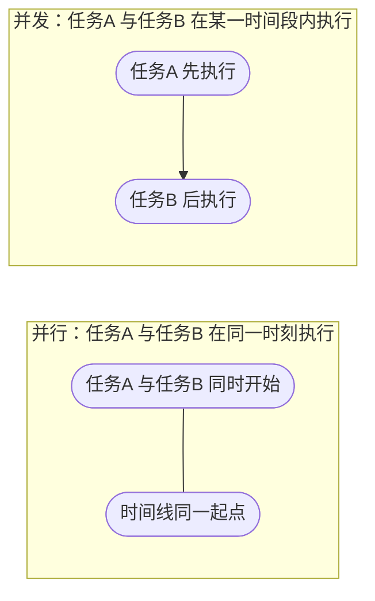
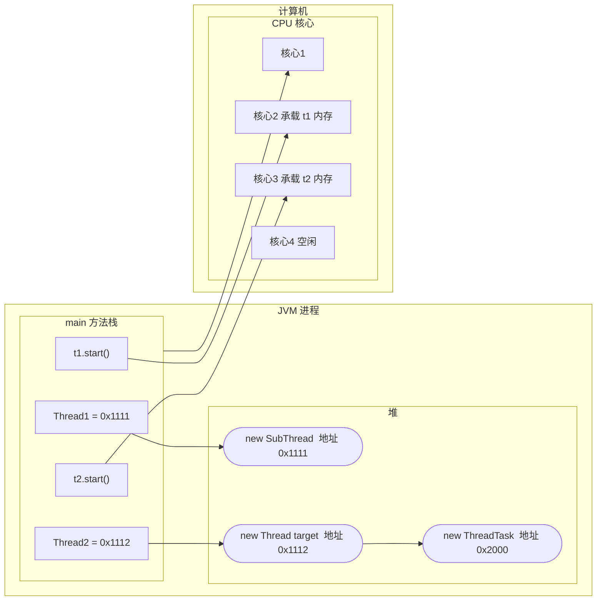
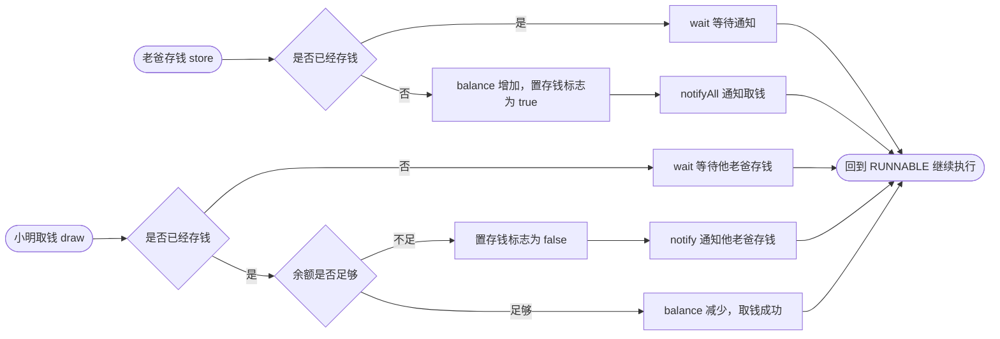
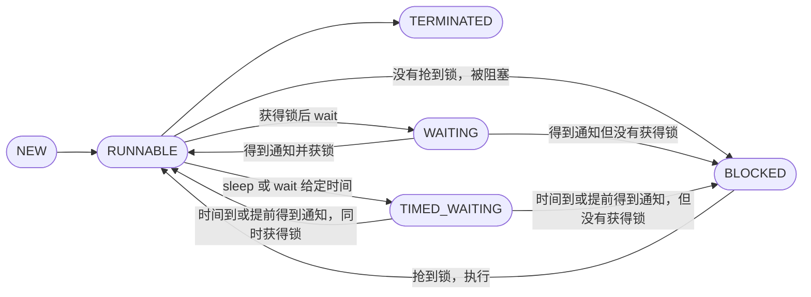
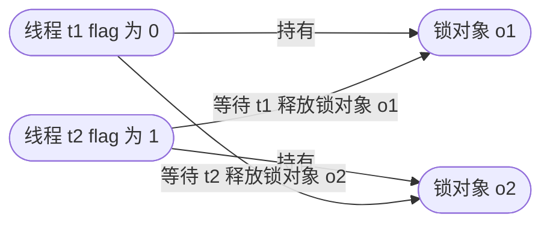
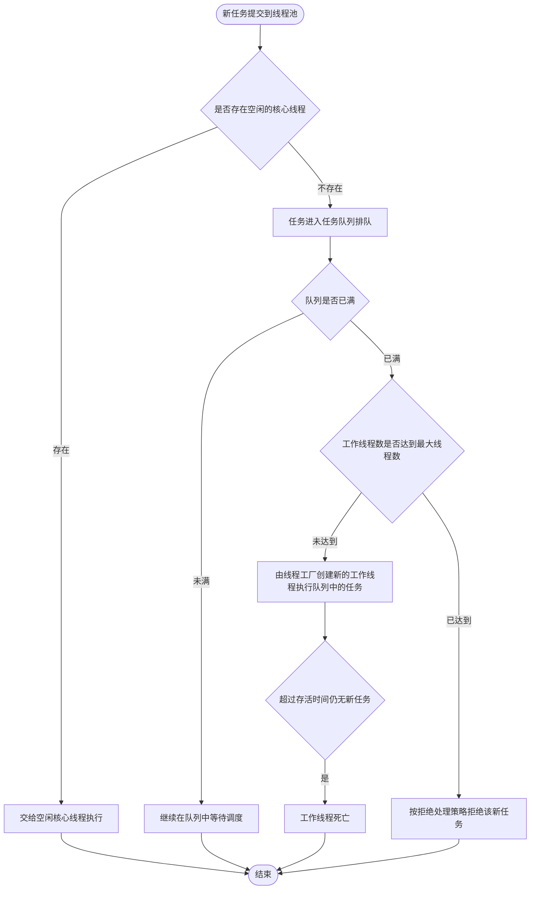

# 第四章 多线程

## 课前回顾

### 1. 如何获取 Stream 流？Stream 流都有哪些常用的操作

| 序号 | 获取 Stream 流的方式 |
| :--- | :--- |
| 1 | `集合对象.stream();` |
| 2 | `Arrays.stream(数组名);` |
| 3 | `Stream.of(T...t);` |

| 序号 | Stream 流常用操作 | 说明 |
| :--- | :--- | :--- |
| 4 | `filter(Predicate p);` | 过滤 |
| 5 | `map(Function f);` | 数据类型转换 |
| 6 | `sorted(Comparator c);` | 排序 |
| 7 | `distinct();` | 去重 |
| 8 | `limit(long count);` | 限制返回个数 |
| 9 | `skip(long count);` | 跳过给定的数量 |
| 10 | `collect(Supplier s);` | 搜集 |
| 11 | `toArray(Function f);` | 转换为数组 |

### 2. 自动装箱和自动拆箱在什么时候发生，如何进行

自动装箱和自动拆箱发生在基本数据类型与其对应的包装类之间。当定义一个基本数据类型的变量时，如果给其赋的值是一个包装类型的对象，这种情况就会发生自动拆箱，自动拆箱由编译器完成，使用的方法是 `包装类.xxxValue()` 方法。当定义一个包装类型的对象，如果给其赋的值是一个基本数据类型，这种情况就会发生自动装箱，自动装箱也是由编译器完成，使用的方法是 `包装类.valueOf(值);`

> 💡 补充：原文两处"使用的方法时"应为"使用的方法是"，已顺手改正。

| 基本数据类型 | 包装类 | 拆箱方法 |
| :--- | :--- | :--- |
| byte | Byte | `byteValue();` |
| short | Short | `shortValue();` |
| long | Long | `longValue();` |
| float | Float | `floatValue();` |
| double | Double | `doubleValue();` |
| boolean | Boolean | `booleanValue();` |
| int | Integer | `intValue();` |
| char | Character | `charValue();` |

### 3. 日期格式化类常用日期格式都有哪些

```java
String format1 = "yyyy-MM-dd HH:mm:ss";
String format1 = "yyyy/MM/dd HH:mm:ss";
SimpleDateFormat sdf = new SimpleDateFormat(format1);
String dateStr = sdf.format(new Date()); //将日期转换为字符串类型的日期
String s = "2020-10-10 10:10:10";
try{
    Date date = sdf.parse(s);//将字符串类型的日期解析为日期对象
} catch(Exception e){
    e.printStackTrace();
}
```

> 💡 补充：上面两个 `String format1` 演示的是两种可选的格式模板，实际编写时在同一作用域内只能保留其中一个（同名变量不能重复声明），否则编译不通过。

---

## 章节内容

| 章节内容 | 要求 |
| :--- | :--- |
| 线程 | **重点** |
| 线程池 | **重点** |

## 章节目标

- 熟悉并发和并行
- 掌握线程创建的两种方式
- 掌握线程的状态
- 掌握死锁的触发情况
- 掌握 synchronized 和 Lock 的使用
- 熟悉线程通信
- 掌握线程池的工作流程

---

## 第一节 并发

### 并发(Concurrency)

**来自官方的说明**

```text
Computer users take it for granted that their systems can do more than one
thing at a time. They assume that they can continue to work in a word
processor, while other applications download files, manage the print queue,
and stream audio. Even a single application is often expected to do more than
one thing at a time.
```

计算机用户认为他们的系统一次可以执行多项操作是理所当然的。他们假设自己可以继续在文字处理器中工作，而其他应用程序则可以下载文件，管理打印队列和流音频。通常甚至一个应用程序一次都可以完成多项任务。

```text
The Java platform is designed from the ground up to support concurrent
programming, with basic concurrency support in the Java programming language
and the Java class libraries. Since version 5.0, the Java platform has also
included high-level concurrency APIs. This lesson introduces the platform's
basic concurrency support and summarizes some of the high-level APIs in the
java.util.concurrent packages.
```

Java 平台是从一开始就设计为支持并发编程，并在 Java 编程语言和 Java 类库中提供基本的并发支持。从 5.0 版开始，Java 平台还包含高级并发 API。本课介绍了平台的基本并发支持，并总结了 `java.util.concurrent` 包中的一些高级 API。

> 💡 补充：原文"Java平是从一开始就设计为支持并发编程"漏了"台"字，已改正。

在并发的概念中还包含并行在其中。



---

## 第二节 进程和线程

### 1. 进程和线程

**来自官方的说明**

```text
In concurrent programming, there are two basic units of execution: processes
and threads. In the Java programming language, concurrent programming is
mostly concerned with threads. However, processes are also important.
```

在并发编程中，有两个基本的执行单元：进程和线程。在 Java 编程语言中，并发编程主要与线程有关。但是，进程也很重要。

```text
A computer system normally has many active processes and threads. This is
true even in systems that only have a single execution core, and thus only
have one thread actually executing at any given moment. Processing time for a
single core is shared among processes and threads through an OS feature
called time slicing.
```

计算机系统通常具有许多活动的进程和线程。即使在只有一个执行核心的系统中也是如此，因此在任何给定时刻只有一个线程实际执行。单个内核的处理时间通过 OS 被称作时间分片的功能在进程和线程之间共享。

```text
It's becoming more and more common for computer systems to have multiple
processors or processors with multiple execution cores. This greatly enhances
a system's capacity for concurrent execution of processes and threads — but
concurrency is possible even on simple systems, without multiple processors
or execution cores.
```

计算机系统具有多个处理器或具有多个执行核心的处理器正变得越来越普遍。这极大地增强了系统同时执行进程和线程的能力——但即使在没有多个处理器或执行核心的简单系统上，并发也是可能的。

### 2. 进程

```text
A process has a self-contained execution environment. A process generally has
a complete, private set of basic run-time resources; in particular, each
process has its own memory space.
```

进程具有独立的执行环境。进程通常具有一套完整的私有基本运行时资源；特别是，每个进程都有其自己的内存空间。

```text
Processes are often seen as synonymous with programs or applications.
However, what the user sees as a single application may in fact be a set of
cooperating processes. To facilitate communication between processes, most
operating systems support Inter Process Communication (IPC) resources, such
as pipes and sockets. IPC is used not just for communication between
processes on the same system, but processes on different systems.
```

进程通常被视为程序或应用程序的同义词。但是，用户视为单个应用程序实际上可能是一组协作进程。为了促进进程之间的通信，大多数操作系统都支持进程间通信（IPC）资源，例如管道和套接字。IPC 不仅用于同一系统上的进程之间的通信，而且还用于不同系统上的进程。

```text
Most implementations of the Java virtual machine run as a single process.
```

Java 虚拟机的大多数实现都是作为单个进程运行的。

### 3. 线程

```text
Threads are sometimes called lightweight processes. Both processes and
threads provide an execution environment, but creating a new thread requires
fewer resources than creating a new process.
```

线程有时称为轻量级进程。进程和线程都提供执行环境，但是创建新线程比创建新进程需要更少的资源。

```text
Threads exist within a process — every process has at least one. Threads
share the process's resources, including memory and open files. This makes
for efficient, but potentially problematic, communication.
```

线程存在于一个进程中——每个进程至少有一个。线程共享进程的资源，包括内存和打开的文件。这样可以进行有效的通信，但可能会出现问题。

```text
Multithreaded execution is an essential feature of the Java platform. Every
application has at least one thread — or several, if you count "system"
threads that do things like memory management and signal handling. But from
the application programmer's point of view, you start with just one thread,
called the main thread. This thread has the ability to create additional
threads, as we'll demonstrate in the next section.
```

多线程执行是 Java 平台的基本功能。每个应用程序都至少有一个线程——或者几个，如果算上做内存管理和信号处理之类事情的"系统"线程。但是从应用程序程序员的角度来看，您仅从一个线程（称为主线程）开始。该线程具有创建其他线程的能力，我们将在下一部分中进行演示。

**总结**

进程拥有自己独立的内存空间，换言之就是计算机分配内存的单位是进程。线程是在进程中，可以共享进程的资源比如内存。

单个执行核心是通过操作系统的时间分片功能来进行进程和线程之间的处理时间的分配。

---

## 第三节 线程

### 1. 线程的创建方式

**来自官方的说明**

```text
An application that creates an instance of Thread must provide the code that
will run in that thread. There are two ways to do this:
-Provide a Runnable object. The Runnable interface defines a single method,
run, meant to contain the code executed in the thread.
-Subclass Thread. The Thread class itself implements Runnable, though its run
method does nothing.
```

创建 Thread 实例的应用程序必须提供将在该线程中运行的代码。有两种方法可以做到这一点：

- 提供一个 Runnable 对象。Runnable 接口定义了一个方法 run，旨在包含在线程中执行的代码。
- 继承 Thread 类。Thread 类本身实现了 Runnable，尽管它的 run 方法不执行任何操作。

**Thread 类常用构造方法**

| 序号 | 构造方法 | 说明 |
| :--- | :--- | :--- |
| 1 | `public Thread();` | 创建一个线程 |
| 2 | `public Thread(String name);` | 创建一个依据名称的线程 |
| 3 | `public Thread(Runnable target);` | 根据给定的线程任务创建一个线程 |
| 4 | `public Thread(Runnable target, String name);` | 根据给定的线程任务和名称创建一个线程 |

**Thread 类常用成员方法**

| 序号 | 成员方法 | 说明 |
| :--- | :--- | :--- |
| 1 | `public synchronized void start();` | 启动线程但不一定会执行 |
| 2 | `public final String getName();` | 获取线程名称 |
| 3 | `public final synchronized void setName(String name);` | 设置线程的名称 |
| 4 | `public final void setPriority(int newPriority);` | 设置线程的优先级 |
| 5 | `public final int getPriority();` | 获取线程的优先级 |
| 6 | `public final void join() throws InterruptedException;` | 等待线程执行完成 |
| 7 | `public final synchronized void join(long millis) throws InterruptedException;` | 等待线程执行给定的时间（单位毫秒） |
| 8 | `public final synchronized void join(long millis, int nanos) throws InterruptedException;` | 等待线程执行给定的时间（单位毫秒、纳秒） |
| 9 | `public long getId();` | 获取线程的 ID |
| 10 | `public State getState();` | 获取线程的状态 |
| 11 | `public boolean isInterrupted();` | 检测线程是否被打断 |
| 12 | `public void interrupt();` | 打断线程 |

**Thread 类常用静态方法**

| 序号 | 静态方法 | 说明 |
| :--- | :--- | :--- |
| 1 | `public static native Thread currentThread();` | 获取当前运行的线程 |
| 2 | `public static boolean interrupted();` | 检测当前运行的线程是否被打断 |
| 3 | `public static native void yield();` | 暂停当前运行的线程，然后再与其他线程争抢资源，称为线程礼让 |
| 4 | `public static native void sleep(long millis) throws InterruptedException;` | 使当前线程睡眠给定的时间（单位毫秒） |
| 5 | `public static void sleep(long millis, int nanos) throws InterruptedException;` | 使当前线程睡眠给定的时间（单位毫秒、纳秒） |

**示例**

```java
package com.cyx.thread;

public class CreateDemo {

    public static void main(String[] args) {
        Thread t1 =new SubThread("inherit"); //通过继承实现的线程
        ThreadTask task = new ThreadTask();
        Thread t2 = new Thread(task, "interface");//通过实现Runnable接口实现的线程
        Thread t3 = new Thread(task, "t3");
        t1.start();//start方法只是告诉JVM线程t1已经准备好了，随时可以调度执行
        try {
            t1.join(); //等待线程t1执行完成
            t1.join(1000);//等待线程t1执行1秒
//             1毫秒 = 1000微秒 = 1000000纳秒
            t1.join(1000, 50000);//等待线程t1执行1.5秒
        } catch (InterruptedException e) {
            e.printStackTrace();
        }
        t2.start();
        t3.start();
    }


    static class SubThread extends Thread{

        public SubThread() {
        }

        public SubThread(String name) {
            super(name);
        }

        @Override
        public void run() {
            try {
                Thread.sleep(2000);
            } catch (InterruptedException e) {
                e.printStackTrace();
            }
            System.out.println(getName() + "=>This is SubThread");
        }
    }

    static class ThreadTask implements Runnable{

        @Override
        public void run() {
            Thread thread = Thread.currentThread();
            String name = thread.getName();
            System.out.println(name + "=>This is Implementation");
        }
    }
}
```

**总结**

创建线程有两种方式：实现 Runnable 接口和继承 Thread。相较于继承 Thread，实现 Runnable 接口更具有优势，在实现接口的同时还可以继承自其他的父类，避免了 Java 中类单继承的局限性；同时 Runnable 接口的实现可以被多个线程重用，但继承 Thread 无法做到；后续学到的线程池中支持 Runnable 接口但不支持 Thread。

> 💡 补充：原文多处写作"Runable"，应为"Runnable"，已统一改正。

**两种创建方式对比**

| 对比项 | 继承 Thread | 实现 Runnable 接口 |
| :--- | :--- | :--- |
| 实现方式 | 子类继承 Thread，重写 run 方法 | 实现 Runnable 接口，重写 run 方法 |
| 是否受单继承限制 | **受限**，无法再继承其他父类 | **不受限**，实现接口的同时仍可继承其他父类 |
| 任务能否被多个线程重用 | 不能 | **可以** |
| 线程池是否支持 | 不支持 | **支持** |
| 启动方式 | `new SubThread(name).start();` | `new Thread(new ThreadTask(), name).start();` |

### 2. 线程内存模型



> 💡 补充：原文此处只有一张内存模型示意图，没有文字说明，上图是按原图重绘的。要点是：`main` 方法栈中的 `Thread1`、`Thread2` 两个引用分别指向堆中地址为 `0x1111`、`0x1112` 的线程对象；`Thread` 对象内部通过 `target` 指向地址 `0x2000` 的 `ThreadTask`。调用 `t1.start()`、`t2.start()` 后，线程被提交给操作系统的 CPU 核心，每个核心持有各自线程的本地内存。

### 3. 线程安全

**案例**

某火车站有 10 张火车票在 3 个窗口售卖

**代码实现**

```java
package com.cyx.thread;

public class SaleThreadTest {

    public static void main(String[] args) {
        SaleTask task = new SaleTask();
        Thread t1 = new Thread(task, "窗口1");
        Thread t2 = new Thread(task, "窗口2");
        Thread t3 = new Thread(task, "窗口3");
        t1.start();
        t2.start();
        t3.start();
    }


    static class SaleTask implements Runnable{

        private int totalTickets = 10; //售卖10张火车票

        @Override
        public void run() {
            while (true){
                String name = Thread.currentThread().getName();
                System.out.println(name + "售卖火车票：" + totalTickets);
                totalTickets --;
                if(totalTickets <= 0) break;
                try {
                    Thread.sleep(100L);
                } catch (InterruptedException e) {
                    e.printStackTrace();
                }
            }
        }
    }
}
```

**执行结果**

```text
"C:\Program Files\Java\jdk1.8.0_171\bin\java.exe" ...
窗口1售卖火车票：9
窗口2售卖火车票：8
窗口3售卖火车票：7
窗口1售卖火车票：6
窗口2售卖火车票：6
窗口3售卖火车票：5
窗口2售卖火车票：3
窗口1售卖火车票：3
窗口3售卖火车票：2
窗口2售卖火车票：1
窗口1售卖火车票：1
窗口3售卖火车票：0

Process finished with exit code 0
```

从结果中可以看出，同一张火车票被卖了多次，这是由于线程之间获取信息不同步导致。

**内存分析**

> 💡 补充：PDF 此处的"内存分析"标题下是一段空白（没有配图也没有文字），因此本笔记不臆造内容。可结合上一小节「线程内存模型」理解：三个窗口线程共用同一个 `SaleTask` 对象，`totalTickets` 是三个线程共享的成员变量，`totalTickets --` 不是原子操作，所以会出现重复售卖。

### 4. 线程同步 - synchronized

**来自官方的说明**

```text
The Java programming language provides two basic synchronization idioms:
synchronized methods and synchronized statements
```

Java 编程语言提供了两种基本的同步习惯用法：同步方法和同步代码块

**同步方法语法**

```java
访问修饰符 synchronized 返回值类型 方法名(参数列表){

}
```

**示例（第二步：同步方法）**

在第一步的基础上，把卖票逻辑抽成一个同步方法，`run` 中改为调用它。改动部分如下：

```java
//synchronized作用在成员方法上，因此synchronized与成员有关
private synchronized void saleTicket(){
    if(totalTickets > 0){
        String name = Thread.currentThread().getName();
        System.out.println(name + "售卖火车票：" + totalTickets);
        totalTickets --;
    }
}

@Override
public void run() {
    while (true){
        saleTicket();
        if(totalTickets == 0) break;
        try {
            Thread.sleep(100L);
        } catch (InterruptedException e) {
            e.printStackTrace();
        }
    }
}
```

**同步代码块语法**

```java
synchronized(对象){

}
```

**示例（第三步：同步代码块）**

新增一个普通对象当作锁，把同步范围从"整个方法"缩小到"代码块"。`run` 方法与 `main` 方法均与上一步相同，改动部分如下：

```java
private Object o = new Object();

//synchronized作用在成员方法上，因此synchronized与成员有关
//        private synchronized void saleTicket(){
//            if(totalTickets > 0){
//                String name = Thread.currentThread().getName();
//                System.out.println(name + "售卖火车票：" + totalTickets);
//                totalTickets --;
//            }
//        }

@Override
public void run() {
    while (true){
//                saleTicket();
        synchronized (o){
            if(totalTickets > 0){
                String name = Thread.currentThread().getName();
                System.out.println(name + "售卖火车票：" + totalTickets);
                totalTickets --;
            }
        }
        if(totalTickets == 0) break;
        try {
            Thread.sleep(100L);
        } catch (InterruptedException e) {
            e.printStackTrace();
        }
    }
}
```

**完整代码**

```java
package com.cyx.thread;

import java.util.concurrent.locks.Lock;

public class SaleThreadTest {

    public static void main(String[] args) {
        SaleTask task = new SaleTask();//一个成员
        Thread t1 = new Thread(task, "窗口1");//共用同一个成员
        Thread t2 = new Thread(task, "窗口2");//共用同一个成员
        Thread t3 = new Thread(task, "窗口3");//共用同一个成员
        t1.start();
        t2.start();
        t3.start();
    }


    static class SaleTask implements Runnable{

        private int totalTickets = 10; //售卖10张火车票

        private Object o = new Object();

        //synchronized作用在成员方法上，因此synchronized与成员有关
        //monitor enter
//        private synchronized void saleTicket(){
//            if(totalTickets > 0){
//                String name = Thread.currentThread().getName();
//                System.out.println(name + "售卖火车票：" + totalTickets);
//                totalTickets --;
//            }
//        }
//      monitor exit


        @Override
        public void run() {
            while (true){
//                saleTicket();
                synchronized (o){
                    if(totalTickets > 0){
                        String name = Thread.currentThread().getName();
                        System.out.println(name + "售卖火车票：" + totalTickets);
                        totalTickets --;
                    }
                }
                if(totalTickets == 0) break;
                try {
                    Thread.sleep(100L);
                } catch (InterruptedException e) {
                    e.printStackTrace();
                }
            }
        }
    }
}
```

**synchronized 锁实现原理**

```text
Synchronization is built around an internal entity known as the intrinsic
lock or monitor lock. (The API specification often refers to this entity
simply as a "monitor.") Intrinsic locks play a role in both aspects of
synchronization: enforcing exclusive access to an object's state and
establishing happens-before relationships that are essential to visibility.
```

同步是围绕称为内部锁或监视器锁的内部实体构建的。（API 规范通常将此实体简称为"监视器"。）内在锁在同步的两个方面都起作用：强制对对象状态的独占访问并建立对可见性至关重要的事前关联。

```text
Every object has an intrinsic lock associated with it. By convention, a
thread that needs exclusive and consistent access to an object's fields has
to acquire the object's intrinsic lock before accessing them, and then
release the intrinsic lock when it's done with them. A thread is said to
own the intrinsic lock between the time it has acquired the lock and
released the lock. As long as a thread owns an intrinsic lock, no other
thread can acquire the same lock. The other thread will block when it
attempts to acquire the lock.
```

每个对象都有一个与之关联的固有锁。按照约定，需要对对象的字段进行独占且一致的访问的线程必须在访问对象之前先获取对象的内在锁，然后在完成对它们的使用后释放该内在锁。据说线程在获取锁和释放锁之间拥有内部锁。只要一个线程拥有一个内在锁，其他任何线程都无法获得相同的锁。另一个线程在尝试获取锁时将阻塞。

```text
When a thread releases an intrinsic lock, a happens-before relationship is
established between that action and any subsequent acquisition of the same
lock.
```

当线程释放内在锁时，该动作与任何随后的相同锁获取之间将建立事前发生的关系。

```text
When a thread invokes a synchronized method, it automatically acquires the
intrinsic lock for that method's object and releases it when the method
returns. The lock release occurs even if the return was caused by an
uncaught exception.
```

当线程调用同步方法时，它会自动获取该方法对象的内在锁，并在方法返回时释放该内在锁。即使返回是由未捕获的异常引起的，也会发生锁定释放。

### 5. 线程同步 - Lock

**来自官方的说明**

```text
Synchronized code relies on a simple kind of reentrant lock. This kind of
lock is easy to use, but has many limitations.
```

同步代码依赖于一种简单的可重入锁。这种锁易于使用，但有很多限制。

```text
Lock objects work very much like the implicit locks used by synchronized
code. As with implicit locks, only one thread can own a Lock object at a
time.
```

锁对象的工作方式非常类似于同步代码所使用的隐式锁。与隐式锁一样，一次只能有一个线程拥有一个 Lock 对象。

```text
The biggest advantage of Lock objects over implicit locks is their ability to
back out of an attempt to acquire a lock. The tryLock method backs out if the
lock is not available immediately or before a timeout expires (if specified).
The lockInterruptibly method backs out if another thread sends an interrupt
before the lock is acquired.
```

与隐式锁相比，Lock 对象的最大优点是它们能够回避获取锁的企图。如果该锁不能立即或在超时到期之前不可用，则 tryLock 方法将撤消（如果指定）。如果另一个线程在获取锁之前发送了中断，则 lockInterruptibly 方法将退出。

**示例**

```java
package com.cyx.thread;

import java.util.concurrent.locks.Lock;
import java.util.concurrent.locks.ReentrantLock;

public class LockDemo {

    public static void main(String[] args) {
        SaleTask task = new SaleTask();//一个成员
        Thread t1 = new Thread(task, "窗口1");//共用同一个成员
        Thread t2 = new Thread(task, "窗口2");//共用同一个成员
        Thread t3 = new Thread(task, "窗口3");//共用同一个成员
        t1.start();
        t2.start();
        t3.start();
    }

    static class SaleTask implements Runnable{

        private int totalTickets = 10; //售卖10张火车票

        private Lock lock = new ReentrantLock();//创建一个可重入锁

        @Override
        public void run() {
            while (true){
                //尝试获得锁
                if(lock.tryLock()){
                    try {
                        if(totalTickets > 0){
                            String name = Thread.currentThread().getName();
                            System.out.println(name + "售卖火车票：" + totalTickets);
                            totalTickets --;
                        }
                    } finally {
                        lock.unlock();//解锁
                    }
                }
                if(totalTickets == 0) break;
                try {
                    Thread.sleep(100L);
                } catch (InterruptedException e) {
                    e.printStackTrace();
                }
            }
        }
    }
}
```

**synchronized 与 Lock 对比**

| 对比项 | synchronized（隐式锁） | Lock（显式锁） |
| :--- | :--- | :--- |
| 所属层次 | Java 语言关键字 | `java.util.concurrent.locks` 下的接口 |
| 锁的对象 | 内部锁（监视器锁），每个对象自带 | 自行创建锁对象，如 `new ReentrantLock()` |
| 同一时刻能否多线程持有 | 不能，一次只能一个线程拥有 | 不能，一次只能一个线程拥有 |
| 加锁 / 解锁 | 自动获取、自动释放（方法返回或抛异常时释放） | 手动调用 `lock()` / `tryLock()` 与 `finally` 中的 `unlock()` |
| 能否放弃获取锁 | 不能，抢不到就一直阻塞 | **能**，`tryLock()` 抢不到立即返回，`lockInterruptibly()` 可被中断 |
| 释放时机是否可控 | 不可控，随作用域结束自动释放 | 可控，由代码显式释放 |

### 6. 线程通信

**Object 类中的通信方法**

| 序号 | 方法 | 说明 |
| :--- | :--- | :--- |
| 1 | `public final native void notify();` | 唤醒一个在监视器上等待的线程 |
| 2 | `public final native void notifyAll();` | 唤醒所有在监视器上等待的线程 |
| 3 | `public final void wait() throws InterruptedException;` | 等待 |
| 4 | `public final native void wait(long timeout) throws InterruptedException;` | 计时等待 |
| 5 | `public final void wait(long timeout, int nanos) throws InterruptedException;` | 计时等待 |

**案例**

小明每次没有生活费了就给他的爸爸打电话，他的爸爸知道了后就去银行存钱，钱存好了之后就通知小明去取。

**分析**

a. 存钱和取钱都有一个共用的账户

b. 存钱后需要通知取钱，然后等待下一次存钱

c. 取钱后需要通知存钱，然后等待下一次取钱

**代码实现**

```java
package com.cyx.thread.interact;

public class Account {

    private String name;

    private double balance;

    private boolean hasMoney = false; //存钱标志

    public Account(String name) {
        this.name = name;
    }

    public synchronized void store(double money){
        if(hasMoney){//已经存钱了
            System.out.println(name + "的老爸等待通知存钱");
            try {
                wait();
            } catch (InterruptedException e) {
                e.printStackTrace();
            }
        } else {
            balance += money;
            System.out.println(name + "的老爸存了" + money + "元钱");
            hasMoney = true;
            notifyAll();//通知取钱
        }
    }

    public synchronized void draw(double money){
        if(hasMoney){ //已经存钱了
            if(balance < money){ //余额不足
                System.out.println(name + "向他老爸控诉没有钱了");
                hasMoney = false;
                notify();//通知他老爸存钱
            } else {
                balance -= money;
                System.out.println(name + "取了" + money + "元钱");
            }
        } else {//没有存钱
            try {
                System.out.println(name + "等待他老爸存钱");
                wait();//等待存钱
            } catch (InterruptedException e) {
                e.printStackTrace();
            }
        }
    }
}
```

```java
package com.cyx.thread.interact;

/**
 * 存钱任务
 */
public class StoreTask implements Runnable{

    private Account account;

    private double money;

    public StoreTask(Account account, double money) {
        this.account = account;
        this.money = money;
    }

    @Override
    public void run() {
        while (true){
            account.store(money);
            try {
                Thread.sleep(500);
            } catch (InterruptedException e) {
                e.printStackTrace();
            }
        }
    }
}
```

```java
package com.cyx.thread.interact;

/**
 * 取钱任务
 */
public class DrawTask implements Runnable{

    private Account account;

    private double money;

    public DrawTask(Account account, double money) {
        this.account = account;
        this.money = money;
    }

    @Override
    public void run() {
        while (true){
            account.draw(money);
            try {
                Thread.sleep(500);
            } catch (InterruptedException e) {
                e.printStackTrace();
            }
        }
    }
}
```

```java
package com.cyx.thread.interact;

public class AccountTest {

    public static void main(String[] args) {
        Account account = new Account("小明");
        Thread t1 = new Thread(new StoreTask(account, 500));
        Thread t2 = new Thread(new DrawTask(account, 1000));
        t1.start();
        t2.start();
    }
}
```

**图解**



### 7. 线程状态

**线程状态源码**

```java
public enum State {
    /**
     * Thread state for a thread which has not yet started.
     */
    NEW,

    /**
     * Thread state for a runnable thread.  A thread in the runnable
     * state is executing in the Java virtual machine but it may
     * be waiting for other resources from the operating system
     * such as processor.
     */
    RUNNABLE,

    /**
     * Thread state for a thread blocked waiting for a monitor lock.
     */
    BLOCKED,

    /**
     * Thread state for a waiting thread.
     */
    WAITING,

    /**
     * Thread state for a waiting thread with a specified waiting time.
     */
    TIMED_WAITING,

    /**
     * Thread state for a terminated thread.
     * The thread has completed execution.
     */
    TERMINATED;
}
```

**线程状态含义**

| 状态 | 含义 |
| :--- | :--- |
| NEW | 尚未启动的线程处于此状态 |
| RUNNABLE | 在 Java 虚拟机中执行的线程处于此状态；它可能正在等待操作系统提供的其他资源，如处理器 |
| BLOCKED | 被阻塞等待监视器锁的线程处于此状态 |
| WAITING | 无限期等待另一个线程执行特定动作的线程处于此状态 |
| TIMED_WAITING | 正在等待另一个线程执行动作达到指定等待时间的线程处于此状态 |
| TERMINATED | 已退出的线程处于此状态，线程已完成执行 |

**线程状态转换图**



---

## 第四节 死锁

### 1. 死锁的概念

**来自官方的说明**

```text
Deadlock describes a situation where two or more threads are blocked forever,
waiting for each other
```

死锁描述了一种情况，其中两个或多个线程永远被阻塞，互相等待。

### 2. 死锁发生条件

| 条件 | 说明 |
| :--- | :--- |
| 互斥条件 | 线程要求对所分配的资源进行排他性控制，即在一段时间内某资源仅为一个线程所占有。此时若有其他线程请求该资源，则请求线程只能等待 |
| 不可剥夺条件 | 线程所获得的资源在未使用完毕之前，不能被其他线程强行夺走，即只能由获得该资源的线程自己来释放（只能是主动释放） |
| 请求与保持条件 | 线程已经保持了至少一个资源，但又提出了新的资源请求，而该资源已被其他线程占有，此时请求线程被阻塞，但对自己已获得的资源保持不放 |
| 循环等待 | 存在一种线程资源的循环等待链，链中每一个线程已获得的资源同时被链中下一个线程所请求 |

### 3. 案例分析

**示例**

```java
package com.cyx.thread.deadlock;

public class DeadLockTest {

    public static void main(String[] args) {
        Object o1 = new Object();
        Object o2 = new Object();
        DeadLockTask task1 = new DeadLockTask(o1, o2, 0);
        DeadLockTask task2 = new DeadLockTask(o1, o2, 1);
        Thread t1 = new Thread(task1);
        Thread t2 = new Thread(task2);
        t1.start();
        t2.start();
    }


    static class DeadLockTask implements Runnable{

        private Object o1, o2;

        private int flag; //锁使用的条件

        public DeadLockTask(Object o1, Object o2, int flag) {
            this.o1 = o1;
            this.o2 = o2;
            this.flag = flag;
        }

        @Override
        public void run() {
            String name = Thread.currentThread().getName();
            if(flag == 0){
                synchronized (o1){
                    System.out.println(name + "锁定对象o1");
                    try {
                        Thread.sleep(500);
                    } catch (InterruptedException e) {
                        e.printStackTrace();
                    }
                    synchronized (o2){
                        System.out.println(name + "锁定对象o2");
                    }
                }
            } else {
                synchronized (o2){
                    System.out.println(name + "锁定对象o2");
                    try {
                        Thread.sleep(500);
                    } catch (InterruptedException e) {
                        e.printStackTrace();
                    }
                    synchronized (o1){
                        System.out.println(name + "锁定对象o1");
                    }
                }
            }
        }
    }
}
```

**分析**

1. 线程 t1 开始执行，首先会持有对象 o1 的锁，然后开始睡眠 0.5 秒；此时，线程 t2 开始执行，首先会持有对象 o2 的锁，然后开始睡眠 0.5 秒。
2. 线程 t1 睡眠结束，尝试获得对象 o2 的锁，此时发现对象 o2 已经被其他线程 t2 锁住，此时 t1 被阻塞在外，等待对象 o2 上的锁释放。
3. 线程 t2 睡眠结束，尝试获得对象 o1 的锁，此时发现对象 o1 已经被其他线程 t1 锁住，此时 t2 被阻塞在外，等待对象 o1 上的锁释放。

**死锁示意**



---

## 第五节 线程池

### 1. 执行器

**来自官方的说明**

```text
In all of the previous examples, there's a close connection between the task
being done by a new thread, as defined by its Runnable object, and the thread
itself, as defined by a Thread object. This works well for small
applications, but in large-scale applications, it makes sense to separate
thread management and creation from the rest of the application. Objects that
encapsulate these functions are known as executors.
```

在前面的所有示例中，由新线程（由其 Runnable 对象定义）执行的任务与由 Thread 对象定义的线程本身之间存在紧密的联系。这对于小型应用程序非常有效，但是在大型应用程序中，将线程管理和创建与其余应用程序分开是有意义的。封装这些功能的对象称为执行器。

**Executor 接口方法**

| 方法 | 说明 |
| :--- | :--- |
| `void execute(Runnable command);` | 将任务添加到线程池中，等待线程池调度执行 |

**ExecutorService 接口常用方法**

| 序号 | 方法 | 说明 |
| :--- | :--- | :--- |
| 1 | `void shutdown();` | 有序关闭线程池，不再接收新的线程任务，但池中已有任务会执行 |
| 2 | `List<Runnable> shutdownNow();` | 关闭线程池，尝试停止所有正在执行的任务，并将池中等待执行的任务返回 |
| 3 | `boolean isShutdown();` | 检测线程池是否已经关闭 |
| 4 | `boolean isTerminated();` | 检测线程池是否已经终止 |
| 5 | `Future<?> submit(Runnable task);` | 提交一个任务至线程池中 |

### 2. 线程池

**来自官方的说明**

```text
Most of the executor implementations in java.util.concurrent use thread
pools, which consist of worker threads. This kind of thread exists
separately from the Runnable and Callable tasks it executes and is often
used to execute multiple tasks.
```

`java.util.concurrent` 中的大多数执行程序实现都使用线程池，该线程池由工作线程组成。这种线程与它执行的 Runnable 和 Callable 任务分开存在，通常用于执行多个任务。

```text
Using worker threads minimizes the overhead due to thread creation. Thread
objects use a significant amount of memory, and in a large-scale
application, allocating and deallocating many thread objects creates a
significant memory management overhead.
```

使用工作线程可以最大程度地减少线程创建所带来的开销。线程对象占用大量内存，在大型应用程序中，分配和取消分配许多线程对象会产生大量内存管理开销。

```text
One common type of thread pool is the fixed thread pool. This type of pool
always has a specified number of threads running; if a thread is somehow
terminated while it is still in use, it is automatically replaced with a
new thread. Tasks are submitted to the pool via an internal queue, which
holds extra tasks whenever there are more active tasks than threads.
```

线程池的一种常见类型是固定线程池。这种类型的池始终具有指定数量的正在运行的线程。如果某个线程在仍在使用时以某种方式终止，则它将自动替换为新线程。任务通过内部队列提交到池中，该内部队列在活动任务多于线程时容纳额外的任务。

```text
An important advantage of the fixed thread pool is that applications using
it degrade gracefully.
```

固定线程池的一个重要优点是使用该线程池的应用程序可以正常降级。

**线程池构造方法**

```java
public ThreadPoolExecutor(int corePoolSize, //核心线程数
                          int maximumPoolSize,//最大线程数
                          long keepAliveTime,//工作线程存活时间
                          TimeUnit unit,//时间单位
                          BlockingQueue<Runnable> workQueue,//任务队列
                          ThreadFactory threadFactory,//线程工厂
                          RejectedExecutionHandler handler)//拒绝处理器
```

**示例**

```java
package com.cyx.thread.pool;

import java.util.Queue;
import java.util.concurrent.*;

public class ThreadPoolTest {

    public static void main(String[] args) {
        LinkedBlockingDeque<Runnable> taskQueue = new LinkedBlockingDeque<>(10);
        ThreadPoolExecutor pool = new ThreadPoolExecutor(
                5, //核心线程数
                10, //最大工作线程数
                2,//非核心线程的工作线程存活时间
                TimeUnit.SECONDS,//存活时间单位
                taskQueue,//任务队列
                Executors.defaultThreadFactory(),//线程池中的线程创建工厂
                new ThreadPoolExecutor.AbortPolicy());//拒绝新线程任务的策略

        for(int i=0; i<30; i++){
            pool.submit(new ThreadPoolTask(i));
            int corePoolSize = pool.getCorePoolSize();//获取核心线程数
            int size = pool.getQueue().size(); //获取队列中任务个数
            long finish = pool.getCompletedTaskCount();//获取线程池执行完成任务的个数
            System.out.printf("线程池中核心线程数：%d，队列中任务个数：%d，线程池完成任务数：%d\n",
                    corePoolSize, size, finish);
            try {
                Thread.sleep(200);
            } catch (InterruptedException e) {
                e.printStackTrace();
            }
        }
        pool.shutdown();//关闭线程池，等待线程池中的任务执行完成，但是不会接收新的线程任务
    }

    static class ThreadPoolTask implements Runnable{

        private int num;

        public ThreadPoolTask(int num) {
            this.num = num;
        }

        @Override
        public void run() {
            System.out.println("正在执行线程任务" + num);
            try {
                Thread.sleep(400);
            } catch (InterruptedException e) {
                e.printStackTrace();
            }
        }
    }
}
```

**线程池工作流程**

线程池启动后，核心线程就已经启动，当一个新的任务提交到线程池时，首先会检测当前是否存在空闲的核心线程，如果存在，就将该任务交给这个空闲核心线程执行。如果不存在，那么就将该任务交给队列，在队列中排队等候。如果队列满了，此时线程池会检测当前工作线程数是否达到最大线程数，如果没有达到最大线程数，那么将由线程工厂创建新的工作线程来执行队列中的任务，这样，队列中就有空间能够容纳这个新任务。如果创建的工作线程在执行完任务后，在给定的时间范围内没有新的任务执行，这些工作线程将死亡。如果已经达到最大线程数，那么线程池将采用提供的拒绝处理策略来拒绝这个新任务。



**线程池创建方式**

```java
package com.cyx.thread.pool;

import java.util.concurrent.ExecutorService;
import java.util.concurrent.Executors;

public class ExecutorTest {

    public static void main(String[] args) {
        //创建一个给定核心线程数以及最大线程数的线程池，该线程池队列非常大
        ExecutorService pool1 = Executors.newFixedThreadPool(5);
        //创建只有一个核心线程数以及最大线程数的线程池，该线程池队列非常大
        ExecutorService pool2 = Executors.newSingleThreadExecutor();
        //创建一个核心线程为0,最大线程数为整数的最大值的可缓存的线程池
        ExecutorService pool3 = Executors.newCachedThreadPool();
        //创建一个给定核心线程数，最大线程数为整数的最大值的可调度的线程池
        ExecutorService pool4 = Executors.newScheduledThreadPool(5);
    }
}
```

| 创建方式 | 核心线程数 | 最大线程数 | 特点 |
| :--- | :--- | :--- | :--- |
| `Executors.newFixedThreadPool(5);` | 给定值 | 与核心线程数相同 | 队列非常大 |
| `Executors.newSingleThreadExecutor();` | 1 | 1 | 队列非常大 |
| `Executors.newCachedThreadPool();` | 0 | 整数的最大值 | 可缓存 |
| `Executors.newScheduledThreadPool(5);` | 给定值 | 整数的最大值 | 可调度 |

### 3. 线程池的使用

```java
package com.cyx.thread.pool;

import java.util.concurrent.ExecutorService;
import java.util.concurrent.Executors;

public class ExecutorTaskTest {

    public static void main(String[] args) {
        ExecutorService service = Executors.newFixedThreadPool(5);
        for(int i=0; i<100; i++){
            int order = i;
            service.submit(()-> System.out.println("正在执行任务" + order));
        }
        service.shutdown();
    }
}
```
