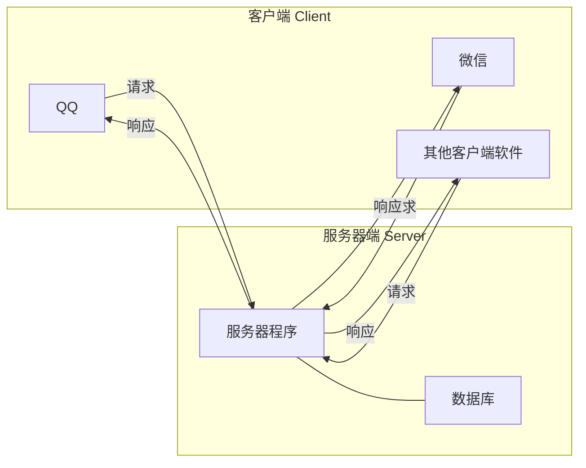
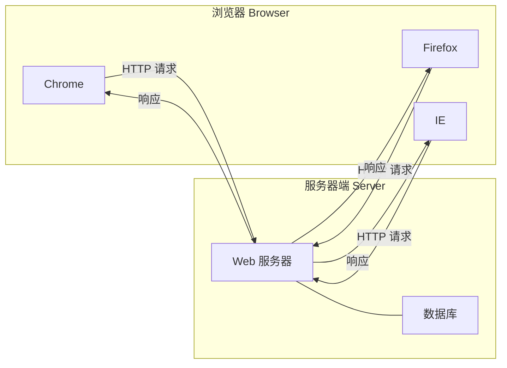
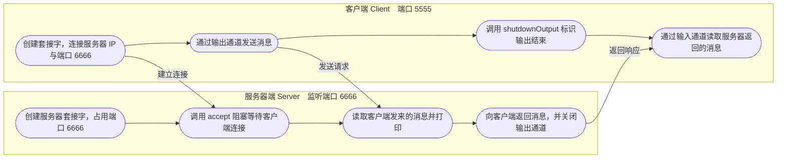
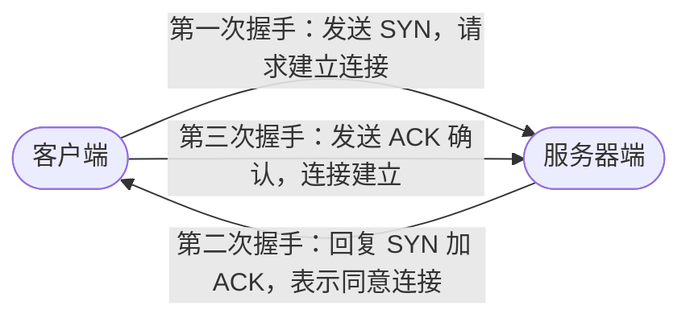
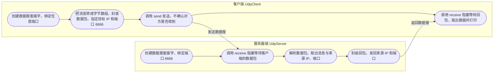

# 第五章 网络编程

## 课前回顾

### 1. 线程有几种创建方式？有什么区别

线程创建有两种方式：第一种是实现 Runnable 接口，第二种是继承于 Thread 类。第一种方式在实现接口的同时还可以继承于其他父类，而第二种方式根据类的单继承特性，无法做到再继承其他父类。第一种方式创建的线程任务可以被多个线程同时共享，而第二种方式无法做到。线程池支持第一种方式提供的线程任务，而不支持第二种方式创建的线程。

### 2. 线程有哪些状态

```java
public enum State{
    NEW,RUNNABLE,BLOCKED,WAITING,TIMED_WAITING,TERMINATED
}
```

> 💡 补充：原文写作 `BLOCK`，JDK 中 `Thread.State` 的常量名实际为 `BLOCKED`（被阻塞），已按源码改正。

### 3. synchronized和Lock有什么区别

每一个对象都有一个与之关联的内在锁，synchronized 和 Lock 都是作用在内在锁上。synchronized 会尝试获得锁，如果获取锁时，发现有其他线程正在使用这把锁，那么当前请求锁的线程等待锁的释放。Lock 尝试获得锁，如果没有获取成功，则不会进行等待，可以有效的回避获得锁的企图。

### 4. 死锁发生的条件

1. 互斥：每一个对象的锁只可能在同一时间被一个线程占有
2. 不可剥夺：线程持有的锁资源只能够主动释放，其他线程不可强制剥夺
3. 请求保持：线程持有了一个锁资源，在未释放该锁资源的情况下，再请求另一个锁资源
4. 循环等待：在等待链中存在一个线程请求的资源被另一个线程所持有，而另一个线程请求的锁资源又被链中的下一个线程所持有

> 💡 补充：原文"而另一个线程请求的所资源"漏字，应为"锁资源"，已改正。

### 5. 线程池工作原理是什么？

**ThreadPoolExecutor 线程池**

当一个新的任务添加到线程池时，线程池首先会检测是否有空闲的工作线程，如果有，就直接将该任务交给空闲的工作线程处理；如果没有，则将该任务添加到任务队列中；如果队列满了，线程池会先检测池中工作线程的数量是否达到最大线程数，如果没有达到，则线程池会使用线程工厂来创建新的工作线程来执行队列中的任务，然后再将该任务添加到队列中；超过核心线程数的工作线程，在执行完任务后，如果在给定的时间范围内没有执行的任务，则将死亡。如果工作线程已经达到线程池的最大线程数量，那么线程池将执行提供的拒绝处理策略来拒绝执行线程任务。

> 💡 补充：原文"再执行完任务后"应为"在执行完任务后"，已改正。

---

## 章节内容

| 章节内容 | 要求 |
| :--- | :--- |
| 套接字 Socket | **重点** |
| 数据报 Datagram | 熟悉 |

## 章节目标

- 了解网络通信中的 IP，端口和协议
- 掌握套接字的使用
- 熟悉数据报的使用

---

## 第一节 网络基础

### 1. 软件结构

**C/S 结构**

1. C => Client，表示客户端
2. S => Server，表示服务器端



**B/S 结构**

1. B => Browser，表示浏览器
2. S => Server，表示服务器端



不论是 C/S 结构还是 B/S 结构，都离不开网络通信。

### 2. 网络通信协议

**TCP&UDP**

**来自官方的说明**

```text
Computers running on the Internet communicate to each other using either the
Transmission Control Protocol (TCP) or the User Datagram Protocol (UDP)
```

互联网上运行的计算机使用传输控制协议（TCP）或用户数据报协议（UDP）相互通信。

**TCP**

**来自官方的说明**

```text
TCP (Transmission Control Protocol) is a connection-based protocol that
provides a reliable flow of data between two computers.
```

TCP（传输控制协议）是基于连接的协议，可在两台计算机之间提供可靠的数据流。

```text
TCP provides a point-to-point channel for applications that require reliable
communications.
```

TCP 为需要可靠通信的应用程序提供了点对点通道。

**UDP**

**来自官方的说明**

```text
UDP (User Datagram Protocol) is a protocol that sends independent packets of
data, called datagrams, from one computer to another with no guarantees about
arrival. UDP is not connection-based like TCP.
```

UDP（用户数据报协议）是一种协议，它从一台计算机向另一台计算机发送独立的数据包（称为数据报），而不能保证其到达。UDP 不像 TCP 那样基于连接。

```text
The UDP protocol provides for communication that is not guaranteed between
two applications on the network. UDP is not connection-based like TCP.
Rather, it sends independent packets of data, called datagrams, from one
application to another. Sending datagrams is much like sending a letter
through the postal service: The order of delivery is not important and is not
guaranteed, and each message is independent of any other.
```

UDP 协议提供了网络上两个应用程序之间无法保证的通信。UDP 不像 TCP 那样基于连接，而是将独立的数据包（称为数据报）从一个应用程序发送到另一个应用程序。发送数据报就像通过邮局发送一封信一样：传递顺序并不重要，也不能保证，每条消息彼此独立。

```text
Many firewalls and routers have been configured not to allow UDP packets.
```

许多防火墙和路由器已配置为不允许 UDP 数据包。

**TCP 与 UDP 对比**

| 对比项 | TCP | UDP |
| :--- | :--- | :--- |
| 英文全称 | Transmission Control Protocol，传输控制协议 | User Datagram Protocol，用户数据报协议 |
| 是否面向连接 | 基于连接（connection-based） | 不基于连接，像 TCP 那样 |
| 数据单位 | 可靠的数据流，点对点通道 | 独立的数据包，称为数据报（datagram） |
| 可靠性 | 在两端之间提供可靠的数据流 | 不保证到达、到达时间与内容 |
| 传递顺序 | 可靠通信，顺序由协议保证 | 传递顺序并不重要，也不能保证 |
| 消息独立性 | 属于同一条通信链路的数据流 | 每条消息彼此独立，如同邮局寄信 |
| 防火墙与路由器 | 未被特别限制 | 许多防火墙和路由器已配置为不允许 UDP 数据包 |

> 💡 补充：课件未给出 TCP 与 UDP 的对比表格，上表由课件中 TCP、UDP 两段官方说明整理而成。

**IP和端口**

**来自官方的说明**

```text
Generally speaking, a computer has a single physical connection to the
network. All data destined for a particular computer arrives through that
connection. However, the data may be intended for different applications
running on the computer. So how does the computer know to which application
to forward the data? Through the use of ports.
```

一般来说，计算机与网络具有单个物理连接。发送到特定计算机的所有数据都通过该连接到达。但是，数据可能打算供计算机上运行的不同应用程序使用。那么计算机如何知道将数据转发到哪个应用程序？通过使用端口。

```text
Data transmitted over the Internet is accompanied by addressing information
that identifies the computer and the port for which it is destined. The
computer is identified by its 32-bit IP address, which IP uses to deliver
data to the right computer on the network. Ports are identified by a 16-bit
number, which TCP and UDP use to deliver the data to the right application.
```

通过 Internet 传输的数据带有寻址信息，该信息标识了计算机及其发往的端口。该计算机由其 32 位 IP 地址标识，该 IP 地址用于将数据传递到网络上正确的计算机。端口由一个 16 位数字标识，TCP 和 UDP 使用该 16 位数字将数据传递到正确的应用程序。

```text
Port numbers range from 0 to 65,535 because ports are represented by 16-bit
numbers. The port numbers ranging from 0 - 1023 are restricted; they are
reserved for use by well-known services such as HTTP and FTP and other system
services. These ports are called well-known ports. Your applications should
not attempt to bind to them.
```

端口号的范围是 0 到 65,535，因为端口由 16 位数字表示。端口号范围从 0 - 1023 被限制；它们保留供 HTTP 和 FTP 等知名服务以及其他系统服务使用。这些端口称为众所周知的端口。你的应用程序不应尝试绑定到它们。

**IP 与端口**

| 寻址信息 | 长度 | 说明 |
| :--- | :--- | :--- |
| IP 地址 | 32 位 | 标识网络上的计算机，IP 使用它把数据送达网络上正确的计算机 |
| 端口 | 16 位 | 标识应用程序，TCP 和 UDP 使用它把数据送达正确的应用程序 |

**端口号范围**

| 端口范围 | 说明 |
| :--- | :--- |
| 0 ~ 1023 | 受限制的端口，保留供 HTTP 和 FTP 等知名服务以及其他系统服务使用，称为众所周知的端口（well-known ports），应用程序不应尝试绑定 |
| 0 ~ 65535 | 端口号的取值范围，因为端口由 16 位数字表示 |

**URL**

**来自官方的说明**

```text
URL is the acronym for Uniform Resource Locator.
```

URL 是"统一资源定位符"的缩写。

```text
URLs have two main components: the protocol needed to access the resource and
the location of the resource.
```

URL 具有两个主要组成部分：访问资源所需的协议和资源的位置。

---

## 第二节 套接字Socket

### 1. 什么是Socket

**来自官方的说明**

```text
A socket is one end-point of a two-way communication link between two
programs running on the network. Socket classes are used to represent the
connection between a client program and a server program. The java.net
package provides two classes--Socket and ServerSocket--that implement the
client side of the connection and the server side of the connection,
respectively.
```

套接字是网络上运行的两个程序之间双向通讯链接的一个端点。套接字类用于表示客户端程序和服务器程序之间的连接。`java.net` 包提供了两个类 —— `Socket` 和 `ServerSocket` —— 分别实现连接的客户端和连接的服务器。

### 2. 如何使用Socket

**来自官方的说明**

```text
Normally, a server runs on a specific computer and has a socket that is bound
to a specific port number. The server just waits, listening to the socket for
a client to make a connection request.
```

通常，服务器在特定计算机上运行，并具有绑定到特定端口号的套接字。服务器只是等待，侦听套接字，等待客户端发出连接请求。

```text
On the client-side: The client knows the hostname of the machine on which the
server is running and the port number on which the server is listening. To
make a connection request, the client tries to rendezvous with the server on
the server's machine and port. The client also needs to identify itself to
the server so it binds to a local port number that it will use during this
connection. This is usually assigned by the system.
```

在客户端上：客户端知道服务器在其上运行的计算机的主机名以及服务器在其上侦听的端口号。为了发出连接请求，客户端尝试在服务器的机器和端口上与服务器会合。客户端还需要向服务器标识自己，以便客户端绑定到在此连接期间将使用的本地端口号。这通常是由系统分配的。

> 💡 补充：原文"侦听套接字以请求客户端发出连接请求"语义有误，官方原文为 listening to the socket for a client to make a connection request，应译为"侦听套接字，等待客户端发出连接请求"，已改正。

**Socket常用构造方法**

| 序号 | 构造方法 | 说明 |
| :--- | :--- | :--- |
| 1 | `public Socket(String host, int port) throws UnknownHostException, IOException;` | 创建一个套接字，连向给定 IP 的主机，并与该主机给定端口的应用通信 |
| 2 | `public Socket(InetAddress address, int port) throws IOException;` | 创建一个套接字，连向给定 IP 信息的主机，并与该主机给定端口的应用通信 |

**Socket常用方法**

| 序号 | 方法 | 说明 |
| :--- | :--- | :--- |
| 1 | `public InputStream getInputStream() throws IOException;` | 获取读取数据的通道 |
| 2 | `public OutputStream getOutputStream() throws IOException;` | 获取输出数据的通道 |
| 3 | `public synchronized void setSoTimeout(int timeout) throws SocketException;` | 设置链接的超时时间，0 表示不会超时 |
| 4 | `public void shutdownInput() throws IOException;` | 标识输入通道不再接收数据，如果再次向通道中读取数据，则返回 -1，表示读取到末尾 |
| 5 | `public void shutdownOutput() throws IOException;` | 禁用输出通道，如果再次向通道中输入数据，则会报 IOException |
| 6 | `public synchronized void close() throws IOException;` | 关闭套接字，相关的数据通道都会被关闭 |

**ServerSocket常用构造方法**

| 序号 | 构造方法 | 说明 |
| :--- | :--- | :--- |
| 1 | `public ServerSocket(int port) throws IOException;` | 创建一个服务器套接字并占用给定的端口 |

**ServerSocket常用方法**

| 序号 | 方法 | 说明 |
| :--- | :--- | :--- |
| 1 | `public Socket accept() throws IOException;` | 侦听与此套接字建立的连接并接受它。该方法将阻塞，直到建立连接为止 |
| 2 | `public synchronized void setSoTimeout(int timeout) throws SocketException;` | 设置链接的超时时间，0 表示不会超时 |

**客户端与服务器端通信**



> 💡 补充：课件本章未展开 TCP 建立连接的具体过程，为便于理解上面的通信流程，补充如下。TCP 是面向连接的协议，通信前需要先完成"三次握手"：



**示例**

**代码实现**

```java
package com.cyx.network.socket;

import java.io.*;
import java.net.Socket;

/**
 * Socket套接字相关功能封装：信息接收和信息发送
 */
public class SocketUtil {
    /**
     * 接收套接字中的信息
     * @param socket 套接字
     * @return
     * @throws IOException
     */
    public static String receiveMsg(Socket socket) throws IOException {
        //服务器读取客户端传输的信息
        InputStream is = socket.getInputStream();
        InputStreamReader isr = new InputStreamReader(is);
        BufferedReader reader = new BufferedReader(isr);
        StringBuilder builder = new StringBuilder();
        String line;
        while ((line = reader.readLine()) != null){
            builder.append(line);
        }
        //标识输入通道中的数据已经被读取完毕，如果再读取，则直接读取到-1。
        //表示读取结束
        socket.shutdownInput();
        return builder.toString();
    }

    /**
     * 向套接字中发送信息
     * @param socket 套接字
     * @param msg 发送的信息
     * @throws IOException
     */
    public static void sendMsg(Socket socket, String msg) throws IOException {
        //获取客户端输出的通道
        OutputStream os = socket.getOutputStream();
        OutputStreamWriter osw = new OutputStreamWriter(os);
        BufferedWriter writer = new BufferedWriter(osw);
        writer.write(msg);
        writer.flush();
        //客户端输出已经完成，如果再向通道中写数据，那么将会报IOException
        socket.shutdownOutput();
    }
}
```

```java
package com.cyx.network.socket;

import java.io.IOException;
import java.net.ServerSocket;
import java.net.Socket;

public class TcpServer {

    private ServerSocket server;

    public TcpServer(int port) throws IOException {
        this.server = new ServerSocket(port);
    }

    /**
     * 服务器启动
     */
    public void start(){
        //服务器不能挂，因此使用死循环
        while (true){
            try {
                //等待客户端连接，程序会被阻塞，与Scanner的next()一样
                Socket connectionClient = server.accept();
                String msg = SocketUtil.receiveMsg(connectionClient);
                System.out.println(msg);
                SocketUtil.sendMsg(connectionClient, "Hello,Client, I'm Server");
            } catch (IOException e) {
                e.printStackTrace();
            }
        }
    }

    public static void main(String[] args) {
        try {
            TcpServer server = new TcpServer(6666);
            server.start();
        } catch (IOException e) {
            e.printStackTrace();
        }
    }
}
```

```java
package com.cyx.network.socket;

import java.io.IOException;
import java.net.Socket;

public class TcpClient {

    private Socket client; //客户端套接字

    public TcpClient(String ip, int port) throws IOException {
        client = new Socket(ip, port);
    }

    /**
     * 客户端发送信息
     * @param msg
     */
    public void sendMsg(String msg) throws IOException {
       SocketUtil.sendMsg(client, msg);
    }

    public String receiveMsg() throws IOException {
        return SocketUtil.receiveMsg(client);
    }

    public static void main(String[] args) {
        try {
            //本机表示的方式：localhost  127.0.0.1  192.168.28.83
            TcpClient client = new TcpClient("localhost", 6666);
            client.sendMsg("Hello,Server, I'm Client");
            System.out.println(client.receiveMsg());
        } catch (IOException e) {
            e.printStackTrace();
        }
    }
}
```

> 💡 补充：客户端与服务器端需成对运行，先启动 `TcpServer`（监听 6666 端口），再运行 `TcpClient` 发起连接，否则客户端会连接失败。

---

## 第三节 数据报Datagram

### 1. 什么是数据报

**来自官方的说明**

```text
A datagram is an independent, self-contained message sent over the network
whose arrival, arrival time, and content are not guaranteed.
```

数据报是通过网络发送的独立的自包含的消息，其是否到达、到达时间和内容无法得到保证。

### 2. 如何使用Datagram

**DatagramSocket常用构造方法**

| 序号 | 构造方法 | 说明 |
| :--- | :--- | :--- |
| 1 | `public DatagramSocket() throws SocketException;` | 构建一个绑定在任意端口的收发数据报的套接字 |
| 2 | `public DatagramSocket(int port) throws SocketException;` | 构建一个绑定在给定端口的收发数据报的套接字 |

**DatagramSocket常用方法**

| 序号 | 方法 | 说明 |
| :--- | :--- | :--- |
| 1 | `public void send(DatagramPacket p) throws IOException;` | 发送给定的数据包 |
| 2 | `public synchronized void receive(DatagramPacket p) throws IOException;` | 接收数据至给定的数据包 |
| 3 | `public synchronized void setSoTimeout(int timeout) throws SocketException;` | 设置链接的超时时间，0 表示不会超时 |

**DatagramPacket常用构造方法**

| 序号 | 构造方法 | 说明 |
| :--- | :--- | :--- |
| 1 | `public DatagramPacket(byte buf[], int length);` | 构建一个接收数据的数据包 |
| 2 | `public DatagramPacket(byte buf[], int offset, int length, InetAddress address, int port);` | 构建一个发送数据的数据包 |

**DatagramPacket常用方法**

| 序号 | 方法 | 说明 |
| :--- | :--- | :--- |
| 1 | `public synchronized InetAddress getAddress();` | 获取发送数据的主机 IP 地址 |
| 2 | `public synchronized int getPort();` | 获取发送数据的主机使用的端口 |
| 3 | `public synchronized int getLength();` | 获取数据包中数据的长度 |

**收发流程**



> 💡 补充：课件未给出 UDP 的收发流程图，上图依据本节示例代码整理。

**示例**

**代码实现**

```java
package com.cyx.network.datagram;

import java.io.IOException;
import java.net.DatagramPacket;
import java.net.DatagramSocket;
import java.net.InetAddress;

public class DatagramUtil {

    private static final int BUFFER_SIZE = 8192;

    /**
     * 发送数据报
     * @param socket 数据报套接字
     * @param msg 发送的消息
     * @param ip 发送消息的目标计算机IP
     * @param port 发送消息的目标计算机端口
     * @throws IOException
     */
    public static void sendPacket(DatagramSocket socket, String msg, String ip, int port)
            throws IOException {
        byte[] data =msg.getBytes();
        InetAddress address = InetAddress.getByName(ip);
        //创建了一个发送数据的数据包
        DatagramPacket packet = new DatagramPacket(data, 0, data.length, address, port);
        socket.send(packet);
    }

    /**
     * 接收数据报
     * @param socket 数据报套接字
     * @return
     */
    public static DatagramPacket receivePacket(DatagramSocket socket){
        byte[] buffer = new byte[BUFFER_SIZE];
        DatagramPacket packet = new DatagramPacket(buffer, buffer.length);
        try {
            socket.receive(packet);
        } catch (IOException e) {
            e.printStackTrace();
        }
        return packet;
    }
}
```

```java
package com.cyx.network.datagram;

import java.io.IOException;
import java.net.DatagramPacket;
import java.net.DatagramSocket;
import java.net.SocketException;

public class UdpServer {

    private DatagramSocket server;

    public UdpServer(int port) throws SocketException {
        server = new DatagramSocket(port);
    }

    /**
     * 服务器启动
     */
    public void start(){
        while (true){
            DatagramPacket packet = DatagramUtil.receivePacket(server);
            int length = packet.getLength();
            String msg = new String(packet.getData(), 0, length);
            System.out.println(msg);
            String ip = packet.getAddress().getHostAddress();
            int port = packet.getPort();
            try {
                DatagramUtil.sendPacket(server, "Hello Client, I'm Server", ip, port);
            } catch (IOException e) {
                e.printStackTrace();
            }
        }
    }

    public static void main(String[] args) {
        try {
            UdpServer server = new UdpServer(6666);
            server.start();
        } catch (SocketException e) {
            e.printStackTrace();
        }

    }
}
```

```java
package com.cyx.network.datagram;

import java.io.IOException;
import java.net.*;

public class UdpClient {


    private DatagramSocket client;

    public UdpClient() throws SocketException {
        client = new DatagramSocket(); //绑定任意端口
    }

    public void sendPacket(String msg, String ip, int port) throws IOException {
        DatagramUtil.sendPacket(client, msg, ip, port);
    }

    public String receivePacket(){
        DatagramPacket packet = DatagramUtil.receivePacket(client);
        int length = packet.getLength();
        return new String(packet.getData(), 0, length);
    }

    public static void main(String[] args) {
        try {
            UdpClient client = new UdpClient();
            client.sendPacket("Hello Server, I'm Client", "localhost", 6666);
            System.out.println(client.receivePacket());
        } catch (SocketException e) {
            e.printStackTrace();
        } catch (IOException e) {
            e.printStackTrace();
        }
    }
}
```

> 💡 补充：UDP 两端同样需要成对运行，先启动 `UdpServer`（绑定 6666 端口），再运行 `UdpClient`。客户端使用无参构造方法创建的套接字，其本地端口由系统随机分配；服务器端回包时依赖数据包中携带的来源 IP 与端口，因此 UDP 虽然没有连接，但仍能收到回复。

---

## 综合练习

使用网络通信完成注册和登录功能。要求注册的用户信息必须进行存档，登录时需要从存档的数据检测是否能够登录。

**分析**

a. 使用 TCP 完成，因为 TCP 是可靠性数据传输，可以保证信息能够被接收

b. 用户属于客户端操作，服务器端需要区分用户的行为

c. 为了区分客户端的行为，需要设计一个消息类，然后使用序列化的方式来进行传输

d. 用户注册信息需要存档，因此需要设计一个用户类，为了方便使用，也可以直接将一个集合使用序列化的方式存储在文档中

**代码实现**

```java
package com.cyx.network.user;

import java.io.Serializable;
import java.util.Objects;

public class User implements Serializable {

    private String username;

    private String password;

    public User(String username, String password) {
        this.username = username;
        this.password = password;
    }

    public String getUsername() {
        return username;
    }

    public void setUsername(String username) {
        this.username = username;
    }

    public String getPassword() {
        return password;
    }

    public void setPassword(String password) {
        this.password = password;
    }

    @Override
    public boolean equals(Object o) {
        if (this == o) return true;
        if (o == null || getClass() != o.getClass()) return false;
        User user = (User) o;
        return Objects.equals(username, user.username) &&
                Objects.equals(password, user.password);
    }

    @Override
    public int hashCode() {
        return Objects.hash(username, password);
    }
}
```

```java
package com.cyx.network.user;

import java.io.Serializable;

public class Message<T> implements Serializable {

    private T data; //发送的消息

    private String action; //行为

    public Message(String action, T data) {
        this.data = data;
        this.action = action;
    }

    public T getData() {
        return data;
    }

    public void setData(T data) {
        this.data = data;
    }

    public String getAction() {
        return action;
    }

    public void setAction(String action) {
        this.action = action;
    }
}
```

```java
package com.cyx.network.user;

import java.io.*;
import java.util.ArrayList;
import java.util.List;

public class FileUtil {

    public static <T> List<T> readData(String path){
        List<T> dataList = new ArrayList<>();
        File file = new File(path);
        if(file.exists()){
            try(InputStream is = new FileInputStream(file);
                ObjectInputStream ois = new ObjectInputStream(is);) {
                dataList = (List<T>) ois.readObject();
            } catch (Exception e) {
                e.printStackTrace();
            }
        }
        return dataList;
    }

    public static <T> boolean writeData(String path, List<T> dataList){
        File file = new File(path);
        File parent = file.getParentFile();
        if(!parent.exists())
            parent.mkdirs();
        boolean success = true;
        try ( OutputStream os = new FileOutputStream(file);
              ObjectOutputStream oos = new ObjectOutputStream(os)){
            oos.writeObject(dataList);
            oos.flush();
        } catch (Exception e) {
            success = false;
            e.printStackTrace();
        }
        return success;
    }

}
```

```java
package com.cyx.network.user;

import java.io.*;
import java.net.Socket;

public class MessageUtil {

    public static <T> void sendMsg(Socket socket, Message<T> message)
            throws IOException {
        OutputStream os = socket.getOutputStream();
        ObjectOutputStream oos = new ObjectOutputStream(os);
        oos.writeObject(message);
        oos.flush();
        socket.shutdownOutput();
    }

    public static <T> Message<T> receiveMsg(Socket socket)
            throws IOException, ClassNotFoundException {
        InputStream is = socket.getInputStream();
        ObjectInputStream ois = new ObjectInputStream(is);
        Message<T> message = (Message<T>) ois.readObject();
        return message;
    }
}
```

```java
package com.cyx.network.user;

import java.io.IOException;
import java.io.ObjectOutputStream;
import java.io.OutputStream;
import java.net.Socket;

public class UserClient {

    private Socket client;

    public UserClient(String ip, int port) throws IOException {
        this.client = new Socket(ip, port);
    }

    public void sendMsg(Message<User> message) throws IOException {
        MessageUtil.sendMsg(client, message);
    }

    public String receiveMsg() throws IOException, ClassNotFoundException {
        Message<String> msg = MessageUtil.receiveMsg(client);
        return msg.getData();
    }

    public static void main(String[] args) {
        try {
            UserClient client = new UserClient("localhost", 8888);
            User user = new User("zhangsan", "123456");
            client.sendMsg(new Message<>("login", user));
            String backMsg = client.receiveMsg();
            System.out.println(backMsg);
        } catch (IOException e) {
            e.printStackTrace();
        } catch (ClassNotFoundException e) {
            e.printStackTrace();
        }
    }
}
```

```java
package com.cyx.network.user;

import java.io.IOException;
import java.net.ServerSocket;
import java.net.Socket;
import java.util.List;

public class UserServer {

    private static final String USER_PATH = "F:\\user\\user.obj";

    private ServerSocket server;

    public UserServer(int port) throws IOException {
        this.server = new ServerSocket(port);
    }

    public void start(){
        while (true){
            try {
                Socket userClient = server.accept();
                Message<User> message = MessageUtil.receiveMsg(userClient);
                String action = message.getAction();
                if("register".equals(action)){
                    register(userClient, message);
                } else if("login".equals(action)){
                    login(userClient, message);
                }
            } catch (IOException e) {
                e.printStackTrace();
            } catch (ClassNotFoundException e) {
                e.printStackTrace();
            }
        }
    }

    private void register(Socket userClient, Message<User> message) throws IOException {
        //读取存档的用户列表
        List<User> users = FileUtil.readData(USER_PATH);
        //获取注册的用户信息
        User registerUser = message.getData();
        //检测用户列表中是否存在注册的用户信息
        boolean exists = users.stream().anyMatch(user -> user.equals(registerUser));
        Message<String> backMsg = new Message<>("back", null);
        if(exists){
            backMsg.setData("账号已被注册");
        } else {
            //将用户信息添加至用户列表中
            users.add(registerUser);
            //将用户列表重新存档
            boolean result = FileUtil.writeData(USER_PATH, users);
            String msg = result ? "注册成功" : "注册失败";
            backMsg.setData(msg);
        }
        MessageUtil.sendMsg(userClient, backMsg);
    }

    private void login(Socket userClient, Message<User> message) throws IOException {
        //读取存档的用户列表
        List<User> users = FileUtil.readData(USER_PATH);
        //获取登录的用户信息
        User loginUser = message.getData();
        //检测用户列表中是否存在登录的用户信息
        boolean exists = users.stream().anyMatch(user -> user.equals(loginUser));
        String msg = exists ? "登录成功" : "账号或密码错误";
        Message<String> backMsg = new Message<>("back", msg);
        MessageUtil.sendMsg(userClient, backMsg);
    }

    public static void main(String[] args) {
        try {
            UserServer server = new UserServer(8888);
            server.start();
        } catch (IOException e) {
            e.printStackTrace();
        }
    }
}
```
