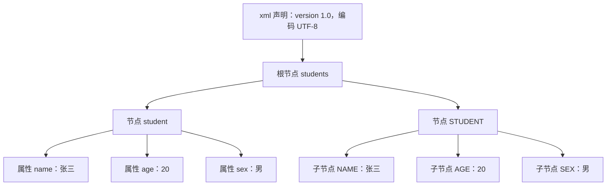
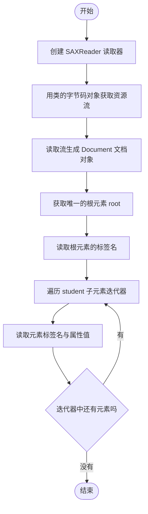

# 第六章 XML

## 课前回顾

### 1. 网络通信有哪些部分组成

1. 协议：TCP/UDP
2. IP：定位计算机
3. 端口：定位应用
4. URL：统一资源定位符

### 2. TCP和UDP有什么区别

TCP 是一个点对点的通信端点，属于可靠性信息传输。UDP 是无连接的不可靠信息传输。

---

## 章节内容

| 章节内容 | 要求 |
| :--- | :--- |
| XML 文档 | **重点** |
| XML 文档约束 | 熟悉 |
| XML 解析 | **重点** |

## 章节目标

- 掌握 XML 的规范书写
- 掌握 XML 中的特殊字符处理
- 了解 XML 约束
- 掌握 XML 解析

---

## 第一节 XML

### 1. 什么是XML

XML 全称是 Extensible Markup Language，可扩展标记语言。

### 2. XML语法

| 语法要点 | 说明 |
| :--- | :--- |
| 后缀名 | xml 是一种文本文档，其后缀名为 xml |
| 文档声明 | xml 文档内容的第一行必须是对整个文档类型的声明 |
| 根标签 | xml 文档内容中有且仅有一个根标签 |
| 标签闭合 | xml 文档内容中的标签必须严格闭合 |
| 属性值 | xml 文档内容中的标签属性值必须使用单引号或者双引号引起来 |
| 大小写 | xml 文档内容中的标签名区分大小写 |

**示例**

```xml
<?xml version="1.0" encoding="UTF-8"?>
<students>
    <student name="张三" age="20" sex="男"></student>
    <STUDENT>
        <NAME>张三</NAME>
        <AGE>20</AGE>
        <SEX>男</SEX>
    </STUDENT>
</students>
```

**XML 文档结构树**



**思考：如果在 XML 文档内容中出现了像 `<` 这类似的特殊符号，怎么办？**

使用标签 CDATA 来完成，CDATA 标签中的内容会按原样展示。

**语法**

```xml
<![CDATA[
<!--内容 -->
]]>
```

XML 文档可以自定义标签，为了更规范的使用 XML 文档，可以使用 XML 约束来限定 XML 文档中的标签使用。

XML 约束可以通过 DTD 文档和 Schema 文档来实现。其中 DTD 文档比较简单，后缀名为 dtd，而 Schema 技术则比较复杂，后缀名为 xsd。

---

## 第二节 DTD约束

### 1. DTD约束元素

**元素类型**

- EMPTY（空元素），元素不包含任何数据，但是可以有属性，如：`<student name="李四" sex="女" age="21" />`
- #PCDATA（字符串），PCDATA 是指被解析器解析的文本也就是字符串内容，不能包含其他类型的元素，如：

```xml
<name>张三</name>
<sex>男</sex>
<age>20</age>
```

- ANY（任何内容都可以）

**DTD约束元素出现顺序及次数**

| 情景 | 语法 | 描述 |
| :--- | :--- | :--- |
| 顺序出现 | `<!ELEMENT name (a,b)>` | 子元素 a、b 必须同时出现，且 a 必须在 b 之前出现 |
| 选择出现 | `<!ELEMENT name (a\|b)>` | 子元素 a、b 只能有一个出现，要么是 a，要么是 b |
| 只出现一次 | `<!ELEMENT name (a)>` | 子元素 a 只能且必须出现一次 |
| 一次或多次 | `<!ELEMENT name (a+)>` | 子元素 a 要么出现一次，要么出现多次 |
| 零次或多次 | `<!ELEMENT name (a*)>` | 子元素 a 可以出现任意次（包括不出现，即出现零次） |
| 零次或一次 | `<!ELEMENT name (a?)>` | 子元素 a 可以出现一次或不出现 |

**元素格式**

`<!ELEMENT 元素名称 元素类型>`

**示例**

```text
<!ELEMENT students (student*)>
<!ELEMENT student (name,sex,age)>
<!ELEMENT name (#PCDATA)>
<!ELEMENT sex (#PCDATA)>
<!ELEMENT age (#PCDATA)>
```

### 2. DTD约束元素属性

**属性值类型**

- CDATA，属性值为普通文本字符串。
- Enumerated，属性值的类型是一组取值的列表，XML 文件中设置的属性值只能是这个列表中的某一个值。
- ID，表示属性值必须唯一，且不能以数字开头。

**属性值设置**

- #REQUIRED，必须设置该属性。
- #IMPLIED，该属性可以设置也可以不设置。
- #FIXED，该属性的值为固定的。使用默认值。

**属性格式**

`<!ATTLIST 元素名 属性名 属性值类型 设置说明>`

**示例**

```text
<!ELEMENT students (student*)>
<!ELEMENT student (name,sex,age)>
<!ELEMENT name (#PCDATA)>
<!ELEMENT sex (#PCDATA)>
<!ELEMENT age (#PCDATA)>
<!ATTLIST student number ID #REQUIRED>
<!ATTLIST student name CDATA>
<!ATTLIST student sex(男|女|其他) #IMPLIED>
<!ATTLIST student age CDATA>
```

### 3. 引入DTD约束

**语法**

`<!DOCTYPE 根标签名 SYSTEM "约束文档名.dtd">`

**示例**

```text
<!ELEMENT students (student*)>
<!--<!ELEMENT student (name, sex, age) ANY>
<!ELEMENT name (#PCDATA)>
<!ELEMENT sex (#PCDATA)>
<!ELEMENT age (#PCDATA)>-->
<!ELEMENT student  EMPTY>
<!ATTLIST student number ID #REQUIRED>
<!ATTLIST student name CDATA>
<!ATTLIST student sex(男|女|其他) #IMPLIED>
<!ATTLIST student age CDATA>
<!ATTLIST student country(中国) CDATA #FIXED>
```

> 💡 补充：原文最后一行 `<!ATTLIST student country(中国) CDATA #FIXED>` 把枚举写到了属性名后面，位置有误。规范写法应为 `<!ATTLIST student country CDATA #FIXED "中国">`（`#FIXED` 之后还要给出固定的默认值）。此处按原文保留。

**配套的 student.dtd 约束文档**

```text
<!ELEMENT students (student*)>
<!--<!ELEMENT student (name, sex, age) ANY>
<!ELEMENT name (#PCDATA)>
<!ELEMENT sex (#PCDATA)>
<!ELEMENT age (#PCDATA)>-->
<!ELEMENT student  EMPTY>
<!ATTLIST student number ID #REQUIRED>
<!ATTLIST student name CDATA>
<!ATTLIST student sex(男|女|其他) #IMPLIED>
<!ATTLIST student age CDATA>
<!ATTLIST student country(中国) CDATA #FIXED>
```

---

## 第三节 XML解析

### 1. 解析方式

**DOM 解析**

DOM 解析将 XML 文档一次性加载进内存，在内存中形成一颗 dom 树，优点是操作方便，可以对文档进行 CRUD 的所有操作，缺点就是占内存。

**SAX 解析**

SAX 解析是将 XML 文档逐行读取，是基于事件驱动的，优点是不占内存，缺点是只能读取，不能增删改。

对于 XML 操作，我们通常都是读取操作，增删改的情况较少，因此这里主要讲解 SAX 解析，SAX 解析最优实现是 Dom4j 解析器。

**DOM 与 SAX 对比**

| 解析方式 | 读取方式 | 优点 | 缺点 |
| :--- | :--- | :--- | :--- |
| DOM | 一次性把文档加载进内存，形成一棵 dom 树 | 操作方便，可以对文档进行 CRUD 的所有操作 | 占内存 |
| SAX | 逐行读取，基于事件驱动 | 不占内存 | 只能读取，不能增删改 |

**DOM 解析流程**



### 2. Dom4j 解析XML

**待解析的 XML 文档**

```xml
<?xml version="1.0" encoding="UTF-8" ?>
<!DOCTYPE students SYSTEM "student.dtd">
<students>
    <!--<student>
        <name>张三</name>
        <sex>男</sex>
        <age>20</age>
    </student>-->
    <student number="aaa1" name="张三" sex="男" age="20" country="中国"/>
    <student number="aaa2" name="张三" sex="男" age="20" />
    <student number="aaa3" name="张三" sex="男" age="20" />
    <student number="aaa4" name="张三" sex="男" age="20" />
</students>
```

**代码实现**

```java
package com.cyx.xml;

import org.dom4j.Attribute;
import org.dom4j.Document;
import org.dom4j.DocumentException;
import org.dom4j.Element;
import org.dom4j.io.SAXReader;

import java.io.InputStream;
import java.util.Iterator;

public class XmlParser {

    public static void main(String[] args) {
        //构建一个SAX读取器
        SAXReader reader = new SAXReader();
        //通过类的字节码对象获取一个给定资源并将该资源读取到流的通道中
        InputStream is = XmlParser.class.getResourceAsStream("student.xml");
        try {
            //SAX读取器从通道中读取一个文档对象
            Document document = reader.read(is);
            //获取文档的根元素，因为XML文档只会有一个根元素
            Element root = document.getRootElement();
            //获取根元素的标签名
            String tagName = root.getQualifiedName();
            System.out.println("XML文档根标签：" + tagName);
            //获取根元素的下一级子元素
//            List<Element> elements = root.elements();
//            for(Element element: elements){
//                //获取元素的标签名
//                String tag = element.getQualifiedName();
//                System.out.println(tag);
//                //获取元素的所有属性
//                List<Attribute> attributes = element.attributes();
//                for(Attribute attr: attributes){
//                    //获取属性名
//                    String name = attr.getName();
//                    //获取属性值
//                    String value = attr.getValue();
//                    System.out.print("属性：" + name + "=>" + value + "\t");
//                }
//                System.out.println();
//            }
            Iterator<Element> iterator = root.elementIterator("student");
            while (iterator.hasNext()){
                Element element = iterator.next();
                //获取元素的标签名
                String tag = element.getQualifiedName();
                System.out.println(tag);
//                //获取元素的所有属性
//                List<Attribute> attributes = element.attributes();
//                for(Attribute attr: attributes){
//                    //获取属性名
//                    String name = attr.getName();
//                    //获取属性值
//                    String value = attr.getValue();
//                    System.out.print("属性：" + name + "=>" + value + "\t");
//                }
//                System.out.println();
                String name = element.attributeValue("name");
                String sex = element.attributeValue("sex");
                String age = element.attributeValue("age");
                System.out.println(name + "\t" + sex + "\t" + age);
            }
        } catch (DocumentException e) {
            e.printStackTrace();
        }
    }
}
```

**常用解析 API**

| API | 说明 |
| :--- | :--- |
| `new SAXReader()` | 构建一个 SAX 读取器 |
| `XmlParser.class.getResourceAsStream("student.xml")` | 通过类的字节码对象获取给定资源，并将该资源读取到流的通道中 |
| `reader.read(is)` | SAX 读取器从通道中读取一个文档对象 |
| `document.getRootElement()` | 获取文档的根元素（XML 文档只会有一个根元素） |
| `root.getQualifiedName()` | 获取元素的标签名 |
| `root.elements()` | 获取元素的下一级子元素 |
| `element.attributes()` | 获取元素的所有属性 |
| `attr.getName()` | 获取属性名 |
| `attr.getValue()` | 获取属性值 |
| `root.elementIterator("student")` | 获取指定标签名的子元素迭代器 |
| `iterator.hasNext()` | 判断迭代器中是否还有下一个元素 |
| `iterator.next()` | 取出迭代器中的下一个元素 |
| `element.attributeValue("name")` | 直接获取指定属性名的属性值 |
