# 阶段项目 —— 影院选票平台

> 本章按课件原始顺序组织。项目中的 `Menu`、`MenuManager`、`CinemaPlatformClient`、`CinemaPlatformServer` 四个类在课件里被反复贴出、每次只补一段代码，因此每一步**只列出该步新增或改动的关键代码**，完整的类只在最终版处注入一次。

## 需求分析

影院选票平台主要是为了解决影迷购票困难的问题，该平台集各大影院影票于一体，影迷可以很方便的在平台上购买影票。影院可以申请入驻该平台，平台管理员对入驻申请进行审核，审核通过后，影院可以在该平台上发布影票售卖信息，随后，影迷可以在该平台上购买影票。平台结构如下：

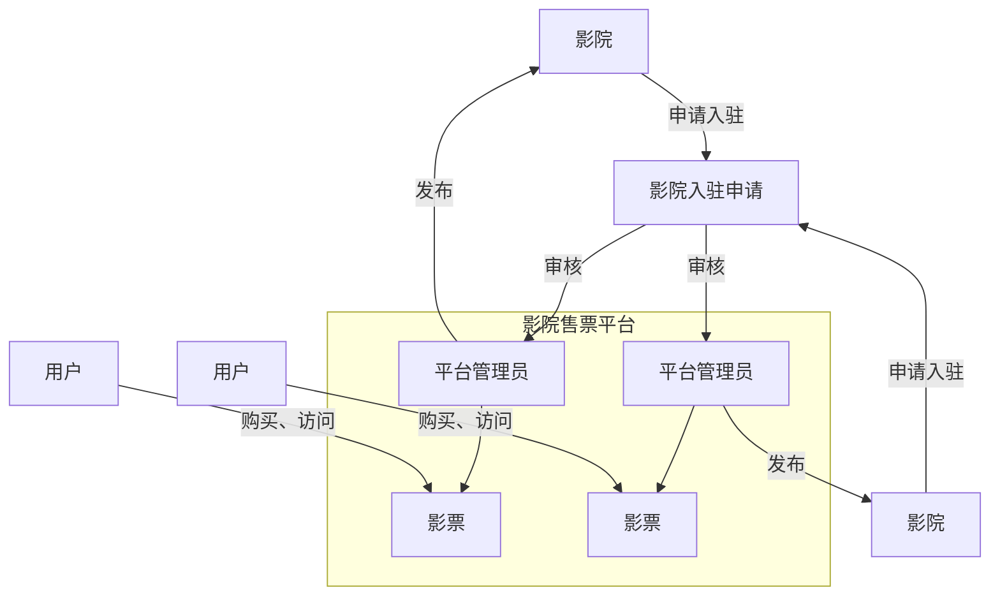

影院结构如下：

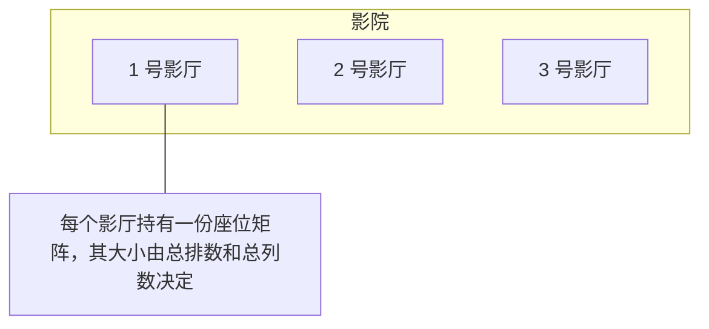

影院下辖若干影厅，每个影厅的座位用一个「总排数 × 总列数」的二维矩阵表示，矩阵中的每个格子对应一个座位。

影院在平台上可以管理该影院的影片信息、影厅信息、影片计划信息以及订单信息。

## 功能图

> 💡 补充：原「功能图」是一张**由右向左**绘制的思维导图，且最左侧节点被标成了「平台管理员」，但它所连接的分明是登录菜单（服务对象是普通用户／商家），属于原图标注笔误。下方按 `MenuManager` 中实际的分组（`LOGIN_MENUS`／`USER_MENUS`／`MANAGER_MENUS`／`SELLER_MENUS`）从左向右重绘。

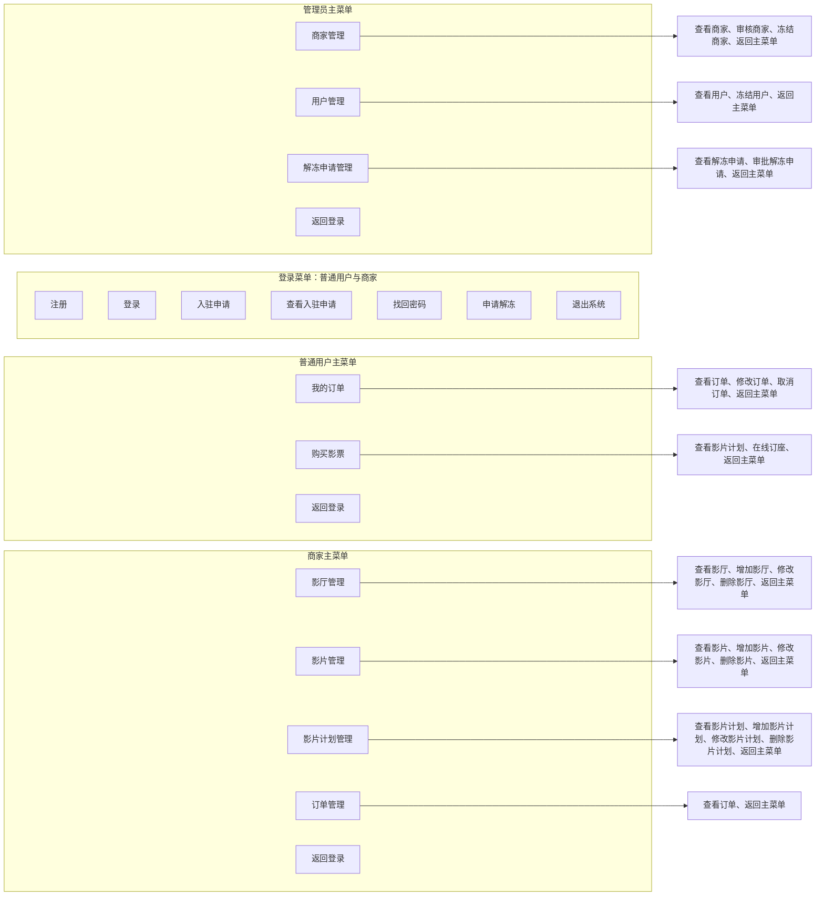

## 实体分析

### 1. 用户

用户分为管理员和普通用户。用户拥有账号、密码、安全码、角色和状态。其中账号唯一；账号和密码主要用于登录；安全码用于找回密码；角色用来区分普通用户和管理员；状态分为正常、冻结。

| 字段 | 类型 | 说明 |
| :--- | :--- | :--- |
| `username` | `String` | 账号，唯一 |
| `password` | `String` | 密码，用于登录 |
| `securityCode` | `String` | 安全码，用于找回密码 |
| `role` | `Role` | 角色，默认为 `Role.USER`；取值 `USER`（普通用户）、`MANAGER`（管理员）、`SELLER`（商家） |
| `state` | `int` | 账号状态：`-1` 审核不通过，`0` 待审核，`1` 正常，`2` 冻结 |

### 2. 商家

商家拥有账号、密码、安全码、角色、状态、影院名称和影院地址。其中账号唯一；账号和密码主要用于登录；安全码用于找回密码；角色用来区分商家和用户；状态分为待审核、正常、冻结。商家是用户的子类，除继承来的字段外，额外拥有影院名称和影院地址。

> 💡 补充：原文这一节写作「**用户**拥有账号、密码、安全码、角色、状态、影院名称和影院地址」，与标题「商家」及后文「角色用来区分商家和用户」自相矛盾，已按商家实体改正。

| 字段 | 类型 | 说明 |
| :--- | :--- | :--- |
| `cinemaName` | `String` | 影院名称 |
| `cinemaAddress` | `String` | 影院地址 |
| — | — | 继承自 `User`：账号、密码、安全码、角色、状态 |

### 3. 影片

影片具有编号、名称、主角、描述和所属商家。其中编号唯一；所属商家主要用来判断平台影片的归属者；其余信息只是用来展示。

| 字段 | 类型 | 说明 |
| :--- | :--- | :--- |
| `id` | `String` | 编号，唯一 |
| `name` | `String` | 名称 |
| `actor` | `String` | 主演 |
| `description` | `String` | 描述 |
| `owner` | `String` | 拥有者（所属商家） |

### 4. 座位

座位拥有排号、列号和所属用户。排号和列号决定座位所处位置；所属用户用来判定座位是否被订购。

| 字段 | 类型 | 说明 |
| :--- | :--- | :--- |
| `row` | `int` | 排号 |
| `col` | `int` | 列号 |
| `owner` | `String` | 拥有者；为空表示座位未被订购 |

### 5. 影厅

影厅拥有编号、名称、总排数、总列数、座位列表和所属商家。其中编号唯一，总排数和总列数决定了座位列表的大小，座位列表主要用于展示和计算余票，方便用户选购座位；所属商家主要用来判断平台影厅的归属者。

| 字段 | 类型 | 说明 |
| :--- | :--- | :--- |
| `id` | `String` | 编号，唯一 |
| `name` | `String` | 名称 |
| `totalRow` | `int` | 总排数 |
| `totalCol` | `int` | 总列数 |
| `seats` | `Seat[][]` | 座位列表，大小由总排数、总列数决定 |
| `owner` | `String` | 拥有者（所属商家） |

### 6. 影片计划

影片计划拥有编号、使用影片、使用影厅、播放日期、开始时间、结束时间和所属商家。其中编号唯一；影片主要用于展示；开始时间和结束时间主要用于检测影片播放计划是否冲突；影厅主要用于计算余票；所属商家主要用来判断平台影片计划的归属者。

| 字段 | 类型 | 说明 |
| :--- | :--- | :--- |
| `id` | `String` | 编号，唯一 |
| `film` | `Film` | 使用影片 |
| `hall` | `FilmHall` | 使用影厅 |
| `playDate` | `String` | 播放日期 |
| `beginTime` | `String` | 开始时间，用于检测播放计划是否冲突 |
| `endTime` | `String` | 结束时间，用于检测播放计划是否冲突 |
| `owner` | `Seller` | 拥有者（所属商家） |

### 7. 订单

订单拥有编号、所属影片计划、影片名称、播放日期、开始时间、结束时间、座位排号、座位列号、所属用户、所属商家和状态。其中编号唯一；状态分为正常、已退订；其余信息只是用来展示。

| 字段 | 类型 | 说明 |
| :--- | :--- | :--- |
| `id` | `String` | 编号，唯一 |
| `filmPlanId` | `String` | 影片计划编号 |
| `filmName` | `String` | 影片名称 |
| `filmHallName` | `String` | 影厅名称 |
| `playDate` | `String` | 播放日期 |
| `beginTime` | `String` | 开始时间 |
| `endTime` | `String` | 结束时间 |
| `row` | `int` | 座位排号 |
| `col` | `int` | 座位列号 |
| `user` | `String` | 订单所属用户 |
| `seller` | `Seller` | 订单所属商家 |
| `state` | `int` | 订单状态：`0` 已退订，`1` 正常（默认） |

> 💡 补充：原文「实体分析」第 7 条没有列出**影厅名称**，但实务中订单需要展示影厅，源码 `Order` 中也确实存在 `filmHallName` 字段，已补入上表。

### 8. 解冻申请

解冻申请拥有编号、账号、理由和审批状态。其中编号唯一；账号主要用来确定解冻的用户；理由主要用来判定是否解冻；审批状态分为待处理、已通过、已驳回。

| 字段 | 类型 | 说明 |
| :--- | :--- | :--- |
| `id` | `String` | 编号，唯一 |
| `username` | `String` | 账号，用于确定解冻的用户 |
| `reason` | `String` | 解冻理由 |
| `state` | `int` | 审批状态：`0` 待处理，`1` 已通过，`2` 已驳回 |

### 9. 实体关系图（ER 图）

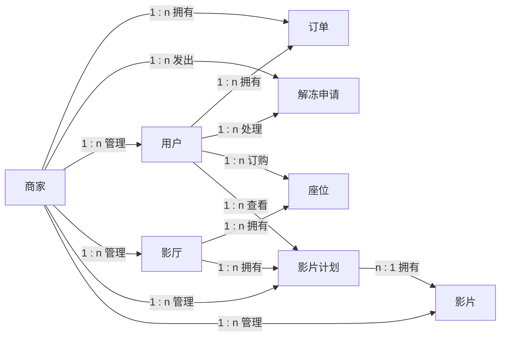

## 架构图

客户端与服务器端通过套接字通信：客户端在用户操作时发送请求，服务器端处理请求后返回结果。

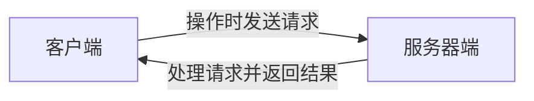

## 实现步骤

### 一、C/S 架构搭建

新建工程 `cinema-platform`，并在工程中分别创建 `cinema-platform-client`、`cinema-platform-server` 和 `cinema-platform-common` 三个模块。

其中 `cinema-platform-client` 为客户端，`cinema-platform-server` 为服务器端，`cinema-platform-common` 为客户端和服务器端共用的代码。

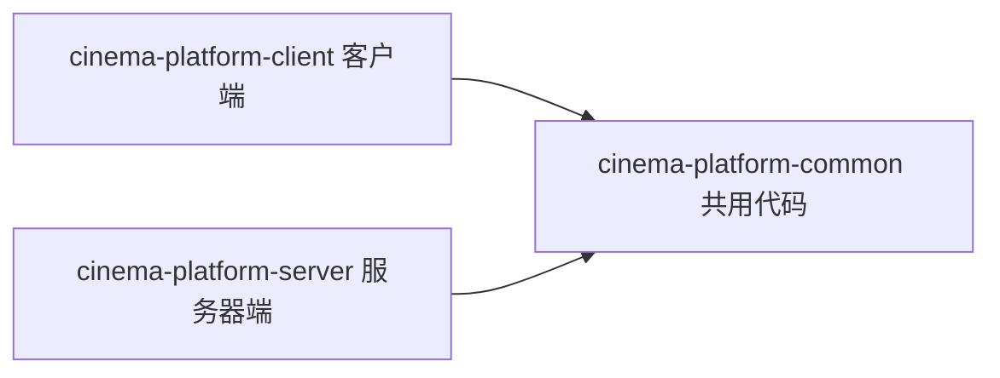

工程结构如下：

```text
cinema-platform
├── cinema-platform-common              客户端与服务器端共用的代码
│   └── src/com/cyx/cinema/platform
│       ├── command/Command.java        命令接口
│       ├── entity/                     实体类：User、Seller、UnfrozenApply、
│       │                               Film、Seat、FilmHall、FilmPlan、Order
│       ├── message/Message.java        通信消息
│       └── util/                       IdGenerator、SocketUtil
├── cinema-platform-client              客户端
│   └── src/com/cinema/platform/client
│       ├── action/UserAction.java      用户行为
│       ├── interact/MessageSender.java 消息发送器
│       ├── menu/                       Menu、MenuManager
│       ├── starter/CinemaPlatformClient.java
│       └── util/InputUtil.java         输入工具类
├── cinema-platform-server              服务器端
│   └── src/com/cyx/cinema/platform/server
│       ├── starter/CinemaPlatformServer.java
│       ├── task/MessageProcessTask.java
│       └── util/                       FileUtil、FilmPlanValidator
└── cinema-platform.iml
```

> 💡 补充：课件里的包名前后不一致——`cinema-platform-common` 和 `cinema-platform-server` 用 `com.cyx.cinema.platform.*`，而 `cinema-platform-client` 用 `com.cinema.platform.client.*`（少了一层 `cyx`）。配套源码也是这样，两者并非笔误，而是工程里真实存在的差异，写 import 时要看清。

### 二、cinema-platform-common 设计

#### 1. 实体构建

根据实体关系图将所有实体构建出来（此处贴出的代码省略了 get/set 方法）。课件中把这些类连续贴在一起，下面按类拆分。

**User 用户**

```java
package com.cyx.cinema.platform.entity;
//ER图 Entity Relational
//实体包常用包名：entity 实体 pojo(plain ordinary java object)简单java对象
//bo(business object) 业务对象 vo(view object) 视图对象 dto(data transfer object) 数据传输对象
//domain 领域模型  model 数据模型

import java.io.Serializable;

/**
 * 用户
 */
public class User implements Serializable {
    /**
     * 用户角色：普通用户、管理员、商家
     */
    public enum Role{
        USER,MANAGER,SELLER
    }

    /**
     * 用户名
     */
    protected String username;
    /**
     * 密码
     */
    protected String password;
    /**
     * 安全码
     */
    protected String securityCode;
    /**
     * 角色
     */
    protected Role role;
    /**
     * 账号状态：-1-审核不通过，0-待审核，1-正常，2-冻结
     */
    protected int state;

    public User(String username, String password, String securityCode) {
        this.username = username;
        this.password = password;
        this.securityCode = securityCode;
        this.role = Role.USER;//默认为普通用户
        this.state = 1;//状态默认为正常
    }

    public String getUsername() {
        return username;
    }

    public String getPassword() {
        return password;
    }

    public String getSecurityCode() {
        return securityCode;
    }

    public Role getRole() {
        return role;
    }

    public int getState() {
        return state;
    }

    public void setPassword(String password) {
        this.password = password;
    }

    public void setSecurityCode(String securityCode) {
        this.securityCode = securityCode;
    }

    public void setRole(Role role) {
        this.role = role;
    }

    public void setState(int state) {
        this.state = state;
    }

    @Override
    public String toString() {
        String roleStr = role == Role.MANAGER ? "管理员" : "普通用户";
        String stateStr = state == 1 ? "正常" : "冻结";
        return username + "\t" + roleStr + "\t" + stateStr;
    }
}
```

**Seller 商家**

```java
package com.cyx.cinema.platform.entity;

/**
 * 商家
 */
public class Seller extends User {
    /**
     * 影院名称
     */
    private String cinemaName;
    /**
     * 影院地址
     */
    private String cinemaAddress;

    public Seller(String username, String password, String securityCode, String cinemaName, String cinemaAddress) {
        super(username, password, securityCode);
        this.cinemaName = cinemaName;
        this.cinemaAddress = cinemaAddress;
        this.role = Role.SELLER; //默认是商家
        this.state = 0;//默认状态为待审核
    }

    public String getCinemaName() {
        return cinemaName;
    }

    public String getCinemaAddress() {
        return cinemaAddress;
    }

    @Override
    public String toString() {
        String stateStr = state == -1 ? "审核不通过" : state == 0 ? "待审核" : state == 1 ? "正常" : "冻结";
        return username + "\t" + cinemaName + "\t" + cinemaAddress + "\t商家" + "\t" + stateStr;
    }
}
```

**UnfrozenApply 解冻申请**

```java
package com.cyx.cinema.platform.entity;

import java.io.Serializable;

/**
 * 解冻申请
 */
public class UnfrozenApply implements Serializable {
    /**
     * 编号
     */
    private String id;
    /**
     * 账号
     */
    private String username;
    /**
     * 解冻理由
     */
    private String reason;
    /**
     * 解冻申请处理状态：0-待处理 1-已通过 2-已驳回
     */
    private int state;

    public UnfrozenApply(String username, String reason) {
        this.username = username;
        this.reason = reason;
    }

    public String getId() {
        return id;
    }

    public void setId(String id) {
        this.id = id;
    }

    public String getUsername() {
        return username;
    }

    public String getReason() {
        return reason;
    }

    public int getState() {
        return state;
    }

    public void setState(int state) {
        this.state = state;
    }

    @Override
    public String toString() {
        String stateStr = state == 0 ? "待处理" : state == 1 ? "已通过" : "已驳回";
        return id + "\t" + username + "\t" + reason + "\t" + stateStr;
    }
}
```

**Film 影片**

```java
package com.cyx.cinema.platform.entity;

import java.io.Serializable;

/**
 * 影片
 */
public class Film implements Serializable {
    /**
     * 编号
     */
    private String id;
    /**
     * 名称
     */
    private String name;
    /**
     * 主演
     */
    private String actor;
    /**
     * 描述
     */
    private String description;
    /**
     * 拥有者
     */
    private String owner;

    public Film(String name, String actor, String description, String owner) {
        this.name = name;
        this.actor = actor;
        this.description = description;
        this.owner = owner;
    }

    public String getName() {
        return name;
    }

    public String getActor() {
        return actor;
    }

    public String getOwner() {
        return owner;
    }

    public String getId() {
        return id;
    }

    public void setId(String id) {
        this.id = id;
    }

    @Override
    public String toString() {
        return id + "\t" + name + "\t" + actor + "\t" + description;
    }
}
```

**Seat 座位**

```java
package com.cyx.cinema.platform.entity;

import java.io.Serializable;

/**
 * 座位
 */
public class Seat implements Serializable {
    /**
     * 排号
     */
    private int row;
    /**
     * 列号
     */
    private int col;
    /**
     * 拥有者
     */
    private String owner;

    public Seat(int row, int col) {
        this.row = row;
        this.col = col;
    }

    public String getOwner() {
        return owner;
    }

    public void setOwner(String owner) {
        this.owner = owner;
    }

    @Override
    public String toString() {
        return " ■ ";
    }
}
```

**FilmHall 影厅**

```java
package com.cyx.cinema.platform.entity;

import java.io.PrintStream;
import java.io.Serializable;

/**
 * 影厅
 */
public class FilmHall implements Serializable {
    /**
     * 编号
     */
    private String id;
    /**
     * 名称
     */
    private String name;
    /**
     * 总排数
     */
    private int totalRow;
    /**
     * 总列数
     */
    private int totalCol;
    /**
     * 座位列表
     */
    private Seat[][] seats;
    /**
     * 拥有者
     */
    private String owner;

    public FilmHall(String name, int totalRow, int totalCol, String owner) {
        this.name = name;
        this.totalRow = totalRow;
        this.totalCol = totalCol;
        this.owner = owner;
        this.seats = new Seat[totalRow][totalCol];
        for(int i=0; i<totalRow; i++){
            for(int j=0; j<totalCol; j++){
                this.seats[i][j] = new Seat(i, j);
            }
        }
    }

    /**
     * 检测给定排号和列号的座位是否已经被订购
     * @param row
     * @param col
     * @return
     */
    public boolean hasOwner(int row, int col){
        return seats[row][col].getOwner() != null;
    }

    /**
     * 换座
     * @param originalRow
     * @param originalCol
     * @param row
     * @param col
     */
    public void changeSeat(int originalRow, int originalCol, int row, int col){
        String owner = seats[originalRow][originalCol].getOwner();//获取原来座位的用户
        seats[originalRow][originalCol].setOwner(null);//座位所属用户置空，表示未被订购
        seats[row][col].setOwner(owner);//新的座位设置所属用户
    }
    /**
     * 获取余票
     * @return
     */
    public int getRestTickets(){
        int tickets = 0;
        for(Seat[] seatArr : seats){
            for(Seat seat : seatArr){
                if(seat.getOwner() == null){
                    tickets++;
                }
            }
        }
        return tickets;
    }

    /**
     * 订购座位
     * @param row
     * @param col
     * @param owner
     */
    public void orderSeat(int row, int col, String owner){
        seats[row][col].setOwner(owner);
    }

    /**
     * 取消订座
     * @param row
     * @param col
     */
    public void cancelSeat(int row, int col){
        seats[row][col].setOwner(null);
    }
    /**
     * 显示座位信息
     */
    public void showSeatInfo(){
        System.out.print(" ");
        for(int j=0; j<totalCol; j++){
            System.out.print(" " + j + " ");
        }
        System.out.println();
        try {
            for(int i=0; i<totalRow; i++){
                System.out.print(i);
                for(int j=0; j<totalCol; j++){
                    PrintStream ps = seats[i][j].getOwner() == null ? System.out : System.err;
                    ps.print(seats[i][j]);
                    Thread.sleep(20L);
                }
                System.out.println();
            }
        } catch (InterruptedException e) {
        }
    }

    public int getTotalRow() {
        return totalRow;
    }

    public int getTotalCol() {
        return totalCol;
    }

    public void setId(String id) {
        this.id = id;
    }

    public String getId() {
        return id;
    }

    public String getName() {
        return name;
    }

    public String getOwner() {
        return owner;
    }

    @Override
    public String toString() {
        return id + "\t" + name + "\t" + totalRow + "\t" + totalCol;
    }
}
```

**FilmPlan 影片计划**

```java
package com.cyx.cinema.platform.entity;

import java.io.Serializable;

/**
 * 影片计划
 */
public class FilmPlan implements Serializable {
    /**
     * 编号
     */
    private String id;
    /**
     * 使用影片
     */
    private Film film;
    /**
     * 使用影厅
     */
    private FilmHall hall;
    /**
     * 播放日期
     */
    private String playDate;
    /**
     * 开始时间
     */
    private String beginTime;
    /**
     * 结束时间
     */
    private String endTime;
    /**
     * 拥有者
     */
    private Seller owner;

    public FilmPlan(Film film, FilmHall hall, String playDate, String beginTime, String endTime, Seller owner) {
        this.film = film;
        this.hall = hall;
        this.playDate = playDate;
        this.beginTime = beginTime;
        this.endTime = endTime;
        this.owner = owner;
    }

    public void setId(String id) {
        this.id = id;
    }

    public String getId() {
        return id;
    }

    public Film getFilm() {
        return film;
    }

    public FilmHall getHall() {
        return hall;
    }

    public String getPlayDate() {
        return playDate;
    }

    public String getBeginTime() {
        return beginTime;
    }

    public String getEndTime() {
        return endTime;
    }

    public Seller getOwner() {
        return owner;
    }

    public void setPlayDate(String playDate) {
        this.playDate = playDate;
    }

    public void setBeginTime(String beginTime) {
        this.beginTime = beginTime;
    }

    public void setEndTime(String endTime) {
        this.endTime = endTime;
    }

    @Override
    public String toString() {
        return id + "\t" + film.getName() + "\t" + hall.getName() + "\t" + playDate + "\t" + beginTime + "~" + endTime + "\t" + hall.getRestTickets() + "\t" + owner.getCinemaName();
    }
}
```

**Order 订单**

```java
package com.cyx.cinema.platform.entity;

import java.io.Serializable;

/**
 * 订单
 */
public class Order implements Serializable {
    /**
     * 编号
     */
    private String id;
    /**
     * 影片计划编号
     */
    private String filmPlanId;
    /**
     * 影片名称
     */
    private String filmName;
    /**
     * 影厅名称
     */
    private String filmHallName;
    /**
     * 播放日期
     */
    private String playDate;
    /**
     * 开始时间
     */
    private String beginTime;
    /**
     * 结束时间
     */
    private String endTime;
    /**
     * 排号
     */
    private int row;
    /**
     * 列号
     */
    private int col;
    /**
     * 订单所属用户
     */
    private String user;
    /**
     * 订单所属商家
     */
    private Seller seller;
    /**
     * 订单状态：0-已退订 1-正常
     */
    private int state = 1;

    public String getId() {
        return id;
    }

    public void setId(String id) {
        this.id = id;
    }

    public String getFilmPlanId() {
        return filmPlanId;
    }

    public void setFilmPlanId(String filmPlanId) {
        this.filmPlanId = filmPlanId;
    }

    public String getFilmName() {
        return filmName;
    }

    public void setFilmName(String filmName) {
        this.filmName = filmName;
    }

    public String getFilmHallName() {
        return filmHallName;
    }

    public void setFilmHallName(String filmHallName) {
        this.filmHallName = filmHallName;
    }

    public String getPlayDate() {
        return playDate;
    }

    public void setPlayDate(String playDate) {
        this.playDate = playDate;
    }

    public String getBeginTime() {
        return beginTime;
    }

    public void setBeginTime(String beginTime) {
        this.beginTime = beginTime;
    }

    public String getEndTime() {
        return endTime;
    }

    public void setEndTime(String endTime) {
        this.endTime = endTime;
    }

    public int getRow() {
        return row;
    }

    public void setRow(int row) {
        this.row = row;
    }

    public int getCol() {
        return col;
    }

    public void setCol(int col) {
        this.col = col;
    }

    public String getUser() {
        return user;
    }

    public void setUser(String user) {
        this.user = user;
    }

    public Seller getSeller() {
        return seller;
    }

    public void setSeller(Seller seller) {
        this.seller = seller;
    }

    public int getState() {
        return state;
    }

    public void setState(int state) {
        this.state = state;
    }

    @Override
    public String toString() {
        String seatInfo = "第" + row + "排第" + col + "列";
        return id + "\t" + seller.getCinemaName() + "\t" + filmName + "\t" + filmHallName + "\t" + seatInfo + "\t" + playDate + " " + beginTime + "~" + endTime + "\t" + seller.getCinemaAddress() + "\t" + (state == 1 ? "正常" : "取消");
    }
}
```

#### 2. ID 生成器

大多数实体都有唯一编号，这些唯一的编号都是以字符串的方式出现，需要使用 ID 生成器来生成。

```java
package com.cyx.cinema.platform.util;
//工具类包名util

import java.util.Random;

/**
 * ID生成器
 */
public class IdGenerator {

    public static void main(String[] args) {
       for(int i=0; i<10; i++){
           String id = generateId(10);
           System.out.println(id);
       }
    }
    
    private static char[] characters = {
            'A','B','C','D','E','F','G','H','I',
            'J','K','L','M','N','O','P','Q','R',
            'S','T','U','V','W','X','Y','Z','0',
            '1','2','3','4','5','6','7','8','9'
    };

    /**
     * 生成指定长度的ID
     * @param length
     * @return
     */
    public static String generateId(int length){
        Random r = new Random();
        StringBuilder builder = new StringBuilder("CYX_");
        for(int i=0; i<length; i++){
            int index = r.nextInt(characters.length);
            builder.append(characters[index]);
        }
        return builder.toString();
    }
    
}
```

#### 3. 信息交互分析

为了保证信息传输的可靠性，这里选用套接字 Socket 来实现可靠性信息传输。而 Socket 实现信息传输使用的是 IO 流通道进行，对于 IO 流，我们学过字节流、字符流、二进制流、对象流等，选用哪一种 IO 流来进行信息传输呢？

在影院选票系统中，用户可以查看影片信息、影片播放计划、用户解冻申请信息等，这些信息都是以列表的形式展现。如果使用字节流和二进制流来实现信息传输，在实现上存在诸多限制，因此首先排除。如果使用字符流来实现信息传输，那么接收端就必须对字符串进行解析，而字符串解析开销比较大，性能较为低下，所以也排除。因此，只能选择对象流来实现信息传输，但需要注意，**传输的对象必须实现序列化接口**。

在影院选票系统中，客户端每次发送的信息必须包含用户的动作以及该动作携带的数据，服务器接到信息后，首先从信息中提取用户动作，然后再根据用户动作对数据进行处理。

**Message 消息**

```java
package com.cyx.cinema.platform.message;

import java.io.Serializable;

/**
 * 消息
 * @param <T>
 */
public class Message<T> implements Serializable {
    /**
     * 操作命令
     */
    private int command;
    /**
     * 发送的数据
     */
    private T data;

    public Message(int command, T data) {
        this.command = command;
        this.data = data;
    }

    public int getCommand() {
        return command;
    }

    public T getData() {
        return data;
    }

    @Override
    public String toString() {
        return command + "=>" + data;
    }
}
```

**SocketUtil 套接字工具类**

客户端与服务器端会进行频繁的交互，为了避免重复的编码，这些交互应该编写在一个工具类中。

```java
package com.cyx.cinema.platform.util;

import java.io.*;
import java.net.Socket;

/**
 * 套接字工具类
 */
public class SocketUtil {
    /**
     * 发送消息
     * @param socket
     * @param msg
     * @param <T>
     */
    public static <T> void sendMsg(Socket socket, T msg){
        try {
            //获取输出流
            OutputStream os = socket.getOutputStream();
            //将输出流包装为对象输出流
            ObjectOutputStream oos = new ObjectOutputStream(os);
            //对象输出流写对象，也就是发送消息
            oos.writeObject(msg);
            //强制将通道中的数据刷出
            oos.flush();
            //告知接收端，消息发送已经完毕
            socket.shutdownOutput();
        } catch (IOException e) {
            e.printStackTrace();
        }
    }

    /**
     * 接收消息
     * @param socket
     * @param <T>
     * @return
     */
    public static <T> T receiveMsg(Socket socket){
        try {
            //获取输入流
            InputStream is = socket.getInputStream();
            //将输入流包装为对象输入流
            ObjectInputStream ois = new ObjectInputStream(is);
            //读取对象
            T t = (T) ois.readObject();
            //告诉发送端，信息读取已经完毕
            socket.shutdownInput();
            return t;
        } catch (Exception e) {
            e.printStackTrace();
            return null;
        }
    }
}
```

#### 4. 消息发送器

在 `cinema-platform-client` 中添加新的消息发送器。

> 💡 说明：该类位于客户端模块，但因为要与 common 模块的 `Message`、`SocketUtil` 配套使用，课件把它紧接在「信息交互分析」之后介绍。

```java
package com.cinema.platform.client.interact;

import com.cyx.cinema.platform.message.Message;
import com.cyx.cinema.platform.util.SocketUtil;

import java.io.IOException;
import java.net.Socket;

/**
 * 消息发送器
 */
public class MessageSender {

    private static final String IP = "localhost";

    private static final int PORT = 8888;

    /**
     * 客户端发送消息
     * @param command
     * @param data
     * @param <T>
     * @param <V>
     * @return
     */
    public static <T,V> T sendMsg(int command, V data){
        try {
            Socket socket = new Socket(IP, PORT);
            Message<V> msg = new Message<>(command, data);
            SocketUtil.sendMsg(socket, msg);
            return SocketUtil.receiveMsg(socket);
        } catch (IOException e) {
            e.printStackTrace();
            return null;
        }
    }

}
```

### 三、cinema-platform-client 设计

#### 1. 用户行为分析

所有的实体都与用户息息相关，用户的行为决定了实体信息的变更。根据功能图将用户的所有行为全部构建出来。

```java
package com.cinema.platform.client.action;

import com.cinema.platform.client.interact.MessageSender;
import com.cinema.platform.client.util.InputUtil;
import com.cyx.cinema.platform.command.Command;
import com.cyx.cinema.platform.entity.*;

import java.util.HashMap;
import java.util.List;
import java.util.Map;
import java.util.Optional;

/**
 * 用户行为
 */
public class UserAction {
    /**
     * 注册
     */
    public static void register(){
        String username = InputUtil.getInputText("请输入账号：");
        String password = InputUtil.getInputText("请输入密码：");
        String securityCode = InputUtil.getInputText("请输入安全码：");
        User user = new User(username, password, securityCode);
        Integer result = MessageSender.sendMsg(Command.REGISTER, user);
        if(result == null || result == 0){
            System.out.println("注册失败，请稍后重试");
        } else if(result == 1){
            System.out.println("注册成功");
        } else {
            System.out.println("账号已被注册");
        }
    }
    /**
     * 入驻申请
     */
    public static void entryApply(){
        String username = InputUtil.getInputText("请输入账号：");
        String password = InputUtil.getInputText("请输入密码：");
        String securityCode = InputUtil.getInputText("请输入安全码：");
        String cinemaName = InputUtil.getInputText("请输入影院名称：");
        String cinemaAddress = InputUtil.getInputText("请输入影院地址：");
        Seller seller = new Seller(username, password, securityCode, cinemaName, cinemaAddress);
        Integer result = MessageSender.sendMsg(Command.REGISTER, seller);
        if(result == null || result == 0){
            System.out.println("入驻申请失败，请稍后重试");
        } else if(result == 1){
            System.out.println("入驻申请成功，请等待审核");
        } else {
            System.out.println("入驻申请账号或影院名称已被使用");
        }
    }
    /**
     * 登录
     */
    public static Map<String,Object> login(){
        String username = InputUtil.getInputText("请输入账号：");
        String password = InputUtil.getInputText("请输入密码：");
        User user = new User(username, password, null);
        return MessageSender.sendMsg(Command.LOGIN, user);
    }
    /**
     * 查案入驻申请
     */
    public static void viewEntryApply(){
        String cinemaName = InputUtil.getInputText("请输入影院名称：");
        List<Seller> sellers = MessageSender.sendMsg(Command.VIEW_ENTRY_APPLY, cinemaName);
        if(sellers == null || sellers.isEmpty()){
            System.out.println("未找到与\"" + cinemaName + "\"相关的入驻申请");
        } else {
            System.out.println("账号\t影院名称\t影院地址\t角色\t状态");
            sellers.forEach(System.out::println);
        }
    }
    /**
     * 找回密码
     */
    public static void getPasswordBack(){
        String username = InputUtil.getInputText("请输入账号：");
        String securityCode = InputUtil.getInputText("请输入安全码：");
        User user = new User(username, null, securityCode);
        String result = MessageSender.sendMsg(Command.GET_PASSWORD_BACK, user);
        if(result == null){
            System.out.println("安全码不正确");
        } else {
            System.out.println("您的密码是：" + result);
        }
    }
    /**
     * 解冻申请
     */
    public static void unfrozenApply(){
        String username = InputUtil.getInputText("请输入账号：");
        String reason = InputUtil.getInputText("请输入解冻理由：");
        UnfrozenApply apply = new UnfrozenApply(username, reason);
        Integer result = MessageSender.sendMsg(Command.UNFROZEN_APPLY, apply);
        if(result == null || result == 0){
            System.out.println("解冻申请发送失败，请稍后重试");
        } else if(result == -1){
            System.out.println("解冻账号不存在");
        } else if(result == 1){
            System.out.println("解冻申请发送成功，请等待审批");
        } else if(result == -2){
            System.out.println("账号未被冻结，不能进行解冻申请");
        } else {
            System.out.println("账号存在未处理的解冻申请，请勿重复发送");
        }
    }
    /**
     * 查看商家
     */
    public static void viewSellers(){
        String cinemaName = InputUtil.getInputText("请输入影院名称：");
        List<Seller> sellers = MessageSender.sendMsg(Command.VIEW_SELLERS, cinemaName);
        if(sellers == null || sellers.isEmpty()){
            System.out.println("未找到与\"" + cinemaName + "\"相关的商家信息");
        } else {
            System.out.println("账号\t\t影院名称\t影院地址\t\t角色\t\t状态");
            sellers.forEach(System.out::println);
        }
    }
    /**
     * 审核商家
     */
    public static void auditSeller(){
        String username = InputUtil.getInputText("请输入商家账号：");
        int state = InputUtil.getInputInteger("请输入审核状态：（-1-审核不通过，1-审核通过）", new int[]{-1, 1});
        Map<String,Object> data = new HashMap<>();
        data.put("username", username);
        data.put("state", state);
        Integer result = MessageSender.sendMsg(Command.AUDIT_SELLER, data);
        if(result == null || result == 0){
            System.out.println("审核失败，请稍后重试");
        } else if(result == 1){
            System.out.println("审核成功");
        } else if(result == -1){
            System.out.println("审核商家不存在");
        } else {
            System.out.println("当前商家无法进行审核");
        }
    }
    /**
     * 冻结商家
     */
    public static void frozenSeller(){
        String username = InputUtil.getInputText("请输入商家账号：");
        Integer result = MessageSender.sendMsg(Command.FROZEN_SELLER, username);
        if(result == null || result == 0){
            System.out.println("冻结失败，请稍后重试");
        } else if(result == 1){
            System.out.println("冻结成功");
        } else if(result == -1){
            System.out.println("冻结商家不存在");
        } else {
            System.out.println("当前商家无法进行冻结");
        }
    }
    /**
     * 查看用户
     */
    public static void viewUsers(){
        List<User> users = MessageSender.sendMsg(Command.VIEW_USERS, null);
        if(users == null || users.isEmpty()){
            System.out.println("当前暂无用户信息");
        } else {
            System.out.println("账号\t\t\t角色\t状态");
            users.forEach(System.out::println);
        }
    }
    /**
     * 冻结用户
     */
    public static void frozenUser(){
        String username = InputUtil.getInputText("请输入冻结账号：");
        Integer result = MessageSender.sendMsg(Command.FROZEN_USER, username);
        if(result == null || result == 0){
            System.out.println("冻结账号失败，请稍后重试");
        } else if(result == 1){
            System.out.println("冻结账号成功");
        } else if(result == -1){
            System.out.println("冻结账号不存在");
        } else {
            System.out.println("账号\"" + username + "\"所处状态不能进行冻结操作");
        }
    }
    /**
     * 查看解冻申请
     */
    public static void viewUnfrozenApplies(){
        List<UnfrozenApply> applies = MessageSender.sendMsg(Command.VIEW_UNFROZEN_APPLIES, null);
        if(applies == null || applies.isEmpty()){
            System.out.println("当前暂无解冻申请");
        } else {
            System.out.println("编号\t\t\t\t解冻账号\t理由\t\t处理状态");
            applies.forEach(System.out::println);
        }
    }
    /**
     * 审批解冻申请
     */
    public static void auditUnfrozenApply(){
        String id = InputUtil.getInputText("请输入解冻申请编号：");
        int state = InputUtil.getInputInteger("请输入审批状态：（1-审批通过，2-已驳回）", new int[]{1,2});
        Map<String,Object> data = new HashMap<>();
        data.put("id", id);
        data.put("state", state);
        Integer result = MessageSender.sendMsg(Command.AUDIT_UNFROZEN_APPLY, data);
        if(result == null || result == 0){
            System.out.println("审批失败，请稍后重试");
        } else if(result == 1){
            System.out.println("审批成功");
        } else if(result == -1){
            System.out.println("审核的解冻申请不存在");
        } else {
            System.out.println("当前账号无法进行审核");
        }
    }
    /**
     * 查看影厅
     */
    public static void viewFilmHalls(String owner){
        List<FilmHall> halls =MessageSender.sendMsg(Command.VIEW_FILM_HALLS, owner);
        if(halls == null || halls.isEmpty()){
            System.out.println("当前暂无影厅信息");
        } else {
            System.out.println("编号\t\t\t\t名称\t\t总排数\t总列数");
            halls.forEach(System.out::println);
        }
    }
    /**
     * 添加影厅
     */
    public static void addFilmHall(String owner){
        String name = InputUtil.getInputText("请输入影厅名称：");
        int row = InputUtil.getInputInteger("请输入影厅总排数：", 5, 10);
        int col = InputUtil.getInputInteger("请输入影厅总列数：", 5, 10);
        FilmHall hall = new FilmHall(name, row, col, owner);
        Integer result = MessageSender.sendMsg(Command.ADD_FILM_HALL, hall);
        if(result == null || result == 0){
            System.out.println("增加影厅失败，请稍后重试");
        } else if(result == 1){
            System.out.println("增加影厅成功");
        } else {
            System.out.println("影厅信息已存在，请勿重复添加");
        }
    }
    /**
     * 修改影厅
     */
    public static void updateFilmHall(String owner){
        String id = InputUtil.getInputText("请输入影厅编号：");
        String name = InputUtil.getInputText("请输入影厅名称：");
        int row = InputUtil.getInputInteger("请输入影厅总排数：", 5, 10);
        int col = InputUtil.getInputInteger("请输入影厅总列数：", 5, 10);
        FilmHall hall = new FilmHall(name, row, col, owner);
        hall.setId(id);
        Integer result = MessageSender.sendMsg(Command.UPDATE_FILM_HALL, hall);
        if(result == null || result == 0){
            System.out.println("更新影厅失败，请稍后重试");
        } else if(result == 1){
            System.out.println("更新影厅成功");
        } else {
            System.out.println("为找到与\"" + id + "\"相关的影厅信息，更新失败");
        }
    }
    /**
     * 删除影厅
     */
    public static void deleteFilmHall(String owner){
        String id = InputUtil.getInputText("请输入影厅编号：");
        Map<String,Object> data = new HashMap<>();
        data.put("id", id);
        data.put("owner", owner);
        Integer result = MessageSender.sendMsg(Command.DELETE_FILM_HALL, data);
        if(result == null || result == 0){
            System.out.println("删除影厅失败");
        } else if(result == 1){
            System.out.println("删除影厅成功");
        } else {
            System.out.println("未找到与\"" + id + "\"相关的影厅信息，删除失败");
        }
    }
    /**
     * 查看影片
     */
    public static void viewFilms(String owner){
        String name = InputUtil.getInputText("请输入影片名称：（Y-查看所有）");
        Map<String,Object> data = new HashMap<>();
        data.put("name", name);
        data.put("owner", owner);
        List<Film> films = MessageSender.sendMsg(Command.VIEW_FILMS, data);
        if(films == null || films.isEmpty()){
            System.out.println("未找到与\"" + name + "\"相关的影片信息");
        } else {
            System.out.println("编号\t\t\t\t名称\t\t主演\t描述");
            films.forEach(System.out::println);
        }
    }
    /**
     * 添加影片
     */
    public static void addFilm(String owner){
        String name = InputUtil.getInputText("请输入影片名称：");
        String actor = InputUtil.getInputText("请输入影片主演：");
        String description = InputUtil.getInputText("请输入影片描述：");
        Film film = new Film(name, actor, description, owner);
        Integer result = MessageSender.sendMsg(Command.ADD_FILM, film);
        if(result == null || result == 0){
            System.out.println("增加影片失败，请稍后重试");
        } else if(result == 1){
            System.out.println("增加影片成功");
        } else {
            System.out.println("影片信息已存在，请勿重复添加");
        }
    }
    /**
     * 修改影片
     */
    public static void updateFilm(String owner){
        String id = InputUtil.getInputText("请输入影片编号：");
        String name = InputUtil.getInputText("请输入影片名称：");
        String actor = InputUtil.getInputText("请输入影片主演：");
        String description = InputUtil.getInputText("请输入影片描述：");
        Film film = new Film(name, actor, description, owner);
        film.setId(id);
        Integer result =MessageSender.sendMsg(Command.UPDATE_FILM, film);
        if(result == null || result == 0){
            System.out.println("修改影片失败，请稍后重试");
        } else if(result == 1){
            System.out.println("修改影片成功");
        } else {
            System.out.println("未找到修改的影片信息");
        }
    }
    /**
     * 删除影片
     */
    public static void deleteFilm(String owner){
        String id = InputUtil.getInputText("请输入影片编号：");
        Map<String,Object> data = new HashMap<>();
        data.put("id", id);
        data.put("owner", owner);
        Integer result = MessageSender.sendMsg(Command.DELETE_FILM, data);
        if(result == null || result == 0){
            System.out.println("删除影片失败，请稍后重试");
        } else if(result == 1){
            System.out.println("删除影片成功");
        } else {
            System.out.println("删除的影片不存在");
        }
    }
    /**
     * 商家查看影片计划
     */
    public static void viewFilmPlans(User owner){
        String filmName = InputUtil.getInputText("请输入影片名称：（Y表示查询所有）");
        Map<String,Object> data = new HashMap<>();
        data.put("filmName", filmName);
        if(owner instanceof Seller)//商家
            data.put("owner", owner.getUsername());
        List<FilmPlan> films = MessageSender.sendMsg(Command.VIEW_FILM_PLANS, data);;
        if(films == null || films.isEmpty()){
            System.out.println("当前暂无影片计划信息");
        } else {
            System.out.println("编号\t\t\t\t影片名称\t影厅名称\t播放日期\t\t\t\t时间\t\t\t\t余票\t所属影院");
            films.forEach(System.out::println);
        }
    }
    /**
     * 添加影片计划
     */
    public static void addFilmPlan(Seller owner){
        String name = InputUtil.getInputText("请输入影片名称：（Y-查看所有）");
        Map<String,Object> data = new HashMap<>();
        data.put("name", name);
        data.put("owner", owner.getUsername());
        List<Film> films = MessageSender.sendMsg(Command.VIEW_FILMS, data);
        if(films == null || films.isEmpty()){
            System.out.println("未找到与\"" + name + "\"相关的影片信息");
        } else {
            System.out.println("编号\t\t\t\t名称\t\t主演\t描述");
            films.forEach(System.out::println);
            Film selectFilm = null;
            while (selectFilm == null){
                String filmId = InputUtil.getInputText("请输入影片编号：");
                Optional<Film> opt = films.stream()
                        .filter(f->f.getId().equals(filmId) && f.getOwner().equals(owner.getUsername()))
                        .findFirst();
                if(opt.isPresent()){
                    selectFilm = opt.get();
                } else {
                    System.out.println("影片编号输入错误");
                }
            }
            List<FilmHall> halls =MessageSender.sendMsg(Command.VIEW_FILM_HALLS, owner.getUsername());
            if(halls == null || halls.isEmpty()){
                System.out.println("当前暂无影厅信息");
            } else {
                System.out.println("编号\t\t\t\t名称\t\t总排数\t总列数");
                halls.forEach(System.out::println);
                FilmHall selectFilmHall = null;
                while (selectFilmHall == null){
                    String filmHallId = InputUtil.getInputText("请输入影厅编号：");
                    Optional<FilmHall> opt = halls.stream()
                            .filter(h->h.getId().equals(filmHallId) && h.getOwner().equals(owner.getUsername()))
                            .findFirst();
                    if(opt.isPresent()){
                        selectFilmHall = opt.get();
                    } else {
                        System.out.println("影厅编号输入错误");
                    }
                }
                String date = InputUtil.getInputDate("请输入播放日期：", "yyyy-MM-dd");
                String beginTime = InputUtil.getInputDate("请输入开始时间：", "HH:mm:ss");
                String endTime = InputUtil.getInputDate("请输入结束时间：", "HH:mm:ss");
                FilmPlan plan = new FilmPlan(selectFilm, selectFilmHall, date, beginTime, endTime, owner);
                Integer result = MessageSender.sendMsg(Command.ADD_FILM_PLAN, plan);
                if(result == null || result == 0){
                    System.out.println("增加影片计划失败，请稍后重试");
                } else if(result == 1){
                    System.out.println("增加影片计划成功");
                } else {
                    System.out.println("增加的影片计划存在时间冲突，请重新制定计划");
                }
            }
        }
    }
    /**
     * 修改影片计划
     */
    public static void updateFilmPlan(Seller owner){
        String id = InputUtil.getInputText("请输入影片计划编号：");
        String date = InputUtil.getInputDate("请输入播放日期：", "yyyy-MM-dd");
        String beginTime = InputUtil.getInputDate("请输入开始时间：", "HH:mm:ss");
        String endTime = InputUtil.getInputDate("请输入结束时间：", "HH:mm:ss");
        Map<String,Object> data =new HashMap<>();
        data.put("id", id);
        data.put("date", date);
        data.put("beginTime", beginTime);
        data.put("endTime", endTime);
        data.put("owner", owner.getUsername());
        Integer result = MessageSender.sendMsg(Command.UPDATE_FILM_PLAN, data);
        if(result == null || result == 0){
            System.out.println("修改影片计划失败，请稍后重试");
        } else if(result == 1){
            System.out.println("修改影片计划成功");
        } else if(result == -1){
            System.out.println("修改的影片计划不存在");
        } else {
            System.out.println("修改的影片计划存在时间冲突，请重新制定");
        }
    }
    /**
     * 删除影片计划
     */
    public static void deleteFilmPlan(Seller owner){
        String id = InputUtil.getInputText("请输入影片计划编号：");
        Map<String,Object> data = new HashMap<>();
        data.put("id", id);
        data.put("owner", owner.getUsername());
        Integer result = MessageSender.sendMsg(Command.DELETE_FILM_PLAN, data);
        if(result == null || result == 0){
            System.out.println("删除影片计划失败");
        } else if(result == 1){
            System.out.println("删除影片计划成功");
        } else {
            System.out.println("未找到与\"" + id + "\"相关的影片计划信息");
        }
    }
    /**
     * 查看订单
     */
    public static void viewOrders(User user){
        List<Order> orders = MessageSender.sendMsg(Command.VIEW_ORDERS, user);
        if(orders == null || orders.isEmpty()){
            System.out.println("当前并无订单信息");
        } else {
            System.out.println("编号\t\t\t\t影院\t\t影片名称\t影厅名称\t座位信息\t\t播放日期\t\t\t\t播放时间\t\t\t\t影院地址\t\t\t状态");
            orders.forEach(System.out::println);
        }
    }
    /**
     * 在线订座
     */
    public static void orderSeatOnline(String owner){
        String id = InputUtil.getInputText("请输入影片计划编号：");
        FilmPlan plan = MessageSender.sendMsg(Command.GET_FILM_PLAN_BY_ID, id);
        if(plan == null){
            System.out.println("未找到与\"" + id + "\"相关的影片计划");
        } else {
            FilmHall hall = plan.getHall();
            hall.showSeatInfo();
            while (true){
                int row = InputUtil.getInputInteger("请输入行号：", 0, hall.getTotalRow());
                int col = InputUtil.getInputInteger("请输入列号：", 0, hall.getTotalCol());
                if(hall.hasOwner(row, col)){
                    System.out.println("选择的座位已被订购，请重新选择");
                } else {
                    Map<String,Object> data = new HashMap<>();
                    data.put("id", id);
                    data.put("row", row);
                    data.put("col", col);
                    data.put("owner", owner);
                    Integer result = MessageSender.sendMsg(Command.ORDER_SEAT_ONLINE, data);
                    if(result == null || result == 0){
                        System.out.println("订座失败，请稍后重试");
                    } else {
                        System.out.println("订座成功");
                    }
                    break;
                }
            }
        }
    }
    /**
     * 修改订单
     */
    public static void updateOrder(String owner){
        String id = InputUtil.getInputText("请输入订单编号：");
        Order order = MessageSender.sendMsg(Command.GET_ORDER_BY_ID, id);
        if(order == null){
            System.out.println("未找到与\"" + id + "\"相关的订单");
            return;
        }
        FilmPlan plan = MessageSender.sendMsg(Command.GET_FILM_PLAN_BY_ID, order.getFilmPlanId());
        if(plan == null){
            System.out.println("未找到与\"" + order.getFilmPlanId() + "\"相关的影片计划");
            return;
        }
        FilmHall hall = plan.getHall();
        if(hall.getRestTickets() > 0){//还有余票
            hall.showSeatInfo();
            while (true){
                int row = InputUtil.getInputInteger("请输入行号：", 0, hall.getTotalRow());
                int col = InputUtil.getInputInteger("请输入列号：", 0, hall.getTotalCol());
                if(hall.hasOwner(row, col)){
                    System.out.println("选择的座位已被订购，请重新选择");
                } else {
                    Map<String,Object> data = new HashMap<>();
                    data.put("id", id);
                    data.put("row", row);
                    data.put("col", col);
                    data.put("owner", owner);
                    Integer result = MessageSender.sendMsg(Command.UPDATE_ORDER, data);
                    if(result == null || result == 0){
                        System.out.println("修改订单失败，请稍后重试");
                    } else {
                        System.out.println("修改订单成功");
                    }
                    break;
                }
            }
        } else {
            System.out.println("当前影片的影票已全部售完");
        }
    }
    /**
     * 取消订单
     */
    public static void cancelOrder(String owner){
        String id = InputUtil.getInputText("请输入订单编号：");
        Map<String,Object> data = new HashMap<>();
        data.put("id", id);
        data.put("owner", owner);
        Integer result = MessageSender.sendMsg(Command.CANCEL_ORDER, data);
        if(result == null || result == 0){
            System.out.println("取消订单失败，请稍后重试");
        } else if(result == 1){
            System.out.println("取消订单成功");
        } else if(result == -1){
            System.out.println("取消的订单不存在");
        } else {
            System.out.println("当前取消的订单已处于取消状态，不能再取消");
        }
    }
}
```

#### 2. 菜单分析

由于是控制台系统，功能图中的所有功能只能够以菜单的形式展示给用户。因此，需要对菜单进行设计。

菜单拥有编号、名称、触发的命令、子菜单列表。编号用于用户选择；名称用于展示；触发的命令决定用户的动作；子菜单列表主要用于选择该菜单后进行展示。

**Menu 菜单（初版）**

```java
package com.cinema.platform.client.menu;

import java.util.ArrayList;
import java.util.List;

/**
 * 菜单
 */
public class Menu {
    /**
     * 序号
     */
    private int order;
    /**
     * 名称
     */
    private String name;
    /**
     * 菜单命令
     */
    private int command;
    /**
     * 子菜单列表
     */
    private List<Menu> children = new ArrayList<>();

    public Menu(int order, String name, int command) {
        this.order = order;
        this.name = name;
        this.command = command;
    }

}
```

菜单分为登录菜单和主菜单，主菜单又分为普通用户主菜单、商家主菜单和管理员主菜单。因此，菜单应该被管理起来，方便使用。

**MenuManager 菜单管理器（骨架）**

```java
package com.cinema.platform.client.menu;

/**
 * 菜单管理器
 */
public class MenuManager {
    /**
     * 登录菜单
     */
    public static final Menu[] LOGIN_MENUS = {};
    /**
     * 用户菜单
     */
    public static final Menu[] USER_MENUS = {};
    /**
     * 管理员菜单
     */
    public static final Menu[] MANAGER_MENUS = {};
    /**
     * 商家菜单
     */
    public static final Menu[] SELLER_MENUS = {};

}
```

构建菜单对象时需要触发的命令，当客户端向服务器端发送该命令时，服务器端需要接收该命令，然后执行相应的处理。因此命令是服务器端和客户端共同使用。在 `cinema-platform-common` 工程添加 `Command` 接口。

**Command 命令接口**

```java
package com.cyx.cinema.platform.command;

/**
 * 命令接口
 */
public interface Command {
    //0123456789  9+1=>10
    //1+1 => 10
    //7+1 => 10
    //0123456789a(10)b(11)c(12)d(13)e(14)f(15)
    //15(f)+1 => 10
    /**
     * 注册
     */
    int REGISTER = 0x00;
    /**
     * 登录
     */
    int LOGIN = 0x01;
    /**
     * 入驻申请
     */
    int ENTRY_APPLY = 0x02;
    /**
     * 查看入驻申请
     */
    int VIEW_ENTRY_APPLY = 0x03;
    /**
     * 找回密码
     */
    int GET_PASSWORD_BACK = 0x04;
    /**
     * 申请解冻
     */
    int UNFROZEN_APPLY = 0x05;
    /**
     * 退出
     */
    int QUIT = 0x06;
    /**
     * 显示子菜单
     */
    int SHOW_CHILDREN = 0x07;
    /**
     * 查看订单
     */
    int VIEW_ORDERS = 0x08;
    /**
     * 修改订单
     */
    int UPDATE_ORDER = 0x09;
    /**
     * 取消订单
     */
    int CANCEL_ORDER = 0x0a;
    /**
     * 返回主菜单
     */
    int GO_BACK_MAIN = 0x0b;
    /**
     * 在线订座
     */
    int ORDER_SEAT_ONLINE = 0x2d;
    /**
     * 查看商家
     */
    int VIEW_SELLERS = 0x0c;
    /**
     * 审核商家
     */
    int AUDIT_SELLER = 0x0d;
    /**
     * 冻结商家
     */
    int FROZEN_SELLER = 0x0e;
    /**
     * 返回登录
     */
    int GO_BACK_LOGIN = 0x0f;
    /**
     * 查看用户
     */
    int VIEW_USERS = 0x10;
    /**
     * 冻结用户
     */
    int FROZEN_USER = 0x11;
    /**
     * 查看解冻申请
     */
    int VIEW_UNFROZEN_APPLIES = 0x12;
    /**
     * 审批解冻申请
     */
    int AUDIT_UNFROZEN_APPLY = 0x13;
    /**
     * 查看影厅
     */
    int VIEW_FILM_HALLS = 0x14;
    /**
     * 添加影厅
     */
    int ADD_FILM_HALL = 0x15;
    /**
     * 修改影厅
     */
    int UPDATE_FILM_HALL = 0x16;
    /**
     * 删除影厅
     */
    int DELETE_FILM_HALL = 0x17;
    /**
     * 查看影片
     */
    int VIEW_FILMS = 0x18;
    /**
     * 添加影片
     */
    int ADD_FILM = 0x19;
    /**
     * 修改影片
     */
    int UPDATE_FILM = 0x1a;
    /**
     * 删除影片
     */
    int DELETE_FILM = 0x1b;
    /**
     * 查看商家影片计划
     */
    int VIEW_FILM_PLANS = 0x1c;
    /**
     * 添加影片计划
     */
    int ADD_FILM_PLAN = 0x1d;
    /**
     * 更新影片计划
     */
    int UPDATE_FILM_PLAN = 0x1e;
    /**
     * 删除影片计划
     */
    int DELETE_FILM_PLAN = 0x1f;
    /**
     * 通过影片计划编号查找影片计划
     */
    int GET_FILM_PLAN_BY_ID = 0x20;
    /**
     * 通过定点杆编号查找订单
     */
    int GET_ORDER_BY_ID = 0x21;
}
```

命令常量与功能的对应关系如下：

| 常量 | 值 | 含义 | 归属菜单 |
| :--- | :--- | :--- | :--- |
| `REGISTER` | `0x00` | 注册 | 登录菜单 |
| `LOGIN` | `0x01` | 登录 | 登录菜单 |
| `ENTRY_APPLY` | `0x02` | 入驻申请 | 登录菜单 |
| `VIEW_ENTRY_APPLY` | `0x03` | 查看入驻申请 | 登录菜单 |
| `GET_PASSWORD_BACK` | `0x04` | 找回密码 | 登录菜单 |
| `UNFROZEN_APPLY` | `0x05` | 申请解冻 | 登录菜单 |
| `QUIT` | `0x06` | 退出 | 登录菜单 |
| `SHOW_CHILDREN` | `0x07` | 显示子菜单 | 通用 |
| `GO_BACK_MAIN` | `0x0b` | 返回主菜单 | 通用 |
| `GO_BACK_LOGIN` | `0x0f` | 返回登录 | 通用 |
| `VIEW_SELLERS` | `0x0c` | 查看商家 | 管理员菜单 |
| `AUDIT_SELLER` | `0x0d` | 审核商家 | 管理员菜单 |
| `FROZEN_SELLER` | `0x0e` | 冻结商家 | 管理员菜单 |
| `VIEW_USERS` | `0x10` | 查看用户 | 管理员菜单 |
| `FROZEN_USER` | `0x11` | 冻结用户 | 管理员菜单 |
| `VIEW_UNFROZEN_APPLIES` | `0x12` | 查看解冻申请 | 管理员菜单 |
| `AUDIT_UNFROZEN_APPLY` | `0x13` | 审批解冻申请 | 管理员菜单 |
| `VIEW_FILM_HALLS` | `0x14` | 查看影厅 | 商家菜单 |
| `ADD_FILM_HALL` | `0x15` | 添加影厅 | 商家菜单 |
| `UPDATE_FILM_HALL` | `0x16` | 修改影厅 | 商家菜单 |
| `DELETE_FILM_HALL` | `0x17` | 删除影厅 | 商家菜单 |
| `VIEW_FILMS` | `0x18` | 查看影片 | 商家菜单 |
| `ADD_FILM` | `0x19` | 添加影片 | 商家菜单 |
| `UPDATE_FILM` | `0x1a` | 修改影片 | 商家菜单 |
| `DELETE_FILM` | `0x1b` | 删除影片 | 商家菜单 |
| `VIEW_FILM_PLANS` | `0x1c` | 查看商家影片计划 | 商家菜单 |
| `ADD_FILM_PLAN` | `0x1d` | 添加影片计划 | 商家菜单 |
| `UPDATE_FILM_PLAN` | `0x1e` | 更新影片计划 | 商家菜单 |
| `DELETE_FILM_PLAN` | `0x1f` | 删除影片计划 | 商家菜单 |
| `VIEW_ORDERS` | `0x08` | 查看订单 | 用户／商家菜单 |
| `UPDATE_ORDER` | `0x09` | 修改订单 | 用户菜单 |
| `CANCEL_ORDER` | `0x0a` | 取消订单 | 用户菜单 |
| `ORDER_SEAT_ONLINE` | `0x2d` | 在线订座 | 用户菜单 |
| `GET_FILM_PLAN_BY_ID` | `0x20` | 通过影片计划编号查找影片计划 | 辅助查询 |
| `GET_ORDER_BY_ID` | `0x21` | 通过订单编号查找订单 | 辅助查询 |

> 💡 补充：课件里 `Command` 接口存在两处常量笔误——`VIEW_USER_FILM_PLANS = 0x0c` 与 `VIEW_SELLERS = 0x0c` 重复、`ORDER_SEAT_ONLINE = 0x0d` 与 `AUDIT_SELLER = 0x0d` 重复；另外 `VIEW_SELLER_FILM_PLANS` 在源码中实际名为 `VIEW_FILM_PLANS`。上表及上方注入的代码均以配套源码为准，并补上了源码里另有实现的 `GET_FILM_PLAN_BY_ID`、`GET_ORDER_BY_ID` 两个常量。

**MenuManager 菜单管理器（填充菜单内容 + 展示方法）**

菜单类中应该添加子菜单的方法，然后完善菜单管理器中菜单内容。课件把这一步拆成「填充菜单数据」和「编写展示方法」两段贴出，完整类如下：

```java
package com.cinema.platform.client.menu;

import com.cyx.cinema.platform.command.Command;

import java.util.Arrays;

/**
 * 菜单管理器
 */
public class MenuManager {
    /**
     * 登录菜单
     */
    public static final Menu[] LOGIN_MENUS = {
            new Menu(1, "注册", Command.REGISTER),
            new Menu(2, "登录", Command.LOGIN),
            new Menu(3, "入驻申请", Command.ENTRY_APPLY),
            new Menu(4, "查看入驻申请", Command.VIEW_ENTRY_APPLY),
            new Menu(5, "找回密码", Command.GET_PASSWORD_BACK),
            new Menu(6, "申请解冻", Command.UNFROZEN_APPLY),
            new Menu(7, "退出", Command.QUIT),
    };
    /**
     * 用户菜单
     */
    public static final Menu[] USER_MENUS;
    static {
            Menu menu1 = new Menu(1, "我的订单", Command.SHOW_CHILDREN);
            menu1.addChild(new Menu(1, "查看订单", Command.VIEW_ORDERS));
            menu1.addChild(new Menu(2, "修改订单", Command.UPDATE_ORDER));
            menu1.addChild(new Menu(3, "取消订单", Command.CANCEL_ORDER));
            menu1.addChild(new Menu(4, "返回主菜单", Command.GO_BACK_MAIN));

            Menu menu2 = new Menu(2, "购买影票", Command.SHOW_CHILDREN);
            menu2.addChild(new Menu(1, "查看影片计划", Command.VIEW_FILM_PLANS));
            menu2.addChild(new Menu(2, "在线订座", Command.ORDER_SEAT_ONLINE));
            menu2.addChild(new Menu(3, "返回主菜单", Command.GO_BACK_MAIN));

            Menu menu3 = new Menu(3, "返回登录", Command.GO_BACK_LOGIN);

            USER_MENUS = new Menu[]{menu1, menu2, menu3};
    };
    /**
     * 管理员菜单
     */
    public static final Menu[] MANAGER_MENUS;
    static {
        Menu menu1 = new Menu(1, "商家管理", Command.SHOW_CHILDREN);
        menu1.addChild(new Menu(1, "查看商家", Command.VIEW_SELLERS));
        menu1.addChild(new Menu(2, "审核商家", Command.AUDIT_SELLER));
        menu1.addChild(new Menu(3, "冻结商家", Command.FROZEN_SELLER));
        menu1.addChild(new Menu(4, "返回主菜单", Command.GO_BACK_MAIN));

        Menu menu2 = new Menu(2, "用户管理", Command.SHOW_CHILDREN);
        menu2.addChild(new Menu(1, "查看用户", Command.VIEW_USERS));
        menu2.addChild(new Menu(2, "冻结用户", Command.FROZEN_USER));
        menu2.addChild(new Menu(3, "返回主菜单", Command.GO_BACK_MAIN));

        Menu menu3 = new Menu(3, "解冻申请管理", Command.SHOW_CHILDREN);
        menu3.addChild(new Menu(1, "查看解冻申请", Command.VIEW_UNFROZEN_APPLIES));
        menu3.addChild(new Menu(2, "审批解冻申请", Command.AUDIT_UNFROZEN_APPLY));
        menu3.addChild(new Menu(3, "返回主菜单", Command.GO_BACK_MAIN));

        Menu menu4 = new Menu(4, "返回登录", Command.GO_BACK_LOGIN);
        MANAGER_MENUS = new Menu[]{menu1, menu2, menu3, menu4};
    }
    /**
     * 商家菜单
     */
    public static final Menu[] SELLER_MENUS;
    static {
        Menu menu1 = new Menu(1, "影厅管理", Command.SHOW_CHILDREN);
        menu1.addChild(new Menu(1, "查看影厅", Command.VIEW_FILM_HALLS));
        menu1.addChild(new Menu(2, "增加影厅", Command.ADD_FILM_HALL));
        menu1.addChild(new Menu(3, "修改影厅", Command.UPDATE_FILM_HALL));
        menu1.addChild(new Menu(4, "删除影厅", Command.DELETE_FILM_HALL));
        menu1.addChild(new Menu(5, "返回主菜单", Command.GO_BACK_MAIN));

        Menu menu2 = new Menu(2, "影片管理", Command.SHOW_CHILDREN);
        menu2.addChild(new Menu(1, "查看影片", Command.VIEW_FILMS));
        menu2.addChild(new Menu(2, "增加影片", Command.ADD_FILM));
        menu2.addChild(new Menu(3, "修改影片", Command.UPDATE_FILM));
        menu2.addChild(new Menu(4, "删除影片", Command.DELETE_FILM));
        menu2.addChild(new Menu(5, "返回主菜单", Command.GO_BACK_MAIN));

        Menu menu3 = new Menu(3, "影片计划管理", Command.SHOW_CHILDREN);
        menu3.addChild(new Menu(1, "查看影片计划", Command.VIEW_FILM_PLANS));
        menu3.addChild(new Menu(2, "增加影片计划", Command.ADD_FILM_PLAN));
        menu3.addChild(new Menu(3, "修改影片计划", Command.UPDATE_FILM_PLAN));
        menu3.addChild(new Menu(4, "删除影片计划", Command.DELETE_FILM_PLAN));
        menu3.addChild(new Menu(5, "返回主菜单", Command.GO_BACK_MAIN));

        Menu menu4 = new Menu(4, "订单管理", Command.SHOW_CHILDREN);
        menu4.addChild(new Menu(1, "查看订单", Command.VIEW_ORDERS));
        menu4.addChild(new Menu(2, "返回主菜单", Command.GO_BACK_MAIN));

        Menu menu5 = new Menu(5, "返回登录", Command.GO_BACK_LOGIN);

        SELLER_MENUS = new Menu[]{menu1, menu2, menu3, menu4, menu5};
    }

    /**
     * 展示给定的菜单数组
     * @param menus
     */
    public static void showMenu(Menu[] menus){
        System.out.println("==========================");
        Arrays.stream(menus).forEach(System.out::println);
        System.out.println("==========================");
    }
}
```

**Menu 菜单（最终版）**

展示时发现展示信息带有内存地址，原因是没有重写 `Object` 类中的 `toString()` 方法。同时补上添加子菜单的方法：

```java
package com.cinema.platform.client.menu;

import java.util.ArrayList;
import java.util.List;

/**
 * 菜单
 */
public class Menu {
    /**
     * 序号
     */
    private int order;
    /**
     * 名称
     */
    private String name;
    /**
     * 菜单命令
     */
    private int command;
    /**
     * 子菜单列表
     */
    private List<Menu> children = new ArrayList<>();

    public Menu(int order, String name, int command) {
        this.order = order;
        this.name = name;
        this.command = command;
    }

    /**
     * 添加子菜单
     * @param child
     */
    public void addChild(Menu child){
        children.add(child);
    }

    public int getCommand() {
        return command;
    }

    public Menu[] getChildren(){
        return children.toArray(new Menu[children.size()]);
    }

    @Override
    public String toString() {
        return order + "." + name;
    }
}
```

> 💡 补充：课件里用户菜单的 `menu3` 和商家菜单的 `menu5`（「返回登录」）都误写成了 `Command.REGISTER`，应为 `Command.GO_BACK_LOGIN`，上方注入的源码已改正。

#### 3. 输入分析

菜单展示后，用户需要选择菜单进行操作，因此需要提供输入交互，交互时应保证输入的正确性，而这种交互操作在退出系统之前会反复出现。因此，输入应该编写在一个工具类中，在减少重复代码的同时还能对异常情况进行统一处理。

```java
package com.cinema.platform.client.util;

import com.cinema.platform.client.menu.MenuManager;

import java.text.ParseException;
import java.text.SimpleDateFormat;
import java.util.Arrays;
import java.util.Scanner;

/**
 * 输入工具类
 */
public class InputUtil {

    private static final Scanner SCANNER = new Scanner(System.in);

    /**
     * 从控制台获取一个给定范围区间内的整数
     * @param tip
     * @param min
     * @param max
     * @return
     */
    public static int getInputInteger(String tip, int min, int max){
        System.out.println(tip);
        while (true){
            if(SCANNER.hasNextInt()){
                int number = SCANNER.nextInt();
                if(number >= min && number <= max){
                    return number;
                } else {
                    System.out.println("输入错误，请输入" + min + "~" + max + "之间的整数");
                }
            } else {
                System.out.println("输入错误，请输入" + min + "~" + max + "之间的整数");
                SCANNER.next();
            }
        }
    }

    /**
     * 从控制台中获取一个给定数组中的数字
     * @param tip
     * @param values
     * @return
     */
    public static int getInputInteger(String tip,int...values){
        System.out.println(tip);
        while (true){
            if(SCANNER.hasNextInt()){
                int number = SCANNER.nextInt();
                for(int value: values){
                    if(number == value) return number;
                }
                System.out.println("输入错误，只能输入" + Arrays.toString(values) + "中的整数");

            } else {
                System.out.println("输入错误，只能输入" + Arrays.toString(values) + "中的整数");
                SCANNER.next();
            }
        }
    }

    /**
     * 从控制台获取一个字符串
     * @param tip
     * @return
     */
    public static String getInputText(String tip){
        System.out.println(tip);
        return SCANNER.next();
    }

    /**
     * 从控制台获取一个给定日期格式的日期
     * @param tip
     * @param format
     * @return
     */
    public static String getInputDate(String tip, String format){
        System.out.println(tip);
        while (true){
            String dateStr = SCANNER.next();
            SimpleDateFormat sdf = new SimpleDateFormat(format);
            boolean valid = true;
            try {
                sdf.parse(dateStr);
            } catch (ParseException e) {
                valid = false;
            }
            if(valid){
                return dateStr;
            } else {
                System.out.println("日期格式错误，请重新输入：（" + format + "）");
            }
        }
    }
}
```

#### 4. 界面展示分析

以登录界面为例，用户在注册成功、登录失败、找回密码、申请解冻等操作后可以继续登录，换言之，登录界面需要反复的展示，可以使用循环来实现。但为了加深对于知识点的应用，这里采用**递归**的方式实现。主界面设计也是一样。而递归只能使用方法来实现，因此，界面展示需要编写成一个方法。

先分别写登录菜单、主菜单和子菜单三个展示方法：

```java
public static void main(String[] args) {
    showLoginMenu();
}

private static void showLoginMenu(){
    MenuManager.showMenu(MenuManager.LOGIN_MENUS);
    int number = InputUtil.getInputInteger("请选择菜单编号：", 1, MenuManager.LOGIN_MENUS.length);
    Menu select = MenuManager.LOGIN_MENUS[number-1];
    switch (select.getCommand()){
        case Command.REGISTER:
            System.out.println("你选择了注册");
            showLoginMenu();
            break;
        case Command.LOGIN:
            System.out.println("你选择了登录");
            showMainMenu();
            break;
    }
}

private static void showMainMenu(){
    MenuManager.showMenu(MenuManager.MANAGER_MENUS);
    int number = InputUtil.getInputInteger("请选择菜单编号：", 1, MenuManager.MANAGER_MENUS.length);
    Menu select = MenuManager.MANAGER_MENUS[number-1];
    switch (select.getCommand()){
        case Command.SHOW_CHILDREN:
            System.out.println("你选择了显示子菜单");
            showChildMenu(select.getChildren());
            break;
        case Command.GO_BACK_LOGIN:
            System.out.println("你选择了返回登录");
            showLoginMenu();
            break;
    }
}

private static void showChildMenu(Menu[] menus){
    MenuManager.showMenu(menus);
    int number = InputUtil.getInputInteger("请选择菜单编号：", 1, menus.length);
    Menu select = menus[number-1];
    switch (select.getCommand()){
        case Command.GO_BACK_MAIN:
            System.out.println("你选择了返回主菜单");
            showMainMenu();
            break;
        default:
            System.out.println(select);
    }
}
```

**代码优化**

三个方法结构高度重复，将它们合并为一个 `showInterface(Menu[] menus)` 方法：把「要展示的菜单数组」作为参数，各分支在递归时传入对应的菜单数组即可。

```java
package com.cinema.platform.client.starter;

import com.cinema.platform.client.action.UserAction;
import com.cinema.platform.client.menu.Menu;
import com.cinema.platform.client.menu.MenuManager;
import com.cinema.platform.client.util.InputUtil;
import com.cyx.cinema.platform.command.Command;
import com.cyx.cinema.platform.entity.FilmHall;
import com.cyx.cinema.platform.entity.Seller;
import com.cyx.cinema.platform.entity.User;

import java.util.Map;


/**
 * 影院平台客户端
 */
public class CinemaPlatformClient {

    private static User currentUser;

    public static void main(String[] args) {
        showInterface(MenuManager.LOGIN_MENUS);
    }

    /**
     * 展示给定的菜单
     * @param menus
     */
    private static void showInterface(Menu[] menus){
        MenuManager.showMenu(menus);
        int number = InputUtil.getInputInteger("请选择菜单编号：", 1, menus.length);
        Menu select = menus[number-1];
        switch (select.getCommand()){
            case Command.REGISTER://注册
                UserAction.register();
                showInterface(menus);
                break;
            case Command.ENTRY_APPLY://商家入驻
                UserAction.entryApply();
                showInterface(menus);
                break;
            case Command.VIEW_ENTRY_APPLY://查看入驻申请
                UserAction.viewEntryApply();
                showInterface(menus);
                break;
            case Command.LOGIN://登录
                login(menus);
                break;
            case Command.GET_PASSWORD_BACK://找回密码
                UserAction.getPasswordBack();
                showInterface(menus);
                break;
            case Command.UNFROZEN_APPLY://解冻申请
                UserAction.unfrozenApply();
                showInterface(menus);
                break;
            case Command.VIEW_SELLERS://查看商家
                UserAction.viewSellers();
                showInterface(menus);
                break;
            case Command.AUDIT_SELLER://审核商家
                UserAction.auditSeller();
                showInterface(menus);
                break;
            case Command.FROZEN_SELLER://冻结商家
                UserAction.frozenSeller();
                showInterface(menus);
                break;
            case Command.VIEW_USERS://查看用户
                UserAction.viewUsers();
                showInterface(menus);
                break;
            case Command.FROZEN_USER: //冻结用户
                UserAction.frozenUser();
                showInterface(menus);
                break;
            case Command.VIEW_UNFROZEN_APPLIES://查看解冻申请
                UserAction.viewUnfrozenApplies();
                showInterface(menus);
                break;
            case Command.AUDIT_UNFROZEN_APPLY://审批解冻申请
                UserAction.auditUnfrozenApply();
                showInterface(menus);
                break;
            case Command.ADD_FILM://添加影片
                UserAction.addFilm(currentUser.getUsername());
                showInterface(menus);
                break;
            case Command.UPDATE_FILM://更新影片
                UserAction.updateFilm(currentUser.getUsername());
                showInterface(menus);
                break;
            case Command.DELETE_FILM://删除影片
                UserAction.deleteFilm(currentUser.getUsername());
                showInterface(menus);
                break;
            case Command.VIEW_FILMS://查看影片
                UserAction.viewFilms(currentUser.getUsername());
                showInterface(menus);
                break;
            case Command.ADD_FILM_HALL://添加影厅
                UserAction.addFilmHall(currentUser.getUsername());
                showInterface(menus);
                break;
            case Command.UPDATE_FILM_HALL://更新影厅
                UserAction.updateFilmHall(currentUser.getUsername());
                showInterface(menus);
                break;
            case Command.DELETE_FILM_HALL://删除影厅
                UserAction.deleteFilmHall(currentUser.getUsername());
                showInterface(menus);
                break;
            case Command.VIEW_FILM_HALLS://查看影厅
                UserAction.viewFilmHalls(currentUser.getUsername());
                showInterface(menus);
                break;
            case Command.ADD_FILM_PLAN://添加影片计划
                UserAction.addFilmPlan((Seller)currentUser);
                showInterface(menus);
                break;
            case Command.UPDATE_FILM_PLAN://更新影片计划
                UserAction.updateFilmPlan((Seller)currentUser);
                showInterface(menus);
                break;
            case Command.DELETE_FILM_PLAN://删除影片计划
                UserAction.deleteFilmPlan((Seller)currentUser);
                showInterface(menus);
                break;
            case Command.VIEW_FILM_PLANS://查看影片计划
                UserAction.viewFilmPlans(currentUser);
                showInterface(menus);
                break;
            case Command.ORDER_SEAT_ONLINE://在线订座
                UserAction.orderSeatOnline(currentUser.getUsername());
                showInterface(menus);
                break;
            case Command.VIEW_ORDERS://查看订单
                UserAction.viewOrders(currentUser);
                showInterface(menus);
                break;
            case Command.UPDATE_ORDER://修改订单
                UserAction.updateOrder(currentUser.getUsername());
                showInterface(menus);
                break;
            case Command.CANCEL_ORDER://取消订单
                UserAction.cancelOrder(currentUser.getUsername());
                showInterface(menus);
                break;
            case Command.GO_BACK_MAIN:
                showUserMenus();
                break;
            case Command.SHOW_CHILDREN:
                showInterface(select.getChildren());
                break;
            case Command.GO_BACK_LOGIN:
                showInterface(MenuManager.LOGIN_MENUS);
                break;
            case Command.QUIT:
                System.out.println("感谢使用影院选票平台");
                System.exit(0);
                break;
        }
    }

    /**
     * 登录
     * @param menus
     */
    private static void login(Menu[] menus){
        Map<String,Object> data = UserAction.login();
        if(data == null){
            System.out.println("账号或密码错误，请重新登录");
        } else {
            int result = (int) data.get("result");
            if(result == 0){
                System.out.println("账号或密码错误，请重新登录");
                showInterface(menus);
            } else if(result == 1){
                currentUser = (User) data.get("user");
                showUserMenus();
            } else if(result == 2){
                System.out.println("当前账号正在审批，请耐心等待");
                showInterface(menus);
            } else if(result == 3){
                System.out.println("账号已被冻结，请解冻后再登录");
                showInterface(menus);
            } else {
                System.out.println("账号不存在，请先注册");
                showInterface(menus);
            }
        }
    }

    /**
     * 展示当前用户的菜单
     */
    private static void showUserMenus(){
        User.Role role = currentUser.getRole();
        Menu[] mainMenus;
        if(role == User.Role.MANAGER){
            mainMenus = MenuManager.MANAGER_MENUS;
        } else if(role == User.Role.SELLER){
            mainMenus = MenuManager.SELLER_MENUS;
        } else {
            mainMenus = MenuManager.USER_MENUS;
        }
        showInterface(mainMenus);
    }
}
```

> 💡 补充：课件在「代码优化」一节把旧的 `showLoginMenu`、`showMainMenu`、`showChildMenu` 三个方法整段注释保留在类中，配套源码已清理掉这些注释代码，语义完全一致。

### 四、cinema-platform-server 设计

> 💡 补充：课件此处标题写作「三、cinema-platform-server 设计」，与前一节「三 cinema-platform-client 设计」编号重复，属排版笔误，这里顺次改为「四」。

#### 1. 服务器套接字

```java
package com.cyx.cinema.platform.server.starter;

import com.cyx.cinema.platform.command.Command;
import com.cyx.cinema.platform.message.Message;
import com.cyx.cinema.platform.util.SocketUtil;

import java.io.IOException;
import java.net.ServerSocket;
import java.net.Socket;

/**
 * 影院平台服务器
 */
public class CinemaPlatformServer {

    private ServerSocket serverSocket;

    public CinemaPlatformServer(int port) throws IOException {
        this.serverSocket = new ServerSocket(port);
    }

    /**
     * 服务器启动
     */
    public void start(){
        while (true){
            try {
                //等待客户端连接
                Socket socket = serverSocket.accept();
                Message msg = SocketUtil.receiveMsg(socket);
                switch (msg.getCommand()){
                    case Command.REGISTER:
                        System.out.println("接到客户端注册请求");
                        break;
                }
                SocketUtil.sendMsg(socket, "");
            } catch (IOException e) {
                e.printStackTrace();
            }
        }
    }

    public static void main(String[] args) {
        try {
            CinemaPlatformServer server= new CinemaPlatformServer(8888);
            server.start();
        } catch (IOException e) {
            e.printStackTrace();
        }
    }
}
```

#### 2. 并发处理

服务器可以同时处理多个用户的操作请求，比如用户 A 在注册的同时用户 B 在登录。然而根据 Java 代码按顺序逐行执行的特征，用户 B 必须等待用户 A 注册完成后才能登录，这明显不符合用户的实际需求。为了解决这个问题，这里需要使用线程来完成。

把「接收消息 → 按命令处理 → 返回结果」整段逻辑搬进一个 `Runnable` 任务：

```java
package com.cyx.cinema.platform.server.task;

import com.cyx.cinema.platform.command.Command;
import com.cyx.cinema.platform.entity.*;
import com.cyx.cinema.platform.message.Message;
import com.cyx.cinema.platform.server.util.FileUtil;
import com.cyx.cinema.platform.server.util.FilmPlanValidator;
import com.cyx.cinema.platform.util.IdGenerator;
import com.cyx.cinema.platform.util.SocketUtil;

import java.net.Socket;
import java.util.HashMap;
import java.util.List;
import java.util.Map;
import java.util.Optional;
import java.util.stream.Collectors;

/**
 * 消息处理任务
 */
public class MessageProcessTask implements Runnable{

    private Socket socket;

    public MessageProcessTask(Socket socket) {
        this.socket = socket;
    }

    @Override
    public void run() {
        Message msg = SocketUtil.receiveMsg(socket);
        System.out.println(msg);
        switch (msg.getCommand()){
            case Command.REGISTER://注册
                processRegister(msg);
                break;
            case Command.VIEW_ENTRY_APPLY://查看入驻申请
                processViewEntryApply(msg);
                break;
            case Command.LOGIN://登录
                processLogin(msg);
                break;
            case Command.GET_PASSWORD_BACK://找回密码
                processGetPasswordBack(msg);
                break;
            case Command.UNFROZEN_APPLY://解冻申请
                processUnfrozenApply(msg);
                break;
            case Command.VIEW_SELLERS://查看商家
                processViewSeller(msg);
                break;
            case Command.AUDIT_SELLER://审核商家
                processAuditSeller(msg);
                break;
            case Command.FROZEN_SELLER://冻结商家
                processFrozenSeller(msg);
                break;
            case Command.VIEW_USERS://查看用户
                processViewUsers();
                break;
            case Command.FROZEN_USER: //冻结用户
                processFrozenUser(msg);
                break;
            case Command.VIEW_UNFROZEN_APPLIES://查看解冻申请
                processViewUnfrozenApplies();
                break;
            case Command.AUDIT_UNFROZEN_APPLY://审批解冻申请
                processAuditUnfrozenApply(msg);
                break;
            case Command.ADD_FILM://添加影片
                processAddFilm(msg);
                break;
            case Command.UPDATE_FILM://更新影片
                processUpdateFilm(msg);
                break;
            case Command.DELETE_FILM://删除影片
                processDeleteFilm(msg);
                break;
            case Command.VIEW_FILMS://查看影片
                processViewFilms(msg);
                break;
            case Command.ADD_FILM_HALL://添加影厅
                processAddFilmHall(msg);
                break;
            case Command.UPDATE_FILM_HALL://更新影厅
                processUpdateFilmHall(msg);
                break;
            case Command.DELETE_FILM_HALL://删除影厅
                processDeleteFilmHall(msg);
                break;
            case Command.VIEW_FILM_HALLS://查看影厅
                processViewFilmHalls(msg);
                break;
            case Command.ADD_FILM_PLAN://添加影片计划
                processAddFilmPlan(msg);
                break;
            case Command.UPDATE_FILM_PLAN://更新影片计划
                processUpdateFilmPlan(msg);
                break;
            case Command.DELETE_FILM_PLAN://删除影片计划
                processDeleteFilmPlan(msg);
                break;
            case Command.VIEW_FILM_PLANS://查看影片计划
                processViewFilmPlans(msg);
                break;
            case Command.ORDER_SEAT_ONLINE://在线订座
                processOrderSeatOnline(msg);
                break;
            case Command.GET_FILM_PLAN_BY_ID://通过影片计划编号查找影片计划
                processGetFilmPlanById(msg);
                break;
            case Command.VIEW_ORDERS://查看订单
                processViewOrders(msg);
                break;
            case Command.UPDATE_ORDER://修改订单
                processUpdateOrder(msg);
                break;
            case Command.GET_ORDER_BY_ID://通过订单编号获取订单
                processGetOrderById(msg);
                break;
            case Command.CANCEL_ORDER://取消订单
                processCancelOrder(msg);
                break;
        }
    }

    /**
     * 处理取消订单
     * @param msg
     */
    private void processCancelOrder(Message msg) {
        Map<String,Object> data = (Map<String, Object>) msg.getData();
        String id = (String) data.get("id");
        String owner = (String) data.get("owner");
        List<Order> orders = FileUtil.readData(FileUtil.ORDER_FILE);
        Order order = null;
        for(int i=0; i<orders.size(); i++){
            Order o = orders.get(i);
            if(o.getId().equals(id) && o.getUser().equals(owner)){
                order = o;
                break;
            }
        }
        if(order == null){
            SocketUtil.sendMsg(socket, -1);
        } else {
            int state = order.getState();
            if(state == 0){//订单已取消
                SocketUtil.sendMsg(socket, -2);
            } else {
                List<FilmPlan> plans = FileUtil.readData(FileUtil.FILM_PLAN_FILE);
                FilmPlan plan = null;
                for(int i=0; i<plans.size(); i++){
                    FilmPlan fp = plans.get(i);
                    if(fp.getId().equals(order.getFilmPlanId())){
                        plan = fp;
                        break;
                    }
                }
                if(plan == null){//影片计划不存在
                    SocketUtil.sendMsg(socket, -1);
                } else {
                    FilmHall hall = plan.getHall();
                    hall.cancelSeat(order.getRow(), order.getCol());
                    boolean success = FileUtil.saveData(plans, FileUtil.FILM_PLAN_FILE);
                    if(success){
                        order.setState(0);//订单状态更改为取消
                        success = FileUtil.saveData(orders, FileUtil.ORDER_FILE);
                        SocketUtil.sendMsg(socket, success ? 1 : 0);
                    } else {
                        SocketUtil.sendMsg(socket, -1);
                    }
                }
            }
        }
    }

    /**
     * 处理通过订单编号获取订单
     * @param msg
     */
    private void processGetOrderById(Message msg) {
        String id = (String) msg.getData();
        List<Order> orders = FileUtil.readData(FileUtil.ORDER_FILE);
        Optional<Order> opt = orders.stream().filter(o->o.getId().equals(id)).findFirst();
        if(opt.isPresent()){
            SocketUtil.sendMsg(socket, opt.get());
        } else {
            SocketUtil.sendMsg(socket, null);
        }
    }

    /**
     * 处理修改订单
     * @param msg
     */
    private void processUpdateOrder(Message msg) {
        Map<String,Object> data = (Map<String, Object>) msg.getData();
        String id = (String) data.get("id");
        List<Order> orders = FileUtil.readData(FileUtil.ORDER_FILE);
        Order order = null;
        for(int i=0; i<orders.size(); i++){
            Order o= orders.get(i);
            if(o.getId().equals(id)){
                order = o;
                break;
            }
        }
        if(order == null){
            SocketUtil.sendMsg(socket, 0);
        } else {
            List<FilmPlan> plans = FileUtil.readData(FileUtil.FILM_PLAN_FILE);
            FilmPlan plan = null;
            for(int i=0; i<plans.size(); i++){
                FilmPlan fp = plans.get(i);
                if(fp.getId().equals(order.getFilmPlanId())){
                    plan = fp;
                    break;
                }
            }
            if(plan == null){
                SocketUtil.sendMsg(socket, 0);
            } else {
                FilmHall hall = plan.getHall();
                int originalRow = order.getRow();
                int originalCol = order.getCol();
                int row = (int) data.get("row");
                int col = (int) data.get("col");
                hall.changeSeat(originalRow, originalCol, row, col);
                boolean success = FileUtil.saveData(plans, FileUtil.FILM_PLAN_FILE);
                if(success){
                    order.setRow(row);
                    order.setCol(col);
                    success = FileUtil.saveData(orders, FileUtil.ORDER_FILE);
                }
                SocketUtil.sendMsg(socket, success ? 1 : 0);
            }
        }
    }

    /**
     * 处理查看订单
     * @param msg
     */
    private void processViewOrders(Message msg) {
        User user = (User) msg.getData();
        List<Order> orders = FileUtil.readData(FileUtil.ORDER_FILE);
        List<Order> result = orders.stream().filter(o->{
            if(user instanceof Seller){//商家
                return o.getSeller().getUsername().equals(user.getUsername());
            } else {//普通用户
                return o.getUser().equals(user.getUsername());
            }
        }).collect(Collectors.toList());
        SocketUtil.sendMsg(socket, result);
    }

    /**
     * 处理通过影片计划编号查找影片计划
     * @param msg
     */
    private void processGetFilmPlanById(Message msg) {
        String id = (String) msg.getData();
        List<FilmPlan> plans = FileUtil.readData(FileUtil.FILM_PLAN_FILE);
        Optional<FilmPlan> opt = plans.stream().filter(fp->fp.getId().equals(id)).findFirst();
        if(opt.isPresent()){
            SocketUtil.sendMsg(socket, opt.get());
        } else {
            SocketUtil.sendMsg(socket, null);
        }
    }

    /**
     * 处理在线订座
     * @param msg
     */
    private void processOrderSeatOnline(Message msg) {
        Map<String,Object> data = (Map<String, Object>) msg.getData();
        String id = (String) data.get("id");
        List<FilmPlan> plans = FileUtil.readData(FileUtil.FILM_PLAN_FILE);
        FilmPlan plan = null;
        for(int i=0; i<plans.size(); i++){
            FilmPlan fp = plans.get(i);
            if(fp.getId().equals(id)){
                plan = fp;
                break;
            }
        }
        if(plan == null){
            SocketUtil.sendMsg(socket, 0);
        } else {
            int row = (int) data.get("row");
            int col = (int) data.get("col");
            String owner = (String) data.get("owner");
            FilmHall hall = plan.getHall();
            hall.orderSeat(row, col, owner);
            Film film = plan.getFilm();
            Order order = new Order();
            order.setId(IdGenerator.generateId(10));
            order.setFilmPlanId(id);
            order.setFilmName(film.getName());
            order.setFilmHallName(hall.getName());
            order.setPlayDate(plan.getPlayDate());
            order.setBeginTime(plan.getBeginTime());
            order.setEndTime(plan.getEndTime());
            order.setRow(row);
            order.setCol(col);
            order.setUser(owner);
            order.setSeller(plan.getOwner());
            List<Order> orders = FileUtil.readData(FileUtil.ORDER_FILE);
            orders.add(order);
            boolean success = FileUtil.saveData(orders,FileUtil.ORDER_FILE);
            if(success){
                success = FileUtil.saveData(plans, FileUtil.FILM_PLAN_FILE);
            }
            SocketUtil.sendMsg(socket, success ? 1 : 0);
        }
    }

    /**
     * 处理查看影片计划
     * @param msg
     */
    private void processViewFilmPlans(Message msg) {
        Map<String,Object> data = (Map<String, Object>) msg.getData();
        String filmName = (String) data.get("filmName");
        String owner = (String) data.get("owner");
        List<FilmPlan> plans = FileUtil.readData(FileUtil.FILM_PLAN_FILE);
        List<FilmPlan> result = plans.stream().filter(fp->{
            boolean matchFilmName = "y".equals(filmName) || fp.getFilm().getName().equals(filmName);
            boolean matchUser = owner == null || owner.equals(fp.getOwner().getUsername());
            return matchFilmName && matchUser;
        }).collect(Collectors.toList());
        SocketUtil.sendMsg(socket, result);
    }
    /**
     * 处理删除影片计划
     * @param msg
     */
    private void processDeleteFilmPlan(Message msg) {
        Map<String,Object> data = (Map<String, Object>) msg.getData();
        String id = (String) data.get("id");
        String owner = (String) data.get("owner");
        List<FilmPlan> plans = FileUtil.readData(FileUtil.FILM_PLAN_FILE);
        int index = -1;
        for(int i=0; i<plans.size(); i++){
            FilmPlan fp = plans.get(i);
            if(fp.getId().equals(id) && fp.getOwner().getUsername().equals(owner)){
                index = i;
                break;
            }
        }
        if(index == -1){
            SocketUtil.sendMsg(socket, -1);
        } else {
            plans.remove(index);
            boolean success = FileUtil.saveData(plans, FileUtil.FILM_PLAN_FILE);
            SocketUtil.sendMsg(socket, success ? 1 : 0);
        }
    }
    /**
     * 处理修改影片计划
     * @param msg
     */
    private void processUpdateFilmPlan(Message msg) {
        Map<String,Object> data = (Map<String, Object>) msg.getData();
        String id = (String) data.get("id");
        String date = (String) data.get("date");
        String beginTime = (String) data.get("beginTime");
        String endTime = (String) data.get("endTime");
        String owner = (String) data.get("owner");
        List<FilmPlan> plans = FileUtil.readData(FileUtil.FILM_PLAN_FILE);
        int index = -1;
        for(int i=0; i<plans.size(); i++){
            FilmPlan fp = plans.get(i);
            if(id.equals(fp.getId()) && owner.equals(fp.getOwner().getUsername())){
                index = i;
                break;
            }
        }
        if(index == -1){//没有找到
            SocketUtil.sendMsg(socket, -1);
        } else {
            FilmPlan updatePlan = plans.remove(index);
            updatePlan.setPlayDate(date);
            updatePlan.setBeginTime(beginTime);
            updatePlan.setEndTime(endTime);
            boolean conflict = plans.stream().anyMatch(fp->FilmPlanValidator.isConflictPlan(fp, updatePlan));
            if(conflict){//时间冲突
                SocketUtil.sendMsg(socket, -2);
            } else {
                plans.add(index, updatePlan);
                boolean success = FileUtil.saveData(plans, FileUtil.FILM_PLAN_FILE);
                SocketUtil.sendMsg(socket, success ? 1 : 0);
            }
        }
    }

    /**
     * 处理添加影片计划
     * @param msg
     */
    private void processAddFilmPlan(Message msg) {
        FilmPlan plan = (FilmPlan) msg.getData();
        List<FilmPlan> plans = FileUtil.readData(FileUtil.FILM_PLAN_FILE);
        boolean conflict = plans.stream().anyMatch(fp -> FilmPlanValidator.isConflictPlan(fp, plan));
        if(conflict){//影片计划存在时间冲突
            SocketUtil.sendMsg(socket, -1);
        } else {
            plan.setId(IdGenerator.generateId(10));
            plans.add(plan);
            boolean success = FileUtil.saveData(plans, FileUtil.FILM_PLAN_FILE);
            SocketUtil.sendMsg(socket, success ? 1 : 0);
        }
    }

    /**
     * 处理查看影厅
     * @param msg
     */
    private void processViewFilmHalls(Message msg) {
        String owner = (String) msg.getData();
        List<FilmHall> halls = FileUtil.readData(FileUtil.FILM_HALL_FILE);
        List<FilmHall> result = halls.stream().filter(h->h.getOwner().equals(owner)).collect(Collectors.toList());
        SocketUtil.sendMsg(socket, result);
    }
    /**
     * 处理删除影厅
     * @param msg
     */
    private void processDeleteFilmHall(Message msg) {
        Map<String,Object> data = (Map<String, Object>) msg.getData();
        String id = (String) data.get("id");
        String owner = (String) data.get("owner");
        List<FilmHall> halls = FileUtil.readData(FileUtil.FILM_HALL_FILE);
        int index = - 1;
        for(int i=0; i<halls.size(); i++){
            FilmHall hall = halls.get(i);
            if(hall.getId().equals(id) && hall.getOwner().equals(owner)){
                index = i;
                break;
            }
        }
        if(index == -1){
            SocketUtil.sendMsg(socket, -1);
        } else {
            halls.remove(index);
            boolean success = FileUtil.saveData(halls, FileUtil.FILM_HALL_FILE);
            SocketUtil.sendMsg(socket, success ? 1 : 0);
        }
    }
    /**
     * 处理修改影厅
     * @param msg
     */
    private void processUpdateFilmHall(Message msg) {
        FilmHall hall = (FilmHall) msg.getData();
        List<FilmHall> halls = FileUtil.readData(FileUtil.FILM_HALL_FILE);
        int index = -1;
        for(int i=0; i<halls.size(); i++){
            FilmHall fh = halls.get(i);
            if(hall.getId().equals(fh.getId()) && hall.getOwner().equals(fh.getOwner())){
                index = i;
                break;
            }
        }
        if(index == -1){
            SocketUtil.sendMsg(socket, -1);
        } else {
            halls.set(index, hall);
            boolean success = FileUtil.saveData(halls, FileUtil.FILM_HALL_FILE);
            SocketUtil.sendMsg(socket, success ? 1: 0);
        }
    }

    /**
     * 处理添加影厅
     * @param msg
     */
    private void processAddFilmHall(Message msg) {
        FilmHall hall = (FilmHall) msg.getData();
        hall.setId(IdGenerator.generateId(10));
        List<FilmHall> halls = FileUtil.readData(FileUtil.FILM_HALL_FILE);
        boolean exists = halls.stream().anyMatch(h->h.getName().equals(hall.getName()));
        if(exists){
            SocketUtil.sendMsg(socket, -1);
        } else {
            halls.add(hall);
            boolean success = FileUtil.saveData(halls, FileUtil.FILM_HALL_FILE);
            SocketUtil.sendMsg(socket, success ? 1 : 0);
        }
    }

    /**
     * 处理删除影片
     * @param msg
     */
    private void processDeleteFilm(Message msg) {
        Map<String,Object> data = (Map<String, Object>) msg.getData();
        String id = (String) data.get("id");
        String owner = (String) data.get("owner");
        List<Film> films = FileUtil.readData(FileUtil.FILM_FILE);
        int index = -1;
        for(int i=0; i<films.size(); i++){
            Film f = films.get(i);
            if(id.equals(f.getId()) && owner.equals(f.getOwner())){
                index = i;
                break;
            }
        }
        if(index == -1){//删除的影片不存在
            SocketUtil.sendMsg(socket, -1);
        } else {
            films.remove(index);
            boolean success = FileUtil.saveData(films, FileUtil.FILM_FILE);
            SocketUtil.sendMsg(socket, success ? 1 : 0);
        }
    }

    /**
     * 处理更新影片
     * @param msg
     */
    private void processUpdateFilm(Message msg) {
        Film film = (Film) msg.getData();
        List<Film> films = FileUtil.readData(FileUtil.FILM_FILE);
        int index = -1;
        for(int i=0; i<films.size(); i++){
            Film f = films.get(i);
            if(film.getId().equals(f.getId()) && film.getOwner().equals(f.getOwner())){
                index = i;
                break;
            }
        }
        if(index == -1){//影片不存在
            SocketUtil.sendMsg(socket, -1);
        } else {
            films.set(index, film);
            boolean success = FileUtil.saveData(films, FileUtil.FILM_FILE);
            SocketUtil.sendMsg(socket, success ? 1 : 0);
        }
    }

    /**
     * 处理查看影片
     * @param msg
     */
    private void processViewFilms(Message msg) {
        Map<String,Object> data = (Map<String, Object>) msg.getData();
        String owner = (String) data.get("owner");
        String name = (String) data.get("name");
        List<Film> films = FileUtil.readData(FileUtil.FILM_FILE);
        List<Film> result = films.stream().filter(f->{
            String seller = f.getOwner();
            if(seller.equals(owner)){
                if("y".equalsIgnoreCase(name)) return true;
                else return name.contains(f.getName()) || f.getName().contains(name);
            }
            return false;
        }).collect(Collectors.toList());
        SocketUtil.sendMsg(socket, result);
    }

    /**
     * 处理添加影片
     * @param msg
     */
    private void processAddFilm(Message msg) {
        Film film = (Film) msg.getData();
        List<Film> films = FileUtil.readData(FileUtil.FILM_FILE);
        boolean exists = films.stream().anyMatch(f->f.getName().equals(film.getName()) && f.getActor().equals(film.getActor()));
        if(exists){//影片存在
            SocketUtil.sendMsg(socket, -1);
        } else {
            film.setId(IdGenerator.generateId(10));
            films.add(film);
            boolean success = FileUtil.saveData(films, FileUtil.FILM_FILE);
            SocketUtil.sendMsg(socket, success ? 1 : 0);
        }
    }

    /**
     * 处理冻结用户
     * @param message
     */
    private void processFrozenUser(Message message) {
        String username = (String) message.getData();
        List<User> users = FileUtil.readData(FileUtil.USER_FILE);
        int index = -1;
        for(int i=0; i<users.size(); i++){
            if(username.equals(users.get(i).getUsername())){
                index = i;
                break;
            }
        }
        if(index == -1){//账号不存在
            SocketUtil.sendMsg(socket, -1);
        } else {
            User user = users.get(index);
            int state = user.getState();
            if(state == 1){//正常
                user.setState(2);//冻结
                users.set(index, user);
                boolean success = FileUtil.saveData(users, FileUtil.USER_FILE);
                SocketUtil.sendMsg(socket, success ? 1: 0);
            } else {//其他状态不可冻结
                SocketUtil.sendMsg(socket, 2);
            }
        }
    }

    /**
     * 处理查看用户
     */
    private void processViewUsers() {
        List<User> users = FileUtil.readData(FileUtil.USER_FILE);
        List<User> sellers = users.stream().filter(u->(u instanceof Seller)).collect(Collectors.toList());
        users.removeAll(sellers);
        SocketUtil.sendMsg(socket, users);
    }
    /**
     * 处理审批解冻申请
     * @param msg
     */
    private void processAuditUnfrozenApply(Message msg) {
        Map<String,Object> data = (Map<String, Object>) msg.getData();
        String id = (String) data.get("id");
        int state = (int) data.get("state");
        List<UnfrozenApply> applies = FileUtil.readData(FileUtil.UNFROZEN_APPLY_FILE);
        UnfrozenApply apply = null;
        for(int i=0; i<applies.size(); i++){
            UnfrozenApply ua = applies.get(i);
            if(ua.getId().equals(id)){
                apply = ua;
                break;
            }
        }
        if(apply == null){//解冻申请不存在
            SocketUtil.sendMsg(socket, -1);
        } else {
            int applyState = apply.getState();
            if(applyState == 0){//待审核状态
                apply.setState(state);
                if(state == 1){//审批通过
                    List<User> users = FileUtil.readData(FileUtil.USER_FILE);
                    User user = null;
                    for(int i=0; i<users.size(); i++){
                        User u = users.get(i);
                        if(u.getUsername().equals(apply.getUsername())){
                            user = u;
                            break;
                        }
                    }
                    if(user == null){//should not be happened
                        SocketUtil.sendMsg(socket, 0);
                    } else {
                        user.setState(1);//设置账号状态正常
                        boolean success = FileUtil.saveData(users, FileUtil.USER_FILE);
                        if(success){
                            success = FileUtil.saveData(applies, FileUtil.UNFROZEN_APPLY_FILE);
                        }
                        SocketUtil.sendMsg(socket, success ? 1 : 0);
                    }
                } else {//审批不通过
                    boolean success = FileUtil.saveData(applies, FileUtil.UNFROZEN_APPLY_FILE);
                    SocketUtil.sendMsg(socket, success ? 1 : 0);
                }
            } else {//其他状态均不能审批
                SocketUtil.sendMsg(socket, -2);
            }
        }
    }


    /**
     * 处理查看解冻申请请求
     */
    private void processViewUnfrozenApplies() {
        List<UnfrozenApply> applies = FileUtil.readData(FileUtil.UNFROZEN_APPLY_FILE);
        SocketUtil.sendMsg(socket, applies);
    }

    /**
     * 处理冻结商家
     * @param msg
     */
    private void processFrozenSeller(Message msg) {
        String username = (String) msg.getData();
        changeSellerState(username, 1, 2);
    }

    /**
     * 更改给定账号的状态
     * @param username 账号
     * @param originalState 原来的状态
     * @param targetState 目标状态
     */
    private void changeSellerState(String username, int originalState, int targetState){
        List<User> users = FileUtil.readData(FileUtil.USER_FILE);
        Seller seller = null;
        for(int i=0; i<users.size(); i++){
            User user = users.get(i);
            if(user instanceof Seller){
                if(user.getUsername().equals(username)){
                    seller = (Seller) user;
                    break;
                }
            }
        }
        if(seller == null){//商家不存在
            SocketUtil.sendMsg(socket, -1);
        } else {
            int sellerState = seller.getState();
            if(sellerState == originalState){
                seller.setState(targetState);
                boolean success = FileUtil.saveData(users, FileUtil.USER_FILE);
                SocketUtil.sendMsg(socket, success ? 1 : 0);
            } else {
                SocketUtil.sendMsg(socket, -2);
            }
        }
    }

    /**
     * 处理审核商家
     * @param msg
     */
    private void processAuditSeller(Message msg) {
        Map<String,Object> data = (Map<String, Object>) msg.getData();
        String username = (String) data.get("username");
        int state = (int) data.get("state");
        changeSellerState(username, 0, state);
    }

    /**
     * 处理查看商家
     * @param msg
     */
    private void processViewSeller(Message msg) {
        String cinemaName = (String) msg.getData();
        List<User> users = FileUtil.readData(FileUtil.USER_FILE);
        List<Seller> sellers = users.stream()
                .filter(u->(u instanceof Seller))
                .map(u->(Seller)u)
                .filter(s-> "y".equalsIgnoreCase(cinemaName) || s.getCinemaName().contains(cinemaName) || cinemaName.contains(s.getCinemaName()))
                .collect(Collectors.toList());
        SocketUtil.sendMsg(socket, sellers);
    }

    /**
     * 处理解冻申请
     * @param msg
     */
    private void processUnfrozenApply(Message msg) {
        UnfrozenApply apply = (UnfrozenApply) msg.getData();
        List<User> users = FileUtil.readData(FileUtil.USER_FILE);
        Optional<User> opt = users.stream().filter(u->u.getUsername().equals(apply.getUsername())).findFirst();
        if(opt.isPresent()){
            User user = opt.get();
            int state = user.getState();
            if(state == 2){//账号处于冻结状态
                List<UnfrozenApply> applies = FileUtil.readData(FileUtil.UNFROZEN_APPLY_FILE);
                boolean exists = applies.stream().anyMatch(ua->ua.getUsername().equals(apply.getUsername()) && ua.getState() == 0);
                if(exists){//该账号存在未处理的解冻申请
                    SocketUtil.sendMsg(socket, -3);
                } else {
                    apply.setId(IdGenerator.generateId(10));
                    applies.add(apply);
                    boolean success = FileUtil.saveData(applies, FileUtil.UNFROZEN_APPLY_FILE);
                    SocketUtil.sendMsg(socket, success ? 1 : 0);
                }
            } else {//其他状态均不能进行解冻申请
                SocketUtil.sendMsg(socket, -2);
            }
        } else {//解冻账号不存在
            SocketUtil.sendMsg(socket, -1);
        }
    }

    /**
     * 处理找回密码
     * @param msg
     */
    private void processGetPasswordBack(Message msg) {
        User user = (User) msg.getData();
        List<User> users = FileUtil.readData(FileUtil.USER_FILE);
        Optional<User> opt = users.stream().filter(u->u.getUsername().equals(user.getUsername())).findFirst();
        if(opt.isPresent()){
            User u = opt.get();
            boolean valid = user.getSecurityCode().equals(u.getSecurityCode());
            SocketUtil.sendMsg(socket, valid ? u.getPassword() : null);
        } else {//账号不存在
            SocketUtil.sendMsg(socket, null);
        }
    }

    /**
     * 处理登录
     * @param msg
     */
    private void processLogin(Message msg) {
        User user = (User) msg.getData();
        List<User> users = FileUtil.readData(FileUtil.USER_FILE);
        if(users.isEmpty()){
            User manager=  new User("admin", "123456", "CYX");
            manager.setRole(User.Role.MANAGER);//设置为管理员
            users.add(manager);
            FileUtil.saveData(users, FileUtil.USER_FILE);
        }
        Optional<User> opt = users.stream().filter(u->u.getUsername().equals(user.getUsername())).findFirst();
        Map<String,Object> result = new HashMap<>();
        if(opt.isPresent()){//说明账号存在
            User loginUser = opt.get();
            //获取账号状态
            int state = loginUser.getState();
            if(state == 2){//冻结
                result.put("result", 3);
            } else if(state == 0){//待审核
                result.put("result", 2);
            } else if(state == -1){//审核不通过
                result.put("result", -1);
            } else {//正常
                boolean success = user.getPassword().equals(loginUser.getPassword());
                if(success){//登录成功
                    loginUser.setPassword(null);//密码置空，保障隐私安全
                    loginUser.setSecurityCode(null);//安全码置空，保障隐私安全
                    result.put("result", 1);
                    result.put("user", loginUser);
                } else {
                    result.put("result", 0);
                }
            }
        } else {//账号不存在
            result.put("result", -1);
        }
        SocketUtil.sendMsg(socket, result);
    }

    /**
     * 处理查看入驻申请
     * @param msg
     */
    private void processViewEntryApply(Message msg) {
        String cinemaName = (String) msg.getData();
        List<User> users = FileUtil.readData(FileUtil.USER_FILE);
        List<Seller> sellers = users.stream().filter(u->{
            if(u instanceof Seller){
                return cinemaName.contains(((Seller) u).getCinemaName()) || ((Seller) u).getCinemaName().contains(cinemaName);
            }
            return false;
        }).map(u->(Seller)u).collect(Collectors.toList());
        SocketUtil.sendMsg(socket, sellers);
    }

    /**
     * 处理注册/入驻申请
     * @param msg
     */
    private void processRegister(Message msg) {
        User user = (User) msg.getData();//获取消息携带的数据
        List<User> users = FileUtil.readData(FileUtil.USER_FILE);
        if(users.isEmpty()){
            User manager=  new User("admin", "123456", "CYX");
            manager.setRole(User.Role.MANAGER);//设置为管理员
            users.add(manager);
        }
//        List<Seller> sellerList = users.stream().filter(new Predicate<User>() {
//            @Override
//            public boolean test(User u) {
//                return (u instanceof Seller);
//            }
//        }).map(new Function<User, Seller>() {
//            @Override
//            public Seller apply(User user) {
//                return (Seller)user;
//            }
//        }).collect(Collectors.toList());
        List<Seller> sellerList = users.stream()
                .filter(u->(u instanceof Seller)).map(u->(Seller)u)
                .collect(Collectors.toList());
        users.removeAll(sellerList);
        boolean exists;//账号是否存在
        if(user instanceof Seller){//是商家
            exists = sellerList.stream().anyMatch(s->s.getUsername().equals(user.getUsername()) || s.getCinemaName().equals(((Seller) user).getCinemaName()));
        } else {//是用户
            exists = users.stream().anyMatch(u->u.getUsername().equals(user.getUsername()));
        }
        if(exists){//账号存在
            SocketUtil.sendMsg(socket, -1);
        } else {
            users.add(user);//注册用户/商家添加到用户列表中
            //将用户列表重新存档
            boolean success = FileUtil.saveData(users, FileUtil.USER_FILE);
            SocketUtil.sendMsg(socket, success ? 1 : 0);
        }
    }
}
```

服务器端不再自己处理消息，而是每接受一个连接就启动一个线程执行上面的任务：

```java
package com.cyx.cinema.platform.server.starter;

import com.cyx.cinema.platform.server.task.MessageProcessTask;

import java.io.IOException;
import java.net.ServerSocket;
import java.net.Socket;

/**
 * 影院平台服务器
 */
public class CinemaPlatformServer {

    private ServerSocket serverSocket;

    public CinemaPlatformServer(int port) throws IOException {
        this.serverSocket = new ServerSocket(port);
    }

    /**
     * 服务器启动
     */
    public void start(){
        while (true){
            try {//用户A注册，此时用户B登录
                //等待客户端连接
                Socket socket = serverSocket.accept();
                //启动线程执行消息处理任务
                new Thread(new MessageProcessTask(socket)).start();
            } catch (IOException e) {
                e.printStackTrace();
            }
        }
    }

    public static void main(String[] args) {
        try {
            CinemaPlatformServer server= new CinemaPlatformServer(8888);
            server.start();
        } catch (IOException e) {
            e.printStackTrace();
        }
    }
}
```

#### 3. 信息读取与存档

对于用户的注册信息、解冻申请、订单、影片、影片计划、影厅信息等都需要存档，用户查询时再读取出来。针对这些频繁发生的操作，可以使用工具类来完成。

```java
package com.cyx.cinema.platform.server.util;

import com.cyx.cinema.platform.entity.Film;

import java.io.*;
import java.util.ArrayList;
import java.util.List;

/**
 * 文件操作工具类
 */
public class FileUtil {
    /**
     * 用户存档文件
     */
    public static final String USER_FILE = "data/user.obj";
    /**
     * 影片存档文件
     */
    public static final String FILM_FILE = "data/film.obj";
    /**
     * 影厅存档文件
     */
    public static final String FILM_HALL_FILE = "data/filmHall.obj";
    /**
     * 影片计划存档文件
     */
    public static final String FILM_PLAN_FILE = "data/filmPlan.obj";
    /**
     * 订单存档文件
     */
    public static final String ORDER_FILE = "data/order.obj";
    /**
     * 解冻申请存档文件
     */
    public static final String UNFROZEN_APPLY_FILE = "data/unfrozenApply.obj";

    /**
     * 保存给定的列表数据至给定的路径文件中
     * @param dataList
     * @param path
     * @param <T>
     * @return
     */
    public static <T> boolean saveData(List<T> dataList, String path){
        File file = new File(path);
        File parent = file.getParentFile();
        if(parent != null && !parent.exists()){
            parent.mkdirs();
        }
        try (OutputStream os =new FileOutputStream(file);
             ObjectOutputStream oos = new ObjectOutputStream(os)){
            oos.writeObject(dataList);
            oos.flush();
            return true;
        } catch (Exception e) {
            return false;
        }
    }

    /**
     * 读取给定路径文件中存储的数据
     * @param path
     * @param <T>
     * @return
     */
    public static <T> List<T> readData(String path){
        try (InputStream is = new FileInputStream(path);
            ObjectInputStream ois = new ObjectInputStream(is)){
            return (List<T>) ois.readObject();
        } catch (Exception e) {
            return new ArrayList<>();
        }
    }
}
```

各类数据的存档文件如下：

| 常量 | 文件路径 | 存储内容 |
| :--- | :--- | :--- |
| `USER_FILE` | `data/user.obj` | 用户列表 |
| `FILM_FILE` | `data/film.obj` | 影片列表 |
| `FILM_HALL_FILE` | `data/filmHall.obj` | 影厅列表 |
| `FILM_PLAN_FILE` | `data/filmPlan.obj` | 影片计划列表 |
| `ORDER_FILE` | `data/order.obj` | 订单列表 |
| `UNFROZEN_APPLY_FILE` | `data/unfrozenApply.obj` | 解冻申请列表 |

### 五、功能实现

> 💡 补充：课件此处标题写作「四、功能实现」，与前一节编号重复，这里顺次改为「五」。

各功能的客户端输入与服务器端返回的标识符汇总如下（标识符的含义与下方各流程图一一对应）：

| 功能 | 客户端输入 | 返回标识符 |
| :--- | :--- | :--- |
| 注册 | 账号、密码、安全码 | `1` 成功；`0` 失败；`-1` 账号已被注册 |
| 入驻申请 | 账号、密码、安全码、影院名称、影院地址 | `1` 成功；`0` 失败；`-1` 账号／影院重复申请 |
| 查看入驻申请 | 影院名称 | 列表为空则提示未找到，否则展示商家列表 |
| 登录 | 账号、密码 | `1` 成功（并返回用户身份）；`0` 密码错误；`-1` 账号不存在；`2` 账号正在审批；`3` 账号被冻结 |
| 找回密码 | 账号、安全码 | `1` 安全码正确（返回密码）；`0` 安全码错误 |
| 申请解冻 | 账号、解冻原因 | `1` 成功；`0` 失败；`-1` 解冻账号不存在；`-2` 账号所处状态不能进行解冻申请；`-3` 解冻账号存在未处理的解冻申请 |
| 退出系统 | — | — |
| 查看商家 | 商家名称（影院名称） | 列表为空则提示未找到，否则展示商家列表 |
| 审核商家 | 商家账号、审核状态 | `1` 成功；`0` 失败；`-1` 商家不存在；`-2` 当前商家无法进行审核 |
| 冻结商家 | 商家编号 | `1` 成功；`0` 失败；`-1` 商家不存在；`-2` 当前商家无法进行冻结 |
| 查看用户 | 无（查看所有用户） | — |
| 冻结用户 | 用户名 | — |
| 查看解冻申请 | 无（查看所有解冻申请） | — |
| 审批解冻申请 | 解冻申请编号、审批状态 | `1` 成功；`0` 失败；`-1` 审批的申请不存在；`-2` 当前账号无法进行审核 |
| 增加影片 | 影片名称、主演、影片描述 | `1` 成功；`0` 失败；`-1` 影片信息已存在 |
| 修改影片 | 影片编号、影片名称、主演、影片描述 | `1` 成功；`0` 失败；`-1` 影片不存在 |
| 删除影片 | 影片编号 | `1` 成功；`0` 失败；`-1` 影片不存在 |
| 查看影片 | 影片名称（支持模糊匹配） | 列表为空则提示未找到，否则展示影片列表 |
| 增加影厅 | 影厅名称、总排数、总列数 | — |
| 修改影厅 | 影厅编号、影厅名称、总排数、总列数 | — |
| 删除影厅 | 影厅编号 | — |
| 查看影厅 | 无（查看所有影厅信息） | — |
| 增加影片计划 | 影片编号、影厅编号、播放日期、开始时间、结束时间 | `1` 成功；`0` 失败；`-1` 影片计划时间冲突 |
| 修改影片计划 | 影片计划编号、播放日期、开始时间、结束时间 | `1` 成功；`0` 失败；`-1` 影片计划不存在；`-2` 影片计划时间冲突 |
| 删除影片计划 | 影片计划编号 | — |
| 查看影片计划 | 影片名称（支持模糊匹配） | — |
| 查看订单 | 无（只能查看自己的订单） | — |
| 修改订单 | 订单编号、排号、列号 | `1` 成功；`0` 失败 |
| 取消订单 | 订单编号 | `1` 成功；`0` 失败；`-1` 取消的订单不存在；`-2` 当前订单已取消 |
| 在线订座 | 影片名称、影片计划编号、排号、列号 | `1` 成功；`0` 失败 |

#### 1. 登录界面

**注册**

注册需要输入账号、密码、安全码。服务器端处理注册请求，处理结果有：注册成功、注册失败、账号已被注册。可以使用标识符来标识：`1` 成功，`0` 失败，`-1` 账号已被注册。

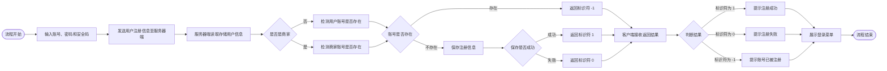

**入驻申请**

影院入驻申请需要输入账号、密码、安全码、影院名称和影院地址。服务器端处理入驻申请请求，处理结果有：申请成功、申请失败、账号／影院重复申请。可以使用标识符来标识：`1` 成功，`0` 失败，`-1` 账号／影院重复申请。

入驻申请流程与注册流程共用同一张流程图，差异只在输入与发送环节，之后汇入注册流程的「服务器端读取存储用户信息」：

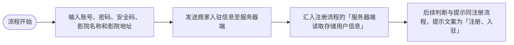

**查看入驻申请**

查看影院入驻申请需要输入影院名称。

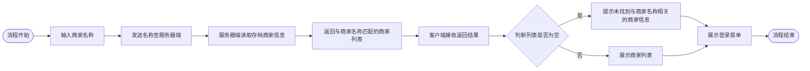

**登录**

登录需要输入账号、密码。服务器端处理登录请求，处理结果有：登录成功、登录失败、账号不存在、账号被冻结、账号正在审批。可以使用标识符来标识：`1` 成功，`0` 失败，`-1` 账号不存在，`2` 账号正在审批，`3` 账号被冻结。服务器端还需要将用户的身份反馈回来，方便客户端展示主菜单。

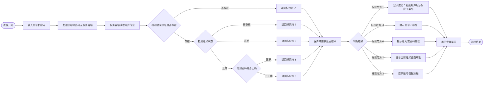

**找回密码**

找回密码需要输入账号、安全码。服务器端处理找回密码请求，处理结果有：安全码正确，返回密码；安全码错误。可以使用标识符来标识：`1` 安全码正确，`0` 安全码错误。

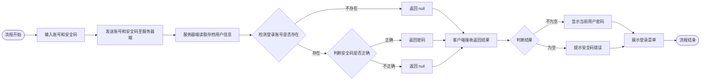

**申请解冻**

申请解冻需要输入账号、解冻原因。服务器端处理申请解冻请求，处理结果有：成功、失败、解冻账号存在未处理的解冻申请、账号所处状态不能进行解冻申请、解冻账号不存在。可以使用标识符来标识：`1` 成功，`0` 失败，`-1` 解冻账号不存在，`-2` 账号所处状态不能进行解冻申请，`-3` 解冻账号存在未处理的解冻申请。

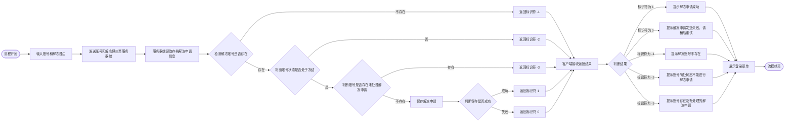

**退出系统**

用户在登录菜单选择「退出」，客户端提示后直接结束程序。

#### 2. 管理员主界面

**商家管理**

**查看商家**：需要输入商家名称（也就是影院名称）。


**审核商家**：需要输入商家账号和审核状态。

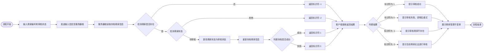

**冻结商家**：需要输入商家编号。

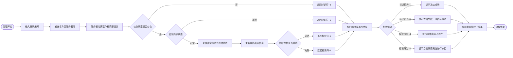

**用户管理（学员完成）**

**查看用户信息**：查看所有用户。

**冻结用户**：需要输入用户名。

**解冻申请管理**

**查看解冻申请**：查看所有解冻申请（学员完成）。

**审批解冻申请**：需要输入解冻申请编号，处理状态。

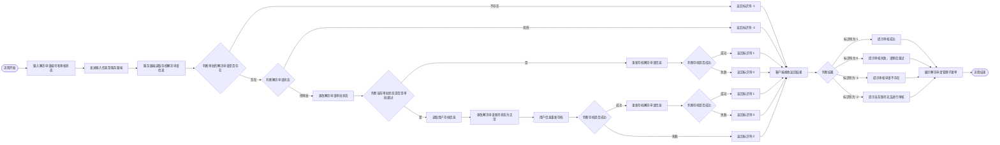

**返回登录**

用户选择「返回登录」，客户端重新展示登录菜单。

#### 3. 商家主界面

**影片管理**

包含影片的增删改查。

**增加影片**：需要输入影片名称、主演、影片描述。

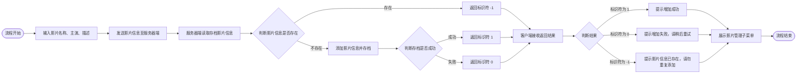

**修改影片**：需要输入影片的编号、影片名称、主演、影片描述。

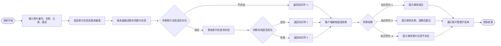

**删除影片**：需要输入影片的编号。

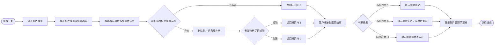

**查看影片**：输入影片名称，可以进行模糊匹配。

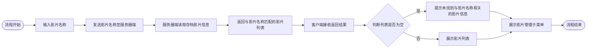

**影厅管理（学员完成）**

包含影厅的增删改查。

- **增加影厅**：需要输入影厅名称、总排数、总列数。
- **修改影厅**：需要输入的编号、影片名称、总排数、总列数。
- **删除影厅**：需要输入影厅的编号。
- **查看影厅**：查看所有影厅信息。

**影片计划管理**

**增加影片计划**：需要输入影片编号、影厅编号、播放日期、开始时间、结束时间。

其中「查看影片子流程」「查看影厅子流程」分别复用「查看影片」「查看影厅」的流程。

```mermaid
flowchart LR
    S(["流程开始"]) --> SUB1["查看影片子流程"]
    SUB1 --> Q1{"判断影片列表是否为空"}
    Q1 -- "是" --> T1["提示无可用影片信息"]
    Q1 -- "否" --> IN1["输入影片编号"]
    IN1 --> GET1["根据编号获取影片信息"]
    GET1 --> SUB2["查看影厅子流程"]
    SUB2 --> Q2{"判断影厅列表是否为空"}
    Q2 -- "是" --> T2["提示无可用影厅信息"]
    Q2 -- "否" --> IN2["输入影厅编号、开始时间、结束时间"]
    IN2 --> GET2["根据编号获取影厅信息"]
    GET2 --> SEND["发送影片计划信息至服务器端"]
    SEND --> READ["服务器端读取影片计划存档信息"]
    READ --> Q3{"判断影片计划时间是否冲突"}
    Q3 -- "冲突" --> R1["返回标识符 -1"]
    Q3 -- "不冲突" --> SAVE["添加影片计划并存档"]
    SAVE --> Q4{"判断存档是否成功"}
    Q4 -- "成功" --> R2["返回标识符 1"]
    Q4 -- "失败" --> R3["返回标识符 0"]
    R1 --> RECV["客户端接收返回结果"]
    R2 --> RECV
    R3 --> RECV
    RECV --> Q5{"判断结果"}
    Q5 -- "标识符为 1" --> P1["提示添加成功"]
    Q5 -- "标识符为 0" --> P2["提示添加失败，请稍后重试"]
    Q5 -- "标识符为 -1" --> P3["提示影片计划时间冲突，请重新拟定"]
    T1 --> SHOW["展示影片计划管理子菜单"]
    T2 --> SHOW
    P1 --> SHOW
    P2 --> SHOW
    P3 --> SHOW
    SHOW --> E(["流程结束"])
```

**修改影片计划**：需要输入影片计划的编号、播放日期、开始时间、结束时间。

```mermaid
flowchart LR
    S(["流程开始"]) --> IN["输入影片计划编号、播放日期、开始时间、结束时间"]
    IN --> SEND["发送输入信息至服务器端"]
    SEND --> READ["服务器端读取存档影片计划信息"]
    READ --> Q1{"判断影片计划是否存在"}
    Q1 -- "不存在" --> R1["返回标识符 -1"]
    Q1 -- "存在" --> M1["修改影片计划"]
    M1 --> Q2{"判断影片计划是否冲突"}
    Q2 -- "冲突" --> R2["返回标识符 -2"]
    Q2 -- "不冲突" --> SAVE["重新存档影片计划信息"]
    SAVE --> Q3{"判断存档是否成功"}
    Q3 -- "成功" --> R3["返回标识符 1"]
    Q3 -- "失败" --> R4["返回标识符 0"]
    R1 --> RECV["客户端接收返回结果"]
    R2 --> RECV
    R3 --> RECV
    R4 --> RECV
    RECV --> Q4{"判断结果"}
    Q4 -- "标识符为 1" --> T1["提示修改成功"]
    Q4 -- "标识符为 0" --> T2["提示修改失败，请稍后重试"]
    Q4 -- "标识符为 -1" --> T3["提示修改影片计划不存在"]
    Q4 -- "标识符为 -2" --> T4["提示修改的影片计划存在时间冲突，修改失败"]
    T1 --> SHOW["展示影片计划管理子菜单"]
    T2 --> SHOW
    T3 --> SHOW
    T4 --> SHOW
    SHOW --> E(["流程结束"])
```

**删除影片计划**：需要输入影片计划的编号（学员完成）。

**查看影片计划**：输入影片名称，可以进行模糊匹配（学员完成）。

**订单管理（学员完成）**

订单查看：只能查看商家自己的订单。

#### 4. 普通用户主界面

**查看订单（学员完成）**

只能查看用户自己的订单。

**修改订单**

只能修改用户自己的订单。

```mermaid
flowchart LR
    S(["流程开始"]) --> IN["输入订单编号"]
    IN --> SUB["查看订单子流程"]
    SUB --> Q0{"判断影片计划是否为空"}
    Q0 -- "是" --> T0["提示暂无影片计划信息"]
    Q0 -- "否" --> SEAT["展示座位信息"]
    SEAT --> IN2["输入排号和列号"]
    IN2 --> Q1{"判断给定座位是否被占用"}
    Q1 -- "是" --> T1["提示选定座位已被他人订购"]
    Q1 -- "否" --> SEND["发送订单编号、排号和列号至服务器端"]
    SEND --> RECV0["服务器端接收发送的消息"]
    RECV0 --> READ["读取存档订单信息"]
    READ --> Q2{"判断修改订单是否存在"}
    Q2 -- "不存在" --> R0["返回标识符 0"]
    Q2 -- "存在" --> M1["更换座位信息"]
    M1 --> M2["影片计划重新存档"]
    M2 --> Q3{"判断存档结果"}
    Q3 -- "成功" --> M3["更改订单座位信息"]
    M3 --> M4["订单信息重新存档"]
    M4 --> Q4{"判断存档结果"}
    Q3 -- "失败" --> R1["返回标识符 0"]
    Q4 -- "成功" --> R2["返回标识符 1"]
    Q4 -- "失败" --> R3["返回标识符 0"]
    R0 --> RECV["客户端接收返回结果"]
    R1 --> RECV
    R2 --> RECV
    R3 --> RECV
    RECV --> Q5{"判断结果"}
    Q5 -- "标识符为 1" --> P1["提示修改成功"]
    Q5 -- "标识符为 0" --> P2["提示修改失败，请稍后重试"]
    T0 --> SHOW["展示我的订单子菜单"]
    P1 --> SHOW
    P2 --> SHOW
    SHOW --> E(["流程结束"])
```

> 💡 补充：原图左上角另有一条「查看订单子流程」的支线，用于从订单编号取出对应的影片计划：判断订单是否存在，不存在返回 `null`；存在则读取影片计划存档信息，再判断订单对应的影片计划是否存在，存在返回影片计划、不存在返回 `null`，最后由客户端接收返回结果并结束。它与「修改订单」主干是并列的两个子流程，这里按主干绘制。

**取消订单**

只能取消用户自己的订单。

```mermaid
flowchart LR
    S(["流程开始"]) --> IN["输入订单编号"]
    IN --> SEND["发送订单编号至服务器端"]
    SEND --> READ["服务器端读取存档订单信息"]
    READ --> Q1{"判断订单是否存在"}
    Q1 -- "不存在" --> R1["返回标识符 -1"]
    Q1 -- "存在" --> Q2{"判断订单是否处于取消状态"}
    Q2 -- "是" --> R2["返回标识符 -2"]
    Q2 -- "否" --> READ2["读取影片计划存档信息"]
    READ2 --> Q3{"判断与订单相关的影片计划是否存在"}
    Q3 -- "不存在" --> R3["返回标识符 -1"]
    Q3 -- "存在" --> C1["取消订购的座位信息"]
    C1 --> C2["重新存档影片计划"]
    C2 --> Q4{"判断存档是否成功"}
    Q4 -- "失败" --> R4["返回标识符 -1"]
    Q4 -- "成功" --> C3["更改订单状态为取消"]
    C3 --> C4["重新存档订单"]
    C4 --> Q5{"判断存档是否成功"}
    Q5 -- "成功" --> R5["返回标识符 1"]
    Q5 -- "失败" --> R6["返回标识符 0"]
    R1 --> RECV["客户端接收返回结果"]
    R2 --> RECV
    R3 --> RECV
    R4 --> RECV
    R5 --> RECV
    R6 --> RECV
    RECV --> Q6{"判断结果"}
    Q6 -- "标识符为 1" --> T1["提示取消订单成功"]
    Q6 -- "标识符为 0" --> T2["提示取消订单失败，请稍后重试"]
    Q6 -- "标识符为 -1" --> T3["提示取消的订单不存在"]
    Q6 -- "标识符为 -2" --> T4["提示当前订单已取消，请勿重复操作"]
    T1 --> SHOW["展示我的订单子菜单"]
    T2 --> SHOW
    T3 --> SHOW
    T4 --> SHOW
    SHOW --> E(["流程结束"])
```

**在线订座**

首先需要查看影票信息（也就是影片计划），然后选择影片计划，展示座位信息，再选择座位。

其中「查看影片计划子流程」为：输入影片名称 → 发送影片名称至服务器端 → 服务器端读取存档影片计划信息 → 返回与影片名称匹配的订单列表 → 客户端接收返回结果 → 流程结束。

```mermaid
flowchart LR
    S(["流程开始"]) --> SUB["查看影片计划子流程"]
    SUB --> Q1{"判断影片计划列表是否为空"}
    Q1 -- "是" --> T1["提示暂无与影片名称相关的影票出售"]
    Q1 -- "否" --> IN1["输入影片计划编号"]
    IN1 --> SEAT["展示座位信息"]
    SEAT --> IN2["输入排号和列号"]
    IN2 --> Q2{"判断给定座位是否被占用"}
    Q2 -- "是" --> T2["提示选定座位已被他人订购"]
    Q2 -- "否" --> SEND["发送影片计划编号、排号和列号至服务器端"]
    SEND --> RECV0["服务器端接收订座信息"]
    RECV0 --> Q3{"判断影片计划是否存在"}
    Q3 -- "不存在" --> R0["返回标识符 0"]
    Q3 -- "存在" --> O1["占用座位"]
    O1 --> O2["创建订单"]
    O2 --> O3["读取存档订单信息"]
    O3 --> O4["添加新的订单信息并重新存档"]
    O4 --> Q4{"判断存档是否成功"}
    Q4 -- "成功" --> R1["返回标识符 1"]
    Q4 -- "失败" --> R2["返回标识符 0"]
    R0 --> RECV["客户端接收返回结果"]
    R1 --> RECV
    R2 --> RECV
    RECV --> Q5{"判断结果"}
    Q5 -- "标识符为 1" --> P1["提示订购成功"]
    Q5 -- "标识符为 0" --> P2["提示订购失败，请稍后重试"]
    T1 --> SHOW["展示可购影票子菜单"]
    P1 --> SHOW
    P2 --> SHOW
    SHOW --> E(["流程结束"])
```
