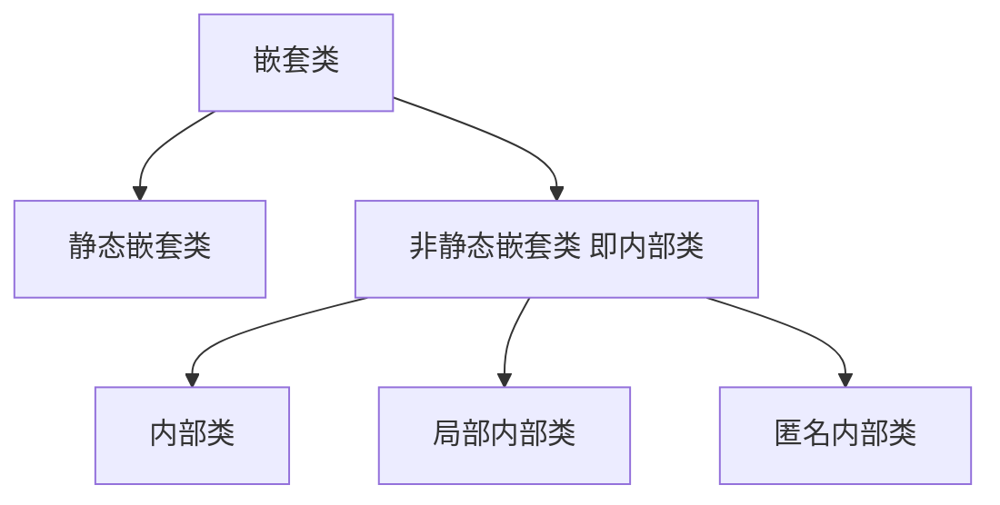

# 补充内容 - 嵌套类及 Lambda 表达式

## 章节内容

| 章节内容 | 要求 |
| :--- | :--- |
| 嵌套类 | 熟悉 |
| Lambda 表达式 | **重点**　难点 |

## 章节目标

- 了解静态嵌套类的定义与使用
- 了解局部内部类的定义与使用
- 熟悉内部类的定义与使用
- 掌握匿名内部类的定义与使用
- 掌握 Lambda 表达式

---

## 第一节 嵌套类

### 1. 概念

**定义**

```text
The Java programming language allows you to define a class within another
class. Such a class is called a nested class
```

Java 编程语言允许你在一个类中定义一个类。这样的类称为嵌套类

**分类**

```text
Nested classes are divided into two categories: static and non-static. Nested
classes that are declared static are called static nested classes. Non-static
nested classes are called inner classes.
```

嵌套类分为两类：静态和非静态。声明为静态的嵌套类称为静态嵌套类。非静态嵌套类称为内部类。

**访问权限**

```text
A nested class is a member of its enclosing class. Non-static nested classes
(inner classes) have access to other members of the enclosing class, even if
they are declared private. Static nested classes do not have access to other
members of the enclosing class. As a member of the OuterClass, a nested class
can be declared private, public, protected, or package private. (Recall that
outer classes can only be declared public or package private.)
```

嵌套类是其外部类的成员。非静态嵌套类（内部类）可以访问外部类的其他成员，即使它们被声明为私有的也可以访问。静态嵌套类无权访问外部类的其他成员。作为 OuterClass 的成员，可以将嵌套类声明为私有、公共、受保护或包私有。（回想一下，外部类只能声明为公共或包私有。）

**嵌套类家族**



### 2. 为什么要使用内部类

当一个事物内部还有其他事物时，使用内部类来描述就显得更加合理。比如计算机包含显卡、主板、CPU，此时就可以使用内部类来描述计算机。

```java
public class Computer {//计算机

    class Mainboard {//主板

    }

    class GPU {//显卡

    }

    class CPU {//CPU

    }
}
```

### 3. 静态嵌套类

```text
As with class methods and variables, a static nested class is associated with
its outer class. And like static class methods, a static nested class cannot
refer directly to instance variables or methods defined in its enclosing
class: it can use them only through an object reference.
```

与类方法和变量一样，静态嵌套类与其外部类相关联。与静态类方法一样，静态嵌套类不能直接引用其外部类中定义的实例变量或方法：它只能通过对象引用来使用它们。

```text
Note: A static nested class interacts with the instance members of its outer
class (and other classes) just like any other top-level class. In effect, a
static nested class is behaviorally a top-level class that has been nested in
another top-level class for packaging convenience.
```

静态嵌套类与它的外部类（和其他类）的实例成员进行交互，就像其他任何顶级类一样。实际上，静态嵌套类在行为上是顶级类，为了包装方便，该顶级类已嵌套在另一个顶级类中。

**示例**

使用静态内部类实现学生管理员对学生按年龄进行排序展示的功能。

```java
package com.cyx.inner.clazz._static;

public class Student {

    private String name;

    private int age;

    public Student(String name, int age) {
        this.name = name;
        this.age = age;
    }

    public int getAge() {
        return age;
    }

    @Override
    public String toString() {
        return "Student{" +
                "name='" + name + '\'' +
                ", age=" + age +
                '}';
    }
}
```

```java
package com.cyx.inner.clazz._static;

import java.util.Arrays;

public class StudentManager {

    private Student[] stus = {};

//    public static void show(){//静态方法，又称之为类方法  类名.方法名()
//
//    }

    public void addStudent(Student stu){
        stus = Arrays.copyOf(stus, stus.length + 1);
        stus[stus.length -1] = stu;
    }

    public void showStudent(StudentSorter sorter){
        sorter.sort(stus);
        for(Student stu: stus){
            System.out.println(stu);
        }
    }

    static class StudentSorter{

        private int order;//排序标志：0-降序排列，1-升序排列

        public StudentSorter() {//无参构造，表示降序排列
            this(0);
        }

        public StudentSorter(int order) {
            this.order = order;
        }

        public void sort(Student[] stus){
            for(int i=0; i<stus.length; i++){
                for(int j=0; j<stus.length - i - 1; j++){
                    int age1 = stus[j].getAge();
                    int age2 = stus[j+1].getAge();
                    if((order == 0 && age1 < age2) || (order == 1 && age1 > age2)){
                        Student temp = stus[j];
                        stus[j] = stus[j+1];
                        stus[j+1] = temp;
                    }
                }
            }
        }
    }
}
```

```java
package com.cyx.inner.clazz._static;

public class StudentTest {

    public static void main(String[] args) {
        StudentManager manager = new StudentManager();
        manager.addStudent(new Student("张三", 20));
        manager.addStudent(new Student("李四", 21));
        manager.addStudent(new Student("王五", 22));
        manager.addStudent(new Student("龙华", 23));
        //静态嵌套类构建对象的语法： new 外部类类名.内部类类名()
        manager.showStudent(new StudentManager.StudentSorter(1));
    }
}
```

> 💡 补充：静态嵌套类构建对象的语法是 `new 外部类类名.内部类类名()`，例如 `new StudentManager.StudentSorter(1)`。

### 4. 内部类

```text
As with instance methods and variables, an inner class is associated with an
instance of its enclosing class and has direct access to that object's
methods and fields. Also, because an inner class is associated with an
instance, it cannot define any static members itself.
```

与实例方法和变量一样，内部类与其所在类的实例相关联，并且可以直接访问该对象的方法和字段。另外，由于内部类与实例相关联，因此它本身不能定义任何静态成员。

**内部类对象创建语法**

```java
外部类类名.内部类类名 对象名 = new 外部类类名().new 内部类类名();
```

**示例**

使用内部类描述一辆汽车拥有一台发动机。

```java
package com.cyx.inner.clazz.inner;

public class Car {//汽车

    private double price;

    private String brand;

    private Engine engine; //汽车拥有的发动机

    public Car(double price, String brand) {
        this.brand = brand;
        this.engine = new Engine("国产", 20000);
        this.price = price + engine.price;
    }

    public Car(Engine engine, String brand, double price){
        this.engine = engine;
        this.brand = brand;
        this.price = price + engine.price;
    }


    public void show(){
        this.engine.show();
    }

    class Engine{ //发动机

        private String type; //发动机类型

        private double price; //发动机价格

        public Engine(String type, double price) {
            this.type = type;
            this.price = price;
        }

        public void show(){
            System.out.println(brand + "汽车使用的是" + type + "发动机，价格为：" + price);
            //如果内部类中存在于外部类同名的成员变量时，想要使用外部类的同名成员变量，需要加上： 外部类类名.this.变量名
            System.out.println("汽车总价为：" + Car.this.price);
        }
    }
}
```

```java
package com.cyx.inner.clazz.inner;

public class CarTest {

    public static void main(String[] args) {
        Car c = new Car(100000, "奥拓");//c是汽车类的成员，因此c对象中有Engine类成员
        c.show();

        Car.Engine engine = new Car(100000, "奥拓").new Engine("进口",50000);

        Car c1 = new Car(engine, "奔驰", 150000);
        c1.show();

        Car.Engine engine1 = c.new Engine("进口", 50000);
        Car c2 = new Car(engine1, "奔驰", 165600);
        c2.show();
    }
}
```

### 5. 局部内部类

```text
Local classes are classes that are defined in a block, which is a group of
zero or more statements between balanced braces. You typically find local
classes defined in the body of a method.
```

局部类是在一个块中定义的类，该块是一组在平衡括号之间的零个或多个语句。通常，你会在方法的主体中找到定义的局部类。

**示例**

使用局部内部类描述使用计算器计算两个数的和。

```java
package com.cyx.inner.clazz.local;

public class LocalClass {

    public static void main(String[] args) {
        int result = calculate(1, 3);
        System.out.println(result);
    }

    public static int calculate(int a, int b){
        class Calculator {
            private int num1,num2;

            public Calculator(int num1, int num2) {
                this.num1 = num1;
                this.num2 = num2;
            }

            public int calculate(){
                return num1 + num2;
            }
        }
        Calculator c = new Calculator(a, b);
        return c.calculate();
    }
}
```

### 6. 匿名内部类

```text
Anonymous classes enable you to make your code more concise. They enable you
to declare and instantiate a class at the same time. They are like local
classes except that they do not have a name. Use them if you need to use a
local class only once.
```

匿名类可以使你的代码更简洁。它们使你在声明一个类的同时实例化它。除了没有名称外，它们类似于局部类。如果只需要使用一次局部类，则使用它们。

```text
The syntax of an anonymous class expression is like the invocation of a
constructor, except that there is a class definition contained in a block of
code.
```

匿名类表达式的语法类似于构造方法的调用，不同之处在于代码块中包含类定义。

**示例**

```java
package com.cyx.inner.clazz.anonymous;

public interface Calculate {

    int calculate(int a, int b);
}
```

```java
package com.cyx.inner.clazz.anonymous;

public abstract class Animal {

    public abstract void eat();
}
```

```java
package com.cyx.inner.clazz.anonymous;

public class Student {

    protected String name;

    protected int age;

    public Student(String name, int age) {
        this.name = name;
        this.age = age;
    }

    public void show(){
        System.out.println(name + "\t" + age);
    }
}
```

```java
package com.cyx.inner.clazz.anonymous;

public class AnonymousClass {

    public static void main(String[] args) {
        int result = calculate(10, 20);
        System.out.println(result);

//        class Tiger extends Animal{
//
//            @Override
//            public void eat() {
//                System.out.println("老虎吃肉");
//            }
//        }
//        Animal tiger = new Tiger();
//        tiger.eat();

        Animal a = new Animal() {
            @Override
            public void eat() {
                System.out.println("老虎吃肉");
            }
        };
        a.eat();

//        class A extends Student{
//
//            public A(String name, int age) {
//                super(name, age);
//            }
//
//            @Override
//            public void show() {
//                System.out.println(age);
//            }
//        }
//        Student s = new A("好奇怪", 20);
//        s.show();

        Student stu = new Student("好奇怪", 20){
            @Override
            public void show() {
                System.out.println(age);
            }
        };
        stu.show();
    }

    public static int calculate(int a, int b){
//        class Calculator implements Calculate{
//
//            @Override
//            public int calculate(int a, int b) {
//                return a + b;
//            }
//        }
//        Calculate calculate = new Calculator();
//        Calculate calculate = new Calculate(){
//
//            @Override
//            public int calculate(int a, int b) {
//                return a + b;
//            }
//        };
        //匿名内部类跟构造方法的调用很相似，不同的地方在于：匿名内部类里面还有类的主体
        Calculate c = new Calculate() {
            @Override
            public int calculate(int a, int b) {
                return a + b;
            }
        };
        return c.calculate(a, b);
    }
}
```

---

## 第二节 Lambda 表达式

### 1. 为什么要使用 Lambda 表达式

```text
One issue with anonymous classes is that if the implementation of your
anonymous class is very simple, such as an interface that contains only one
method, then the syntax of anonymous classes may seem unwieldy and unclear.
In these cases, you're usually trying to pass functionality as an argument to
another method, such as what action should be taken when someone clicks a
button. Lambda expressions enable you to do this, to treat functionality as
method argument, or code as data.
```

匿名类的一个问题是，如果匿名类的实现非常简单，比如仅包含一个方法的接口，则匿名类的语法可能看起来笨拙且不清楚。在这些情况下，你通常试图将功能作为参数传递给另一种方法，例如，当某人单击按钮时应采取什么措施。Lambda 表达式使你能够执行此操作，将功能视为方法参数，或将代码视为数据。

**示例**

```java
package com.cyx.inner.clazz.lambda;

public interface Actor {

    void performance();//表演节目
}
```

```java
package com.cyx.lambda;

public class Test {

    public static void main(String[] args) {
        Actor actor = new Actor() {
            @Override
            public void performance() {
                System.out.println("演员表演节目");
            }
        };
        actor.performance();//执行方法
    }
}
```

> 💡 补充：课件此处把包名简写成了 `com.cyx.lambda`，配套源码中 `Actor` 等类实际位于 `com.cyx.inner.clazz.lambda` 包下。

从上面的代码中可以看出：匿名内部类只是对 Actor 接口的实现，重点是强调其有表演节目的行为。如果能够直接将表演节目的行为赋值给 actor 对象的引用，使得 actor 对象的引用在调用接口方法时直接执行该行为，那么将大大节省代码的编写量。而 Lambda 表达式就能够实现这样的功能。

### 2. Lambda 表达式标准语法

**Lambda 表达式语法**

```java
(参数类型1 变量名1,参数类型2 变量名2,...参数类型n 变量名n) -> {
    //代码块
    [return 返回值;]
};
```

**示例**

```java
package com.cyx.inner.clazz.lambda;

public class ActorTest {

    public static void main(String[] args) {
//        Actor actor = new Actor() {
//            @Override
//            public void performance() {
//                System.out.println("演员表演节目");
//            }
//        };
//        Actor a1 = () -> {
//            System.out.println("演员表演节目");
//        };
        //Lambda表达式
//        Actor actor = () -> {
//            System.out.println("演员表演节目");
//        };
        Actor actor = () -> System.out.println("演员表演节目");
        actor.performance();
    }
}
```

> Lambda 表达式只能使用在只有一个接口方法的接口上。只有一个接口方法的接口称之为函数式接口（Functional Interface）。

**练习**

定义一个接口将任意对象以字符串的形式展示出来。并在测试类中使用 Lambda 表达式完成测试

```java
package com.cyx.inner.clazz.lambda;

public interface Printable {

    void print(Object o);
}
```

```java
package com.cyx.inner.clazz.lambda;

public class PrintableTest {

    public static void main(String[] args) {
//        Printable p = new Printable() {
//            @Override
//            public void print(Object o) {
//                System.out.println(o);
//            }
//        };
        //函数式编程思想
//        Printable p = (Object o) -> {
//            System.out.println(o);
//        };
//        Printable p = (o) -> {
//            System.out.println(o);
//        };
//        Printable p = o -> {
//            System.out.println(o);
//        };
        Printable p = o -> System.out.println(o);
        p.print("这是一个字符串");
    }
}
```

定义一个接口计算两个数的和。并在测试类中使用 Lambda 表达式完成测试

```java
package com.cyx.inner.clazz.lambda;

public interface Calculate {

    int sum(int a, int b);
}
```

```java
package com.cyx.inner.clazz.lambda;

public class CalculateTest {

    public static void main(String[] args) {
//        Calculate  c = new Calculate() {
//            @Override
//            public int sum(int a, int b) {
//                return a + b;
//            }
//        };
//        Calculate c = (int a, int b) -> {
//            return a + b;
//        };
//        Calculate c = (a, b) -> {
//            return a + b;
//        };
        Calculate c = (a, b) -> a + b;

        int result = c.sum(1, 5);
        System.out.println(result);
    }
}
```

### 3. Lambda 表达式省略规则

- `()` 中的所有参数类型可以省略
- 如果 `()` 中有且仅有一个参数，那么 `()` 可以省略
- 如果 `{}` 中有且仅有一条语句，那么 `{}` 可以省略，这条语句后的分号也可以省略。如果这条语句是 `return` 语句，那么 `return` 关键字也可以省略

**示例**

编写一个接口，打印系统当前时间。并在测试类中使用 Lambda 表达式完成测试

```java
package com.cyx.inner.clazz.lambda;

public interface PrintTime {

    void printTime();
}
```

```java
package com.cyx.inner.clazz.lambda;

public class PrintTimeTest {

    public static void main(String[] args) {
//        PrintTime p = new PrintTime() {
//            @Override
//            public void printTime() {
//                System.out.println(System.currentTimeMillis());
//            }
//        };

//        PrintTime p = () -> {
//            System.out.println(System.currentTimeMillis());
//        };
        PrintTime p = () -> System.out.println(System.currentTimeMillis());
        p.printTime();
    }
}
```

编写一个接口，获取一个指定范围内的随机数。并在测试类中使用 Lambda 表达式完成测试

```java
package com.cyx.inner.clazz.lambda;

public interface RandomNumber {

    int getRandomNumber(int start, int end);
}
```

```java
package com.cyx.inner.clazz.lambda;

import java.util.Random;

public class RandomNumberTest {

    public static void main(String[] args) {
//        RandomNumber r = new RandomNumber() {
//            @Override
//            public int getRandomNumber(int start, int end) {
////                int diff = end - start;
//                return (int)(Math.random() * (end - start)) + start;
//            }
//        };

//        RandomNumber r = (int start, int end) -> {
//            return (int)(Math.random() * (end - start)) + start;
//        };

//        RandomNumber r = (start, end) -> {
//            return (int)(Math.random() * (end - start)) + start;
//        };
        RandomNumber r = (start, end) ->  (int)(Math.random() * (end - start)) + start;
        System.out.println(r.getRandomNumber(10, 20));

//        Random random = new Random();
//       int result = random.nextInt(10) + 10;

        RandomNumber r1 = (start, end) ->  new Random().nextInt(end - start) + start;
        System.out.println(r1.getRandomNumber(10, 20));
    }
}
```
