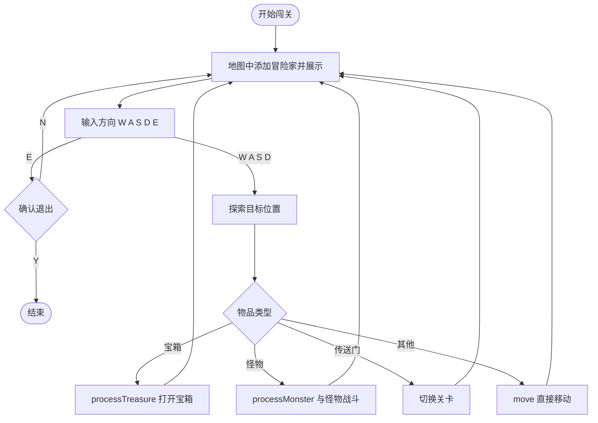

# 阶段项目 —— 宠物小精灵

> 本项目按实现步骤逐步搭建：PDF 中同一个类会反复出现、每次只补一点代码。为便于阅读，本章**每一步只列出该步新增或改动的关键代码**，完整类只在首次出现或最终版本处用配套源码注入一次，不再重复贴全量代码。
>
> 多态在本项目中的体现：`DisplayItem` 接口 + `Item` 抽象父类，宝箱、怪物、传送门、药品、装备、宠物小精灵都以上层类型统一处理；战斗、掉落、换装等逻辑大量使用 `instanceof` 与父类引用。

---

## 需求分析

冒险家携带宠物小精灵闯关，每一关卡都有对应的地图，地图随机生成，上面包含有宝箱、怪物和传送门，比例为 39:39:1，宝箱可以开出药品、装备或宠物小精灵，比例为 6:3:1。冒险家可以在地图上移动，每移动一步就会遇到宝箱、怪物或传送门。如果遇到宝箱，可以选择打开与否；如果遇到怪物，则需要选择携带的小精灵与之对抗，成功击杀怪物后会随机掉落装备、药品和宠物小精灵，掉落比例为 7:2:1。如果遇到传送门，则可以选择是否向传送门移动，如果向传送门移动，可以传送至对应的关卡。

### 说明

**药品**：可以用来恢复血量，每一关卡的药品不同，恢复的血量也不同，药品可以堆叠。

**装备**：可以给携带的宠物小精灵穿戴，增加宠物小精灵的攻击、防御、血量。

| 部位 | 攻击 | 防御 | 血量 |
| :--- | :---: | :---: | :---: |
| 头盔 | | ✓ | ✓ |
| 铠甲 | | ✓ | ✓ |
| 护腿 | | ✓ | ✓ |
| 鞋子 | | ✓ | ✓ |
| 戒指 | ✓ | ✓ | ✓ |
| 项链 | ✓ | ✓ | ✓ |
| 手镯 | ✓ | ✓ | ✓ |
| 武器 | ✓ | | ✓ |

所有装备的属性均根据关卡来随机生成，可能出现极品装备，也可能出现垃圾装备。

**宠物小精灵**：可以穿戴装备，最多只能穿戴 8 件装备，每个部位只能穿戴一件。

| 宠物小精灵 | 等级 | 攻击 | 防御 | 血量 |
| :--- | :--- | :---: | :---: | :---: |
| 妙蛙种子 Bulbasaur | 初级 | 60 | 40 | 600 |
| 雷精灵 Jolteon | 中级 | 80 | 60 | 800 |
| 小火龙 Charmander | 高级 | 100 | 80 | 1000 |
| 比卡丘 Bikachu | 究级 | 150 | 100 | 2000 |

所有同类宠物小精灵初始属性（攻击、防御、血量）相同，同类宠物小精灵可以进行融合升星，以提升宠物小精灵的初始属性。每次融合能提升初始属性的 50%，同类宠物小精灵最多融合 10 次。

**怪物**：可以阻挡冒险家探索地图，冒险家需要使用携带的宠物小精灵与之对抗，将其击杀后方可继续探索地图。怪物被击杀后会掉落装备、药品或者宠物小精灵。

| 怪物 | 等级 | 攻击（范围） | 防御（范围） | 血量（范围） |
| :--- | :--- | :--- | :--- | :--- |
| 象牙猪 Mamoswine | 初级 | 45 ~ 55 | 35 ~ 45 | 600 ~ 800 |
| 牛魔怪 CattleMonster | 中级 | 50 ~ 60 | 40 ~ 50 | 700 ~ 900 |
| 铁炮鱼 Ramoraid | 高级 | 60 ~ 70 | 50 ~ 60 | 900 ~ 1100 |
| 火焰鸟 Moltres | 究级 | 80 ~ 100 | 70 ~ 90 | 1400 ~ 1800 |

所有怪物的初始属性均根据关卡来随机生成。

**传送门**：可以返回上一关卡，也可以前往下一关卡。

**地图**：地图大小为 9x9，共 81 个格子。第一关卡的地图上只有 1 个传送门，通往下一关卡；其余关卡均有两个传送门，返回上一关卡的传送门位于地图的第一个位置，前往下一关卡的传送门位置随机。冒险家闯关时，如果是第一关，则位于地图的第一个位置，第二个位置为初级怪物象牙猪；其余关卡，冒险家位于第二个位置。地图为加密地图，冒险家不知道地图上到底有什么。当冒险家探索某一位置地图时，该位置地图才具体显示；冒险家探索完成的地图显示为空白，以区分未探索的地图。

冒险家探索完第二个位置后，第二个位置显示为空白，示意如下（`♀` 为冒险家）：

| 行 \ 列 | 0 | 1 | 2 | 3 | 4 | 5 | 6 | 7 | 8 |
| :---: | :---: | :---: | :---: | :---: | :---: | :---: | :---: | :---: | :---: |
| **0** | | ♀ | ■ | ■ | ■ | ■ | ■ | ■ | ■ |
| **1** | ■ | ■ | ■ | ■ | ■ | ■ | ■ | ■ | ■ |
| **2** | ■ | ■ | ■ | ■ | ■ | ■ | ■ | ■ | ■ |
| **3** | ■ | ■ | ■ | ■ | ■ | ■ | ■ | ■ | ■ |
| **4** | ■ | ■ | ■ | ■ | ■ | ■ | ■ | ■ | ■ |
| **5** | ■ | ■ | ■ | ■ | ■ | ■ | ■ | ■ | ■ |
| **6** | ■ | ■ | ■ | ■ | ■ | ■ | ■ | ■ | ■ |
| **7** | ■ | ■ | ■ | ■ | ■ | ■ | ■ | ■ | ■ |
| **8** | ■ | ■ | ■ | ■ | ■ | ■ | ■ | ■ | ■ |

**冒险家**：冒险家携带背包闯关，背包中可以容纳装备、药品以及小精灵，默认有 10 个药品、1 个妙蛙种子。冒险家闯关时可以使用 W(上)、A(左)、S(下)、D(右) 四个键在地图上移动，使用 E(退出)。

### 各类比例汇总

| 场景 | 比例 |
| :--- | :--- |
| 地图上的 宝箱 : 怪物 : 传送门 | 39 : 39 : 1 |
| 宝箱开出 药品 : 装备 : 宠物小精灵 | 6 : 3 : 1 |
| 怪物掉落 装备 : 药品 : 宠物小精灵 | 7 : 2 : 1 |
| 怪物等级 初级 : 中级 : 高级 : 究级 | 18 : 12 : 6 : 3 |
| 宠物小精灵 初级 : 中级 : 高级 : 究级 | 80 : 15 : 4 : 1 |
| 装备种类 武器 : 项链 : 戒指 : 手镯 : 头盔 : 铠甲 : 护腿 : 鞋子 | 3 : 5 : 8 : 8 : 19 : 19 : 19 : 19 |

> 💡 补充：需求说明中「怪物掉落比例为 7 : 2 : 1」，但源码里宝箱与怪物掉落都调用同一个 `Tools.getRandomItem()`，实际比例为 药品 : 装备 : 宠物小精灵 = 6 : 3 : 1（以源码为准）。
>
> 💡 补充：需求说明「最多融合 10 次」，而源码中星级从 1 星升到 10 星即停止，实际最多融合 9 次。

### 类结构图

粉色为接口、深绿色为抽象类、浅绿色为普通类。箭头方向表示「被实现」或「被继承」。

```mermaid
flowchart TD
    DisplayItem(["接口 DisplayItem 展示物品"])
    Item["抽象类 Item 物品"]
    Equipment["抽象类 Equipment 装备"]
    Monster["抽象类 Monster 怪物"]
    Pokemon["抽象类 Pokemon 宠物小精灵"]
    Treasure["Treasure 宝箱"]
    Portal["Portal 传送门"]
    HP["HP 药品"]
    Helmet["Helmet 头盔"]
    Armor["Armor 铠甲"]
    Leggings["Leggings 护腿"]
    Shoe["Shoe 鞋子"]
    Weapon["Weapon 武器"]
    Necklace["Necklace 项链"]
    Ring["Ring 戒指"]
    Bracelet["Bracelet 手镯"]
    Bulbasaur["Bulbasaur 妙蛙种子"]
    Jolteon["Jolteon 雷精灵"]
    Charmander["Charmander 小火龙"]
    Bikachu["Bikachu 比卡丘"]
    Mamoswine["Mamoswine 象牙猪"]
    CattleMonster["CattleMonster 牛魔怪"]
    Ramoraid["Ramoraid 铁炮鱼"]
    Moltres["Moltres 火焰鸟"]
    Adventurer["Adventurer 冒险家"]
    Level["Level 关卡"]
    LevelMap["LevelMap 关卡地图"]
    Tools["Tools 工具类"]
    Launcher["Launcher 启动类"]

    DisplayItem --> Item
    DisplayItem --> Adventurer
    Item --> Equipment
    Item --> Monster
    Item --> Pokemon
    Item --> Treasure
    Item --> Portal
    Item --> HP
    Equipment --> Helmet
    Equipment --> Armor
    Equipment --> Leggings
    Equipment --> Shoe
    Equipment --> Weapon
    Equipment --> Necklace
    Equipment --> Ring
    Equipment --> Bracelet
    Pokemon --> Bulbasaur
    Pokemon --> Jolteon
    Pokemon --> Charmander
    Pokemon --> Bikachu
    Monster --> Mamoswine
    Monster --> CattleMonster
    Monster --> Ramoraid
    Monster --> Moltres
    Level --> LevelMap
```



> 💡 补充：课件类结构图中「铁炮鱼」的类名写作 `Remoraid`，而配套源码中的类名是 `Ramoraid`，本章统一以源码为准。
>
> 💡 补充：`Tools` 与 `Launcher` 不参与这棵继承树，单独作为工具类与启动类存在。

---

## 实现步骤

### 1. 接口设计

地图上物品信息会加密，被探索之后会显示出来，可以使用接口来完成约定。

**代码实现（DisplayItem 接口）**

```java
package com.cyx.pokemon;

/**
 * 物品显示接口
 */
public interface DisplayItem {

    /**
     * 获取物品信息
     * @return
     */
    String getItemInformation();

}
```

所有物品必须遵守这个约定。此时宝箱、怪物、传送门三个类都直接实现该接口，`getItemInformation()` 统一返回 `■`，以宝箱为例：

```java
package com.cyx.pokemon.item;

import com.cyx.pokemon.DisplayItem;

/**
 * 宝箱
 */
public class Treasure implements DisplayItem {

    @Override
    public String getItemInformation() {
        return "■";
    }
}
```

（`Monster`、`Portal` 在本步的写法与 `Treasure` 完全一致，只是类名不同，不再重复。）

### 2. 展示物品设计

冒险家探索地图时，物品信息会具体显示。换言之，冒险家探索到某物品时，该物品展示具体信息，探索完成后，该物品展示信息为空白。每一个物品都具有这样的特性；除此之外，物品大多数都与关卡有关，物品都有名称，因此可以利用继承的特性来实现。每一种物品展示的信息不一样，因此父类只能设计为抽象类。

**代码实现（Item 抽象类）**

```java
package com.cyx.pokemon.item;

import com.cyx.pokemon.DisplayItem;

/**
 * 物品
 */
public abstract class Item implements DisplayItem {

    /**
     * 物品名称
     */
    protected String name;
    /**
     * 关卡编号
     */
    protected int levelNumber;
    /**
     * 是否被探索
     */
    protected boolean discovery;

    public int getLevelNumber() {
        return levelNumber;
    }

    public Item(String name) {
        this.name = name;
    }

    public Item(String name, int levelNumber) {
        this.name = name;
        this.levelNumber = levelNumber;
    }

    public void setDiscovery(boolean discovery) {
        this.discovery = discovery;
    }

    public String getName() {
        return name;
    }
}
```

各物品由「实现 `DisplayItem`」改为「继承 `Item`」，只需覆写 `getItemInformation()`。以传送门为例：

**代码实现（Portal）**

```java
package com.cyx.pokemon.item;

import com.cyx.pokemon.DisplayItem;

/**
 * 传送门
 */
public class Portal extends Item {
    /**
     * 是否是通往下一关卡的传送门
     */
    private boolean next;

    public Portal(boolean next) {
        super("传送门");
        this.next = next;
    }

    public boolean isNext() {
        return next;
    }

    @Override
    public String getItemInformation() {
        if(discovery){
            return next ? "→" : "←";
        }
        return "■";
    }
}
```

### 3. 传送门分析

传送门有两个方向，一个是返回上一关卡，一个是前往下一关卡，可以使用布尔类型的变量进行控制。具体实现见上一节的 `Portal`。

### 4. 宝箱分析

宝箱可以开出药品、装备或者宠物小精灵，比例为 6:3:1。因为此时药品、装备、小精灵还未设计，所以暂时先写简单的逻辑骨架：

```java
/**
 * 开启宝箱能够获得一个物品
 * @return
 */
public Item open(){
    Random r = new Random();
    //取[0, 10)范围内的随机数
    int number = r.nextInt(10);
    if(number == 0){//获得宠物小精灵

    } else if(number <= 3){//获得装备

    } else {//获得药品

    }
    return null;
}
```

（待第 7 节药品、装备、宠物小精灵全部设计完成后，`open()` 再改为调用 `Tools.getRandomItem()`。）

### 5. 药品分析

恢复血量与关卡有关，药品可以堆叠。

**代码实现（HP）**

```java
package com.cyx.pokemon.item;

/**
 * 药品：回复血量
 */
public class HP extends Item{

    private int count;

    public HP(int levelNumber, int count) {
        super("天山雪莲", levelNumber);
        this.count = count;
    }

    /**
     * 使用药品可以回复血量
     * @return
     */
    public int use(){
        count--;
        return levelNumber * 500;
    }

    public int getCount() {
        return count;
    }

    /**
     * 堆叠药品
     * @param count
     */
    public void addCount(int count){
        this.count += count;
    }

    /**
     * 检测药品是否可以被销毁
     * @return
     */
    public boolean canDestroy(){
        return count == 0;
    }

    @Override
    public String getItemInformation() {
        return name;
    }
}
```

### 6. 装备分析

装备有 8 种，因此装备可以设计为抽象类。每一种装备具有攻击、防御、血量三种属性，属性值与关卡有关且属性随机。

先准备工具类（随机数、控制台输入、延时、随机物品等）：

**代码实现（Tools 工具类）**

```java
package com.cyx.pokemon.util;

import com.cyx.pokemon.item.HP;
import com.cyx.pokemon.item.Item;
import com.cyx.pokemon.item.equipment.*;
import com.cyx.pokemon.item.pokemon.Bikachu;
import com.cyx.pokemon.item.pokemon.Bulbasaur;
import com.cyx.pokemon.item.pokemon.Charmander;
import com.cyx.pokemon.item.pokemon.Jolteon;

import java.io.IOException;
import java.util.Random;
import java.util.Scanner;

/**
 * 工具类
 */
public class Tools {
    /**
     * 随机数对象
     */
    private static final Random RANDOM = new Random();
    /**
     * 输入对象
     */
    private static final Scanner SCANNER = new Scanner(System.in);

    /**
     * 从控制台获取一个字符
     * @return
     */
    public static char getInputChar(){
        while (true){
            String input = SCANNER.next().trim();
            if(input.length() != 1){
                System.out.println("输入错误，请重新输入");
            } else {
                return input.charAt(0);
            }
        }
    }

    /**
     * 从控制台获取给定范围内的数字
     * @param min 最小值
     * @param max 最大值
     * @return
     */
    public static int getInputNumber(int min, int max){
        while (true){
            if(SCANNER.hasNextInt()){
                int num = SCANNER.nextInt();
                if(num >= min && num <= max){
                    return num;
                } else {
                    System.out.println("输入错误，请输入" + min + "~" + max + "之间的整数");
                }
            } else {
                System.out.println("输入错误，请输入" + min + "~" + max + "之间的整数");
                SCANNER.next();
            }
        }
    }

    /**
     * 延迟给定时间
     * @param time 时间
     */
    public static void lazy(long time){
        try {
            Thread.sleep(time);
        } catch (InterruptedException e) {
            e.printStackTrace();
        }
    }
    /**
     *获取给定范围内的随机数
     * @param min 最小值
     * @param max 最大值
     * @param levelNumber 关卡编号
     * @return
     */
    public static int getRandomNumber(int min, int max, int levelNumber){
        int diff = (max - min) * levelNumber;
        return RANDOM.nextInt(diff) + min * levelNumber;
    }

    /**
     *获取给定范围内的随机数
     * @param min 最小值
     * @param max 最大值
     * @return
     */
    public static int getRandomNumber(int min, int max){
        return getRandomNumber(min, max, 1);
    }

    /**
     *获取给定范围内的随机数
     * @param max 最大值
     * @return
     */
    public static int getRandomNumber(int max){
        return getRandomNumber(0, max);
    }

    /**
     * 获取一个随机物品
     * @param levelNumber 关卡编号
     * @return
     */
    public static Item getRandomItem(int levelNumber){
        //取[0, 10)范围内的随机数
        int number = Tools.getRandomNumber(10);
        if(number == 0){//获得宠物小精灵，
            //比例 初级：中级：高级：究级 = 80:15:4:1
            int rate = Tools.getRandomNumber(100);
            if(rate == 0){//究级宠物小精灵=>比卡丘
                return new Bikachu();
            } else if(rate <= 4){//高级宠物小精灵 => 小火龙
                return new Charmander();
            } else if(rate <= 20){//中级宠物小精灵 => 雷精灵
                return new Jolteon();
            } else {//初级宠物小精灵
                return new Bulbasaur();
            }
        } else if(number <= 3){//获得装备
            //比例  武器：项链：戒指：手镯：头盔：铠甲：护腿：鞋子 = 3:5:8:8:19:19:19:19
            int rate = Tools.getRandomNumber(100);
            if(rate < 3){//武器
                return new Weapon(levelNumber);
            } else if(rate < 8){//项链
                return new Necklace(levelNumber);
            } else if(rate < 16){//戒指
                return new Ring(levelNumber);
            } else if(rate < 24){//手镯
                return new Bracelet(levelNumber);
            } else if(rate < 43){//头盔
                return new Helmet(levelNumber);
            } else if(rate < 62){//铠甲
                return new Armor(levelNumber);
            } else if(rate < 81){//护腿
                return new Leggings(levelNumber);
            } else {//鞋子
                return new Shoe(levelNumber);
            }
        } else {//获得药品
            return new HP(levelNumber, 10);
        }
    }
}
```

**代码实现（Equipment 抽象类）**

```java
package com.cyx.pokemon.item.equipment;

import com.cyx.pokemon.item.Item;

/**
 * 装备
 */
public abstract class Equipment extends Item {
    /**
     * 攻击力
     */
    protected int attack;
    /**
     * 防御力
     */
    protected int defense;
    /**
     * 生命值
     */
    protected int health;

    public Equipment(String name, int levelNumber) {
        super(name, levelNumber);
    }

    public int getAttack() {
        return attack;
    }

    public int getDefense() {
        return defense;
    }

    public int getHealth() {
        return health;
    }

    @Override
    public String getItemInformation() {
        return name + "：攻击=" + attack + " 防御=" + defense + " 生命值=" + health;
    }

    /**
     * 是否比其他装备好
     * @param other
     * @return
     */
    public boolean isBetter(Equipment other){
        //首先必须保证是同类型装备
        if(this.getClass() == other.getClass()){
            int total1 = this.attack + this.defense + this.health >> 1;
            int total2 = other.attack + other.defense + other.health >> 1;
            return total1 > total2;
        }
        return false;
    }
}
```

8 种具体装备的写法一致，只是名称与随机范围不同：

```java
package com.cyx.pokemon.item.equipment;

import com.cyx.pokemon.util.Tools;

/**
 * 头盔
 */
public class Helmet extends Equipment{

    public Helmet(int levelNumber) {
        super("头盔", levelNumber);
        this.attack = 0;
        this.defense = Tools.getRandomNumber(20, 30, levelNumber);
        this.health = Tools.getRandomNumber(100, 150, levelNumber);
    }
}
```

```java
package com.cyx.pokemon.item.equipment;

import com.cyx.pokemon.util.Tools;

/**
 * 铠甲
 */
public class Armor extends Equipment{

    public Armor(int levelNumber) {
        super("铠甲", levelNumber);
        this.attack = 0;
        this.defense = Tools.getRandomNumber(40, 50, levelNumber);
        this.health = Tools.getRandomNumber(200, 250, levelNumber);
    }
}
```

```java
package com.cyx.pokemon.item.equipment;

import com.cyx.pokemon.util.Tools;

/**
 * 护腿
 */
public class Leggings extends Equipment{

    public Leggings(int levelNumber) {
        super("护腿", levelNumber);
        this.attack = 0;
        this.defense = Tools.getRandomNumber(30, 40, levelNumber);
        this.health = Tools.getRandomNumber(150, 200, levelNumber);
    }
}
```

```java
package com.cyx.pokemon.item.equipment;

import com.cyx.pokemon.util.Tools;

/**
 * 鞋子
 */
public class Shoe extends Equipment{

    public Shoe(int levelNumber) {
        super("鞋子", levelNumber);
        this.attack = 0;
        this.defense = Tools.getRandomNumber(10, 20, levelNumber);
        this.health = Tools.getRandomNumber(80, 100, levelNumber);
    }
}
```

```java
package com.cyx.pokemon.item.equipment;

import com.cyx.pokemon.util.Tools;

/**
 * 武器
 */
public class Weapon extends Equipment{

    public Weapon(int levelNumber) {
        super("武器", levelNumber);
        this.attack = Tools.getRandomNumber(100, 150, levelNumber);
        this.defense = 0;
        this.health = Tools.getRandomNumber(250, 300, levelNumber);
    }
}
```

```java
package com.cyx.pokemon.item.equipment;

import com.cyx.pokemon.util.Tools;

/**
 * 项链
 */
public class Necklace extends Equipment{

    public Necklace(int levelNumber) {
        super("项链", levelNumber);
        this.attack = Tools.getRandomNumber(25, 35, levelNumber);
        this.defense = Tools.getRandomNumber(25, 35, levelNumber);
        this.health = Tools.getRandomNumber(120, 180, levelNumber);
    }
}
```

```java
package com.cyx.pokemon.item.equipment;

import com.cyx.pokemon.util.Tools;

/**
 * 戒指
 */
public class Ring extends Equipment{

    public Ring(int levelNumber) {
        super("戒指", levelNumber);
        this.attack = Tools.getRandomNumber(20, 30, levelNumber);
        this.defense = Tools.getRandomNumber(20, 20, levelNumber);
        this.health = Tools.getRandomNumber(100, 200, levelNumber);
    }
}
```

```java
package com.cyx.pokemon.item.equipment;

import com.cyx.pokemon.util.Tools;

/**
 * 手镯
 */
public class Bracelet extends Equipment{

    public Bracelet(int levelNumber) {
        super("手镯", levelNumber);
        this.attack = Tools.getRandomNumber(20, 30, levelNumber);
        this.defense = Tools.getRandomNumber(20, 20, levelNumber);
        this.health = Tools.getRandomNumber(100, 200, levelNumber);
    }
}
```

> 💡 补充：按 `Tools.getRandomNumber(min, max, levelNumber)` 的实现（`diff = (max - min) * levelNumber`，再 `nextInt(diff)`），当 `min` 与 `max` 相等时 `diff` 为 0，`RANDOM.nextInt(0)` 会抛出 `IllegalArgumentException`。源码中戒指 `Ring`、手镯 `Bracelet` 的防御值就是 `getRandomNumber(20, 20, levelNumber)`，运行到这两种装备时会出问题；这类「固定值」写成直接赋值更稳妥。

### 7. 宠物小精灵分析

可以穿戴装备，最多只能穿戴 8 件装备，每个部位只能穿戴一件。宠物小精灵有 4 种类型，每一种都有名字，同类宠物小精灵都可以进行融合升星，升星提升初始属性 50%。因此宠物小精灵应设计为抽象类。

**初版骨架**：定义攻击、防御、血量、星级四个属性与 8 个装备位，并提供融合方法。

```java
public abstract class Pokemon extends Item {
    /** 攻击力 */
    protected int attack;
    /** 防御力 */
    protected int defense;
    /** 生命值 */
    protected int health;
    /** 星级，默认1星 */
    private int star = 1;
    /**
     * 宠物小精灵能够穿戴8件装备，默认是没有穿戴任何装备
     * 穿戴顺序：头盔、铠甲、护腿、鞋子、武器、项链、戒指、手镯
     */
    private Equipment[] equipments = new Equipment[8];

    public Pokemon(String name) {
        super(name);
    }

    @Override
    public String getItemInformation() {
        return name + "：攻击=" + attack + " 防御=" + defense + " 生命值=" + health;
    }

    /**
     * 与其他小精灵融合
     * @param other 其他小精灵
     */
    public void merge(Pokemon other){
        if(star == 10){
            System.out.println(name + "星级已满，无法再融合升星");
        } else {
            this.attack += (other.attack >> 1);
            this.defense += (other.defense >> 1);
            this.health += (other.health >> 1);
            star += 1;
            System.out.println("融合成功");
            System.out.println(getItemInformation());
        }
    }
}
```

> 💡 补充：`>> 1` 相当于除以 2，即「提升初始属性的 50%」。

**更换装备（初版）**：按装备类型定位到对应部位，若该部位未穿戴则直接穿上，否则先记录旧装备。

```java
public Equipment changeEquipment(Equipment newEquipment){
    int index;
    if(newEquipment instanceof Helmet){//头盔
        index = 0;
    } else if(newEquipment instanceof Armor){//铠甲
        index = 1;
    } else if(newEquipment instanceof Leggings){//护腿
        index = 2;
    } else if(newEquipment instanceof Shoe){//鞋子
        index = 3;
    } else if(newEquipment instanceof Weapon){//武器
        index = 4;
    } else if(newEquipment instanceof Necklace){//项链
        index = 5;
    } else if(newEquipment instanceof Ring){//戒指
        index = 6;
    } else {//手镯
        index = 7;
    }
    //旧装备
    Equipment old = equipments[index];
    if(old == null){//未穿戴装备
        equipments[index] = newEquipment;
    } else {//已经穿戴装备

    }
    return old;
}
```

换装前应该比较新装备是否比旧装备好，因此需要在装备类 `Equipment` 中添加装备比较的方法：

```java
/**
 * 是否比其他装备好
 * @param other
 * @return
 */
public boolean isBetter(Equipment other){
    //首先必须保证是同类型装备
    if(this.getClass() == other.getClass()){
        int total1 = this.attack + this.defense + this.health >> 1;
        int total2 = other.attack + other.defense + other.health >> 1;
        return total1 > total2;
    }
    return false;
}
```

> 💡 补充：`+` 的优先级高于 `>>`，所以 `this.attack + this.defense + this.health >> 1` 是「先求和、再右移一位」，等价于 `(攻击 + 防御 + 生命值) / 2`，即按三项属性之和的一半来比较优劣。

**更换装备（修改）**：已经穿戴装备时，只有新装备更好才替换，否则把新装备当作「换下来的旧装备」返回，由背包回收。

```java
if(old == null){//未穿戴装备
    equipments[index] = newEquipment;
} else {//已经穿戴装备
    //新装备比旧装备好
    if(newEquipment.isBetter(old)){
        equipments[index] = newEquipment;
    } else {
        old = newEquipment;
    }
}
return old;
```

换装后，宠物小精灵的攻击、防御、血量会发生改变，但不能改变宠物小精灵本身的属性。因此获取攻击、防御和血量时，应该将宠物小精灵本身的属性 + 所穿戴装备的属性：

```java
public int getAttack() {
    int totalAttack = attack;
    for(Equipment equipment: equipments){
        if(equipment != null)
            totalAttack += equipment.getAttack();
    }
    return totalAttack;
}

public int getDefense() {
    int totalDefense = defense;
    for(Equipment equipment: equipments){
        if(equipment != null)
            totalDefense += equipment.getDefense();
    }
    return totalDefense;
}

public int getHealth() {
    int totalHealth = health;
    for(Equipment equipment: equipments){
        if(equipment != null)
            totalHealth += equipment.getHealth();
    }
    return totalHealth;
}

@Override
public String getItemInformation() {
    return name + "：攻击=" + getAttack() + " 防御=" + getDefense() + " 生命值=" + getHealth();
}
```

4 种具体宠物小精灵只需在构造方法中给出初始属性，以妙蛙种子为例：

```java
package com.cyx.pokemon.item.pokemon;

/**
 * 妙蛙种子
 */
public class Bulbasaur extends Pokemon{
    public Bulbasaur() {
        super("妙蛙种子");
        this.attack = 60;
        this.defense = 40;
        this.health = 600;
    }
}
```

（`Charmander`、`Bikachu`、`Jolteon` 写法相同，仅名称与数值不同；它们的最终版本见第 8 节。）

到此，宝箱 `Treasure` 打开的物品都已经设计，可以实现宝箱开启功能：

**代码实现（Treasure）**

```java
package com.cyx.pokemon.item;

import com.cyx.pokemon.util.Tools;

/**
 * 宝箱
 */
public class Treasure extends Item {

    public Treasure(int levelNumber) {
        super("宝箱", levelNumber);
    }

    /**
     * 开启宝箱能够获得一个物品
     * @return
     */
    public Item open(){
        return Tools.getRandomItem(levelNumber);
    }

    @Override
    public String getItemInformation() {
        return discovery ? "۞" : "■";
    }
}
```

### 8. 怪物分析

可以阻挡冒险家探索地图。怪物会与宠物小精灵对抗，也就是会攻击宠物小精灵。

**攻击宠物小精灵（初版）**：伤害 = 攻击力 × 攻击力 ÷ 对方防御力，为 0 时保底调整为 1。

```java
/**
 * 攻击宠物小精灵
 * @param pokemon 宠物小精灵
 */
public void attackPokemon(Pokemon pokemon){
    int minusHealth = this.attack * this.attack / pokemon.getDefense();
    if(minusHealth == 0) {//伤害为0，需要调整
        minusHealth = 1; //调整伤害为1点
    }
    pokemon.setHealth(pokemon.getHealth() - minusHealth);
    System.out.println(name + "对" + pokemon.getName() + "发动攻击，造成了" + minusHealth + "伤害");
}
```

这样设计存在问题：怪物攻击宠物小精灵时，宠物小精灵的血量总值一直在减少，但是却无法使用药品恢复血量。因此，需要在宠物小精灵类 `Pokemon` 中添加一个新的变量来记录宠物小精灵的当前血量，并提供获取和更改血量的方法。所有宠物小精灵类都需要做相应的修改。

```java
/**
 * 当前生命值
 */
protected int currentHealth;

public void setHealth(int health) {
    this.health = health;
}

public int getCurrentHealth() {
    return currentHealth;
}

public void setCurrentHealth(int currentHealth) {
    this.currentHealth = currentHealth;
}
```

怪物会攻击宠物小精灵，宠物小精灵也会攻击怪物：

```java
/**
 * 宠物小精灵攻击怪物
 * @param monster 怪物
 */
public void attackMonster(Monster monster){
    int minusHealth = this.attack * this.attack / monster.getDefense();
    if(minusHealth == 0) {//伤害为0，需要调整
        minusHealth = 1; //调整伤害为1点
    } else if(minusHealth > monster.getCurrentHealth()){//如果伤害比怪物当前血量还要高
        minusHealth = monster.getCurrentHealth(); //伤害就应该等于怪物当前血量
    }
    //剩余血量
    int restHealth = monster.getCurrentHealth() - minusHealth;
    monster.setCurrentHealth(restHealth);
    System.out.println(name + "对" + monster.getName() + "发动攻击，造成了" + minusHealth + "伤害");
}
```

各宠物小精灵子类构造方法中新增当前血量初始化：

```java
this.currentHealth = this.health;
```

**代码实现（Pokemon 最终版）**

```java
package com.cyx.pokemon.item.pokemon;

import com.cyx.pokemon.item.Item;
import com.cyx.pokemon.item.equipment.*;
import com.cyx.pokemon.item.monster.Monster;

/**
 * 宠物小精灵
 */
public abstract class Pokemon extends Item {

    /**
     * 攻击力
     */
    protected int attack;
    /**
     * 防御力
     */
    protected int defense;
    /**
     * 生命值
     */
    protected int health;
    /**
     * 当前生命值
     */
    protected int currentHealth;
    /**
     * 星级，默认1星
     */
    private int star = 1;
    /**
     * 宠物小精灵能够穿戴8件装备，默认是没有穿戴任何装备
     * 穿戴顺序：头盔、铠甲、护腿、鞋子、武器、项链、戒指、手镯
     */
    private Equipment[] equipments = new Equipment[8];

    public Pokemon(String name) {
        super(name);
    }


    public int getAttack() {
        int totalAttack = attack;
        for(Equipment equipment: equipments){
            if(equipment != null)
                totalAttack += equipment.getAttack();
        }
        return totalAttack;
    }

    public int getDefense() {
        int totalDefense = defense;
        for(Equipment equipment: equipments){
            if(equipment != null)
                totalDefense += equipment.getDefense();
        }
        return totalDefense;
    }

    public int getHealth() {
        int totalHealth = health;
        for(Equipment equipment: equipments){
            if(equipment != null)
                totalHealth += equipment.getHealth();
        }
        return totalHealth;
    }

    public void setHealth(int health) {
        this.health = health;
    }

    public int getCurrentHealth() {
        return currentHealth;
    }

    public void setCurrentHealth(int currentHealth) {
        this.currentHealth = currentHealth;
    }

    /**
     * 获取生命值与声明总值的比例
     * @return
     */
    public double getHealthPercent(){
        return currentHealth * 1.0 / getHealth();
    }

    @Override
    public String getItemInformation() {
        return name + "：攻击=" + getAttack() + " 防御=" + getDefense() + " 生命值=" + getHealth();
    }

    /**
     * 宠物小精灵攻击怪物
     * @param monster 怪物
     */
    public void attackMonster(Monster monster){
        int minusHealth = this.attack * this.attack / monster.getDefense();
        if(minusHealth == 0) {//伤害为0，需要调整
            minusHealth = 1; //调整伤害为1点
        } else if(minusHealth > monster.getCurrentHealth()){//如果伤害比怪物当前血量还要高
            minusHealth = monster.getCurrentHealth(); //伤害就应该等于怪物当前血量
        }
        //剩余血量
        int restHealth = monster.getCurrentHealth() - minusHealth;
        monster.setCurrentHealth(restHealth);
        System.out.println(name + "对" + monster.getName() + "发动攻击，造成了" + minusHealth + "伤害");
    }

    /**
     * 与其他小精灵融合
     * @param other 其他小精灵
     */
    public void merge(Pokemon other){
        if(star == 10){
            System.out.println(name + "星级已满，无法再融合升星");
        } else {
            this.attack += (other.attack >> 1);
            this.defense += (other.defense >> 1);
            this.health += (other.health >> 1);
            star += 1;
            System.out.println("融合成功");
            System.out.println(getItemInformation());
        }
    }

    /**
     * 更换装备
     * @param newEquipment 新装备
     * @return
     */
    public Equipment changeEquipment(Equipment newEquipment){
        int index;
        if(newEquipment instanceof Helmet){//头盔
            index = 0;
        } else if(newEquipment instanceof Armor){//铠甲
            index = 1;
        } else if(newEquipment instanceof Leggings){//护腿
            index = 2;
        } else if(newEquipment instanceof Shoe){//鞋子
            index = 3;
        } else if(newEquipment instanceof Weapon){//武器
            index = 4;
        } else if(newEquipment instanceof Necklace){//项链
            index = 5;
        } else if(newEquipment instanceof Ring){//戒指
            index = 6;
        } else {//手镯
            index = 7;
        }
        //旧装备
        Equipment old = equipments[index];
        if(old == null){//未穿戴装备
            equipments[index] = newEquipment;
        } else {//已经穿戴装备
            //新装备比就装备好
            if(newEquipment.isBetter(old)){
                equipments[index] = newEquipment;
            } else {
                old = newEquipment;
            }
        }
        return old;
    }
}
```

**代码实现（4 种宠物小精灵最终版）**

```java
package com.cyx.pokemon.item.pokemon;

/**
 * 妙蛙种子
 */
public class Bulbasaur extends Pokemon{

    public Bulbasaur() {
        super("妙蛙种子");
        this.attack = 60;
        this.defense = 40;
        this.health = 600;
        this.currentHealth = this.health;
    }
}
```

```java
package com.cyx.pokemon.item.pokemon;

/**
 * 小火龙
 */
public class Charmander extends Pokemon{

    public Charmander() {
        super("小火龙");
        this.attack = 100;
        this.defense = 80;
        this.health = 1000;
        this.currentHealth = this.health;
    }
}
```

```java
package com.cyx.pokemon.item.pokemon;

/**
 * 雷精灵
 */
public class Jolteon extends Pokemon{

    public Jolteon() {
        super("雷精灵");
        this.attack = 80;
        this.defense = 60;
        this.health = 800;
        this.currentHealth = this.health;
    }
}
```

```java
package com.cyx.pokemon.item.pokemon;

/**
 * 比卡丘
 */
public class Bikachu extends Pokemon{

    public Bikachu() {
        super("比卡丘");
        this.attack = 150;
        this.defense = 100;
        this.health = 2000;
        this.currentHealth = this.health;
    }
}
```

怪物死后会掉落装备、药品或宠物小精灵：

```java
/**
 * 怪物掉落装备
 * @return
 */
public Item drop(){
    return Tools.getRandomItem(levelNumber);
}
```

**代码实现（Monster 抽象类最终版）**

```java
package com.cyx.pokemon.item.monster;

import com.cyx.pokemon.item.Item;
import com.cyx.pokemon.item.pokemon.Pokemon;
import com.cyx.pokemon.util.Tools;

/**
 * 怪物
 */
public abstract class Monster extends Item {

    /**
     * 攻击力
     */
    protected int attack;
    /**
     * 防御力
     */
    protected int defense;
    /**
     * 生命值
     */
    protected int health;
    /**
     * 怪物当前血量
     */
    protected int currentHealth;


    public Monster(String name, int levelNumber) {
        super(name, levelNumber);
    }

    public int getDefense() {
        return defense;
    }

    public int getCurrentHealth() {
        return currentHealth;
    }

    public void setCurrentHealth(int currentHealth) {
        this.currentHealth = currentHealth;
    }

    /**
     * 怪物恢复
     */
    public void resume(){
       currentHealth = health;
    }

    /**
     * 攻击宠物小精灵
     * @param pokemon 宠物小精灵
     */
    public void attackPokemon(Pokemon pokemon){
        int minusHealth = this.attack * this.attack / pokemon.getDefense();
        if(minusHealth == 0) {//伤害为0，需要调整
            minusHealth = 1; //调整伤害为1点
        } else if(minusHealth > pokemon.getCurrentHealth()){//如果伤害比宠物小精灵当前血量还要高
            minusHealth = pokemon.getCurrentHealth(); //伤害就应该等于宠物小精灵当前血量
        }
        //剩余血量
        int restHealth = pokemon.getCurrentHealth() - minusHealth;
        pokemon.setCurrentHealth(restHealth);
        System.err.println(name + "对" + pokemon.getName() + "发动攻击，造成了" + minusHealth + "伤害");
    }

    /**
     * 怪物掉落装备
     * @return
     */
    public Item drop(){
        return Tools.getRandomItem(levelNumber);
    }
}
```

各怪物的 `getItemInformation()` 在被探索后返回各自的代号（象牙猪 `A`、牛魔怪 `B`、铁炮鱼 `C`、火焰鸟 `D`）：

```java
package com.cyx.pokemon.item.monster;

import com.cyx.pokemon.util.Tools;

/**
 * 象牙猪
 */
public class Mamoswine extends Monster {

    public Mamoswine(int levelNumber) {
        super("象牙猪", levelNumber);
        this.attack = Tools.getRandomNumber(45, 55, levelNumber);
        this.defense = Tools.getRandomNumber(35, 45, levelNumber);
        this.health = Tools.getRandomNumber(600, 800, levelNumber);
        this.currentHealth = this.health;
    }

    @Override
    public String getItemInformation() {
        return discovery ? "A" : "■";
    }
}
```

```java
package com.cyx.pokemon.item.monster;

import com.cyx.pokemon.util.Tools;

/**
 * 牛魔怪
 */
public class CattleMonster extends Monster{

    public CattleMonster(int levelNumber) {
        super("牛魔怪", levelNumber);
        this.attack = Tools.getRandomNumber(50, 60, levelNumber);
        this.defense = Tools.getRandomNumber(40, 50, levelNumber);
        this.health = Tools.getRandomNumber(700, 900, levelNumber);
        this.currentHealth = this.health;
    }

    @Override
    public String getItemInformation() {
        return discovery ? "B" : "■";
    }
}
```

```java
package com.cyx.pokemon.item.monster;

import com.cyx.pokemon.util.Tools;

/**
 * 铁炮鱼
 */
public class Ramoraid extends Monster{

    public Ramoraid(int levelNumber) {
        super("铁炮鱼", levelNumber);
        this.attack = Tools.getRandomNumber(60, 70, levelNumber);
        this.defense = Tools.getRandomNumber(50, 60, levelNumber);
        this.health = Tools.getRandomNumber(900, 1100, levelNumber);
        this.currentHealth = this.health;
    }

    @Override
    public String getItemInformation() {
        return discovery ? "C" : "■";
    }
}
```

```java
package com.cyx.pokemon.item.monster;

import com.cyx.pokemon.util.Tools;

/**
 * 火焰鸟
 */
public class Moltres extends Monster{

    public Moltres(int levelNumber) {
        super("火焰鸟", levelNumber);
        this.attack = Tools.getRandomNumber(80, 100, levelNumber);
        this.defense = Tools.getRandomNumber(70, 90, levelNumber);
        this.health = Tools.getRandomNumber(1400, 1800, levelNumber);
        this.currentHealth = this.health;
    }

    @Override
    public String getItemInformation() {
        return discovery ? "D" : "■";
    }
}
```

### 9. 关卡设计

关卡有编号、有地图。

**代码实现（Level）**

```java
package com.cyx.pokemon.level;

/**
 * 关卡
 */
public class Level {
    /**
     * 关卡编号
     */
    private int number;
    /**
     * 关卡地图
     */
    private LevelMap map;

    private Level prevLevel;

    private Level nextLevel;

    public Level(Level prevLevel, int number, Level nextLevel) {
        this.number = number;
        this.prevLevel = prevLevel;
        this.nextLevel = nextLevel;
        this.map = new LevelMap(number);
    }

    public int getNumber() {
        return number;
    }

    public LevelMap getMap() {
        return map;
    }

    public Level getPrevLevel() {
        return prevLevel;
    }

    public void setPrevLevel(Level prevLevel) {
        this.prevLevel = prevLevel;
    }

    public Level getNextLevel() {
        return nextLevel;
    }

    public void setNextLevel(Level nextLevel) {
        this.nextLevel = nextLevel;
    }
}
```

### 10. 地图分析

地图网格绘制，共 9x9 个格子，每个网格中都有物品：

```text
┌───┬───┬───┬───┬───┬───┬───┬───┬───┐
│ ■ │ ■ │ ■ │ ■ │ ■ │ ■ │ ■ │ ■ │ ■ │
├───┼───┼───┼───┼───┼───┼───┼───┼───┤
│ ■ │ ■ │ ■ │ ■ │ ■ │ ■ │ ■ │ ■ │ ■ │
├───┼───┼───┼───┼───┼───┼───┼───┼───┤
│ ■ │ ■ │ ■ │ ■ │ ■ │ ■ │ ■ │ ■ │ ■ │
├───┼───┼───┼───┼───┼───┼───┼───┼───┤
│ ■ │ ■ │ ■ │ ■ │ ■ │ ■ │ ■ │ ■ │ ■ │
├───┼───┼───┼───┼───┼───┼───┼───┼───┤
│ ■ │ ■ │ ■ │ ■ │ ■ │ ■ │ ■ │ ■ │ ■ │
├───┼───┼───┼───┼───┼───┼───┼───┼───┤
│ ■ │ ■ │ ■ │ ■ │ ■ │ ■ │ ■ │ ■ │ ■ │
├───┼───┼───┼───┼───┼───┼───┼───┼───┤
│ ■ │ ■ │ ■ │ ■ │ ■ │ ■ │ ■ │ ■ │ ■ │
├───┼───┼───┼───┼───┼───┼───┼───┼───┤
│ ■ │ ■ │ ■ │ ■ │ ■ │ ■ │ ■ │ ■ │ ■ │
├───┼───┼───┼───┼───┼───┼───┼───┼───┤
│ ■ │ ■ │ ■ │ ■ │ ■ │ ■ │ ■ │ ■ │ ■ │
└───┴───┴───┴───┴───┴───┴───┴───┴───┘
```

整个地图可以看作图形组合：每一个物品有两行信息，上面一行纯网格线，下面一行有网格线，也有物品信息。以三格为例：

```text
┌───┬───┬───┐
│ ■ │ ■ │ ■ │
├───┼───┼───┤
│ ■ │ ■ │ ■ │
└───┴───┴───┘
```

**生成地图（简单版）**：先把每个格子都放上象牙猪，用于验证网格绘制。

```java
/**
 * 生成地图
 */
private void generate(){
    for(int i=0; i<items.length; i++){
        for(int j=0; j<items[i].length; j++){
            items[i][j] = new Mamoswine(number);
        }
    }
}
```

**展示地图（初版）**：逐行拼接上下两条线，行首、行中、行尾使用不同的制表符。

```java
/**
 * 展示地图
 */
public void show(){
    for(int i=0; i<items.length; i++){
        String line1 = "", line2 = "";
        for(int j=0; j<items[i].length; j++){
            if(i == 0){//第一行
                if(j == 0){//第一列
                    line1 += "┌───";
                    line2 += "│ " + items[i][j].getItemInformation() + " ";
                } else if(j == items[i].length-1){//最后一列
                    line1 += "┬───┐";
                    line2 += "│ " + items[i][j].getItemInformation() + " │";
                } else {
                    line1 += "┬───";
                    line2 += "│ " + items[i][j].getItemInformation() + " ";
                }
            } else {
                if(j == 0){//第一列
                    line1 += "├───";
                    line2 += "│ " + items[i][j].getItemInformation() + " ";
                } else if(j == items[i].length-1){//最后一列
                    line1 += "┼───┤";
                    line2 += "│ " + items[i][j].getItemInformation() + " │";
                } else {
                    line1 += "┼───";
                    line2 += "│ " + items[i][j].getItemInformation() + " ";
                }
            }
        }
        System.out.println(line1);
        System.out.println(line2);
    }
    String lastLine = "";//最后一行网格线
    for(int i=0;i<items[0].length; i++){
        if(i==0){//第一列
            lastLine += "└───";
        } else if(i == items[0].length -1){//最后一列
            lastLine += "┴───┘";
        } else {
            lastLine += "┴───";
        }
    }
    System.out.println(lastLine);
}
```

**启动类（先验证地图显示）**

```java
package com.cyx.pokemon;

import com.cyx.pokemon.level.LevelMap;

/**
 * 启动类
 */
public class Launcher {
    public static void main(String[] args) {
        LevelMap map = new LevelMap(1);
        map.show();
    }
}
```

地图随机生成，上面包含有宝箱、怪物和传送门，宝箱可以开出药品、装备或宠物小精灵，比例为 6:3:1。如果是第一关，第一个位置为冒险家进入地图的位置，第二个位置为初级怪物象牙猪。如果是其他关卡，第一个位置为返回上一关卡的传送门，第二个位置为冒险家进入地图的位置。

**生成地图（随机版）**：宝箱 : 怪物 : 传送门 = 39 : 39 : 1。

```java
/**
 * 生成地图=> 宝箱：怪物：传送门 = 39:39:1
 * 第一个位置和第二个位置不能使用
 */
private void generate(){
    if(number == 1){//第一关卡
        //第二个位置为初级怪物象牙猪
        items[0][1] = new Mamoswine(number);
        items[0][0] = new Mamoswine(number);
    } else {//其他关卡
        //第一个位置为返回上一层的传送门
        items[0][0] = new Portal(false);
        items[0][1] = new Portal(false);
    }
    //记录生成的宝箱数量
    int generatedTreasure = 0;
    //记录生成的怪物数量
    int generatedMonster1 = 0;//记录生成的初级怪物数量
    int generatedMonster2 = 0;//记录生成的中级怪物数量
    int generatedMonster3 = 0;//记录生成的高级怪物数量
    int generatedMonster4 = 0;//记录生成的究级怪物数量
    //记录生成的传送门数量
    int generatedPortal = 0;

    while (generatedTreasure < 39
            || (generatedMonster1 + generatedMonster2 + generatedMonster3 + generatedMonster4) < 39
            || generatedPortal == 0){
        //获取随机坐标
        int index = Tools.getRandomNumber(2, 81);
        //计算行和列
        int row = index / items[0].length;
        int col = index % items[0].length;
        //目标位置已经有物品存在
        if(items[row][col] != null) continue;
        //获取一个随机数
        int rate = Tools.getRandomNumber(79);
        if(rate == 0){//传送门
            //传送门已经生成了，直接跳过
            if(generatedPortal == 1) continue;
            items[row][col] = new Portal(true);
            generatedPortal += 1;
        } else if(rate < 40){//宝箱
            //宝箱已经全部生成完毕，直接跳过
            if(generatedTreasure == 39) continue;
            items[row][col] = new Treasure(number);
            generatedTreasure += 1;
        } else {//怪物 初级：中级：高级：究级 = 18:12:6:3
            int num = Tools.getRandomNumber(39);
            if(num < 3){//究级怪物
                //究级怪物已经全部生成完毕，直接跳过
                if(generatedMonster4 == 3) continue;
                items[row][col] = new Moltres(number);
                generatedMonster4 += 1;
            } else if(num < 9){//高级怪物
                //高级怪物已经全部生成完毕，直接跳过
                if(generatedMonster3 == 6) continue;
                items[row][col] = new Ramoraid(number);
                generatedMonster3 += 1;
            } else if(num < 21){//中级怪物
                //中级怪物已经全部生成完毕，直接跳过
                if(generatedMonster2 == 12) continue;
                items[row][col] = new CattleMonster(number);
                generatedMonster2 += 1;
            } else {//初级怪物
                //初级怪物已经全部生成完毕，直接跳过
                if(generatedMonster1 == 18) continue;
                items[row][col] = new Mamoswine(number);
                generatedMonster1 += 1;
            }
        }
    }
}
```

> 💡 补充：`items[0][1] = new Portal(false);` 这里第二个传送门会被后续 `addAdventurer()` 写入的冒险家覆盖，实际不产生影响（见第 11 节）。

**代码实现（LevelMap）**

```java
package com.cyx.pokemon.level;

import com.cyx.pokemon.Adventurer;
import com.cyx.pokemon.DisplayItem;
import com.cyx.pokemon.item.Portal;
import com.cyx.pokemon.item.Treasure;
import com.cyx.pokemon.item.monster.CattleMonster;
import com.cyx.pokemon.item.monster.Mamoswine;
import com.cyx.pokemon.item.monster.Moltres;
import com.cyx.pokemon.item.monster.Ramoraid;
import com.cyx.pokemon.util.Tools;

/**
 * 关卡地图
 */
public class LevelMap {
    /**
     * 关卡编号
     */
    private int number;
    /**
     * 地图上的物品： 9x9
     */
    private final DisplayItem[][] items = new DisplayItem[9][9];
    /**
     * 记录冒险家在地图中的位置
     */
    private int currentRow, currentCol;

    public LevelMap(int number) {
        this.number = number;
        generate();
    }

    /**
     * 生成地图=> 宝箱：怪物：传送门 = 39:39:1
     * 第一个位置和第二个位置不能使用
     */
    private void generate(){
        if(number == 1){//第一关卡
            //第二个位置为初级怪物象牙猪
            items[0][1] = new Mamoswine(number);
            items[0][0] = new Mamoswine(number);
        } else {//其他关卡
            //第一个位置为返回上一层的传送门
            items[0][0] = new Portal(false);
            items[0][1] = new Portal(false);
        }
        //记录生成的宝箱数量
        int generatedTreasure = 0;
        //记录生成的怪物数量
        int generatedMonster1 = 0;//记录生成的初级怪物数量
        int generatedMonster2 = 0;//记录生成的中级级怪物数量
        int generatedMonster3 = 0;//记录生成的高级怪物数量
        int generatedMonster4 = 0;//记录生成的究级怪物数量
        //记录生成的宝箱数量
        int generatedPortal = 0;
        while (generatedTreasure < 39
                || (generatedMonster1 + generatedMonster2 + generatedMonster3 + generatedMonster4) < 39
                || generatedPortal == 0){
            //获取随机坐标
            int index = Tools.getRandomNumber(2, 81);
            //计算行和列
            int row = index / items[0].length;
            int col = index % items[0].length;
            //目标位置已经有物品存在
            if(items[row][col] != null) continue;
            //获取一个随机数
            int rate = Tools.getRandomNumber(79);
            if(rate == 0){//传送门
                //传送门已经生成了，直接跳过
                if(generatedPortal == 1) continue;
                items[row][col] = new Portal(true);
                generatedPortal += 1;
            } else if(rate < 40){//宝箱
                //宝箱已经全部生成完毕，直接跳过
                if(generatedTreasure == 39) continue;
                items[row][col] = new Treasure(number);
                generatedTreasure += 1;
            } else {//怪物 初级：中级：高级：究级 = 18:12:6:3
                int num = Tools.getRandomNumber(39);
                if(num < 3){//究级怪物
                    //究级怪物已经全部生成完毕，直接跳过
                    if(generatedMonster4 == 3) continue;
                    items[row][col] = new Moltres(number);
                    generatedMonster4 += 1;
                } else if(num < 9){//高级怪物
                    //高级怪物已经全部生成完毕，直接跳过
                    if(generatedMonster3 == 6) continue;
                    items[row][col] = new Ramoraid(number);
                    generatedMonster3 += 1;
                } else if(num < 21){//中级怪物
                    //中级怪物已经全部生成完毕，直接跳过
                    if(generatedMonster2 == 12) continue;
                    items[row][col] = new CattleMonster(number);
                    generatedMonster2 += 1;
                } else {//初级怪物
                    //初级怪物已经全部生成完毕，直接跳过
                    if(generatedMonster1 == 18) continue;
                    items[row][col] = new Mamoswine(number);
                    generatedMonster1 += 1;
                }
            }
        }

    }

    /**
     * 获取给定方向位置的物品信息
     * @param direct 方向
     * @return
     */
    public DisplayItem getPositionItem(char direct){
        int targetRow = currentRow, targetCol = currentCol;
        switch (direct){
            case 'W': //向上
                if(targetRow == 0){
                    return null;
                }
                targetRow -= 1;
                break;
            case 'A'://向左
                if(targetCol == 0){
                    return null;
                }
                targetCol -= 1;
                break;
            case 'S'://向下
                if(targetRow == items.length - 1){
                    return null;
                }
                targetRow += 1;
                break;
            case 'D'://向右
                if(targetCol == items[currentRow].length -1){
                    return null;
                }
                targetCol += 1;
                break;
        }
        return items[targetRow][targetCol];
    }

    /**
     * 向给定方向移动冒险家的位置
     * @param direct
     */
    public void move(char direct){
        int oldRow = currentRow,oldCol = currentCol;
        //获取冒险家
        DisplayItem adventurer = items[oldRow][oldCol];
        switch (direct){
            case 'W': //向上
                if(currentRow == 0){
                    System.err.println("非法移动");
                    Tools.lazy(300L);
                    return;
                }
                currentRow -= 1;
                break;
            case 'A'://向左
                if(currentCol == 0){
                    System.err.println("非法移动");
                    Tools.lazy(300L);
                    return;
                }
                currentCol -= 1;
                break;
            case 'S'://向下
                if(currentRow == items.length - 1){
                    System.err.println("非法移动");
                    Tools.lazy(300L);
                    return;
                }
                currentRow += 1;
                break;
            case 'D'://向右
                if(currentCol == items[currentRow].length -1){
                    System.err.println("非法移动");
                    Tools.lazy(300L);
                    return;
                }
                currentCol += 1;
                break;
        }
        //冒险家新的位置
        items[currentRow][currentCol] = adventurer;
        //原来的位置就不在存在物品了
        items[oldRow][oldCol] = null;
    }

    /**
     * 添加冒险家
     * @param adventurer 冒险家
     */
    public void addAdventurer(Adventurer adventurer){
        currentRow = 0;
        if(number == 1){//第一关
            currentCol = 0;
        } else {
            currentCol = 1;
        }
        items[currentRow][currentCol] = adventurer;
    }

    /**
     * 展示地图
     */
    public void show(){
        System.out.println("宠物小精灵第" + number + "关：");
        for(int i=0; i<items.length; i++){
            String line1 = "", line2 = "";
            for(int j=0; j<items[i].length; j++){
                String info = " ";
                if(items[i][j] != null){
                    info = items[i][j].getItemInformation();
                }
                if(i == 0){//第一行
                    if(j == 0){//第一列
                        line1 += "┌───";
                        line2 += "│ " + info + " ";
                    } else if(j == items[i].length-1){//最后一列
                        line1 += "┬───┐";
                        line2 += "│ " + info + " │";
                    } else {
                        line1 += "┬───";
                        line2 += "│ " + info + " ";
                    }
                } else {
                    if(j == 0){//第一列
                        line1 += "├───";
                        line2 += "│ " + info + " ";
                    } else if(j == items[i].length-1){//最后一列
                        line1 += "┼───┤";
                        line2 += "│ " + info + " │";
                    } else {
                        line1 += "┼───";
                        line2 += "│ " + info + " ";
                    }
                }
            }
            System.out.println(line1);
            System.out.println(line2);
        }
        String lastLine = "";//最后一行网格线
        for(int i=0;i<items[0].length; i++){
            if(i==0){//第一列
                lastLine += "└───";
            } else if(i == items[0].length -1){//最后一列
                lastLine += "┴───┘";
            } else {
                lastLine += "┴───";
            }
        }
        System.out.println(lastLine);
    }
}
```

### 11. 冒险家分析

冒险家携带背包闯关，背包中可以容纳装备、药品以及小精灵，默认有 10 个药品、1 个妙蛙种子。

**初版 Adventurer**：装备、药品、宠物三个背包数组，外加一个总背包二维数组。

```java
package com.cyx.pokemon;

import com.cyx.pokemon.item.HP;
import com.cyx.pokemon.item.Item;
import com.cyx.pokemon.item.equipment.Equipment;
import com.cyx.pokemon.item.pokemon.Bulbasaur;
import com.cyx.pokemon.item.pokemon.Pokemon;

/**
 * 冒险家
 */
public class Adventurer implements DisplayItem{
    /**
     * 装备背包
     */
    private Equipment[] equipments = {};
    /**
     * 药品背包
     */
    private HP[] medicines = {
            new HP(1, 10)
    };
    /**
     * 宠物背包
     */
    private Pokemon[] pokemons = {
            new Bulbasaur()
    };
    /**
     * 总背包
     */
    private Item[][] packageItems = {
            equipments,
            medicines,
            pokemons
    };

    @Override
    public String getItemInformation() {
        return "♀";
    }
}
```

冒险家开始闯关时会进入关卡地图，因此需要在关卡地图 `LevelMap` 中添加冒险家：

```java
/**
 * 添加冒险家
 * @param adventurer 冒险家
 */
public void addAdventurer(Adventurer adventurer){
    if(number == 1){//第一关
        items[0][0] = adventurer;
    } else {
        items[0][1] = adventurer;
    }
}
```

完善冒险家 `Adventurer` 闯关方法：

```java
/**
 * 开始闯关
 */
public void start(){
    Level level = new Level(null, 1, null);
    LevelMap map = level.getMap();
    //冒险家进入地图
    map.addAdventurer(this);
    map.show();
}
```

编写启动类，冒险家开始闯关，检测显示是否正常：

```java
package com.cyx.pokemon;

/**
 * 启动类
 */
public class Launcher {
    public static void main(String[] args) {
        Adventurer adventurer = new Adventurer();
        adventurer.start();
    }
}
```

执行结果正常时，地图第一个位置应显示 `♀`。

冒险家闯关时可以使用 W(上)、A(左)、S(下)、D(右) 四个键在地图上移动，移动时需要先探索，如果遇到怪物，则需要先击败怪物，才能移动；如果遇到宝箱，需要打开后才能移动。如果遇到传送门，可以选择直接移动。因此需要在冒险家 `Adventurer` 中添加按方向探索和移动的方法。

冒险家探索和移动时都需要冒险家在地图上的位置，因此，在地图中应该记录冒险家的位置。冒险家移动后，能够发现地图上的物品，因此，还需要在地图中添加获取给定方向位置物品的方法。

**获取给定方向位置的物品**：

```java
/**
 * 获取给定方向位置的物品信息
 * @param direct 方向
 * @return
 */
public DisplayItem getPositionItem(char direct){
    int targetRow = currentRow, targetCol = currentCol;
    switch (direct){
        case 'W': //向上
            if(targetRow == 0){
                return null;
            }
            targetRow -= 1;
            break;
        case 'A'://向左
            if(targetCol == 0){
                return null;
            }
            targetCol -= 1;
            break;
        case 'S'://向下
            if(targetRow == items.length - 1){
                return null;
            }
            targetRow += 1;
            break;
        case 'D'://向右
            if(targetCol == items[currentRow].length -1){
                return null;
            }
            targetCol += 1;
            break;
    }
    return items[targetRow][targetCol];
}
```

冒险家完成探索后，可能移动至探索位置，移动后，冒险家原来的位置再没有物品。因此，地图中需要添加冒险家位置变更的方法。

**向给定方向移动**：

```java
/**
 * 向给定方向移动冒险家的位置
 * @param direct
 */
public void move(char direct){
    int oldRow = currentRow,oldCol = currentCol;
    //获取冒险家
    DisplayItem adventurer = items[oldRow][oldCol];
    switch (direct){
        case 'W': //向上
            if(currentRow == 0){
                System.err.println("非法移动");
                Tools.lazy(300L);
                return;
            }
            currentRow -= 1;
            break;
        case 'A'://向左
            if(currentCol == 0){
                System.err.println("非法移动");
                Tools.lazy(300L);
                return;
            }
            currentCol -= 1;
            break;
        case 'S'://向下
            if(currentRow == items.length - 1){
                System.err.println("非法移动");
                Tools.lazy(300L);
                return;
            }
            currentRow += 1;
            break;
        case 'D'://向右
            if(currentCol == items[currentRow].length -1){
                System.err.println("非法移动");
                Tools.lazy(300L);
                return;
            }
            currentCol += 1;
            break;
    }
    //冒险家新的位置
    items[currentRow][currentCol] = adventurer;
    //原来的位置就不再存在物品了
    items[oldRow][oldCol] = null;
}
```

相应地，`addAdventurer()` 需要同时记录冒险家的行列坐标：

```java
/**
 * 添加冒险家
 * @param adventurer 冒险家
 */
public void addAdventurer(Adventurer adventurer){
    currentRow = 0;
    if(number == 1){//第一关
        currentCol = 0;
    } else {
        currentCol = 1;
    }
    items[currentRow][currentCol] = adventurer;
}
```

冒险家需要从控制台输入移动方向，移动可以反复执行，因此需要完善开始闯关的方法：



```java
/**
 * 开始闯关
 */
public void start(){
    currentLevel = new Level(null, 1, null);
    LevelMap map = currentLevel.getMap();
    //冒险家进入地图
    map.addAdventurer(this);
    while (true){
        currentLevel.getMap().show();
        System.out.println("请选择移动方向：W(上)、A(左)、S(下)、D(右)、E(退出)");
        char direct = Tools.getInputChar();
        if(direct == 'E'){//退出
            System.out.println("确定要退出吗？ Y/N");
            char quit = Tools.getInputChar();
            if(Character.toUpperCase(quit) == 'Y'){
                System.out.println("感谢使用宠物小精灵闯关");
                break;
            }
        } else {
            Item item = discovery(direct);
            if(item != null){
                //物品被发现
                item.setDiscovery(true);
                currentLevel.getMap().show();
            }
            if(item instanceof Treasure){//宝箱
                processTreasure((Treasure) item, direct);
            } else if(item instanceof Monster){//怪物
                processMonster((Monster) item, direct);
            } else if(item instanceof Portal){//传送门
                System.out.println("发现传送门，是否通过？ Y/N");
                char pass = Tools.getInputChar();
                if(Character.toUpperCase(pass) == 'Y'){
                    if(((Portal) item).isNext()){//通往下一关卡的传送门
                        //获取当前关卡的下一关卡
                        Level nextLevel = currentLevel.getNextLevel();
                        if(nextLevel == null){//下一关卡为空，则需要创建
                            nextLevel = new Level(currentLevel,
                                    currentLevel.getNumber() + 1, null);
                            //将冒险家加载至地图中
                            nextLevel.getMap().addAdventurer(this);
                            //当前关卡的下一关卡即为新创建的关卡
                            currentLevel.setNextLevel(nextLevel);
                        }
                        //经过传送门后，下一关卡即为当前关卡
                        currentLevel = nextLevel;
                    } else {//通往上一关卡的传送门
                        Level prevLevel = currentLevel.getPrevLevel();
                        if(prevLevel == null){
                            System.out.println("非法操作");
                        } else {
                            currentLevel = prevLevel;
                        }
                    }
                }
            } else {//其他情况
                move(direct);
            }
        }
    }
}
```

**处理怪物**：选择出战宠物小精灵，循环对战，生命值低于 50% 时询问是否使用药品。

```java
/**
 * 处理怪物
 * @param monster 怪物
 * @param direct 方向
 */
private void processMonster(Monster monster, char direct){
    System.out.println("发现" +monster.getName() + "，是否清除？ Y/N");
    char clear = Tools.getInputChar();
    if(Character.toUpperCase(clear) == 'Y'){
        for(int i=0;i<pokemons.length; i++){
            System.out.println((i+1) + "\t" + pokemons[i].getItemInformation());
        }
        System.out.println("请选择出战宠物小精灵：");
        int number = Tools.getInputNumber(1, pokemons.length);
        Pokemon pokemon = pokemons[number -1];
        while (monster.getCurrentHealth() > 0 && pokemon.getCurrentHealth() > 0){
            //获取宠物小精灵的剩余生命值的比例
            double rate = pokemon.getHealthPercent();
            if(rate < 0.5){//生命值低于50%，询问是否使用药品
                System.out.println(pokemon.getName() + "生命值低于50%，是否使用药品？ Y/N");
                char eatHp = Tools.getInputChar();
                if(Character.toUpperCase(eatHp) == 'Y'){
                    HP hp = getCurrentLevelHP(currentLevel.getNumber());
                    if(hp == null){
                        System.out.println("背包中没有可用药品，请探索其他地图");
                    } else {
                        //如果药品可以被销毁，说明没有可用数量
                        if(hp.canDestroy()){
                            int index = -1;
                            for(int i=0; i<medicines.length; i++){
                                if(hp.getLevelNumber() == medicines[i].getLevelNumber()){
                                    index = i;
                                    break;
                                }
                            }
                            System.arraycopy(medicines, index+1, medicines,
                                    index, medicines.length - index -1);
                            System.out.println("药品已经使用完毕");
                        } else {
                            int health = hp.use();
                            pokemon.setCurrentHealth(
                                    pokemon.getCurrentHealth() + health);
                        }
                    }
                }
            }
            Tools.lazy(300L);
            pokemon.attackMonster(monster);
            Tools.lazy(300L);
            monster.attackPokemon(pokemon);
            Tools.lazy(300L);
        }
        //怪物已被击败
        if(monster.getCurrentHealth() == 0){
            System.out.println("怪物已被击败");
            //怪物掉落物品
            Item dropItem = monster.drop();
            //展示获取的物品信息
            System.out.println("怪物已被击败，掉落" + dropItem.getItemInformation());
            processItem(dropItem);
            //怪物被击败后
            move(direct);
        } else {//宠物小精灵被击败
            monster.resume();//怪物回血
            System.out.println(pokemon.getName() + "已被击败");
        }
    }
}
```

**获取当前关卡可用的药品**：如果当前关卡的药品已经使用完，那么可以使用上一关卡的药品，依次类推。

```java
/**
 * 获取当前关卡使用的药品，如果当前关卡的药品已经使用完，那么可以使用上一关卡的药品，依次类推
 * @param levelNumber
 * @return
 */
private HP getCurrentLevelHP(int levelNumber){
    if(levelNumber == 0) return null;
    HP hp = null;
    for(int i=0; i<medicines.length; i++){
        if(medicines[i].getLevelNumber() == levelNumber){
            hp = medicines[i];
            break;
        }
    }
    if(hp == null){
        return getCurrentLevelHP(levelNumber - 1);
    } else {
        return hp;
    }
}
```

**处理获得的物品**：药品堆叠、装备换给宠物小精灵、宠物小精灵融合或入包。

```java
/**
 * 处理获得物品
 * @param item
 */
private void processItem(Item item){
    if(item instanceof HP){//药品
        for(HP hp: medicines){
            if(hp.getLevelNumber() == item.getLevelNumber()){
                hp.addCount(((HP) item).getCount());
                break;
            }
        }
    } else if(item instanceof Equipment){//装备
        System.out.println("发现新的装备，是否给宠物小精灵更换？ Y/N");
        char change = Tools.getInputChar();
        if(Character.toUpperCase(change) == 'Y'){
            Equipment old = null;
            for(Pokemon pokemon: pokemons){
                //小精灵更换装备
                old = pokemon.changeEquipment((Equipment) item);
                //如果换下来的装备为空，说明后面的小精灵不需要再看
                if(old == null) break;
            }
            //如果换下来的旧装备不为空，直接放入背包中
            if(old != null){
                equipments = Arrays.copyOf(equipments, equipments.length + 1);
                equipments[equipments.length - 1] = old;
            }
        }
    } else {//宠物小精灵
        int index = -1;
        for(int i=0; i<pokemons.length; i++){
            if(item.getClass() == pokemons[i].getClass()){
                index = i;
                break;
            }
        }
        //不存在同类型宠物小精灵
        if(index == -1){
            pokemons = Arrays.copyOf(pokemons, pokemons.length + 1);
            pokemons[pokemons.length - 1] = (Pokemon) item;
        } else {//存在同类型宠物小精灵
            System.out.println("发现可融合宠物小精灵，是否融合？ Y/N");
            char merge = Tools.getInputChar();
            if(Character.toUpperCase(merge) == 'Y'){
                pokemons[index].merge((Pokemon) item);
            } else {//不融合，直接放入背包
                pokemons = Arrays.copyOf(pokemons, pokemons.length + 1);
                pokemons[pokemons.length - 1] = (Pokemon) item;
            }
        }
    }
}
```

**处理宝箱**：

```java
/**
 * 处理宝箱
 * @param treasure 宝箱
 */
private void processTreasure(Treasure treasure, char direct){
    System.out.println("发现宝箱，是否打开？ Y/N");
    char open = Tools.getInputChar();
    if(Character.toUpperCase(open) == 'Y'){
        //开启宝箱获得一个物品
        Item item =  treasure.open();
        //展示获取的物品信息
        System.out.println("获得" + item.getItemInformation());
        processItem(item);
        //宝箱处理后，冒险家移动至宝箱的位置
        move(direct);
    }
}
```

**探索与移动封装**：冒险家只负责操作当前关卡的地图。

```java
/**
 * 探索给定方向地图位置
 * @param direct 方向
 * @return
 */
private Item discovery(char direct){
    return (Item) currentLevel.getMap().getPositionItem(Character.toUpperCase(direct));
}

/**
 * 向给定方向地图位置移动
 */
private void move(char direct){
    currentLevel.getMap().move(Character.toUpperCase(direct));
}
```

**代码实现（Adventurer 最终版）**

```java
package com.cyx.pokemon;

import com.cyx.pokemon.item.HP;
import com.cyx.pokemon.item.Item;
import com.cyx.pokemon.item.Portal;
import com.cyx.pokemon.item.Treasure;
import com.cyx.pokemon.item.equipment.Equipment;
import com.cyx.pokemon.item.monster.Monster;
import com.cyx.pokemon.item.pokemon.Bulbasaur;
import com.cyx.pokemon.item.pokemon.Pokemon;
import com.cyx.pokemon.level.Level;
import com.cyx.pokemon.level.LevelMap;
import com.cyx.pokemon.util.Tools;

import java.util.Arrays;

/**
 * 冒险家
 */
public class Adventurer implements DisplayItem{
    /**
     * 装备背包
     */
    private Equipment[] equipments = {};
    /**
     * 药品背包
     */
    private HP[] medicines = {
            new HP(1, 10)
    };
    /**
     * 宠物背包
     */
    private Pokemon[] pokemons = {
            new Bulbasaur()
    };
    /**
     * 总背包
     */
    private Item[][] packageItems = {
            equipments,
            medicines,
            pokemons
    };

    private Level currentLevel;

    /**
     * 开始闯关
     */
    public void start(){
        currentLevel = new Level(null, 1, null);
        LevelMap map = currentLevel.getMap();
        //冒险家进入地图
        map.addAdventurer(this);
        while (true){
            currentLevel.getMap().show();
            System.out.println("请选择移动方向：W(上)、A(左)、S(下)、D(右)、E(退出)");
            char direct = Tools.getInputChar();
            if(direct == 'E'){//退出
                System.out.println("确定要退出吗？ Y/N");
                char quit = Tools.getInputChar();
                if(Character.toUpperCase(quit) == 'Y'){
                    System.out.println("感谢使用宠物小精灵闯关");
                    break;
                }
            } else {
                Item item = discovery(direct);
                if(item != null){
                    //物品被发现
                    item.setDiscovery(true);
                    currentLevel.getMap().show();
                }
                if(item instanceof Treasure){//宝箱
                    processTreasure((Treasure) item, direct);
                } else if(item instanceof Monster){//怪物
                    processMonster((Monster) item, direct);
                } else if(item instanceof Portal){//传送门
                    System.out.println("发现传送门，是否通过？ Y/N");
                    char pass = Tools.getInputChar();
                    if(Character.toUpperCase(pass) == 'Y'){
                        if(((Portal) item).isNext()){//通往下一关卡的传送门
                            //获取当前关卡的下一关卡
                            Level nextLevel = currentLevel.getNextLevel();
                            if(nextLevel == null){//下一关卡为空，则需要创建
                                nextLevel = new Level(currentLevel, currentLevel.getNumber() + 1, null);
                                //将冒险家加载至地图中
                                nextLevel.getMap().addAdventurer(this);
                                //当前关卡的下一关卡即为新创建的关卡
                                currentLevel.setNextLevel(nextLevel);
                            }
                            //经过传送门后，下一关卡即为当前关卡
                            currentLevel = nextLevel;
                        } else {//通往上一关卡的传送门
                            Level prevLevel = currentLevel.getPrevLevel();
                            if(prevLevel == null){
                                System.out.println("非法操作");
                            } else {
                                currentLevel = prevLevel;
                            }
                        }
                    }
                } else {//其他情况
                    move(direct);
                }
            }
        }

    }

    /**
     * 处理怪物
     * @param monster 怪物
     * @param direct 方向
     */
    private void processMonster(Monster monster, char direct){
        System.out.println("发现" +monster.getName() + "，是否清除？ Y/N");
        char clear = Tools.getInputChar();
        if(Character.toUpperCase(clear) == 'Y'){
            for(int i=0;i<pokemons.length; i++){
                System.out.println((i+1) + "\t" + pokemons[i].getItemInformation());
            }
            System.out.println("请选择出战宠物小精灵：");
            int number = Tools.getInputNumber(1, pokemons.length);
            Pokemon pokemon = pokemons[number -1];
            while (monster.getCurrentHealth() > 0 && pokemon.getCurrentHealth() > 0){
                //获取宠物小精灵的剩余生命值的比例
                double rate = pokemon.getHealthPercent();
                if(rate < 0.5){//生命值低于50%，询问是否使用药品
                    System.out.println(pokemon.getName() + "生命值低于50%，是否使用药品？ Y/N");
                    char eatHp = Tools.getInputChar();
                    if(Character.toUpperCase(eatHp) == 'Y'){
                        HP hp = getCurrentLevelHP(currentLevel.getNumber());
                        if(hp == null){
                            System.out.println("背包中没有可用药品，请探索其他地图");
                        } else {
                            //如果药品可以被销毁，说明没有可用数量
                            if(hp.canDestroy()){
                                int index = -1;
                                for(int i=0; i<medicines.length; i++){
                                    if(hp.getLevelNumber() == medicines[i].getLevelNumber()){
                                        index = i;
                                        break;
                                    }
                                }
                                System.arraycopy(medicines, index+1, medicines, index, medicines.length - index -1);
                                System.out.println("药品已经使用完毕");
                            } else {
                                int health = hp.use();
                                pokemon.setCurrentHealth( pokemon.getCurrentHealth() + health);
                            }
                        }
                    }
                }
                Tools.lazy(300L);
                pokemon.attackMonster(monster);
                Tools.lazy(300L);
                monster.attackPokemon(pokemon);
                Tools.lazy(300L);
            }
            //怪物已被击败
            if(monster.getCurrentHealth() == 0){
                System.out.println("怪物已被击败");
                //怪物掉落物品
                Item dropItem = monster.drop();
                //展示获取的物品信息
                System.out.println("怪物已被击败，掉落" + dropItem.getItemInformation());
                processItem(dropItem);
                //怪物被击败后
                move(direct);
            } else {//宠物小精灵被击败
                monster.resume();//怪物回血
                System.out.println(pokemon.getName() + "已被击败");
            }
        }
    }

    /**
     * 获取当前关卡使用的药品，如果当前关卡的药品已经使用完，那么可以使用上一关卡的药品，依次类推
     * @param levelNumber
     * @return
     */
    private HP getCurrentLevelHP(int levelNumber){
        if(levelNumber == 0) return null;
        HP hp = null;
        for(int i=0; i<medicines.length; i++){
            if(medicines[i].getLevelNumber() == levelNumber){
              hp = medicines[i];
              break;
            }
        }
        if(hp == null){
            return getCurrentLevelHP(levelNumber - 1);
        } else {
            return hp;
        }
    }

    /**
     * 处理获得物品
     * @param item
     */
    private void processItem(Item item){

        if(item instanceof HP){//药品
            for(HP hp: medicines){
                if(hp.getLevelNumber() == item.getLevelNumber()){
                    hp.addCount(((HP) item).getCount());
                    break;
                }
            }
        } else if(item instanceof Equipment){//装备
            System.out.println("发现新的装备，是否给宠物小精灵更换？ Y/N");
            char change = Tools.getInputChar();
            if(Character.toUpperCase(change) == 'Y'){
                Equipment old = null;
                for(Pokemon pokemon: pokemons){
                    //小精灵更换装备
                    old = pokemon.changeEquipment((Equipment) item);
                    //如果换下来的装备为空，说明后面的小精灵不需要再看
                    if(old == null) break;
                }
                //如果换下来的旧装备不为空，直接放入背包中
                if(old != null){
                    equipments = Arrays.copyOf(equipments, equipments.length + 1);
                    equipments[equipments.length - 1] = old;
                }
            }
        } else {//宠物小精灵
            int index = -1;
            for(int i=0; i<pokemons.length; i++){
                if(item.getClass() == pokemons[i].getClass()){
                    index = i;
                    break;
                }
            }
            //不存在同类型宠物小精灵
            if(index == -1){
                pokemons = Arrays.copyOf(pokemons, pokemons.length + 1);
                pokemons[pokemons.length - 1] = (Pokemon) item;
            } else {//存在同类型宠物小精灵
                System.out.println("发现可融合宠物小精灵，是否融合？ Y/N");
                char merge = Tools.getInputChar();
                if(Character.toUpperCase(merge) == 'Y'){
                    pokemons[index].merge((Pokemon) item);
                } else {//不融合，直接放入背包
                    pokemons = Arrays.copyOf(pokemons, pokemons.length + 1);
                    pokemons[pokemons.length - 1] = (Pokemon) item;
                }
            }
        }
    }

    /**
     * 处理宝箱
     * @param treasure 宝箱
     */
    private void processTreasure(Treasure treasure, char direct){
        System.out.println("发现宝箱，是否打开？ Y/N");
        char open = Tools.getInputChar();
        if(Character.toUpperCase(open) == 'Y'){
            //开启宝箱获得一个物品
            Item item =  treasure.open();
            //展示获取的物品信息
            System.out.println("获得" + item.getItemInformation());
            processItem(item);
            //宝箱处理后，冒险家移动至宝箱的位置
            move(direct);
        }
    }

    /**
     * 探索给定方向地图位置
     * @param direct 方向
     * @return
     */
    private Item discovery(char direct){
        return (Item) currentLevel.getMap().getPositionItem(Character.toUpperCase(direct));
    }
    /**
     * 向给定方向地图位置移动
     */
    private void move(char direct){
        currentLevel.getMap().move(Character.toUpperCase(direct));
    }


    @Override
    public String getItemInformation() {
        return "♀";
    }
}
```

**代码实现（Launcher 最终版）**

```java
package com.cyx.pokemon;


/**
 * 启动类
 */
public class Launcher {

    public static void main(String[] args) {
        Adventurer adventurer = new Adventurer();
        adventurer.start();
    }
}
```
