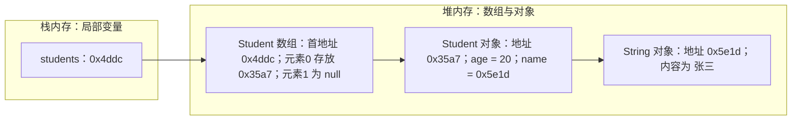
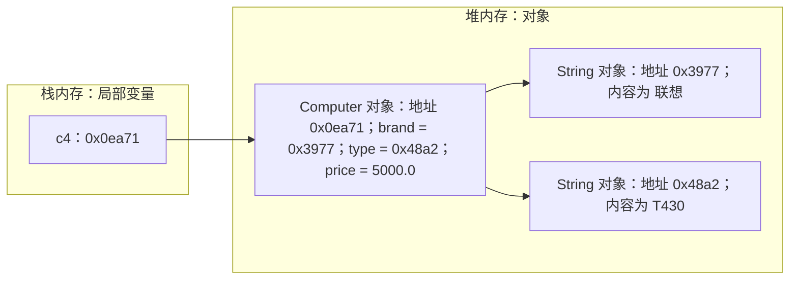
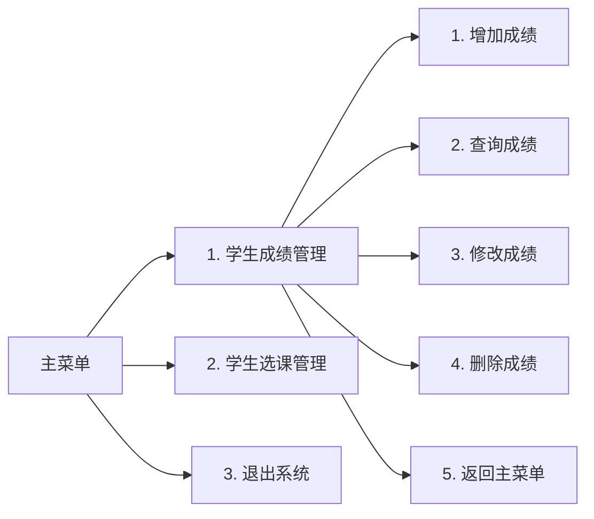

# 第二章 方法带参

## 课前回顾

**1. 描述类和对象的关系**

类是一组对象的共有特征和行为的描述。对象是类的其中一个具体的成员。

**2. 如何创建对象**

```java
类名 对象名 = new 类名();
```

**3. 如何定义和调用方法**

```java
public void 方法名(){

}

对象名.方法名();
```

**4. 成员变量和局部变量的区别**

成员变量有初始值，而局部变量没有初始值，因此，局部变量在使用之前必须完成初始化。成员变量在整个类中可见，而局部变量只能在其所定义的方法中可见，因此，如果在方法中出现了与成员变量同名的局部变量，此时局部变量的优先级更高。

**5. 你是如何理解 this 关键字的**

this 关键字表示当前对象。那么当前对象究竟是什么？哪一个对象使用 new 关键字那么 this 就指向哪一个对象。

```java
Car c = new Car(); // this => c

Car c1 = new Car();  // this=>c1
```

## 主要内容

| 主要内容 | 要求 |
| :--- | :--- |
| 方法带参 | **重点**　难点 |
| 方法参数传递 | **重点**　难点 |
| 方法重载 | **重点** |
| 面向对象和面向过程的区别 | **重点** |

## 章节目标

- 掌握带参方法的定义与调用
- 掌握方法的返回值
- 掌握方法重载
- 熟悉面向对象和面向过程的区别

---

## 第一节 方法带参

### 1. 构造方法带参

**案例场景**

现有计算机类定义如下：

```java
public class Computer{
    public String brand;//品牌
    public String type;//型号
    public double price;//价格
}
```

现要创建 3 个具体的计算机实例，代码如下：

```java
public class ComputerTest{
    public static void main(String[] args){
        Computer c1 = new Computer();
        c1.brand = "联想";
        c1.type = "T430";
        c1.price = 5000;

        Computer c2 = new Computer();
        c2.brand = "联想";
        c2.type = "W530";
        c2.price = 6000;

        Computer c3 = new Computer();
        c3.brand = "联想";
        c3.type = "T450";
        c3.price = 7000;
    }
}
```

**思考**：以上代码存在什么问题？

每创建一个对象，都会出现重复为对象的属性赋值，这样造成大量的冗余代码。可以使用带参构造方法来进行优化。

**构造方法带参语法**

```java
访问修饰符 类名(数据类型1 变量名1,数据类型2 变量名2,...数据类型n 变量名n){

}
```

**代码实现**

```java
/**
 * 计算机
 */
public class Computer {
    public String brand;//品牌
    public String type;//型号
    public double price;//价格

    //如果一个类中没有定义任何构造方法，那么编译器会自动为这个类添加一个默认的无参构造方法
    //如果一个类中定义了构造方法，那么编译器不会为这个类添加默认的无参构造方法

    //如果在一个类中已经定义了带参数的构造方法，此时还想使用无参构造方法，那么必须将无参构造方法也定义出来
    public Computer(){
        this("默认品牌","默认型号",1000);
    }

    //此时在类中定义了带参数的构造方法，那么编译器不会为这个类添加默认的无参构造方法

    //构造方法的()表示的是参数列表，这里的列表是形式参数
    public Computer(String brand, String type, double price){
        this.brand = brand;
        this.type = type;
        this.price = price;
    }
}
```

使用带参构造方法创建对象时，必须注意参数列表传递的值要与构造方法定义时的形式列表一一对应。传递的参数是实参，也就是形式参数的一个具体实例。

```java
//调用带参构造方法创建对象，一行代码即可完成属性赋值
Computer c4 = new Computer("联想","T430",5000);
Computer c5 = new Computer("联想","W530",6000);
Computer c6 = new Computer("联想","T450",7000);
```

**练习**

定义书籍类（名称、出版社、出版年月、价格）并使用带参构造方法创建对象。

```java
/**
 * 定义书籍类(名称、出版社、出版年月、价格)并使用带参构造方法创建对象
 */
public class Book {

    public String name; //书籍名称

    public String publisher; //出版社

    public String publishTime; //出版时间

    public double price; //价格

    public Book(String name, String publisher, String publishTime, double price){
        this.name = name;
        this.publisher = publisher;
        this.publishTime = publishTime;
        this.price = price;
    }
}
```
```java
public class BookTest {

    public static void main(String[] args) {
        Book book1 = new Book("Java Core I", "01星球", "2021-04-05", 49.99);
        Book book2 = new Book("Java Core II", "01星球", "2021-04-05", 59.99);
        Book book3 = new Book("Java Effective", "01星球", "2021-04-05", 99.99);
    }
}
```

### 2. 方法带参

**方法带参语法**

```java
访问修饰符 返回值类型 方法名(数据类型1 变量名1,数据类型2 变量名2,...数据类型n 变量名n){
    [return 返回值;]
}
//带参方法调用
对象名.方法名(实参1,实参2,...实参n);
```

`return` 关键字的作用就是给出方法执行的结果，使得方法直接结束。

**案例场景**

现有计算器类定义如下：

```java
public class Calculator {

    public int number1;

    public int number2;

    public String operator;

    //calculate方法执行完成后必须要返回一个int类型的值
    //如果一个方法的返回值类型不为void，那么在选择结构中，必须为每一种情况都提供一个返回值
    public int calculate(){
        switch (operator){
            case "+": return number1 + number2;
            case "-": return number1 - number2;
            case "*": return number1 * number2;
            case "/": return number1 / number2;
            default: return 0;
        }
    }
}
```

某商家共有 30 件啤酒，每件价格 72 元，商家在 3 天内卖完这 30 件啤酒，请问每天卖了多少钱？

```java
import java.util.Scanner;

public class CalculatorTest {

    public static void main(String[] args) {
        Scanner sc = new Scanner(System.in);
        System.out.println("请输入你的姓名：");
        String name = sc.next();

        Calculator c = new Calculator();//构建一个计算器
        c.number1 = 30;
        c.number2 = 72;
        c.operator = "*";
        int total = c.calculate(); //计算总价
        c.number1 = total;
        c.number2 = 3;
        c.operator = "/";
        int avg = c.calculate();
        System.out.println("每天卖了" + avg);
    }
}
```

**思考**：以上代码存在什么问题？

依然是为对象的属性重复赋值的问题，可以使用构造方法来解决。

**优化一：使用带参构造方法**

在 `Calculator` 类中定义带参构造方法：

```java
public Calculator(){}

public Calculator(int number1, int number2, String operator){
    this.number1 = number1;
    this.number2 = number2;
    this.operator = operator;
}
```

此时 `CalculatorTest` 中创建对象与赋值的代码可以简化为：

```java
Calculator c1 = new Calculator(30, 72, "*");
int result = c1.calculate();
Calculator c2 = new Calculator(result, 3, "/");
int avg1 = c2.calculate();
System.out.println("每天卖了" + avg1);
```

仔细解读上面的代码，是否还存在问题？

上面的代码确实进行了优化，但是与现实生活不符。在现实生活中，要进行计算，只需要一台计算器即可，这里使用了两台计算器才能完成简单的计算功能。因此，在这里还需要对代码进行改造，以满足实际生活的需要。可以使用带参方法来优化。

**优化二：使用带参方法**

把 `Calculator` 类中原有的成员变量、构造方法和无参 `calculate()` 方法注释掉，改为带参方法：

```java
public int calculate(int number1, int number2, String operator){
    switch (operator){
        case "+": return number1 + number2;
        case "-": return number1 - number2;
        case "*": return number1 * number2;
        case "/": return number1 / number2;
        default: return 0;
    }
}
```

此时 `CalculatorTest` 中一台计算器就能完成全部计算：

```java
Calculator c = new Calculator();
int number1 = 30;
int total = c.calculate(number1, 72, "*");
int avg = c.calculate(total, 3, "/");
System.out.println(avg);
```

**代码实现**

```java
public class Calculator {

//    public int number1;
//
//    public int number2;
//
//    public String operator;
//
//    public Calculator(){}
//
//    public Calculator(int number1, int number2, String operator){
//        this.number1 = number1;
//        this.number2 = number2;
//        this.operator = operator;
//    }

    /**
     * 访问修饰符 返回值类型 方法名(数据类型1 变量名1,数据类型2 变量名2,...数据类型n 变量名n){
     *     [return 返回值;]
     * }
     *
     * return关键字的作用就是给出方法执行的结果，使得方法直接结束
     */

    //calculate方法执行完成后必须要返回一个int类型的值
    //如果一个方法的返回值类型不为void，那么在选择结构中，必须为每一种情况都提供一个返回值
//    public int calculate(){
//        switch (operator){
//            case "+": return number1 + number2;
//            case "-": return number1 - number2;
//            case "*": return number1 * number2;
//            case "/": return number1 / number2;
//            default: return 0;
//        }
//    }

    public int calculate(int number1, int number2, String operator){
        switch (operator){
            case "+": return number1 + number2;
            case "-": return number1 - number2;
            case "*": return number1 * number2;
            case "/": return number1 / number2;
            default: return 0;
        }
    }
}
```
```java
import java.util.Scanner;

/**
 * 某商家共有30件啤酒，每件价格72元，商家在3天内卖完这30件啤酒，请问每天卖了多少钱？
 */
public class CalculatorTest {

    public static void main(String[] args) {
//        Scanner sc = new Scanner(System.in);
//        System.out.println("请输入你的姓名：");
//        String name = sc.next();
//
//
//        Calculator c = new Calculator();//构建一个计算器
//        c.number1 = 30;
//        c.number2 = 72;
//        c.operator = "*";
//        int total = c.calculate(); //计算总价
//        c.number1 = total;
//        c.number2 = 3;
//        c.operator = "/";
//        int avg = c.calculate();
//        System.out.println("每天卖了" + avg);
//
//        Calculator c1 = new Calculator(30, 72, "*");
//        int result = c1.calculate();
//        Calculator c2 = new Calculator(result, 3, "/");
//        int avg1 = c2.calculate();
//        System.out.println("每天卖了" + avg1);

        Calculator c = new Calculator();
        int number1 = 30;
        int total = c.calculate(number1, 72, "*");
        int avg = c.calculate(total, 3, "/");
        System.out.println(avg);
    }
}
```

**练习**

使用方法实现求任意数的阶乘。

使用方法实现判断一个数是否是素数。

```java
public class NumberUtil {

    //阶乘： 6! = 6 x 5 x 4 x 3 x 2 x 1
    public int factorial(int number){
        if(number == 0) return 1;
        int result = 1;
        for(int i=1; i<= number; i++){
            result = result * i;
        }
        return result;
    }

    /**
     * 素数特征：只能被1和本身整除。换言之，也就是从2开始，到这个数本身-1为止，如果存在任意
     * 一个数能够该数被整除，那么说明该数不是素数
     * @param number
     * @return
     */
    public boolean isPrime(int number){
        if(number == 2) return true;
        for(int i=2; i<number; i++){
            //if选择结构中，如果其后只有一条语句或者一个结构体，那么{}可以省略。
            if(number % i == 0) return false;
        }
        return true;
    }
}
```
```java
public class NumberUtilTest {

    public static void main(String[] args) {
        NumberUtil util = new NumberUtil();
        int result = util.factorial(6);
        System.out.println(result);

        boolean prime = util.isPrime(7);
        System.out.println(prime);
    }
}
```

### 3. 对象数组

**案例场景**

学生有姓名和年龄，类定义如下：

```java
public class Student {
    //成员变量  属性  字段
    public String name;

    public int age;

    public Student(String name, int age){
        this.name = name;
        this.age = age;
    }
}
```

一个班级有多个学生，如何存储这些学生的信息？使用数组存储。

**代码实现**

```java
public class StudentTest {

    public static void main(String[] args) {

        int[] numbers = new int[2];
        numbers[0] = 10;

        Student[] students = new Student[2];
        students[0] = new Student("张三", 20);
        students[1] = new Student("李四", 25);
    }
}
```

**内存结构**

以 `students` 数组为例（`students[0]` 指向堆中的学生对象，对象的 `name` 再指向堆中的字符串对象）：



**练习**

使用对象数组存储学生选择的 5 门必修课程（课程编号，课程名称，学分）。

```java
public class Course {

    public String number;//课程编号

    public String name; //课程名称

    public double score;//学分

    public Course(String number, String name, double score){
        this.number = number;
        this.name = name;
        this.score = score;
    }
}
```
```java
public class CourseTest {

    public static void main(String[] args) {
        Course[] courses = new Course[5];
        courses[0] = new Course("C0001", "Java", 5);
        courses[1] = new Course("C0002", "JDBC", 2);
        courses[2] = new Course("C0003", "Html", 3);
        courses[3] = new Course("C0004", "Jsp", 6);
        courses[4] = new Course("C0005", "Spring", 10);
    }
}
```

使用对象数组存储 5 个菜单信息（菜单编号，菜单名称）。

```java
public class Menu {

    public int order; //编号

    public String name; //名称

    public Menu(int order, String name){
        this.order = order;
        this.name = name;
    }

    public void show(){
        System.out.println(order + "." + name);
    }
}
```
```java
public class MenuTest {

    public static void main(String[] args) {
        Menu[] menus = new Menu[5];
        menus[0] = new Menu(1, "增加学生信息");
        menus[1] = new Menu(2, "修改学生信息");
        menus[2] = new Menu(3, "查询学生信息");
        menus[3] = new Menu(4, "删除学生信息");
        menus[4] = new Menu(5, "返回上级菜单");
    }
}
```

### 4. 引用数据类型作为方法的参数

**案例场景**

某手机专卖店有 100 个手机展架，售货员现在依次向展架上摆放手机。请使用面向对象的设计思想描述这一过程。（手机有品牌，型号和价格）

**分析**

a. 这一过程涉及到的对象有两个，一个是手机，一个是售货员。因此我们需要为这两个对象构建类

b. 摆放手机是售货员的一个行为，因此需要使用方法来描述

c. 100 个手机展架放的都是手机，因此需要使用对象数组来存储

**代码实现**

```java
public class Mobile {

    public String brand;

    public String type;

    public double price;

    public Mobile(String brand, String type, double price){
        this.brand = brand;
        this.type = type;
        this.price = price;
    }
}
```
```java
public class Seller {

    //数组中的默认值都是null
    public Mobile[] mobiles = new Mobile[100];

    /**
     * 引用数据类型作为方法的参数
     * @param mobile
     */
    public void playMobile(Mobile mobile){
        for(int i=0; i<mobiles.length; i++){
            if(mobiles[i] == null){
                mobiles[i] = mobile;
                break;
            }
        }
    }
}
```
```java
public class SellerTest {

    public static void main(String[] args) {
        Seller seller = new Seller();
        //调用售货员放手机
        seller.playMobile(new Mobile("小米", "小米10", 2000));
    }
}
```

**练习**

某老师现要录入班级学生信息（姓名，性别，年龄，成绩），学生信息存储在数组中。请使用方法完成。

**分析**

a. 涉及的对象（具体的事物）：老师和学生，需要构建两个类来描述这样的对象的共同特征和行为举止

b. 录入班级学生信息是老师的行为

c. 学生信息存储在数组中

**代码实现**

```java
public class Stu {

    public String name;//姓名

    public String sex;//性别

    public int age;//年龄

    public double score;//成绩

    public Stu(String name, String sex, int age, double score){
        this.name = name;
        this.sex = sex;
        this.age = age;
        this.score = score;
    }
}
```
```java
import java.util.Arrays;

public class Teacher {

    public Stu[] stus = {}; //刚开始的时候 一个学生也没有

    public void addStu(Stu stu){//添加一个学生信息
        stus = Arrays.copyOf(stus, stus.length + 1); //先对数组进行扩容
        stus[stus.length - 1] = stu;
    }
}
```
```java
import java.util.Scanner;

public class TeacherTest {

    public static void main(String[] args) {
        Scanner sc = new Scanner(System.in);
        Teacher t = new Teacher(); //一位老师
        for(int i=0; i<3; i++){
            System.out.println("请输入学生姓名：");
            String name = sc.next();
            System.out.println("请输入学生性别：");
            String sex = sc.next();
            System.out.println("请输入学生年龄：");
            int age = sc.nextInt();
            System.out.println("请输入学生成绩：");
            double score = sc.nextDouble();
//            Stu stu =new Stu(name, sex, age, score);
//            t.addStu(stu);
            t.addStu(new Stu(name, sex, age, score));
        }
    }
}
```

### 5. 数组作为方法的参数

**案例场景**

现有甲乙丙三个班级成绩统计如下：

甲：80,72,85,67,50,76,95,49

乙：77,90,92,89,67,94

丙：99,87,95,93,88,78,85

现要求将每个班的成绩从高到低依次排列。

**代码实现**

```java
import java.util.Arrays;

/**
 * 现有甲乙丙三个班级成绩统计如下：
 * 甲：80,72,85,67,50,76,95,49
 * 乙：77,90,92,89,67,94
 * 丙：99,87,95,93,88,78,85
 * 现要求将每个班的成绩从高到低依次排列。
 */
public class ArraySort {

    public static void main(String[] args) {
        int[] arr1 = {80,72,85,67,50,76,95,49};
        int[] arr2 = {77,90,92,89,67,94};
        int[] arr3 = {99,87,95,93,88,78,85};
        sortDesc(arr1);
        System.out.println(Arrays.toString(arr1));
        sortDesc(arr2);
        System.out.println(Arrays.toString(arr2));
        sortDesc(arr3);
        System.out.println(Arrays.toString(arr3));
    }

    public static void sortDesc(int[] arr){
        //可以使用冒泡排序来对数组中的元素进行降序排列
        for(int i=0; i<arr.length; i++){
            for(int j=0; j<arr.length-i-1; j++){
                if(arr[j] < arr[j+1]){
                    int temp = arr[j];
                    arr[j] = arr[j+1];
                    arr[j+1] = temp;
                }
            }
        }
    }
}
```

**练习**

使用方法来完成菜单数组的显示功能。

```java
public class MenuArray {

    public static void main(String[] args) {
        Menu[] mainMenus = {
                new Menu(1, "学生成绩管理"),
                new Menu(2, "学生选课管理"),
                new Menu(3, "退出系统")
        };

        Menu[] secondMenus = {
                new Menu(1, "增加成绩"),
                new Menu(2, "修改成绩"),
                new Menu(3, "删除成绩"),
                new Menu(4, "查询成绩"),
                new Menu(5, "返回主菜单"),
        };

        showMenus(mainMenus);
        showMenus(secondMenus);
    }

    public static void showMenus(Menu[] menus){
        for(int i=0; i<menus.length; i++){
            menus[i].show();
        }
    }
}
```

### 6. 方法参数传递规则

**方法传参来自官方的说明**

```text
Primitive arguments, such as an int or a double, are passed into methods by
value. This means that any changes to the values of the parameters exist only
within the scope of the method. When the method returns, the parameters are
gone and any changes to them are lost.
```

基本数据类型的参数（例如 int 或 double）按值传递给方法。这意味着对参数值的任何更改仅存在于方法范围内。当方法返回时，参数消失，对它们的任何更改都将丢失。

```text
Reference data type parameters, such as objects, are also passed into methods
by value. This means that when the method returns, the passed-in reference
still references the same object as before. However, the values of the
object's fields can be changed in the method, if they have the proper access
level.
```

引用数据类型参数（例如对象）也按值传递到方法中。这意味着当方法返回时，传入的引用仍然引用与以前相同的对象。但是，如果对象的字段的值具有适当的访问级别，则可以在方法中更改它们。

**基本数据类型传值案例**

```java
public class PassingPrimitive {

    public static void main(String[] args) {
        int a = 10;
        change(a);//调用方法时，实际上传递的是变量a的值的拷贝
        System.out.println(a);
    }

    public static void change(int number) {
        number++;
    }
}
```

基本数据类型传值时传递的是值的拷贝。

**引用数据类型传值案例**

```java
public class ComputerTest {

    public static void main(String[] args) {
        Computer c1 = new Computer();
        c1.brand = "联想";
        c1.type = "T430";
        c1.price = 5000;
        //调用带参构造方法创建对象时，必须注意参数列表传递的值要与构造方法定义时的形式列表一一对应
        //传递的参数是实参：也就是形式参数的一个具体实例。
        Computer c4 = new Computer("联想","T430",5000);
        updateComputer(c4);
        System.out.println(c4.price);

        Computer c2 = new Computer();
        c2.brand = "联想";
        c2.type = "W530";
        c2.price = 6000;
        Computer c5= new Computer("联想","W530",6000);


        Computer c3 = new Computer();
        c3.brand = "联想";
        c3.type = "T450";
        c3.price = 7000;
        Computer c6 = new Computer("联想","T450",7000);
    }


    public static void updateComputer(Computer computer){
        computer.price = 10000;
    }
}
```

引用数据类型传值时传递的是对象在堆内存上的空间地址。

以 `c4` 为例，方法收到的只是地址 `0x0ea71` 的拷贝，因此方法内部修改对象属性会生效，而不会创建新的对象：



> 💡 补充：官方文档说引用类型同样"按值传递"，这里说的"传递空间地址"指的是传递地址值的拷贝。二者并不矛盾：方法内改属性会作用于同一个对象，但把形参重新指向新对象（如 `computer = new Computer(...)`）不会影响调用方的变量。

---

## 第二节 方法重载（Overloading）

### 1. 概念

在同一个类中，方法名相同，参数列表不同的多个方法构成方法重载。

### 2. 示例

```java
public class Calculator{

    public int sum(int a, int b){
        return a + b;
    }

    public int sum(int a, int b, int c){
        return a + b + c;
    }
}
```

### 3. 误区

下面的方法是否属于方法重载？

```java
public class Test1{

    public void show(){
        System.out.println("Nice");
    }

    public int show(){
        return 1;
    }
}
```

不属于方法重载，因为方法名和参数列表都一样。在同一个类中，不可能出现这样的方法定义。

```java
public class Test2{

    public int add(int a, int b){
        return a + b;
    }

    public int add(int c, int d){
        return c + d;
    }
}
```

不属于方法重载，因为方法名和参数列表都一样。在同一个类中，不可能出现这样的方法定义。

```java
public class Test3{

    public double multiply(double a, double b){
        return a * b;
    }

    public int multiply(int a, int b){
        return a * b;
    }
}
```

> 💡 补充：`Test3` 中两个方法的参数类型不同（`double` 与 `int`），属于方法重载。可见参数列表是否"不同"看的是**参数的类型、个数、顺序**，与参数名无关，也与返回值类型无关。

### 4. 构造方法重载

构造方法也是方法，因此构造方法也可以重载。如果在一个类中出现了多个构造方法的定义，那么这些构造方法就形成构造方法重载。

`this` 关键字调用构造方法，必须是这个构造方法中的第一条语句。

---

## 第三节 面向对象和面向过程的区别

### 1. 案例

级联菜单展示：



### 2. 代码实现

**面向过程**

```java
import java.util.Scanner;

/**
 * Procedure Oriented Programming 面向过程编程
 */
public class POP {

    public static void main(String[] args) {
        Scanner sc = new Scanner(System.in);
        while (true){
            System.out.println("1.学生成绩管理");
            System.out.println("2.学生选课管理");
            System.out.println("3.退出系统");
            System.out.println("请选择菜单编号：");
            int number = sc.nextInt();
            if(number == 1){
                outer:
                while (true){
                    System.out.println("1.增加成绩");
                    System.out.println("2.修改成绩");
                    System.out.println("3.删除成绩");
                    System.out.println("4.查询成绩");
                    System.out.println("5.返回主菜单");
                    System.out.println("请选择菜单编号：");
                    int order=  sc.nextInt();
                    switch (order){
                        case 1:
                            System.out.println("你选择了增加成绩");
                            break;
                        case 2:
                            System.out.println("你选择了修改成绩");
                            break;
                        case 3:
                            System.out.println("你选择了删除成绩");
                            break;
                        case 4:
                            System.out.println("你选择了查询成绩");
                            break;
                        case 5:
                            break outer;
                    }
                }
            } else if(number == 2){
                System.out.println("你选择了学生选课管理");
            } else {
                System.out.println("感谢使用XXX系统");
                break;
            }
        }
    }
}
```

**面向对象**

分析：

a. 该过程涉及到的对象（事物）有两个：用户和菜单

b. 用户拥有执行增删改查成绩的动作

菜单类 `Menu` 与第一节练习中的定义一致，用户类和主程序如下：

```java
public class User {

    public void addScore(){
        System.out.println("你选择了增加成绩");
    }

    public void deleteScore(){
        System.out.println("你选择了删除成绩");
    }

    public void updateScore(){
        System.out.println("你选择了修改成绩");
    }

    public void searchScore(){
        System.out.println("你选择了查询成绩");
    }
}
```
```java
import java.util.Scanner;

/**
 * Object Oriented Programming 面向对象编程
 */
public class OOP {

    public static Menu[] mainMenus = {
            new Menu(1, "学生成绩管理"),
            new Menu(2, "学生选课管理"),
            new Menu(3, "退出系统")
    };

    public static Menu[] secondMenus = {
            new Menu(1, "增加成绩"),
            new Menu(2, "修改成绩"),
            new Menu(3, "删除成绩"),
            new Menu(4, "查询成绩"),
            new Menu(5, "返回主菜单")
    };

    public static Scanner sc = new Scanner(System.in);

    public static User user = new User();

    public static void main(String[] args) {
        gotoMain();
    }
    //去主菜单
    public static void gotoMain(){
        showMenus(mainMenus);//显示主菜单
        int number = sc.nextInt();
        if(number == 1){
            gotoSecond();
        } else if(number == 2){
            System.out.println("你选择了学生选课管理");
            gotoMain(); //去主菜单
        } else {
            System.out.println("感谢使用XXX系统");
        }
    }
    //去二级菜单
    public static void gotoSecond(){
        showMenus(secondMenus);//显示二级菜单
        int order = sc.nextInt();
        switch (order){
            case 1:
                user.addScore();//用户增加成绩
                gotoSecond();
                break;
            case 2:
                user.updateScore();//用户修改成绩
                gotoSecond();
                break;
            case 3:
                user.deleteScore();//用户删除成绩
                gotoSecond();
                break;
            case 4:
                user.searchScore();//用户查询成绩
                gotoSecond();
                break;
            case 5:
                gotoMain();
                break;
        }
    }

    public static void showMenus(Menu[] menus){
        for(int i=0; i<menus.length; i++){
            menus[i].show();
        }
        System.out.println("请选择菜单编号：");
    }
}
```

**对比**

面向过程侧重点在过程的实现上。面向对象的侧重点在对象上，需要利用对象的行为来完成过程的组装。
