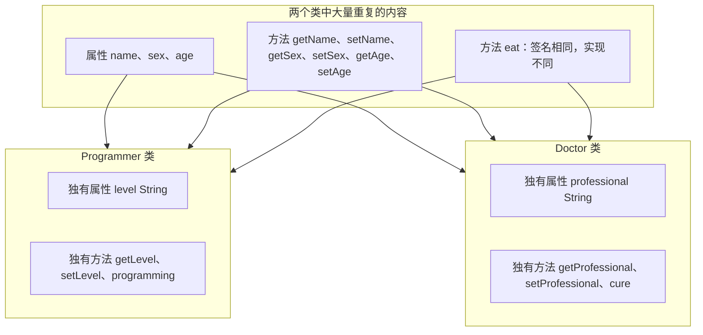
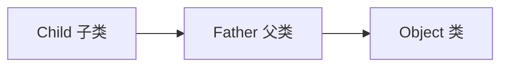
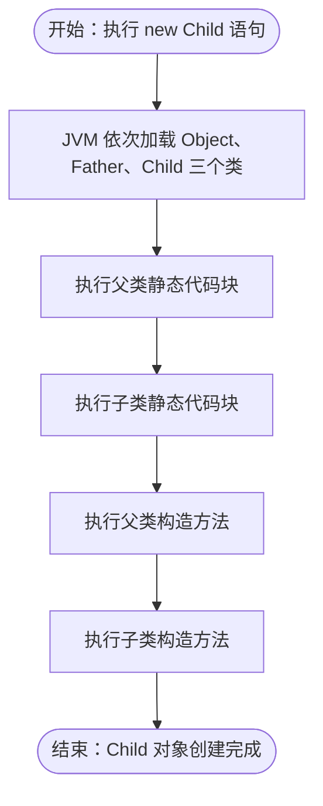

# 第四章 继承

## 课前回顾

1. **如何进行封装**

首先将类中定义的成员属性全部修改为 private 修饰

然后对每一个属性提供一个对外访问的方法，也就是生成 getter/setter 方法

最后在对外访问的方法（getter/setter）中加入属性值验证

2. **封装的好处**

- 提高了代码的重用性
- 提高了代码的可维护性
- 保护了隐私，能够很好保护代码的实现逻辑

3. **包的作用**

```java
package 包名;  //包名一般来说都是小写字母组成，每个包之间使用'.'隔开
```

包的本质其实就是一个文件夹。包可以用来防止命名冲突、可以保护属性、可以对访问权限进行控制。

4. **访问修饰符的权限控制**

- 访问修饰符：public、protected、默认修饰符、private
- 能够修饰类的访问修饰符：public、默认修饰符、private（只能用来修饰内部类）
- public 修饰的类，整个工程中都可以访问；默认修饰符修饰的类，只能在同一个包中访问。
- 能够修饰成员的访问修饰符：public、protected、默认修饰符、private
- public 修饰的成员，整个工程中都可以访问；默认修饰符修饰的成员只能在同一个包中访问。protected 修饰的成员，在同一个包中或者子类中可以访问。private 修饰的成员只能在本类中访问。

5. **static 修饰符使用范围**

- static 能够用来修饰类、变量、方法、代码块。需要注意的是：static 修饰类时只能修饰内部类。
- static 修饰的变量称之为类变量（公开的类变量访问：`类名.变量名`）
- static 修饰的方法称之为类方法（公开的类方法访问：`类名.方法名`）
- static 修饰的代码块称之为静态代码块。静态代码块在 JVM 第一次加载类时执行，而且只会执行一次。

## 课程内容

| 课程内容 | 要求 |
| :--- | :--- |
| 继承 | **重点** |
| 方法重写 | **重点** |
| super 关键字 | **重点** |
| 万物皆对象的原理 | **重点** |
| final 关键字 | **重点** |

## 课程目标

- 掌握继承的使用场景
- 掌握方法重写
- 掌握 super 关键字的使用
- 掌握万物皆对象的原理
- final 关键字的使用

---

## 第一节 继承（Inheritance）

### 1. 概念

**继承（Inheritance）来自官方的说明**

```text
The idea of inheritance is simple but powerful: When you want to create a new
class and there is already a class that includes some of the code that you
want, you can derive your new class from the existing class. In doing this,
you can reuse the fields and methods of the existing class without having to
write (and debug!) them yourself.
```

继承的概念很简单但是很强大：当你要创建一个新类并且已经有一个包含所需代码的类时，可以从现有类中派生新类。这样，你可以重用现有类的字段和方法，而不必自己编写（和调试！）它们。

```text
A subclass inherits all the members (fields, methods, and nested classes)
from its superclass. Constructors are not members, so they are not inherited
by subclasses, but the constructor of the superclass can be invoked from the
subclass.
```

子类从其父类继承所有成员（字段，方法和嵌套类）。构造方法不是成员，因此它们不会被子类继承，但是可以从子类中调用父类的构造方法。

```text
A class that is derived from another class is called a subclass (also a
derived class, extended class, or child class). The class from which the
subclass is derived is called a superclass (also a base class or a parent
class).
```

从一个类派生的类称为子类（也可以是派生类，扩展类或子类）。派生子类的类称为超类（也称为基类或父类）。

继承也是面向对象的三大特征之一。

### 2. 如何使用继承

**语法**

```java
public class 子类名 extends 父类名 {

}
```

**示例**

```java
package com.cyx.inheritance;

public class Father {

    public String name;

    public String sex;

    public void eat(){
        System.out.println("吃饭");
    }

    public void sleep(){
        System.out.println("睡觉");
    }
}
```

```java
package com.cyx.inheritance;

public class Child extends Father{

    public void show(){
        //本类中未定义name变量，但是却可以使用，说明name变量是从父类中继承过来的
        System.out.println(name);
        System.out.println(sex);
        //本类中未定义eat()方法，但是却可以使用，说明eat()方法是从父类中继承过来的
        eat();
        sleep();
    }
}
```

```java
package com.cyx.inheritance;

public class FatherTest {

    public static void main(String[] args) {
        Child child = new Child();
        child.name = "张三";
        child.sex = "男";
        child.show();
    }
}
```

> 💡 补充：这里 `Child` 中并没有定义 `name`、`sex` 属性和 `eat()`、`sleep()` 方法，却可以直接使用，说明它们都是从父类 `Father` 继承过来的。

**继承的属性和方法**

```text
A subclass inherits all of the public and protected members of its parent, no
matter what package the subclass is in. If the subclass is in the same
package as its parent, it also inherits the package-private members of the
parent.
```

不论子类在什么包中，子类会继承父类中所有的公开的和受保护的成员（包括字段和方法）。如果子类和父类在同一个包中，子类也会继承父类中受包保护的成员。

```text
A subclass does not inherit the private members of its parent class. However,
if the superclass has public or protected methods for accessing its private
fields, these can also be used by the subclass.
```

子类不会继承父类中定义的私有成员。尽管如此，如果父类有提供公开或者受保护的访问该字段的方法，这些方法也能在子类中被使用。

**示例**

```java
package com.cyx.inheritance;

public class Father {

    String name;

    public String sex;

    public String getName() {
        return name;
    }

    public void setName(String name) {
        this.name = name;
    }

    public String getSex() {
        return sex;
    }

    public void setSex(String sex) {
        this.sex = sex;
    }

    protected void eat(){
        System.out.println("吃饭");
    }

    public void sleep(){
        System.out.println("睡觉");
    }
}
```

`Child` 类与上一节完全一致（同包），此处不再重复列出。下面把 `Child` 放到另一个包 `p1` 中，它能继承到的成员就变少了。

```java
package com.cyx.inheritance.p1;

import com.cyx.inheritance.Father;

public class Child extends Father {

    public Child(){
        super("test", "女");
    }

    public void show(){
        //本类中未定义name变量，但是却可以使用，说明name变量是从父类中继承过来的
        System.out.println(getName());
        System.out.println(sex);
        //本类中未定义eat()方法，但是却可以使用，说明eat()方法是从父类中继承过来的
        eat();
        sleep();
    }
}
```

> 💡 补充：本节的 `Father` 与上一节的相比，只调整了成员的访问修饰符——`name` 由 `public` 改为默认修饰符、`eat()` 由 `public` 改为 `protected`，并补充了 getter/setter；配套源码 `p1/Child.java` 还补上了一个无参构造方法 `super("test", "女")`，因为父类 `Father` 只有带参构造，子类必须显式调用它。
>
> 跨包继承后：`name` 是默认修饰符，`p1.Child` 不能再直接访问，只能通过父类公开的 `getName()` 读取；`sex` 是 `public`，可以访问；`eat()` 是 `protected`，子类中可以访问；`sleep()` 是 `public`，可以访问。

### 3. 应用场景

**思考如下代码存在什么问题？**

```java
//Programmer.java
public class Programmer {

    private String name;

    private String sex;

    private int age;

    private String level;

    public String getName() {
        return name;
    }

    public void setName(String name) {
        this.name = name;
    }

    public String getSex() {
        return sex;
    }

    public void setSex(String sex) {
        this.sex = sex;
    }

    public int getAge() {
        return age;
    }

    public void setAge(int age) {
        this.age = age;
    }

    public String getLevel() {
        return level;
    }

    public void setLevel(String level) {
        this.level = level;
    }

    public void programming(){
        System.out.println("程序员编程");
    }

    public void eat(){
        System.out.println("程序员吃饭");
    }
}
```

```java
//Doctor.java
public class Doctor {

    private String name;

    private String sex;

    private int age;

    private String professional;

    public String getName() {
        return name;
    }

    public void setName(String name) {
        this.name = name;
    }

    public String getSex() {
        return sex;
    }

    public void setSex(String sex) {
        this.sex = sex;
    }

    public int getAge() {
        return age;
    }

    public void setAge(int age) {
        this.age = age;
    }

    public String getProfessional() {
        return professional;
    }

    public void setProfessional(String professional) {
        this.professional = professional;
    }

    public void cure(){
        System.out.println("医生治病");
    }

    public void eat(){
        System.out.println("医生吃饭");
    }
}
```

直接看代码，初学者可能无法直观的看出问题所在，可以使用类图进行比对。



由类图可以看出，Programmer 和 Doctor 两个类中存在大量重复的代码，可以使用继承来进行优化，以减少重复的编码。

**代码实现**

```java
package com.cyx.inheritance.p2;

public class Person {

    private String name;

    private String sex;

    private int age;

    public Number getScore(){//获取成绩
        return 0;
    }

    public String getName() {
        return name;
    }

    public void setName(String name) {
        this.name = name;
    }

    public String getSex() {
        return sex;
    }

    public void setSex(String sex) {
        this.sex = sex;
    }

    public int getAge() {
        return age;
    }

    public void setAge(int age) {
        this.age = age;
    }

    public void eat(){
        System.out.println("吃饭");
    }
}
```

```java
package com.cyx.inheritance.p2;

public class Doctor extends Person {

    private String professional;

    public String getProfessional() {
        return professional;
    }

    public void setProfessional(String professional) {
        this.professional = professional;
    }

    public void eat() {
        System.out.println("用左手吃饭");
    }

//    @Override
    public void cure(){
        System.out.println("医生治病");
    }

    //子类重写父类方法时，返回值类型可以是父类方法的返回值类型的子类
    @Override //该注解告诉编译器，这是一个重写的方法，编译器会去检测父类中是否存在这样的方法，如果不存在，则将生成一个错误
    public Integer getScore(){
        return 90;
    }
}
```

```java
package com.cyx.inheritance.p2;

public class Programmer extends Person{

    private int level;

    public int getLevel() {
        return level;
    }

    public void setLevel(int level) {
        this.level = level;
    }


    public void eat() {
        System.out.println("坐在电脑面前吃饭");
    }

    public void programming(){
        System.out.println("程序员编程");
    }

    public Double getScore(){
        return 92.6;
    }
}
```

```java
package com.cyx.inheritance.p2;

public class PersonTest {

    public static void main(String[] args) {
        Doctor d = new Doctor();
        d.setName("Miss Zhang");
        d.setSex("女");
        d.setAge(18);
        d.setProfessional("临床医疗");
        d.cure();
        d.eat();

        Person p1 = new Doctor();//医生是人
        p1.setName("Miss Zhang");
        p1.setSex("女");
        p1.setAge(18);
        p1.eat();
        //强制类型转换   int number = (int)1.0;
        ((Doctor)p1).cure();

        Person p2 = new Programmer();//程序员是人
        p2.setName("马化腾");
        p2.setSex("男");
        p2.setAge(48);
        p2.eat();
        ((Programmer)p2).programming();
    }
}
```

> 💡 补充：PDF 中 `Person.eat()` 输出的是“医生吃饭”（从 `Doctor` 复制粘贴所致），配套源码里已改回“吃饭”。另外配套源码比课件多出 `getScore()` 相关代码（`Person` 返回 `Number`，`Doctor` 返回 `Integer`、`Programmer` 返回 `Double`），用于演示“重写方法可以返回父类方法返回值类型的子类型”，即协变返回类型；`Doctor`、`Programmer` 中也补上了对 `eat()` 的重写。

**子类与父类的关系是 is - a 关系。表示是一个。**

如果一个对象赋值给其父类的引用，此时想要调用该对象的特有的方法，必须要进行强制类型转换。

---

## 第二节 方法重写（Override）

### 1. 概念

**来自官方的说明**

```text
An instance method in a subclass with the same signature(name, plus the
number and the type of its parameters)  and return type as an instance method
in the superclass overrides the superclass's method.
```

子类中的一个成员方法与父类中的成员方法有相同的签名（方法名加上参数数量和参数类型）和返回值类型的实例方法重写了父类的方法。

### 2. 如何使用方法重写

**来自官方的说明**

```text
The ability of a subclass to override a method allows a class to inherit from
a superclass whose behavior is "close enough" and then to modify behavior as
needed. The overriding method has the same name, number and type of
parameters, and return type as the method that it overrides. An overriding
method can also return a subtype of the type returned by the overridden
method. This subtype is called a covariant return type.
```

子类重写方法的能力使类可以从行为“足够近”的父类继承，然后根据需要修改行为。重写方法与被重写的方法具有相同的名称，数量和参数类型，并且返回类型相同。重写方法还可以返回重写方法返回的类型的子类型。此子类型称为协变返回类型。

```text
When overriding a method, you might want to use the @Override annotation that
instructs the compiler that you intend to override a method in the
superclass. If, for some reason, the compiler detects that the method does
not exist in one of the superclasses, then it will generate an error.
```

重写方法时，您可能需要使用 @Override 注解，该注释指示编译器您打算重写父类中的方法。如果由于某种原因，编译器检测到该方法在父类中不存在，则它将生成错误。

**基本数据类型与包装类的对应关系**

| 基本数据类型 | 包装类 |
| :--- | :--- |
| `byte` | `Byte` |
| `short` | `Short` |
| `int` | `Integer` |
| `long` | `Long` |
| `float` | `Float` |
| `double` | `Double` |

以上包装类都是 `Number` 的子类。

```java
package com.cyx.inheritance.number;

public class NumberTest {

    public static void main(String[] args) {
        Byte b = 1; //byte b = 1;
        Short s = 1; //short s = 1;
        Integer i = 1; // int i = 1;
        Long l = 1L; // long l = 1L;
        Double d = 1.0; // double d = 1.0;
        Float f = 1.0f; // float f = 1.0f;
    }
}
```

> 💡 补充：上面的包装类演示对应配套源码 `number/NumberTest.java`，课件中只画出了类型对应关系，源码给出了具体写法。

**案例**

几何图形都有面积和周长，不同的几何图形，面积和周长的算法也不一样。矩形有长和宽，通过长和宽能够计算矩形的面积和周长；圆有半径，通过半径可以计算圆的面积和周长。请使用继承相关的知识完成程序设计。

**分析**

a. 几何图形包含了矩形和圆。几何图形都有面积和周长，因此几何图形可以定义为一个类，里面包含了面积和周长的计算方法

b. 矩形是一种几何图形。矩形有长和宽，可以根据长和宽来计算面积和周长

c. 圆是一种几何图形。圆有半径，可以根据半径来计算面积和周长

**代码实现**

```java
package com.cyx.inheritance.shape;

/**
 * 几何图形
 */
public class Shape {
    /**
     * 计算周长
     * @return
     */
    protected Number calculatePerimeter(){
        return 0;
    }

    /**
     * 计算面积
     * @return
     */
    protected Number calculateArea(){
        return 0;
    }
}
```

```java
package com.cyx.inheritance.shape;

/**
 * 矩形
 */
public class Rectangle extends Shape {

    private int width;

    private int length;

    public Rectangle(int width, int length) {
        this.width = width;
        this.length = length;
    }

    @Override
    protected Integer calculatePerimeter() {
        return (width + length) * 2;
    }

    @Override
    public Integer calculateArea() {
        return width * length;
    }
}
```

```java
package com.cyx.inheritance.shape;

/**
 * 圆
 */
public class Circle extends Shape{

    private int radius;

    public Circle(int radius) {
        this.radius = radius;
    }

    @Override
    public Double calculateArea() {
        return Math.PI * radius * radius;
    }

    @Override
    public Double calculatePerimeter() {
        return 2 * Math.PI * radius;
    }
}
```

```java
package com.cyx.inheritance.shape;

public class ShapeTest {

    public static void main(String[] args) {
        Shape s1 = new Rectangle(10, 9);
        System.out.println(s1.calculatePerimeter());
        System.out.println(s1.calculateArea());


        Shape s2 = new Circle(5);
        System.out.println(s2.calculatePerimeter());
        System.out.println(s2.calculateArea());
    }
}
```

**重写方法时访问修饰符的级别不能降低。**

### 4. super 关键字

**super 关键字（来自官方的说明）**

```text
If a constructor does not explicitly invoke a superclass constructor, the
Java compiler automatically inserts a call to the no-argument constructor of
the superclass. If the super class does not have a no-argument constructor,
you will get a compile-time error. Object does have such a constructor, so if
Object is the only superclass, there is no problem.
```

如果子类的构造方法没有明确调用父类的构造方法，Java 编译器会自动插入一个父类无参构造的调用。如果父类没有无参构造，你将得到一个编译时错误。Object 类有一个无参构造，因此，如果 Object 类是该类的唯一父类，这就没有问题。

> 💡 补充：示例一、示例二、示例三是同一个 `Father` / `Child` 的三种渐进取法，下面每一步只列出该步新增或改动的代码，完整版在示例三之后一次性给出。

**示例一：子类和父类中都没有定义构造方法**

`Father`、`Child` 的其余代码与上文一致，本步只新增了构造方法。

```java
// Father.java
public Father(){
    super(); //调用Object类的无参构造
}
```

```java
// Child.java
//如果一个类中没有定义构造方法，那么编译器将会给该类插入一个无参构造方法
public Child(){
    super();//如果子类构造方法中没有显式的调用父类的构造方法，那么编译器会自动插入一个父类无参构造的调用
}
```

**示例二：子类中有定义构造方法，父类没有定义构造方法**

`Child` 中新增了一个带参构造方法，父类仍使用编译器自动插入的无参构造。

```java
// Child.java
public Child(String name){
    super();
    this.name = name;
}
```

**示例三：子类和父类中都有定义构造方法**

父类中删去无参构造、改为带参构造，子类中也只保留带参构造，并显式调用父类的带参构造。

```java
// Father.java
public Father(String name, String sex){
    this.name = name;
    this.sex = sex;
}
```

```java
// Child.java
public Child(String name, String sex){
    //如果父类中定义了带参构造，并且没有定义无参构造，那么必须在子类的构造方法中显式的调用父类
    //的带参构造
    super(name, sex);
}
```

**完整代码**

```java
package com.cyx.inheritance;

public class Father {

    String name;

    public String sex;

    public Father(String name, String sex){
        this.name = name;
        this.sex = sex;
    }

    public String getName() {
        return name;
    }

    public void setName(String name) {
        this.name = name;
    }

    public String getSex() {
        return sex;
    }

    public void setSex(String sex) {
        this.sex = sex;
    }

    protected void eat(){
        System.out.println("吃饭");
    }

    public void sleep(){
        System.out.println("睡觉");
    }
}
```

```java
package com.cyx.inheritance;

public class Child extends Father{

    public Child(String name, String sex){
        //如果父类中定义了带参构造，并且没有定义无参构造，那么必须在子类的构造方法中显式的调用父类
        //的带参构造
        super(name, sex);
    }

    public void show(){
        //本类中未定义name变量，但是却可以使用，说明name变量是从父类中继承过来的
        System.out.println(name);
        System.out.println(sex);
        //本类中未定义eat()方法，但是却可以使用，说明eat()方法是从父类中继承过来的
        eat();
        sleep();
    }
}
```

```java
package com.cyx.inheritance;

public class FatherTest {

    public static void main(String[] args) {
        Child child = new Child("张三", "男");
        child.name = "张三";
        child.sex = "男";
        child.show();
    }
}
```

> 💡 补充：引入构造方法后，测试类的写法也要跟着调整——`new Child("张三", "男")` 通过构造方法给属性赋值，因此源码中随后对 `child.name`、`child.sex` 的再次赋值其实是多余的。

**使用 super 调用父类的构造方法时，必须为这个构造方法的第一条语句。**

**来自官方的说明**

```text
If your method overrides one of its superclass's methods, you can invoke the
overridden method through the use of the keyword super. You can also use
super to refer to a hidden field (although hiding fields is discouraged).
```

如果你的方法重写了父类的方法之一，则可以通过使用关键字 super 来调用父类中被重写的方法。你也可以使用 super 来引用隐藏字段（尽管不建议使用隐藏字段）。

**示例**

```java
package com.cyx.inheritance.p3;

public class Person {

    protected String name;

    protected String sex;

    public String getSex() {
        return sex;
    }

    public void setSex(String sex) {
        this.sex = sex;
    }

    public String getName() {
        return name;
    }

    public void setName(String name) {
        this.name = name;
    }
}
```

```java
package com.cyx.inheritance.p3;

public class Student extends Person{

    private String name;

    public Student(String name) {
        this.name = name;
    }

    @Override
    public String getName() {
        return name;
    }

    public void show(){
        System.out.println(this.name);//访问本类中定义的name变量
        System.out.println(super.name);//访问父类中定义的name变量
        //如果子类中和父类中没有相同的成员变量，此时使用this和super均可
        //以调用父类的成员变量
        System.out.println(this.sex);
        System.out.println(super.sex);

        System.out.println(this.getName());
        System.out.println(super.getName());
    }
}
```

```java
package com.cyx.inheritance.p3;

public class PersonTest {

    public static void main(String[] args) {
       Student s = new Student("张三");
       s.setSex("男");
       s.show();
    }
}
```

**思考：如果子类中的静态方法与父类中的静态方法具有相同的签名，是否属于方法重写？**

不属于方法重写。因为静态方法称之为类方法，跟对象无关，调用时只看对象的数据类型。

```java
package com.cyx.inheritance.p4;

public class StaticFather {

    public static void show(){
        System.out.println("这是父类的静态方法");
    }
}
```

```java
package com.cyx.inheritance.p4;

public class StaticChild extends StaticFather{

    public static void show(){
        System.out.println("这是子类的静态方法");
    }
}
```

```java
package com.cyx.inheritance.p4;

public class StaticTest {

    public static void main(String[] args) {
        StaticFather f = new StaticChild();
        f.show();
        StaticFather.show();
        StaticChild.show();
    }
}
```

### 5. 万物皆对象

```text
Excepting Object, which has no superclass, every class has one and only one
direct superclass (single inheritance). In the absence of any other explicit
superclass, every class is implicitly a subclass of Object.
```

除了没有父类的 Object 之外，每个类都有一个且只有一个直接父类（单继承）。在没有其他任何显式超类的情况下，每个类都隐式为 Object 的子类。

```text
Classes can be derived from classes that are derived from classes that are
derived from classes, and so on, and ultimately derived from the topmost
class, Object. Such a class is said to be descended from all the classes in
the inheritance chain stretching back to Object.
```

类可以派生自另一个类，另一个类又可以派生自另一个类，依此类推，并最终派生自最顶层的类 Object。据说这样的类是继承链中所有类的后代，并延伸到 Object。

所有类都是 Object 的子类，因此，创建对象时都需要调用 Object 类中的无参构造方法，而 Object 本身就表示对象，因此创建出来的都是对象。

**继承链示意**



**练习：（使用继承完成）**

动物都有名称、年龄，都需要吃东西、睡觉。狗也是一种动物，也有名称和年龄，狗吃的是骨头，睡觉时是趴着睡。马也是一种动物，也有名称和年龄，马吃的是草，睡觉时站着睡。

```java
package com.cyx.inheritance.animal;

public class Animal {

    protected String name;

    protected int age;

    public Animal(String name, int age) {
        this.name = name;
        this.age = age;
    }

    protected void eat(){
        System.out.println("动物吃东西");
    }

    protected void sleep(){
        System.out.println("动物睡觉");
    }
}
```

```java
package com.cyx.inheritance.animal;

public class Dog extends Animal{

    public Dog(String name, int age) {
        super(name, age);
    }

    @Override
    public void eat() {
        System.out.println(age + "年的" + name + "在吃骨头");
    }

    @Override
    public void sleep() {
        System.out.println(age + "年的" + name + "正在趴着睡觉");
    }
}
```

```java
package com.cyx.inheritance.animal;

public class Horse extends Animal{

    public Horse(String name, int age) {
        super(name, age);
    }

    @Override
    public void eat() {
        System.out.println(age + "年的" + name + "在吃草");
    }

    @Override
    public void sleep() {
        System.out.println(age + "年的" + name + "正在站着睡觉");
    }
}
```

```java
package com.cyx.inheritance.animal;

public class AnimalTest {

    public static void main(String[] args) {
        Animal a1 = new Dog("哈巴狗", 10);
        a1.eat();
        a1.sleep();

        Animal a2 = new Horse("赤兔", 5);
        a2.eat();
        a2.sleep();
    }
}
```

某公司员工有内部员工和临时工两种。不论是内部员工还是临时工，都具有姓名，员工编号，所属部门，薪资。但临时工干的活都是一些较为粗重的，内部员工干的活都是一些较为轻松的。

```java
package com.cyx.inheritance.worker;

public class Worker {

    protected String name;//姓名

    protected String number;//员工编号

    protected String dept;//所属部门

    protected double salary;//薪资

    public Worker(String name, String number, String dept, double salary) {
        this.name = name;
        this.number = number;
        this.dept = dept;
        this.salary = salary;
    }

    public void work(){
        System.out.println("员工需要干活");
    }
}
```

```java
package com.cyx.inheritance.worker;

public class InteriorWorker extends Worker{

    public InteriorWorker(String name, String number, String dept, double salary) {
        super(name, number, dept, salary);
    }

    @Override
    public void work() {
        System.out.println("内部员工干一些较为轻松的活，但薪资可能要低一些");
    }
}
```

```java
package com.cyx.inheritance.worker;

public class TemporaryWorker extends Worker{

    public TemporaryWorker(String name, String number, String dept, double salary) {
        super(name, number, dept, salary);
    }

    @Override
    public void work() {
        System.out.println("临时员工干一些较为粗重的活，但薪资相对较高");
    }
}
```

```java
package com.cyx.inheritance.worker;

public class WorkerTest {

    public static void main(String[] args) {
        Worker w1 = new InteriorWorker("张三", "D0001", "工程部", 2000);
        w1.work();

        Worker w2 = new TemporaryWorker("李四", "D0002","工程部", 20000);
        w2.work();
    }
}
```

---

## 第三节 final 修饰符

### 1. 应用范围

final 修饰符应该使用在类、变量以及方法上。

### 2. final 修饰类

```text
Note that you can also declare an entire class final. A class that is
declared final cannot be subclassed. This is particularly useful, for
example, when creating an immutable class like the String class.
```

注意，你也可以声明整个类的 final。声明为 final 的类不能被子类化。例如，当创建不可变类（如 String 类）时，这特别有用。

如果一个类被 final 修饰，表示这个类是最终的类，因此这个类不能够再被继承，因为继承就是对类进行扩展。

**示例**

```java
package com.cyx.inheritance._final;

//final修饰的类不能够被继承
public final class FinalClass {

    public void show(){
        System.out.println("这是最终类里面的方法");
    }
}
```

```java
package com.cyx.inheritance._final;

//这里会报编译错误，因此FinalClass不能够被继承
public class ChildClass extends FinalClass{
}
```

> 💡 补充：为了让工程能够正常编译，配套源码中的 `_final/ChildClass.java` 已被整段注释掉，上面列出的是课件中会报编译错误的写法。

### 3. final 修饰方法

```text
You can declare some or all of a class's methods final. You use the final
keyword in a method declaration to indicate that the method cannot be
overridden by subclasses. The Object class does this—a number of its methods
are final.
```

你可以将类的某些或所有方法声明为 final。在方法声明中使用 final 关键字表示该方法不能被子类覆盖。Object 类就是这样做的——它的许多方法都是最终的。

**示例**

```java
package com.cyx.inheritance._final;

public class FinalMethod {

    public final void show(){
        System.out.println("这是一个最终方法，不能被重写");
    }
}
```

```java
package com.cyx.inheritance._final;

public class ChildMethod extends FinalMethod {

    //这里也会报编译错误，因为父类中的show()方法是最终的，不可被重写
    public void show(){

    }
}
```

> 💡 补充：同样出于编译通过的考虑，配套源码中的 `_final/ChildMethod.java` 把 `show()` 方法注释掉了。

### 4. final 修饰变量

final 修饰变量的时候，变量必须在对象构建时完成初始化。final 修饰的变量称为常量。

**示例**

```java
package com.cyx.inheritance._final;

public class FinalVariable {

    //final修饰的变量一定要在对象创建时完成赋值操作，final修饰的变量称之为常量，不可被更改
    private final int number;

    //static final修饰的变量就是静态常量
    public static final String COUNTRY = "中国";

    public FinalVariable(){
        this.number = 10;
    }

    public void change(){
//        this.number = 11; //因为number是一个常量，不能再被更改，因此会报编译错误
    }
}
```

**思考如下代码的执行过程：**

```java
package com.cyx.inheritance.test;

public class Father {

    static {
        System.out.println("父类静态代码块执行");
    }

    public Father(){
        super();
        System.out.println("父类构造方法执行");
    }
}
```

```java
package com.cyx.inheritance.test;

public class Child extends Father{

    static {
        System.out.println("子类静态代码块执行");
    }

    public Child(){
        super();
        System.out.println("子类构造方法执行");
    }
}
```

```java
package com.cyx.inheritance.test;

public class Test {

    public static void main(String[] args) {
        new Child();
        //构建Child对象时，发现Child是Father的子类，而Father又是Object的子类。因此JVM会首先加载Object类
        //然后再加载Father类，最后再加载Child类。而静态代码块是在类第一次加载时执行，而且只会执行一次。因此
        //Father类中的静态代码块先执行，然后再执行Child类中的静态代码块。然后才执行new Child();代码。

        //父类静态代码块执行
        //子类静态代码块执行
        //父类构造方法执行
        //子类构造方法执行
    }
}
```

**执行顺序**



> 💡 补充：静态代码块只在类第一次被加载时执行且只执行一次，所以它一定早于构造方法；而构造方法在 `new` 时执行，且总是先执行父类构造、再执行子类构造。另外课件中这一段的包名写作 `com.hyx.inheritance.test`，应是 `com.cyx` 的笔误，此处已按全章统一的 `com.cyx.inheritance.test` 处理。
