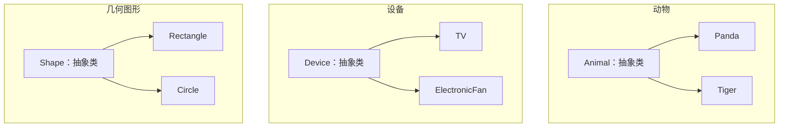
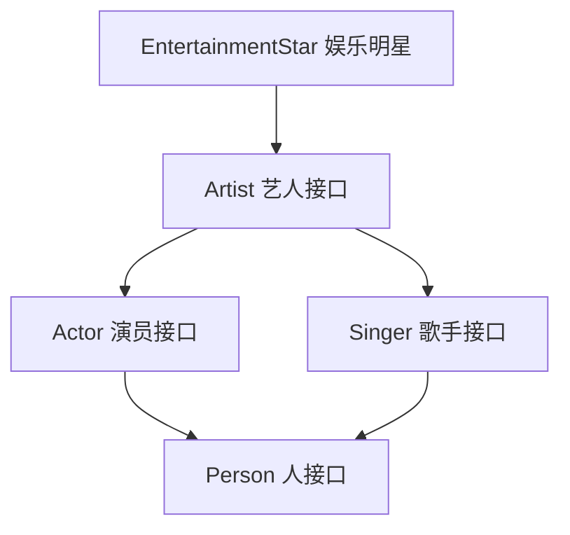
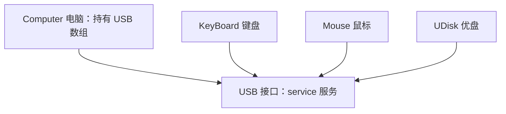
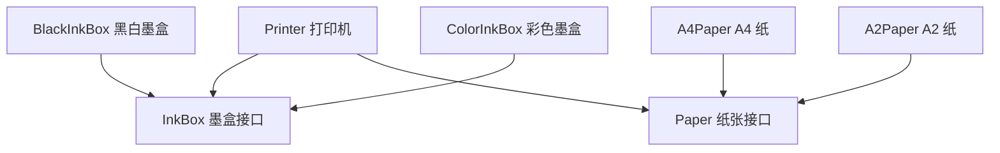

# 第五章 抽象类和接口

## 课前回顾

1. **子类能够继承父类中的哪些成员**

在任何情况下，子类可以继承父类中的公开的（public 修饰）、受保护的成员。在同一个包中，子类还可以继承父类中使用默认修饰符修饰的成员。因为构造方法不是类的成员，因此不能够被继承。

2. **方法重写的规则**

方法重写发生在具有继承关系的子类中，进行方法重写时，子类中重写的方法必须与父类中定义的方法具有相同的方法名和参数列表，返回值类型可以与父类中被重写的方法的返回值类型一致，也可以是父类中被重写的方法的返回值类型的子类（协变返回类型）。子类中重写方法的访问修饰符级别不能比父类中被重写的方法的访问修饰符级别低。

3. **super 关键字的使用**

a. super 用来调用父类中的成员：主要是为了区分子类与父类有相同的成员

b. super 用来调用父类的构造方法：必须是该构造方法中的第一条语句。

```java
public class Father{

    public Father(String name){
        super();
        this.name = name;
    }

    protected String name;

    public void show(){
        System.out.println("Father show");
    }
}

public class Child extends Father{

    public Child(String name){
        super(name);
        this.name = name;
    }

    private String name;

    @Override
    public void show(){
        System.out.println("Child show");
    }

    public void test(){
        this.show();//调用子类的方法
        super.show(); //调用父类的方法
        System.out.println(this.name);//打印子类中的name属性值
        System.out.println(super.name);//打印父类中的name属性值
    }
}
```

4. **万物皆对象的原理**

当创建对象时会使用构造方法，而在构造方法中，子类是无条件调用父类的构造方法。而 Object 类是所有类的隐式父类，因此，一个对象的创建必须要经过 Object 类的构造方法才能创建成功，而 Object 本身就表示对象的意思。因此，所有的类使用构造方法创建出来的都是对象。

## 章节内容

| 章节内容 | 要求 |
| :--- | :--- |
| 抽象类 | **重点** |
| 抽象方法 | **重点** |
| 接口 | **重点** |
| 接口方法 | **重点** |

## 章节目标

- 掌握抽象类的定义与使用
- 掌握抽象方法的定义与使用
- 掌握接口的定义与使用
- 掌握接口方法的定义与使用

---

## 第一节 抽象类

### 1. 概念

**抽象类来自官方的说明**

```text
An abstract class is a class that is declared abstract—it may or may not
include abstract methods. Abstract classes cannot be instantiated, but they
can be subclassed.
```

抽象类是被声明为 abstract 的类——它可能包含也可能不包含抽象方法。抽象类不能被实例化，但是可以被子类化（也就是可以被继承）。

**抽象类定义语法**

```java
public abstract class 类名{//定义一个抽象类

}
```

**抽象方法定义语法**

```java
访问修饰符 abstract 返回值类型 方法名(参数列表);//知道要做一件事情，但不知道具体怎么去做这件事情
```

### 2. 抽象类应用场景

一般来说，描述抽象的事物就需要使用抽象类。比如动物、设备、几何图形等。

**动物**

**代码实现**

```java
package com.cyx.abstractclass;

public abstract class Animal {

    //抽象方法是没有方法体的。因为方法体就是表示知道具体怎么去做这件事情。
    public abstract void eat();

}
```

```java
package com.cyx.abstractclass;

public class Panda extends Animal {

    @Override
    public void eat() {
        System.out.println("熊猫吃竹叶");
    }
}
```

```java
package com.cyx.abstractclass;

public class Tiger extends Animal{

    @Override
    public void eat() {
        System.out.println("老虎吃肉");
    }
}
```

```java
package com.cyx.abstractclass;

public class AnimalTest {

    public static void main(String[] args) {
        Animal a1 = new Panda();
        a1.eat();
        Animal a2 = new Tiger();
        a2.eat();
    }
}
```

如果一个类继承于一个抽象类，那么该类必须实现这个抽象类中的所有抽象方法。否则，该类必须定义为抽象类

抽象类不一定有抽象方法，但有抽象方法的类一定是抽象类

> 💡 补充：`Animal` 是抽象类，`Panda`、`Tiger` 继承它并实现了 `eat()`；测试类中只能用父类类型 `Animal` 去接收子类对象，不能写 `new Animal()`。

**继承关系**



**设备**

**代码实现**

```java
package com.cyx.device;

public abstract class Device {

    public abstract void work();//知道设备会工作，但不知道设备怎么工作
}
```

```java
package com.cyx.device;

import com.cyx.device.Device;

public class TV extends Device {

    @Override
    public void work() {
        System.out.println("电视机播放电视剧");
    }
}
```

```java
package com.cyx.device;

public class ElectronicFan extends Device {

    @Override
    public void work() {
        System.out.println("电风扇开始转起来了");
    }
}
```

```java
package com.cyx.device;

public class DeviceTest {

    public static void main(String[] args) {
        Device d1 = new TV();
        d1.work();

        Device d2 = new ElectronicFan();
        d2.work();
    }
}
```

**几何图形**

**代码实现**

```java
package com.cyx.shape;

public abstract class Shape {

    public abstract Number perimeter();//知道几何图形能算周长，但不知道怎么算

    public abstract Number area();//知道几何图形能算面积，但不知道怎么算
}
```

```java
package com.cyx.shape;

public class Rectangle extends Shape{

    private int width;

    private int length;

    public Rectangle(int width, int length) {
        this.width = width;
        this.length = length;
    }

    @Override
    public Integer perimeter() {
        return (length + width) * 2;
    }

    @Override
    public Integer area() {
        return length * width;
    }

}
```

```java
package com.cyx.shape;

public class Circle extends Shape{

    private int radius;

    public Circle(int radius) {
        this.radius = radius;
    }

    @Override
    public Double perimeter() {
        return 2 * Math.PI * radius;
    }

    @Override
    public Double area() {
        return Math.PI * radius * radius;
    }
}
```

```java
package com.cyx.shape;

public class ShapeTest {

    public static void main(String[] args) {
        Shape s1 = new Rectangle(10, 8);
        System.out.println(s1.perimeter());
        System.out.println(s1.area());

        Shape s2 = new Circle(10);
        System.out.println(s2.perimeter());
        System.out.println(s2.area());
    }
}
```

> 💡 补充：`Shape` 中两个抽象方法的返回值类型写的是 `Number`，而子类 `Rectangle` 重写后返回 `Integer`、`Circle` 返回 `Double`，这属于协变返回类型，返回值类型是父类返回值类型的子类即可。

---

## 第二节 接口

### 1. 概念

在软件工程中，软件与软件的交互很重要，这就需要一个约定。每个程序员都应该能够编写实现这样的约定。接口就是对约定的描述。

**接口来自官方的说明**

```text
In the Java programming language, an interface is a reference type, similar
to a class, that can contain only constants, method signatures, default
methods, static methods, and nested types. Method bodies exist only for
default methods and static methods. Interfaces cannot be instantiated—they
can only be implemented by classes or extended by other interfaces
```

在 Java 编程语言中，接口是类似于类的引用类型，它只能包含常量，方法签名，默认方法，静态方法和嵌套类型。方法主体仅适用于默认方法和静态方法。接口无法实例化——它们只能由类实现或由其他接口扩展。

```text
An interface declaration can contain method signatures, default methods,
static methods and constant definitions. The only methods that have
implementations are default and static methods.
```

接口声明可以包含方法签名，默认方法，静态方法和常量定义。具有实现的方法是默认方法和静态方法。

从上面的描述中可以得出：接口中没有构造方法。

### 2. 接口定义

**语法**

```java
[public] interface 接口名{

    [public static final]数据类型 变量名 = 变量的值; //接口中定义变量，该变量是静态常量，在定义的时候必须赋值

    返回值类型 方法名([参数列表]);//定义接口方法

    default 返回值类型 方法名([参数列表]){//接口中定义的默认方法，必须在JDK8及以上版本使用
        [return 返回值;]
    }

    static 返回值类型 方法名([参数列表]){//接口中定义的静态方法，必须在JDK8及以上版本使用
        [return 返回值;]
    }

    private 返回值类型 方法名([参数列表]){//接口中定义的私有方法，必须在JDK9及以上版本使用
        [return 返回值;]
    }
}
```

```java
package com.cyx.interfaceclass;

interface Test {

    public static final int number = 10;

    public abstract void show();

    public default int plus(int a, int b){
        return a + b;
    }

    public static int multiply(int a, int b){
        return a * b;
    }

//    private String getName(){
//        return "admin";
//    }
}
```

**示例**

使用接口描述人有名字

```java
package com.cyx.interfaceclass.person;

public interface Person {

    String getName(); //获取人的姓名
}
```

使用接口描述演员能表演

```java
package com.cyx.interfaceclass.person;

public interface Actor {

    void performance(); //演员表演
}
```

使用接口描述歌手能唱歌

```java
package com.cyx.interfaceclass.person;

public interface Singer {

    void sing(); //唱歌
}
```

使用接口描述艺人能代言

```java
package com.cyx.interfaceclass.person;

public interface Artist {

    void endorsement(); //代言
}
```

> 💡 补充：上面 `Actor`、`Singer`、`Artist` 三个接口是逐步演进的中间版本，下一节会给它们加上继承关系，最终版本见「接口继承」的示例代码。

### 3. 接口继承

**语法**

```java
[public] interface 接口名 extends 接口名1, 接口名2,...接口名n{

}
```

**示例**

使用接口继承描述演员是人

```java
package com.cyx.interfaceclass.person;

public interface Actor extends Person {

    void performance(); //演员表演
}
```

使用接口继承描述歌手是人

```java
package com.cyx.interfaceclass.person;

public interface Singer extends Person{

    void sing(); //唱歌
}
```

使用接口继承描述艺人既是演员也是歌手

```java
package com.cyx.interfaceclass.person;

public interface Artist extends Actor, Singer{

    void endorsement(); //代言
}
```

**注意**

接口可以多继承，这是 Java 中唯一可以使用多继承的地方。接口包含的变量都是静态常量，接口中包含的方法签名都是公开的抽象方法，接口中的默认方法和静态方法在 JDK8 及以上版本才能定义，接口的私有方法必须在 JDK9 及以上版本才能定义。接口编译完成后也会生成相应的 class 文件。

**接口继承关系**



### 4. 接口实现

**实现接口语法**

```java
访问修饰符 class 类名 implements 接口名1, 接口名2,...接口名n{

}
```

```text
A class that implements an interface must implement all the methods declared
in the interface.
```

实现接口的类必须实现接口中声明的所有方法。

一个类如果实现了一个接口，那么就必须实现这个接口中定义的所有抽象方法（包括接口通过继承关系继承过来的抽象方法），这个类被称为接口的实现类或者说子类。与继承关系一样，实现类与接口之间的关系是 is-a 的关系。

**示例**

使用实现接口的方式描述娱乐明星是艺人

```java
package com.cyx.interfaceclass.person;

public class EntertainmentStar implements Artist{

    private String name;

    public EntertainmentStar(String name) {
        this.name = name;
    }

    @Override
    public void endorsement() {
        System.out.printf("娱乐明星%s代言\n", getName());
    }

    @Override
    public void performance() {
        System.out.printf("娱乐明星%s表演\n", getName());
    }

    @Override
    public void sing() {
        System.out.printf("娱乐明星%s唱歌\n", getName());
    }

    @Override
    public String getName() {
        return name;
    }
}
```

```java
package com.cyx.interfaceclass.person;

public class PersonTest {

    public static void main(String[] args) {
        Person p = new EntertainmentStar("刘德华"); //娱乐明星是人
        System.out.println(p.getName());

        Actor a = new EntertainmentStar("范冰冰");//娱乐明星是演员
        a.performance();

        Singer s = new EntertainmentStar("张学友"); //娱乐明星是歌手
        s.sing();

        Artist artist = new EntertainmentStar("古天乐");//娱乐明星是艺人
        artist.endorsement();
        artist.performance();
        artist.sing();
    }
}
```

> 💡 补充：`PersonTest` 中同一个 `EntertainmentStar` 对象分别赋值给 `Person`、`Actor`、`Singer`、`Artist` 四种类型的变量，都能调用各自接口中声明的方法，这正是接口多态的效果。

### 5. 接口应用场景

一般来说，定义规则、定义约定时使用接口。

**示例**

计算机对外暴露有 USB 接口，USB 接口生产商只需要按照接口的约定生产相应的设备（比如 USB 键盘、USB 鼠标、优盘）即可。

USB 接口定义：

```java
package com.cyx.interfaceclass.usb;

public interface USB {

    void service(); //USB接口服务
}
```

USB 键盘遵守接口的约定，也就是实现这个接口

```java
package com.cyx.interfaceclass.usb;

public class KeyBoard implements USB{

    @Override
    public void service() {
        System.out.println("键盘已接入，可以开始打字了");
    }
}
```

USB 鼠标遵守接口的约定，也就是实现这个接口

```java
package com.cyx.interfaceclass.usb;

public class Mouse implements USB{

    @Override
    public void service() {
        System.out.println("鼠标已接入，可以开始移动光标了");
    }
}
```

优盘遵守接口的约定，也就是实现这个接口

```java
package com.cyx.interfaceclass.usb;

public class UDisk implements USB{

    @Override
    public void service() {
        System.out.println("优盘已接入，可以存储数据了");
    }
}
```

电脑拥有 USB 接口

```java
package com.cyx.interfaceclass.usb;

public class Computer {

    private USB[] usbArr = new USB[4]; //一台电脑拥有4个USB接口

    public void insertUsb(int index, USB usb){//插入USB接口
        if(index < 0 || index >= usbArr.length){
            System.out.println("请不要瞎搞");
        } else {
            usbArr[index] = usb;
            usb.service();
        }
    }
}
```

**测试**

```java
package com.cyx.interfaceclass.usb;

public class ComputerTest {

    public static void main(String[] args) {
        Computer computer = new Computer();
        computer.insertUsb(1, new Mouse());
    }
}
```

**接口实现关系**



**练习**

打印机对外暴露有墨盒（颜色）和纸张（大小）接口，墨盒生产商按照墨盒接口的约定生产黑白墨盒和彩色墨盒，纸张生产商按照纸张接口的约定生产 A2 纸和 A4 纸张。

```java
package com.cyx.printer;

/**
 * 墨盒
 */
public interface InkBox {

    String getColor(); //获取墨盒的颜色
}
```

```java
package com.cyx.printer;

public class BlackInkBox implements InkBox{

    @Override
    public String getColor() {
        return "黑白";
    }
}
```

```java
package com.cyx.printer;

public class ColorInkBox implements InkBox{

    @Override
    public String getColor() {
        return "彩色";
    }
}
```

```java
package com.cyx.printer;

/**
 * 纸张
 */
public interface Paper {

    String getSize();//获取纸张的大小
}
```

```java
package com.cyx.printer;

public class A4Paper implements Paper{

    @Override
    public String getSize() {
        return "A4";
    }
}
```

```java
package com.cyx.printer;

public class A2Paper implements Paper{

    @Override
    public String getSize() {
        return "A2";
    }
}
```

```java
package com.cyx.printer;

/**
 * 打印机
 */
public class Printer {

    private InkBox inkBox;

    private Paper paper;

    public Printer() {
    }

    public Printer(InkBox inkBox, Paper paper) {
        this.inkBox = inkBox;
        this.paper = paper;
    }

    public void print(){
        //print format 格式化打印不会换行  %s表示字符串站位   %d表示数字站位
        System.out.printf("打印机使用%s墨盒在%s纸张上打印\n", inkBox.getColor(), paper.getSize());
    }

    public InkBox getInkBox() {
        return inkBox;
    }

    public void setInkBox(InkBox inkBox) {
        this.inkBox = inkBox;
    }

    public Paper getPaper() {
        return paper;
    }

    public void setPaper(Paper paper) {
        this.paper = paper;
    }
}
```

```java
package com.cyx.printer;

public class PrinterTest {

    public static void main(String[] args) {
        Printer p1 = new Printer();
        p1.setPaper(new A4Paper());
        p1.setInkBox(new ColorInkBox());
        p1.print();

        Printer p2 =  new Printer(new BlackInkBox(), new A2Paper());
        p2.print();
    }
}
```

**打印机类图**



> 💡 补充：`Printer` 并不关心具体用哪个墨盒、哪种纸，它只持有 `InkBox`、`Paper` 两个接口类型的引用，由测试类在运行时（构造方法或 set 方法）传入具体实现，这就是「面向接口编程」的解耦效果。

---

## 第三节 总结

抽象类和接口的区别

1. 抽象类拥有构造方法，而接口没有构造方法
2. 抽象类可以定义成员变量、静态变量、静态常量，而接口中只能定义公开的静态常量
3. 抽象类中的方法可以有受保护、默认的方法，而接口中的方法都是公开的（JDK9 中可以定义的私有方法除外）
4. 抽象类主要应用在对于抽象事物的描述，而接口主要应用在对于约定、规则的描述
5. 抽象类只能够单继承，而接口可以多继承
