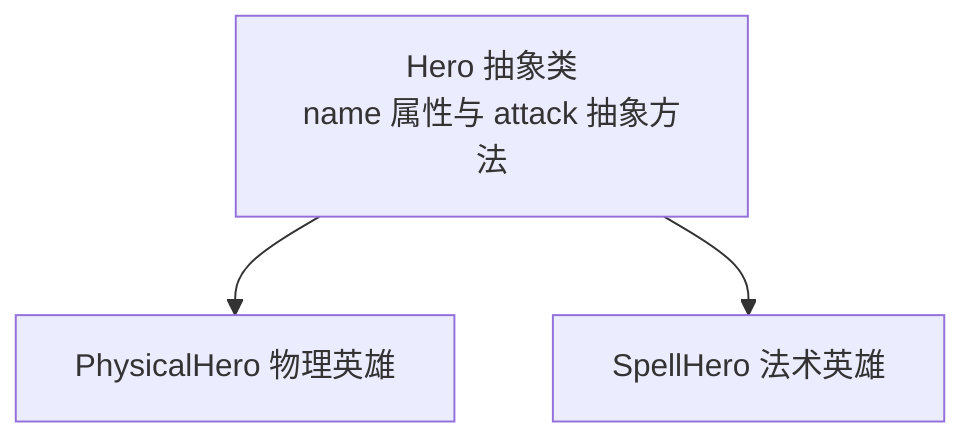
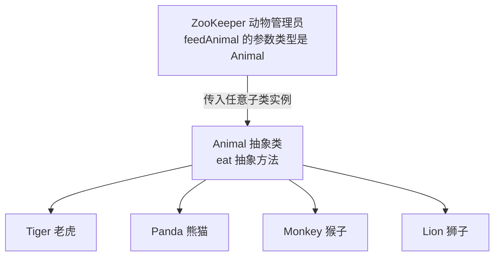

# 第六章 多态

## 课前回顾

### 1. 如何定义抽象类和抽象方法

```java
访问修饰符 abstract class 类名{

    访问修饰符 abstract 返回值 方法名(参数列表);
}
```

抽象类不一定有抽象方法，但是有抽象方法的类一定是抽象类

### 2. 如何定义接口，接口中能定义哪些方法

```java
访问修饰符 interface 接口名{
    数据类型 变量名 = 变量的值; //接口中定义的变量都是公开的静态常量

    返回值类型 方法名(参数列表); //接口中定义的方法都是公开的抽象方法

    default 返回值类型 方法名(参数列表){// 接口中定义的默认方法都是公开的 => JDK1.8
        //代码块
        [return 返回值;]
    }

    static 返回值类型 方法名(参数列表){// 接口中定义的静态方法都是公开的 => JDK1.8
        //代码块
        [return 返回值;]
    }

    private 返回值类型 方法名(参数列表){// 接口中定义的私有方法 => JDK1.9
        //代码块
        [return 返回值;]
    }
}
```

接口没有构造方法

### 3. 抽象类和接口的区别

a. 抽象类是一个类，所以抽象类只能单继承，而接口可以多继承。一个类在继承抽象类的同时还可以实现一个或多个接口

b. 抽象类拥有构造方法，而接口没有

c. 抽象类中可以定义成员变量和受保护的、受包保护的成员方法，而接口中定义的变量都是公开的静态常量，接口中定义的方法都是公开的抽象方法。

d. 接口主要用于功能性方面的描述，而抽象类更加注重的是抽象事物的描述。

---

## 章节内容

- 多态　**重点**
- 向下转型　**重点**
- Object 类常用方法　**重点**

## 章节目标

- 掌握多态的使用
- 掌握 instanceof 运算符的使用
- 掌握 Object 类的常用方法的使用

---

## 第一节 多态(Polymorphism)

### 1. 概念

**多态来自官方的说明**

```text
The dictionary definition of polymorphism refers to a principle in biology in
which an organism or species can have many different forms or stages. This
principle can also be applied to object-oriented programming and languages
like the Java language. Subclasses of a class can define their own unique
behaviors and yet share some of the same functionality of the parent class.

多态性的字典定义是指在生物学原理，其中的生物体或物质可具有许多不同的形式或阶段。该原理也可以应用于面向对象的编程和 Java 语言之类的语言。一个类的子类可以定义自己的独特行为，但可以共享父类的某些相同功能。
```

从上面的描述中我们可以得出：继承、接口就是多态的具体体现方式。多态主要体现在类别、做事的方式上面。多态是面向对象的三大特征之一，多态分为编译时多态和运行时多态两大类。

### 2. 编译时多态

方法重载在编译时就已经确定如何调用，因此方法重载属于编译时多态。

**案例**

计算任意两个数的和。

**代码实现**

```java
package com.cyx.polymorphism;

public class Calculator {

    public double calculate(double a, double b){
        return a + b;
    }

    public long calculate(long a, long b){
        return a + b;
    }

}
```

```java
package com.cyx.polymorphism;

public class CalculatorTest {

    public static void main(String[] args) {
        Calculator c = new Calculator();
        long result1 = c.calculate(1, 2);
        System.out.println(result1);
        double result2 = c.calculate(1.0, 2.0);
        System.out.println(result2);
    }
}
```

### 3. 运行时多态

```text
The Java virtual machine (JVM) calls the appropriate method for the object
that is referred to in each variable. It does not call the method that is
defined by the variable's type. This behavior is referred to as virtual
method invocation and demonstrates an aspect of the important polymorphism
features in the Java language.

Java 虚拟机（JVM）为每个变量中引用的对象调用适当的方法。它不会调用由变量类型定义的方法。这种行为称为虚拟方法调用，它说明了 Java 语言中重要的多态性特征的一个方面。
```

**案例**

**向上转型示意图**


```java
package com.cyx.polymorphism.p1;

public class Father {

    public void show(){
        System.out.println("Father Show");
    }
}
```

```java
package com.cyx.polymorphism.p1;

public class Child extends Father{

    @Override
    public void show() {
        System.out.println("Child Show");
    }
}
```

```java
package com.cyx.polymorphism.p1;

public class FatherTest {

    public static void main(String[] args) {
        //变量f的类型是Father
        Father f = new Child();
        //f调用show()时，不会调用Father定义的方法
        f.show();
    }
}
```

**案例**

王者荣耀中英雄都有名字，都会攻击，物理英雄会发动物理攻击，法术英雄发动法术攻击。

**继承关系**



```java
package com.cyx.polymorphism.hero;

public abstract class Hero {

    protected String name;

    public Hero(String name) {
        this.name = name;
    }

    public abstract void attack();
}
```

```java
package com.cyx.polymorphism.hero;

/**
 * 物理英雄
 */
public class PhysicalHero extends Hero {

    public PhysicalHero(String name) {
        super(name);
    }

    @Override
    public void attack() {
        System.out.println(name + "发动物理攻击");
    }
}
```

```java
package com.cyx.polymorphism.hero;

/**
 * 法术英雄
 */
public class SpellHero extends Hero{

    public SpellHero(String name) {
        super(name);
    }

    @Override
    public void attack() {
        System.out.println(name + "发动法术攻击");
    }
}
```

```java
package com.cyx.polymorphism.hero;

public class HeroTest {

    public static void main(String[] args) {
        Hero hero1 = new PhysicalHero("李白");
        hero1.attack();

        Hero hero2 = new SpellHero("安其拉");
        hero2.attack();
    }
}
```

**应用场景**

动物园中有老虎、熊猫、猴子等动物，每种动物吃的东西不一样，老虎吃肉，熊猫吃竹叶，猴子吃水果；动物管理员每天都会按时给这些动物喂食。

分析：

动物：吃东西

老虎、熊猫、猴子都是动物

动物管理员：喂食

**继承关系**



> 💡 补充：本案例的 `ZooKeeper`、`ZooKeeperTest` 会随需求逐步演进。下面首次给出完整代码，之后的每一步只列出新增或改动的内容，最终完整代码在“4. instanceof 运算符”一节给出。

```java
package com.cyx.polymorphism.animal;

public abstract class Animal {
    //动物吃东西，但不知道怎么吃
    public abstract void eat();
}
```

```java
package com.cyx.polymorphism.animal;

public class Tiger extends Animal{

    @Override
    public void eat() {
        System.out.println("老虎吃肉");
    }
}
```

```java
package com.cyx.polymorphism.animal;

public class Panda extends Animal{

    @Override
    public void eat() {
        System.out.println("熊猫吃竹叶");
    }
}
```

```java
package com.cyx.polymorphism.animal;

public class Monkey extends Animal{

    @Override
    public void eat() {
        System.out.println("猴子吃水果");
    }
}
```

```java
package com.cyx.polymorphism.animal;

/**
 * 动物管理员
 */
public class ZooKeeper {

    public void feedTiger(Tiger tiger){
        tiger.eat();
    }

    public void feedPanda(Panda panda){
        panda.eat();
    }

    public void feedMonkey(Monkey monkey){
        monkey.eat();
    }
}
```

```java
package com.cyx.polymorphism.animal;

public class ZooKeeperTest {

    public static void main(String[] args) {
        ZooKeeper keeper = new ZooKeeper();
        keeper.feedTiger(new Tiger());
        keeper.feedMonkey(new Monkey());
        keeper.feedPanda(new Panda());
    }
}
```

**思考**

思考：以上代码中动物管理员类的设计存在什么问题？

动物园中现在又要引入一种新的动物狮子

```java
package com.cyx.polymorphism.animal;

public class Lion extends Animal {

    @Override
    public void eat() {
        System.out.println("狮子吃肉");
    }
}
```

`ZooKeeper` 中需要再增加一个喂食方法：

```java
    public void feedLion(Lion lion){
        lion.eat();
    }
```

`ZooKeeperTest` 中也要增加一行调用：

```java
        keeper.feedLion(new Lion());
```

如果动物园大量的引入动物，那么这个动物管理类就得添加多个相应的喂食方法。这很显然存在设计上的缺陷，可以使用多态来优化。

`ZooKeeper` 中把上面所有的 `feedXxx` 方法注释掉，只保留一个 `feedAnimal()`，参数类型写成父类 `Animal`：

```java
    public void feedAnimal(Animal animal){
        animal.eat();
    }
```

`ZooKeeperTest` 的调用也随之统一：

```java
        keeper.feedAnimal(new Tiger());
        keeper.feedAnimal(new Monkey());
        keeper.feedAnimal(new Panda());
        keeper.feedAnimal(new Lion());
```

### 4. instanceof 运算符

instanceof 本身意思表示的是什么什么的一个实例。主要应用在类型的强制转换上面。在使用强制类型转换时，如果使用不正确，在运行时会报错。而 instanceof 运算符对转换的目标类型进行检测，如果是，则进行强制转换。这样可以保证程序的正常运行。

> 💡 补充：章节内容中提到的“向下转型”即本节讨论的强制类型转换——把父类类型的引用转回子类类型，例如 `((Tiger)animal)`；转型前先用 `instanceof` 判断，可以避免运行时出错。

**语法**

```java
对象名 instanceof 类名;  //表示检测对象是否是指定类型的一个实例。返回值类型为boolean类型
```

**示例**

为每个动物增加各自特有的方法：

```java
package com.cyx.polymorphism.animal;

public class Lion extends Animal {

    @Override
    public void eat() {
        System.out.println("狮子吃肉");
    }


    public void foraging(){
        System.out.println("狮子在觅食");
    }
}
```

```java
package com.cyx.polymorphism.animal;

public class Monkey extends Animal{

    @Override
    public void eat() {
        System.out.println("猴子吃水果");
    }

    public void climbing(){
        System.out.println("猴子在爬树");
    }

}
```

```java
package com.cyx.polymorphism.animal;

public class Panda extends Animal{

    @Override
    public void eat() {
        System.out.println("熊猫吃竹叶");
    }

    public void rolling(){
        System.out.println("熊猫在打滚");
    }
}
```

```java
package com.cyx.polymorphism.animal;

public class Tiger extends Animal {

    @Override
    public void eat() {
        System.out.println("老虎吃肉");
    }

    //子类特有的方法
    public void strolling(){
        System.out.println("老虎在漫步");
    }
}
```

```java
package com.cyx.polymorphism.animal;

/**
 * 动物管理员
 */
public class ZooKeeper {

//    public void feedTiger(Tiger tiger){
//        tiger.eat();
//    }
//
//    public void feedPanda(Panda panda){
//        panda.eat();
//    }
//
//    public void feedMonkey(Monkey monkey){
//        monkey.eat();
//    }
//
//    public void feedLion(Lion lion){
//        lion.eat();
//    }

    public void feedAnimal(Animal animal){
//        int a = (int)1.0;
        animal.eat();
        if(animal instanceof Tiger) //如果animal对象是一个Tiger类的实例
            ((Tiger)animal).strolling();
        else if(animal instanceof Monkey)//如果animal对象是一个Monkey类的实例
            ((Monkey) animal).climbing();
        else if (animal instanceof Lion)//如果animal对象是一个Lion类的实例
            ((Lion) animal).foraging();
        else if (animal instanceof Panda)//如果animal对象是一个Panda类的实例
            ((Panda) animal).rolling();
    }
}
```

```java
package com.cyx.polymorphism.animal;

public class ZooKeeperTest {

    public static void main(String[] args) {
        ZooKeeper keeper = new ZooKeeper();
//        keeper.feedTiger(new Tiger());
//        keeper.feedMonkey(new Monkey());
//        keeper.feedPanda(new Panda());
//        keeper.feedLion(new Lion());
        keeper.feedAnimal(new Tiger());
        keeper.feedAnimal(new Monkey());
        keeper.feedAnimal(new Panda());
        keeper.feedAnimal(new Lion());
    }
}
```

**练习**

某商城有电视机、电风扇、空调等电器设备展示。现有质检人员对这些电器设备一一检测，如果是电视机，就播放视频来检测；如果是电风扇，就启动电风扇；如果空调，就进行制冷操作。

分析：

设备：展示

电视机、电风扇、空调是电器设备：展示

```java
package com.cyx.polymorphism.device;

/**
 * 设备
 */
public abstract class Device {

    public abstract void show();
}
```

```java
package com.cyx.polymorphism.device;

public class TV extends  Device{

    @Override
    public void show() {
        System.out.println("这是长虹电视机");
    }

    public void playVideo(){
        System.out.println("播放视频");
    }

}
```

```java
package com.cyx.polymorphism.device;

/**
 * 空调
 */
public class AirConditioning extends Device{

    @Override
    public void show() {
        System.out.println("这是格力空调");
    }

    public void airColder(){
        System.out.println("空调制冷");
    }
}
```

```java
package com.cyx.polymorphism.device;

/**
 * 电风扇
 */
public class ElectronicFan extends Device{


    @Override
    public void show() {
        System.out.println("这是一把高级的电风扇");
    }

    public void start(){
        System.out.println("电风扇启动了");
    }
}
```

```java
package com.cyx.polymorphism.device;

/**
 * 质检
 */
public class QualityInspection {

    public void test(Device device){
        device.show();
        if(device instanceof TV)
            ((TV) device).playVideo();
        else if(device instanceof ElectronicFan)
            ((ElectronicFan) device).start();
        else if(device instanceof AirConditioning)
            ((AirConditioning) device).airColder();
    }

}
```

```java
package com.cyx.polymorphism.device;

public class DeviceTest {

    public static void main(String[] args) {
        QualityInspection qi = new QualityInspection();
        qi.test(new TV());
        qi.test(new ElectronicFan());
        qi.test(new AirConditioning());
    }
}
```

---

## 第二节 Object 类常用方法

Object 类中定义的方法大多数都是属于 native 方法，native 表示的是本地方法，实现方式是在 C++ 中。

> 💡 补充：本节用同一个 `Student` 类反复演示 Object 方法的重写过程。首次给出完整的类，之后只列出新增或改动的方法；`StudentTest` 每次都贴出完整代码；最终完整代码见最后 `finalize()` 一节的示例。

### 1. getClass()

```java
public final Class getClass()
//The getClass() method returns a Class object, which has methods you can use to get information about the
//class, such as its name (getSimpleName()), its superclass (getSuperclass()), and the interfaces it
//implements (getInterfaces()).
//getClass() 方法返回一个 Class 对象，该对象具有可用于获取有关该类的信息的方法，例如其名称
//(getSimpleName())，其超类 (getSuperclass()) 及其实现的接口 (getInterfaces())。
```

**示例**

```java
package com.cyx.polymorphism.object;

import com.cyx.polymorphism.device.TV;

public class ObjectTest {

    public static void main(String[] args) {
        TV tv = new TV();
        Class clazz = tv.getClass();
        String name = clazz.getSimpleName();//获取类名
        System.out.println(name);
        String className = clazz.getName(); //获取类的全限定名
        System.out.println(className);
        Class superClass = clazz.getSuperclass(); //获取父类的定义信息
        String superName = superClass.getSimpleName();//获取父类的名称
        System.out.println(superName);
        String superClassName = superClass.getName(); //获取父类的全限定名
        System.out.println(superClassName);

        String s = "admin";
        Class stringClass = s.getClass();
        Class[] interfaceClasses = stringClass.getInterfaces();
        for(int i=0; i<interfaceClasses.length; i++){
            Class interfaceClass = interfaceClasses[i];
            String interfaceName = interfaceClass.getSimpleName();//获取接口的名称
            System.out.println(interfaceName);
            String interfaceClassName = interfaceClass.getName(); //获取接口的全限定名
            System.out.println(interfaceClassName);
        }
    }
}
```

### 2. hashCode()

```java
public int hashCode()
//The value returned by hashCode() is the object's hash code, which is the object's memory address in
//hexadecimal.
//hashCode() 返回值是对象的哈希码，即对象的内存地址（十六进制）。
//By definition, if two objects are equal, their hash code must also be equal. If you override the equals()
//method, you change the way two objects are equated and Object's implementation of hashCode() is no longer
//valid. Therefore, if you override the equals() method, you must also override the hashCode() method as
//well.
//根据定义，如果两个对象相等，则它们的哈希码也必须相等。如果重写 equals() 方法，则会更改两个对象的
//相等方式，并且 Object 的 hashCode() 实现不再有效。因此，如果重写 equals() 方法，则还必须重写
//hashCode() 方法。
```

Object 类中的 hashCode() 方法返回的就是对象的内存地址。一旦重写 hashCode() 方法，那么 Object 类中的 hashCode() 方法就是失效，此时的 hashCode() 方法返回的值不再是内存地址。

**示例**

```java
package com.cyx.polymorphism.hashcode;

public class Student {

    private String name;

    private int age;

    public Student(String name, int age) {
        this.name = name;
        this.age = age;
    }

    //hashCode()方法被重写之后，返回的值就不再是对象的内存地址
    @Override
    public int hashCode() {
        return 1;
    }
}
```

```java
package com.cyx.polymorphism.hashcode;

public class StudentTest {

    public static void main(String[] args) {
        Student s1 = new Student("张三", 1);
        Student s2 = new Student("张三", 1);
    }
}
```

### 3. equals(Object obj)

```java
public boolean equals(Object obj)
//The equals() method compares two objects for equality and returns true if they are equal. The equals()
//method provided in the Object class uses the identity operator (==) to determine whether two objects are
//equal. For primitive data types, this gives the correct result. For objects, however, it does not. The
//equals() method provided by Object tests whether the object references are equal—that is, if the objects
//compared are the exact same object.
//equals() 方法比较两个对象是否相等，如果相等则返回 true。Object 类中提供的 equals() 方法使用身份
//运算符（==）来确定两个对象是否相等。对于原始数据类型，这将给出正确的结果。但是，对于对象，则不是。
//Object 提供的 equals() 方法测试对象引用是否相等，即所比较的对象是否完全相同。
//To test whether two objects are equal in the sense of equivalency (containing the same information), you
//must override the equals() method.
//要测试两个对象在等效性上是否相等（包含相同的信息），必须重写 equals() 方法。
```

**示例**

`Student` 类中新增 `equals()`，并按约定同时重写 `hashCode()`：

```java
    //1. 比较内存地址
    //2. 检测是否是同一类型
    //3. 检测属性是否相同
    @Override
    public boolean equals(Object o) {
        if(this == o) return true;
        //比较类的定义是否一致
        if(this.getClass() != o.getClass()) return false;
        //类的定义一致，那么对象o就可以被强制转换为Student
        Student other = (Student) o;
        return this.name.equals(other.name) && this.age == other.age;
    }

    //hashCode()方法被重写之后，返回的值就不再是对象的内存地址
    @Override
    public int hashCode() {
        return name.hashCode() + age;
    }
```

```java
package com.cyx.polymorphism.hashcode;

public class StudentTest {

    public static void main(String[] args) {
        Student s1 = new Student("张三", 1);
        Student s2 = new Student("张三", 1);
        boolean result = s1.equals(s2);
        System.out.println(result);
        System.out.println(s1.hashCode());
        System.out.println(s2.hashCode());
    }
}
```

根据定义，如果两个对象相等，则它们的哈希码也必须相等，反之则不然。

重写了 equals 方法，就需要重写 hashCode 方法，才能满足上面的结论

**面试题：请描述 == 和 equals 方法的区别**

基本数据类型使用 == 比较的就是两个数据的字面量是否相等。引用数据类型使用 == 比较的是内存地址。equals 方法来自 Object 类，本身实现使用的就是 ==，此时它们之间没有区别。但是 Object 类中的 equals 方法可能被重写，此时比较就需要看重写逻辑来进行。

### 4. toString()

```java
public String toString()
//You should always consider overriding the toString() method in your classes.
//你应该始终考虑在类中重写 toString() 方法。
//The Object's toString() method returns a String representation of the object, which is very useful for
//debugging. The String representation for an object depends entirely on the object, which is why you need
//to override toString() in your classes.
//Object 的 toString() 方法返回该对象的 String 表示形式，这对于调试非常有用。对象的 String 表示形
//式完全取决于对象，这就是为什么你需要在类中重写 toString() 的原因。
```

**示例**

`Student` 类中新增：

```java
    @Override
    public String toString() {
        return name + "\t" + age;
    }
```

```java
package com.cyx.polymorphism.hashcode;

public class StudentTest {

    public static void main(String[] args) {
        Student s1 = new Student("张三", 1);
        System.out.println(s1);
    }
}
```

### 5. finalize()

```java
protected void finalize() throws Throwable
//The Object class provides a callback method, finalize(), that may be invoked on an object when it becomes
//garbage. Object's implementation of finalize() does nothing—you can override finalize() to do cleanup,
//such as freeing resources.
//Object 类提供了一个回调方法 finalize()，当该对象变为垃圾时可以在该对象上调用该方法。Object 类的
//finalize() 实现不执行任何操作——你可以覆盖 finalize() 进行清理，例如释放资源。
```

**示例**

```java
    //当一个Student对象变成垃圾时可能会被调用
    @Override
    protected void finalize() throws Throwable {
        this.name = null;
        System.out.println("所有资源已释放完毕，可以进行清理了");
    }
```

`Student` 与 `StudentTest` 的完整代码如下：

```java
package com.cyx.polymorphism.hashcode;

public class Student {

    private String name;

    private int age;

    public Student(String name, int age) {
        this.name = name;
        this.age = age;
    }

    //如果两个对象相等，那么它们的哈希码一定相等。反之则不然。

    //如果重写了equals方法，那么一定要重写hashCode方法。因为不重写hashCode方法
    //就会调用Object类中的hashCode方法，得到的是内存地址。不同对象的内存地址是
    //不一致的。但是equals方法重写后，比较的不是内存地址，而是对象的内部信息，这样
    //就会造成多个不同的对象相等但却拥有不同的哈希码
    @Override
    public boolean equals(Object o) {
       if(this == o) return true;
       //比较类的定义是否一致
       if(this.getClass() != o.getClass()) return false;
       //类的定义一致，那么对象o就可以被强制转换为Student
       Student other = (Student) o;
       return this.name.equals(other.name) && this.age == other.age;
    }

    //hashCode()方法被重写之后，返回的值就不在是对象的内存地址
    @Override
    public int hashCode() {
        return name.hashCode() + age;
    }

    @Override
    public String toString() {
        return name + "\t" + age;
    }

    //当一个Student对象变成垃圾时可能会被调用
    @Override
    protected void finalize() throws Throwable {
        this.name = null;
        System.out.println("所有资源已释放完毕，可以进行清理了");
    }
}
```

```java
package com.cyx.polymorphism.hashcode;

public class StudentTest {

    public static void main(String[] args) {
        show();
        //garbage collector
        System.gc(); //调用系统的垃圾回收器进行垃圾回收
        System.out.println("这是最后一行代码了");
    }

    public static void show(){
        //s对象的作用范围只是在show()方法中，一旦方法执行完毕，那么
        //s对象就应该消亡，释放内存
        Student s = new Student("李四",20);
        System.out.println(s);
    }
}
```
