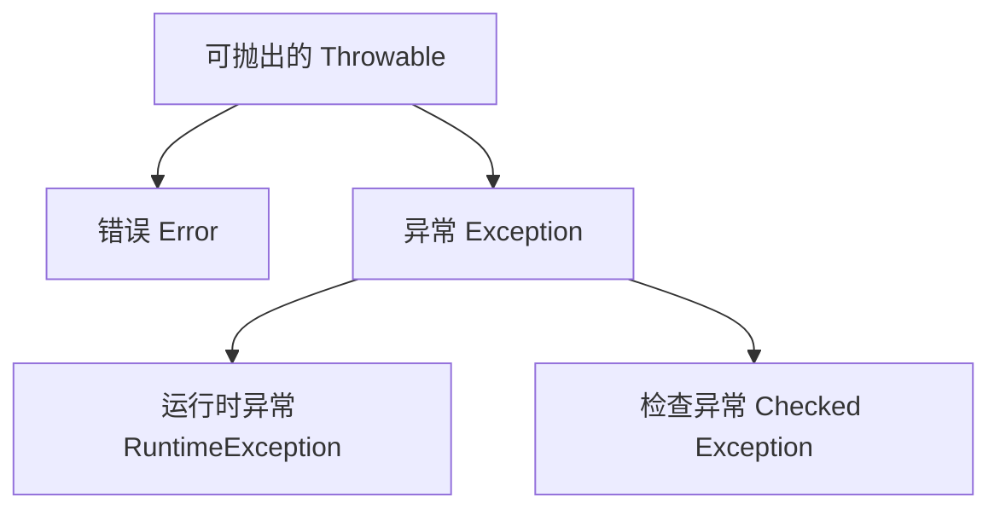

# 第七章 异常

## 课前回顾

### 1. 解释说明编译时多态和运行时多态

编译时多态主要体现在方法重载上，在编译的时候就已经确定了方法如何调用。

运行时多态主要体现在方法重写上，因为只有在程序运行时才知道一个对象的引用到底指向堆内存中的某一个具体对象，从而才能确定调用哪个对象的方法。

```java
public abstract class Animal {

    public abstract void eat();

}

public class Tiger extends Animal{

    @Override
    public void eat(){
        System.out.println("老虎吃肉");
    }

    public void strolling(){
        System.out.println("老虎在漫步");
    }

}

public class Panda extends Animal{

    @Override
    public void eat(){
        System.out.println("熊猫吃竹叶");
    }

    public void sleep(){
        System.out.println("熊猫睡懒觉");
    }

}

public class AnimalTest{

    public static void main(String[] args){
        Animal animal = new Tiger();
        animal.eat();
        if(animal instanceof Tiger){
            ((Tiger)animal).strolling();
        } else if(animal instanceof Panda){
            ((Panda)animal).sleep();
        }
    }

}
```

### 2. 解释说明 instanceof 运算符的作用

instanceof 运算符的作用就是检测某个对象是否是某个类型的一个实例。主要用来进行向下转型（强制类型转换），它能够确保向下转型的正确使用。instanceof 运算符只能用在具有继承关系的类中。

### 3. 两个对象的哈希码相同，它们相等吗

不一定。因为 Object 类中的 hashCode 方法可以被重写，得出的结果是通过计算来的。因此出现同样的哈希码时，可能使用的是不同的方式计算得出。那么哈希码相同时，对象不一定相等。但如果对象相等，那么它们之间的哈希码一定相同。

### 4. Object 类的 finalize() 方法有什么作用

Object 类的 finalize() 方法主要是在垃圾回收器回收垃圾时调用，用于释放资源。

## 章节内容

| 章节内容 | 要求 |
| :--- | :--- |
| 异常体系 | 熟悉 |
| 异常处理 | **重点** |
| 自定义异常 | **重点** |

## 章节目标

- 熟悉异常体系
- 掌握异常处理
- 会自定义异常

---

## 第一节 异常(Exception)

### 1. 概念

**来自官方的说明**

```text
An exception is an event, which occurs during the execution of a program,
that disrupts the normal flow of the program's instructions.
```

异常是在程序执行期间发生的事件，该事件中断了程序指令的正常流程。

```text
When an error occurs within a method, the method creates an object and hands
it off to the runtime system. The object, called an exception object,
contains information about the error, including its type and the state of the
program when the error occurred. Creating an exception object and handing it
to the runtime system is called throwing an exception.
```

当方法内发生错误时，该方法将创建一个对象并将其交给运行时系统。该对象称为异常对象，包含有关错误的信息，包括错误的类型和发生错误时程序的状态。创建异常对象并将其交给运行时系统称为抛出异常。

异常是由方法抛出

**示例**

```java
package com.cyx.exception;

public class Example1 {

    public static void main(String[] args) {
        calculate();
    }

    public static void calculate(){
        int result = 1 / 0;
        System.out.println(result);//该行代码不能够被执行
    }
}
```

### 2. 异常体系



**Throwable**

是所有异常的父类。其常用方法如下：

```java
public Throwable();

public Throwable(String message);

public String getMessage();//获取异常发生的原因

public void printStackTrace(); //打印异常在栈中的轨迹信息
```

**Error**

Error 是一种非常严重的错误，程序员不能通过编写解决。

**Exception**

Exception 表示异常的意思，主要是程序员在编写代码时考虑不周导致的问题。异常分为运行时异常和检查异常两大类，一旦程序出现这些异常，程序员应该处理这些异常。

**RuntimeException**

RuntimeException 表示运行时异常，所有在程序运行的时候抛出的异常类型都是属于 RuntimeException 的子类。运行时异常一般来说程序可以自动恢复，不必处理。

**检查异常**

检查异常是指编译器在编译代码的过程中发现不正确的编码所抛出的异常。

---

## 第二节 异常处理

### 1. 如何处理异常

在 Java 中，异常的种类很多，如果每一种异常类型我们都需要去记住，这无疑是一件很困难的事。如果能够有一套机制来处理异常，那么将减少程序员在开发时的耗时。Java 就提供了一套异常处理机制来处理异常。Java 处理异常使用了 5 个关键字：throw、throws、try、catch、finally

### 2. throw 抛出异常

throw 关键字只能在方法内部使用，throw 关键字抛出异常表示自身并未对异常进行处理。

**语法**

```java
throw 异常对象; //通常与 if 选择结构配合使用
```

**示例**

```java
package com.cyx.exception;

import java.util.Scanner;

public class Example1 {

    private static Scanner sc = new Scanner(System.in);

    public static void main(String[] args) {
        calculate();
    }

    public static void calculate(){
        System.out.println("请输入一个数字：");
        int number1 = sc.nextInt();
        System.out.println("请再输入一个数字：");
        int number2 = sc.nextInt();
        if(number2 == 0){
            ArithmeticException e = new ArithmeticException("在除法运算中除数不能为零");
            throw e;
        }
        int result = number1 / number2;
        System.out.println(result);//该行代码不能够被执行
    }
}
```

> 💡 补充：本节两处示例都命名为 `Example1`，且包名同为 `com.cyx.exception`，实际编写时同一个包内不能存在两个同名类，这里应视为前后两段独立演示。

### 3. throws 声明可能抛出的异常类型

throws 关键字只能应用在方法或者构造方法的定义上对可能抛出的异常类型进行声明，自身不会对异常做出处理，由方法的调用者来处理。如果方法的调用者未处理，则异常将持续向上一级调用者抛出，直至 main() 方法为止，如果 main() 方法也未处理，那么程序可能因此终止

**语法**

```java
访问修饰符 返回值类型 方法名(参数列表) throws 异常类型1,异常类型2,...异常类型n{

}
```

**示例**

```java
package com.cyx.exception;

import java.util.InputMismatchException;
import java.util.Scanner;

public class Example2 {

    private static Scanner sc = new Scanner(System.in);

    public static void main(String[] args) {
        int result = devided();
        System.out.println(result);
    }

    public static int devided() throws InputMismatchException, ArithmeticException{
        int number1 = getNumber();
        int number2 = getNumber();
        return number1 / number2;
    }

    /**
     *
     * @return
     * @throws InputMismatchException 执行该方法时可能会抛出InputMismatchException
     */
    public static int getNumber() throws InputMismatchException {
        System.out.println("请输入一个数字：");
        int number = sc.nextInt();
        return number;
    }
}
```

throws 可以声明方法执行时可能抛出的异常类型，但需要注意的是：方法执行过程中只能抛出声明的异常类型的其中一个异常。

### 4. try-catch 捕获异常

throw 和 throws 关键字均没有对异常进行处理，这可能会导致程序终止。在这种情况下，可以使用 try-catch 结构来对抛出异常进行捕获处理，从而保证程序能够正常运行。

**语法**

```java
try{
    //代码块
} catch(异常类型 异常对象名){

}
```

其中 try 表示尝试的意思，尝试执行 try 结构中的代码块，如果执行过程中抛出了异常，则交给 catch 语句块进行捕获操作

**示例**

```java
package com.cyx.exception;

import java.util.InputMismatchException;
import java.util.Scanner;

public class Example3 {

    private static Scanner sc = new Scanner(System.in);

    public static void main(String[] args) {
        try {
            int number = getNumber();
            System.out.println(number);
        } catch (InputMismatchException e){
            e.printStackTrace();//打印异常轨迹
            System.out.println(e.getClass().getName());
            System.out.println("异常信息："+ e.getMessage());
            System.out.println("请不要瞎搞，只能数数字");
        }
        System.out.println("发生异常也会执行");
    }

    /**
     *
     * @return
     * @throws InputMismatchException 执行该方法时可能会抛出InputMismatchException
     */
    public static int getNumber() throws InputMismatchException {
        System.out.println("请输入一个数字：");
        int number = sc.nextInt();
        return number;
    }
}
```

**思考**

如果一个方法可能抛出多个异常，如何捕获？

可以在 try 后面添加多个 catch 子句来分别对每一种异常进行处理。

**示例**

```java
package com.cyx.exception;

import java.util.InputMismatchException;
import java.util.Scanner;

public class Example3 {

    private static Scanner sc = new Scanner(System.in);

    public static void main(String[] args) {
        int result = devided();
        System.out.println(result);
    }

    public static int devided() {
        try {
            int number1 = getNumber();
            int number2 = getNumber();
            return number1 / number2;
        } catch (InputMismatchException e){
            System.out.println("请不要瞎搞，只能数数字");
            return -1;
        } catch (ArithmeticException e){
            System.out.println("在除法运算中除数不能为零");
            return -2;
        }
    }

    /**
     *
     * @return
     * @throws InputMismatchException 执行该方法时可能会抛出InputMismatchException
     */
    public static int getNumber() throws InputMismatchException {
        System.out.println("请输入一个数字：");
        int number = sc.nextInt();
        return number;
    }
}
```

当使用多个 catch 子句捕获异常时，如果捕获的多个异常对象的数据类型具有继承关系，那么父类异常不能放在前面。

### 5. finally 语句

finally 语句不能单独使用，必须与 try 语句或者 try-catch 结构配合使用，表示无论程序是否发生异常都会执行，主要用于释放资源。但如果在 try 语句或者 catch 语句中存在系统退出的代码，则 finally 语句将得不到执行。

```java
System.exit(0); //系统正常退出 0-正常退出 非0-异常退出

System.exit(1); //系统异常退出
```

**语法**

```java
try{

} finally{

}

//或者

try{

} catch(异常类型 异常对象名){

} finally{

}
```

**示例**

```java
package com.cyx.exception;

public class Example4 {

    private static int[] numbers = {1, 2, 3, 4, 5};

    public static void main(String[] args) {
        try {
            int number = getNumberFromArray(5);
            System.out.println(number);
        } catch (ArrayIndexOutOfBoundsException e){
            System.out.println("数组下标越界了");
            System.exit(0);
        } finally {
            System.out.println("需要执行的代码");
        }
    }

    public static int getNumberFromArray(int index){
        return numbers[index];
    }
}
```

### 面试题

分析如下代码的执行结果：

```java
public class Example5 {

    public static void main(String[] args) {
        int result = getResult();
        System.out.println(result);
    }

    public static int getResult(){
        int number = 10;
        try { //尝试执行
            //返回值 => 尝试返回一个结果，但发现后面还有finally模块，而finally模块一定会得到执行。于是在这里只能将
            //返回值使用一个临时变量(例如变量a)存储起来。然后再执行finally模块，finally模块执行完之后，再将这个临时
            //变量(a)存储的值返回
            return number;
        } catch (Exception e){
            return 1;
        } finally {
            number++;
        }
    }
}
```

---

## 第三节 自定义异常

### 1. 为什么要使用自定义异常

在 Java 中，异常的类型非常的多，要想使用这些异常，首先必须要熟悉它们。这无疑是一个巨大的工作量，很耗费时间。如果我们可以自定义异常，则只需要熟悉 RuntimeException、Exception 和 Throwable 即可。这大大缩小了熟悉范围。自定义异常还可以帮助我们快速的定位问题。

**自定义运行时异常语法**

```java
public class 类名 extends RuntimeException{}
```

**自定义检查异常语法**

```java
public class 类名 extends Exception{}
```

**示例**

在登录时经常会看到提示："用户名不存在"或者"账号或密码错误"。请使用自定义异常来描述该场景

```java
package com.cyx.exception;

/**
 * 用户名不存在异常
 *
 * 异常命名规范：场景描述+Exception
 */
public class UsernameNotFoundException extends Exception{

    public UsernameNotFoundException(){}

    public UsernameNotFoundException(String msg){
        super(msg);
    }

}
```

```java
package com.cyx.exception;

/**
 * 账号或密码错误异常
 */
public class BadCredentialsException extends Exception{


    public BadCredentialsException(){

    }

    public BadCredentialsException(String msg){
        super(msg);
    }
}
```

```java
package com.cyx.exception;

import java.util.Scanner;

public class Login {

    private static Scanner sc = new Scanner(System.in);

    public static void main(String[] args) {
        System.out.println("请输入账号：");
        String username = sc.next();
        System.out.println("请输入密码：");
        String password = sc.next();
        try {
            login(username, password);
        } catch (UsernameNotFoundException e) {
            e.printStackTrace();
        } catch (BadCredentialsException e) {
            e.printStackTrace();
        }
    }

    public static void login(String username, String password) throws UsernameNotFoundException, BadCredentialsException {
        if("admin".equals(username)){
            if("123456".equals(password)){
                System.out.println("登录成功");
            } else {
                throw new BadCredentialsException("账号或密码错误");
            }
        } else {
            throw new UsernameNotFoundException("账号不存在");
        }
    }
}
```

### 2. 异常使用注意事项

a. 运行时异常可以不处理。

b. 如果父类抛出了多个异常，子类覆盖父类方法时，只能抛出相同的异常或者是该异常的子集。(与协变返回类型原理一致)

c. 父类方法没有抛出异常，子类覆盖父类该方法时也不可抛出检查异常。此时子类产生该异常，只能捕获处理，不能声明抛出

```java
package com.cyx.exception;

public class Father {

    public void eat() throws Exception{

    }

    public void sleep(){

    }

    public void login(){

    }
}
```

```java
package com.cyx.exception;

public class Child extends Father {

    private String username;

    private String password;

    public Child(String username, String password) {
        this.username = username;
        this.password = password;
    }

    @Override
    public void eat() throws UsernameNotFoundException {

    }

    //父类中的方法没有声明抛出异常，子类中方法可以声明抛出运行时异常
    @Override
    public void sleep() throws RuntimeException{

    }

    //父类中的方法没有声明抛出异常，子类中方法不能声明抛出检查异常
    @Override
    public void login() {
        try {
            Login.login(username, password);
        } catch (UsernameNotFoundException e) {
            e.printStackTrace();
        } catch (BadCredentialsException e) {
            e.printStackTrace();
        }
    }
}
```
