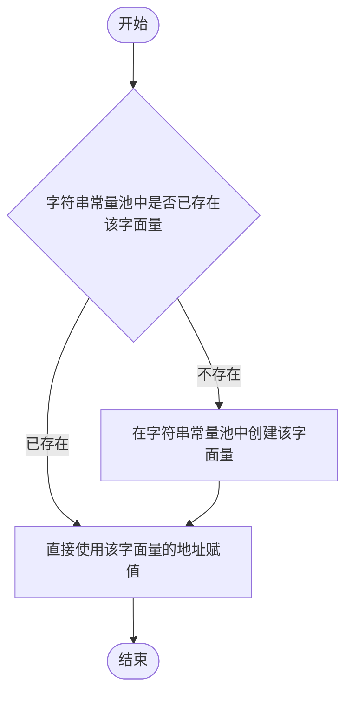
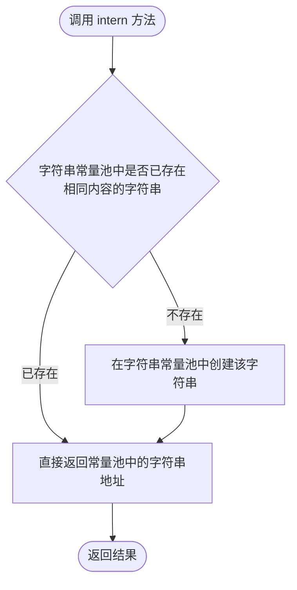

# 第八章 字符串

## 课前回顾

### 1. 简单描述异常体系

Throwable 表示可抛出的异常，所有的异常都是 Throwable 的子类。可抛出的异常分为 Error 和 Exception 两大类。

Error 表示非常严重的错误，程序员无法通过修改编码解决。

Exception 表示异常，异常又分为运行时异常（RuntimeException）和检查异常（Exception）。

### 2. 解释说明 try、catch、finally、throw、throws 关键字的使用

throw 表示抛出一个具体的异常实例。通常与 if 选择结构配合使用，只适用于方法内部。

throws 表示在方法或者构造方法的定义上面声明可能抛出的异常类型。

throw 和 throws 都没有对异常进行处理，只是转移了异常所处的场所。

try-catch 结构就是对异常进行捕获处理。其中 try 表示尝试执行其后的代码块，如果出现异常，则由 catch 子句进行捕获操作。

finally 不能够单独使用，只能与 try 或者 try-catch 结构配合使用。finally 模块中的代码一般来说都会被执行，除非 try 或者 catch 中包含有 `System.exit(0)`，finally 模块主要用于释放资源。

### 3. 描述异常使用的注意事项

- 运行时异常可以不用处理
- 子类重写父类方法时，如果父类方法有异常抛出声明，那么子类重写时也可以声明相同的异常或者该异常的子类
- 子类重写父类方法时，如果父类方法没有异常抛出声明，那么子类重写时可以声明抛出运行时异常，但不能抛出检查异常。如果方法体中的代码抛出检查异常，则需要捕获处理。

## 章节内容

| 章节内容 | 要求 |
| :--- | :--- |
| String 的使用 | **重点** |
| StringBuilder 以及 StringBuffer 的使用 | **重点** |

## 章节目标

- 掌握字符串的创建方式
- 掌握字符串的常用方法
- 掌握 StringBuilder 以及 StringBuffer 中的常用方法

---

## 第一节 String

### 1. 特性介绍

- String 类位于 `java.lang` 包中，无需引入，直接使用即可。
- String 类是由 `final` 修饰的，表示 String 类是一个最终类，不能够被继承。
- String 类构建的对象不可再被更改

**示例**

String 类由 `final` 修饰，因此下面的写法会编译报错：

```java
package com.cyx.string;

//public class MyString extends String{
//}
```

创建一个字符串对象，并对其进行拼接，观察字符串是否被更改：

```java
package com.cyx.string;

public class Example1 {

    public static void main(String[] args) {
        //当使用一个字面量给字符串赋值时，首先会去字符串常量池中检测是否存在这个字面量。如果存在，
        //则直接使用这个字面量的地址赋值即可。如果不存在，则需要在字符串常量池中创建这个字面量，然后
        //再将地址赋值过去即可。
        String s = "超用心";
        s += "在线教育";//这里的字符串拼接动作发生在堆内存上
        System.out.println(s);
    }
}
```

上面代码在使用字面量给字符串赋值时，会先访问字符串常量池，其过程如下：



> 💡 补充：`s += "在线教育"` 并不是在原字符串上修改，而是新创建了一个字符串对象，拼接动作发生在堆内存上，因此 `String` 类的对象是“不可再被更改”的。

### 2. 常用构造方法

**语法**

```java
public String(String original);

public String(char value[]);

public String(char value[], int offset, int count);

public String(byte bytes[]);

public String(byte bytes[], int offset, int length);

public String(byte bytes[], Charset charset);
```

**示例**

```java
package com.cyx.string;

import java.nio.charset.Charset;

public class Example2 {

    public static void main(String[] args) {
        String s = "超用心在线教育";
        System.out.println(s);
        //这里会创建两个对象：一个是字面量会在常量池中创建一个对象，
        //另一个是new String("")构造方法创建出来的对象
        String s1 = new String("超用心在线教育");
        System.out.println(s1);

        char[] values = {'a','d','m','i','n'};
        String s2 = new String(values);
        System.out.println(s2);
        //在使用这个构造方法时必须要考虑到数组下标越界的可能性
        String s3 = new String(values, 1, 3);
        System.out.println(s3);

        //字节可以存储整数，字符也可以使用整数表示，这个整数就是ASCII码对应的整数值
        byte[] bytes = {97, 98, 99, 100, 101, 102};
        String s4 = new String(bytes);
        System.out.println(s4);
        String s5 = new String(bytes, 2, 3);
        System.out.println(s5);

        Charset charset = Charset.forName("UTF-8");//构建UTF-8字符集
        String s6 = new String(bytes, charset);
        System.out.println(s6);
    }
}
```

### 3. 常用方法

**获取长度**

```java
public int length(); //获取字符串的长度
```

**字符串比较**

```java
public boolean equals(Object anObject);//比较两个字符串是否相同
public boolean equalsIgnoreCase(String anotherString);//忽略大小写比较两个字符串是否相同
```

**字符串大小写转换**

```java
public String toLowerCase();//转换为小写
public String toUpperCase();//转换为大写
```

**示例**

```java
package com.cyx.string;

public class Example3 {

    public static void main(String[] args) {
        String s1 = "超用心在线教育";
        int length = s1.length();//获取字符串的长度
        System.out.println(length);

        String s2 = "abc";
        String s3 = "abc";
        String s4 = "AbC";
        System.out.println(s2 == s3);
        //字符串之间进行比较时，首先会查看两个字符串的长度是否一致，如果一致，再看其中的每一个字符是否相同
        System.out.println(s2.equals(s3));
        System.out.println(s2.equals(s4));
        System.out.println(s2.equalsIgnoreCase(s4));

        String s5 = s2.toUpperCase();
        System.out.println(s5);

        String s6  = s4.toLowerCase();
        System.out.println(s6);
    }
}
```

**获取字符在字符串中的下标**

```java
public int indexOf(int ch); //获取指定字符在字符串中第一次出现的下标
public int lastIndexOf(int ch);//获取指定字符在字符串中最后一次出现的下标
```

**获取字符串在字符串中的下标**

```java
public int indexOf(String str);//获取指定字符串在字符串中第一次出现的下标
public int lastIndexOf(String str);//获取指定字符串在字符串中最后一次出现的下标
```

**获取字符串中的指定下标的字符**

```java
public char charAt(int index);
```

**示例**

```java
package com.cyx.string;

public class Example4 {

    public static void main(String[] args) {
        String s = "kiley@aliyun.com";
        int number = 'a';
        System.out.println(number);
        //'@' => char => int
        //求指定字符在字符串中第一次出现的下标位置
        int index1 = s.indexOf('@'); //相互兼容的数据类型之间可以发生自动类型转换
        System.out.println(index1);
        int index2 = s.lastIndexOf('@');
        System.out.println(index2);

        int index3 = s.indexOf('.'); //相互兼容的数据类型之间可以发生自动类型转换
        int index4 = s.lastIndexOf('.');
        boolean case1 = (index1 == index2); //保证只有一个@
        boolean case2 = (index3 == index4); //保证只有一个.
        boolean case3 = (index3 - index2 > 1);//@必须在.的前面
        boolean case4 = (index1 > 0 && index3 < s.length()-1);//@不能在最开始 .不能在末尾
        if(case1 && case2 && case3 && case4){
            System.out.println("字符串" + s + "是一个邮箱地址");
        }

        System.out.println(s.charAt(0));
    }
}
```

**字符串截取**

```java
public String substring(int beginIndex);//从指定开始位置截取字符串，直到字符串的末尾
public String substring(int beginIndex, int endIndex);//从指定开始位置到指定结束位置截取字符串
```

**示例**

```java
package com.cyx.string;

public class Example5 {

    public static void main(String[] args) {
        String s = "Java是一门非常高深的语言";
        //字符串截取，截取是使用的是左闭右开区间[0, 4)
        String sub1 = s.substring(0, 4);
        System.out.println(sub1);
        String sub2 = s.substring(7);
        System.out.println(sub2);
    }
}
```

**字符串替换**

```java
public String replace(char oldChar, char newChar);//使用新的字符替换字符串中存在的旧的字符
public String replace(CharSequence target, CharSequence replacement);//使用替换的字符串来替换字符串中的旧的字符串
public String replaceAll(String regex, String replacement);//使用替换的字符串来替换字符串中满足正则表达式的字符串
```

**示例**

```java
package com.cyx.string;

public class Example6 {

    public static void main(String[] args) {
        String s = "Hello World";
        String s1 = s.replace('o', 'a');
        System.out.println(s);
        System.out.println(s1);
        String s2 = s.replace("o", "a");
        System.out.println(s2);

        String info = "a1b2c3d4e5";
        //regular expression 正则表达式
        //三至五位整数的正则表达式 099 [123456789][0123456789][0123456789]
        //[1-9][0-9]{2,4}
        //英文字符串正则表达式
        //[a-zA-Z]+
        String result1 = info.replaceAll("[0-9]","");
        System.out.println(result1);

        String result2 = info.replaceAll("[a-zA-Z]","");
        System.out.println(result2);
    }
}
```

**获取字符数组**

```java
public char[] toCharArray();
```

**获取字节数组**

```java
public byte[] getBytes(); //获取字节数组
public byte[] getBytes(Charset charset);//获取指定编码下的字节数组
```

**示例**

```java
package com.cyx.string;

import java.nio.charset.Charset;

public class Example7 {

    public static void main(String[] args) {
        String s = "My God";
        char[] values = s.toCharArray();
        for(int i=0; i<values.length; i++){
            System.out.println(values[i]);
        }

        byte[] bytes = s.getBytes();
        for(int i=0; i<bytes.length; i++){
            System.out.println(bytes[i]);
        }

        byte[] bytes1 = s.getBytes(Charset.forName("GB2312"));
        for(int i=0; i<bytes1.length; i++){
            System.out.println(bytes1[i]);
        }
    }
}
```

**字符串拼接**

```java
public String concat(String str);//将字符串追加到末尾
```

**去除字符串两端的空白字符**

```java
public String trim();
```

**示例**

```java
package com.cyx.string;

public class Example8 {

    public static void main(String[] args) {
        String s1 = "Hello";
        String s2 = "World";
        String s3 = s1 + s2;
        System.out.println(s3);
        String s4 = s1.concat(s2); //将s2追加到s1的末尾
        System.out.println(s4);

        String s5 = "    ab cde  ";
        System.out.println(s5);
        String s6 = s5.trim(); //将字符串两端的空格修剪掉
        System.out.println(s6);
    }
}
```

**字符串分割**

```java
public String[] split(String regex);//将字符串按照匹配的正则表达式分割
```

**字符串匹配正则表达式**

```java
public boolean matches(String regex); //检测字符串是否匹配给定的正则表达式
```

**示例**

```java
package com.cyx.string;

public class Example9 {

    public static void main(String[] args) {
        String s = "a1b2c3d4e5A";//[a-z0-9]+
        String[] arr = s.split("[0-9]");
        for(int i=0; i<arr.length; i++){
            System.out.println(arr[i]);
        }
        String personInfo = "刘德华,男,53,很帅气";
        String[] arr1 = personInfo.split(",");
        for(int i=0; i<arr1.length; i++){
            System.out.println(arr1[i]);
        }
        String regex = "[a-z0-9]+";
        boolean match = s.matches(regex);
        System.out.println(match);
    }
}
```

**不得不提的 intern() 方法**

```java
public native String intern();
```

**示例**

```java
package com.cyx.string;

public class Example10 {

    public static void main(String[] args) {
        String s1 = "超用心";
        String s2 = "在线教育";
        String s3 = s1 + s2;
        String s4 = "超用心在线教育";
        System.out.println(s3 == s4);
        //将字符串s3放入字符串常量池，放入时会先检测常量池中是否存在s3字符串，如果字符串常量池中存在
        //字符串s3，那么s5直接使用常量池中的s3字符串地址即可。如果不存在，则在常量池中创建字符串s3
        String s5 = s3.intern();
        System.out.println(s5 == s4);
    }
}
```

字符串的拼接结果在堆内存中，而字面量在字符串常量池中，因此 `s3 == s4` 为 `false`。调用 `intern()` 后，会把字符串放入字符串常量池，其过程如下：



---

## 第二节 StringBuilder 和 StringBuffer

### 1. 特性介绍

- StringBuilder 类位于 `java.lang` 包中，无需引入，直接使用即可。
- StringBuilder 类是由 `final` 修饰的，表示 StringBuilder 是一个最终类，不能够被继承
- StringBuilder 类构建的对象，可以实现字符序列的追加，但不会产生新的对象，只是将这个字符序列保存在字符数组中。

### 2. 构造方法

```java
public StringBuilder(); //构建一个 StringBuilder 对象，默认容量为 16
public StringBuilder(int capacity);//构建一个 StringBuilder 对象并指定初始化容量
public StringBuilder(String str); //构建一个 StringBuilder 对象，并将指定的字符串存储在其中
```

**示例**

```java
package com.cyx.builder;

public class Example1 {

    public static void main(String[] args) {
        StringBuilder sb1 = new StringBuilder(); //构建了一个初始化容量为16的字符串构建器
        StringBuilder sb2 = new StringBuilder(1024);//构建了一个初始化容量为1024的字符串构建器
        StringBuilder sb3 = new StringBuilder("超用心在线教育");
    }
}
```

### 3. 常用方法

**追加**

```java
public StringBuilder append(String str);//将一个字符串添加到 StringBuilder 存储区
public StringBuilder append(StringBuffer sb);//将 StringBuffer 存储的内容添加到 StringBuilder 存储区
```

**示例**

```java
package com.cyx.builder;

public class Example2 {

    public static void main(String[] args) {
        StringBuilder sb = new StringBuilder(1024);
        sb.append("超用心在线教育");
        sb.append(1);
        sb.append(1.0);
        sb.append(true);
        sb.append('a');
        System.out.println(sb);

        StringBuffer buffer = new StringBuffer(1024);
        buffer.append("超用心在线教育");//synchronized
        buffer.append(1);
        buffer.append(1.0);
        buffer.append(true);
        buffer.append('a');
        System.out.println(buffer);

        sb.append(buffer);
        System.out.println(sb);


        StringBuilder sb1 = new StringBuilder(1024);
        sb1.append("超用心在线教育").append(1).append(1.0).append(true).append('a');
        System.out.println(sb1);
    }
}
```

**删除指定区间存储的内容**

```java
public StringBuilder delete(int start, int end);//将 StringBuilder 存储区指定的开始位置到指定的结束位置之间的内容删除掉
```

**删除存储区指定下标位置存储的字符**

```java
public StringBuilder deleteCharAt(int index);
```

**示例**

```java
package com.cyx.builder;

public class Example3 {

    public static void main(String[] args) {
        StringBuilder builder = new StringBuilder("abcdefg");
        builder.delete(1, 5); //[1, 5)
        System.out.println(builder);

        builder.deleteCharAt(0);
        System.out.println(builder);
    }
}
```

**在 StringBuilder 存储区指定偏移位置处插入指定的字符串**

```java
public StringBuilder insert(int offset, String str);
```

**将存储区的内容倒序**

```java
public StringBuilder reverse();
```

**获取指定字符串在存储区中的位置**

```java
public int indexOf(String str); //获取指定字符串在存储区中第一次出现的位置
public int lastIndexOf(String str);//获取指定字符串在存储区中最后一次出现的位置
```

**示例**

```java
package com.cyx.builder;

public class Example4 {

    public static void main(String[] args) {
        StringBuilder builder = new StringBuilder("admin");
        builder.reverse();//倒序
        System.out.println(builder);
        builder.insert(2,",");//在偏移量后面位置插入一个字符串
        System.out.println(builder);
        //需要注意的是：length()方法返回的是char[]中使用的数量
        System.out.println(builder.length());


        StringBuilder sb = new StringBuilder("abababa");
        int index1 = sb.indexOf("ab"); //获取字符串第一次出现的位置
        int index2 = sb.lastIndexOf("ab");//获取字符串最后一次出现的位置
        System.out.println(index1);
        System.out.println(index2);
    }
}
```

> 💡 补充：`length()` 方法返回的是 `char[]` 中已经使用的数量，而不是构造时指定的容量。

### 练习

**1. 现有字符串 ababababababababa，求其中子字符串 aba 出现的次数（使用 String 类完成）**

```java
package com.cyx.exercise;

/**
 * 现有字符串`ababababababababa`，求其中子字符串`aba`出现的次数（使用String类完成）
 */
public class Exercise1 {

    public static void main(String[] args) {
        String s = "ababababababababa";
        String target = "aba";
        int times = 0; //记录出现次数
        int length = s.length();//字符串的长度
        int targetLength = target.length();//目标字符串的长度
        int maxIndex = length - targetLength; //遍历字符串时最大下标
        for(int i=0; i <= maxIndex; i++){
            String s1 = s.substring(i, i+targetLength);//截取字符串
            if(s1.equals(target)){
                times++;
            }
        }
        System.out.println(times);
    }
}
```

**2. 将从控制台输入的数字转换为财务数字（10,005.25）（使用 StringBuilder 完成）**

```java
package com.cyx.exercise;

import java.util.Scanner;

/**
 * 将从控制台输入的数字转换为财务数字（101,010,005.25）(使用`StringBuilder`完成)
 */
public class Exercise2 {

    public static void main(String[] args) {
        Scanner sc = new Scanner(System.in);
        System.out.println("请输入一个数字：");
        double money = sc.nextDouble();
        StringBuilder builder = new StringBuilder();
        builder.append(money);
        //找到小数点的位置
        int index = builder.indexOf(".");
        //小数点前面的数字才需要处理
        if(index > 3){
           for(int i=index-3; i>0; i-=3){
               builder.insert(i, ",");
           }
        }
        System.out.println(builder.toString());
    }
}
```

> 💡 补充：练习 2 的示例结果在课件正文中写作 `10,005.25`，而配套源码的注释中写作 `101,010,005.25`，此处保留正文表述。

### 4. 对比 String

String、StringBuilder 和 StringBuffer 都是用来处理字符串的。在处理少量字符串的时候，它们之间的处理效率几乎没有任何区别。但在处理大量字符串的时候，由于 String 类的对象不可再更改，因此在处理字符串时会产生新的对象，对于内存的消耗来说较大，导致效率低下。而 StringBuilder 和 StringBuffer 使用的是对字符串的字符数组内容进行拷贝，不会产生新的对象，因此效率较高。而 StringBuffer 为了保证在多线程情况下字符数组中内容的正确使用，在每一个成员方法上面加了锁，有锁就会增加消耗，因此 StringBuffer 在处理效率上要略低于 StringBuilder。
