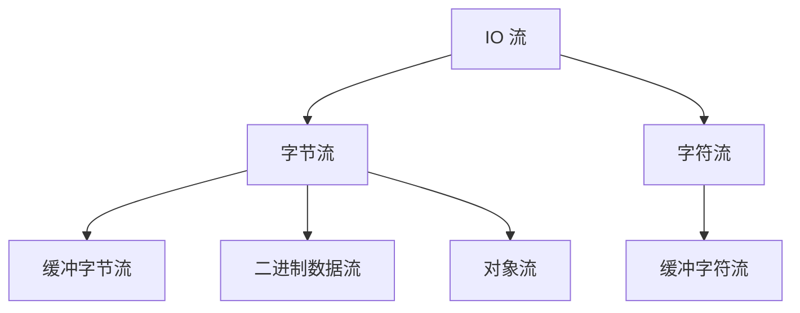

# 第九章 I/O流

## 课前回顾

### 1. 描述字符串的特性

String 类是由 final 修饰的，表示这是一个最终类，不能够被继承。

String 类表示一个字符串，而字符串中的字符使用的是一个 final 修饰 char 数组存储，因此 String 类一旦构建出对象，就不可再被更改。

如果给一个 String 类的引用赋一个字面量，那么首先会在常量池中检测是否存在这样的字面量，如果不存在，则在常量池中创建，创建好之后再将常量池中的内存地址赋值给这个引用。

### 2. 阐述 String、StringBuilder、StringBuffer 处理字符串的区别

String 类处理字符串时会产生新的对象，因为 String 类构建的对象不可再被更改。而 StringBuilder 和 StringBuffer 处理字符串时只是将组成字符串的字符数组内容拷贝至自身的存储区，因此不会产生新的字符串对象。对于内存上的开销来说，相比于 String 类的处理方式就减少了许多。因此 StringBuilder 和 StringBuffer 在处理大量字符串的时候，效率要高于 String 类。StringBuffer 为了实现在多线程情况下的同步使用而对其中的方法加了锁，有锁就会产生开销，因此在处理字符串时 StringBuffer 比 StringBuilder 效率要略低一些。处理少量字符串的时候，它们之间的效率几乎无差别。

### 3. 说明 String 类的 intern() 方法的作用

如果一个字符串对象需要纳入字符串常量池中，可以使用 intern() 方法来实现。intern() 方法首先会去常量池中查看是否存在这样的对象，如果不存在，则创建，创建好之后再将这个常量池中创建的内存地址赋值给相应的引用。

```java
//会去常量池中查看是否存在字符串"管理员"，如果不存在，就在常量池中创建字符串"管理员"，然后将内存地址赋值给s1
String s1 = "管理员";
String s2 = "很水";
String s3 = s1 + s2;//产生一个新的字符串，这个字符串在堆内存上。
//准备将s3放入常量池，放入之前会先去常量池中查看是否存在字符串"管理员很水"，如果不存在，就在常量池中创建字符串"管理员很水"，然后将内存地址赋值给s4
String s4 = s3.intern();
String s5 = "管理员很水";//由于s4已经在常量池中创建了字符串"管理员很水"，此时只需要将这个字符串的内存地址赋给s5即可
System.out.println(s4 == s5);
```

## 章节内容

| 章节内容 | 要求 |
| :--- | :--- |
| File 类的常用操作 | **重点** |
| 递归 | **重点** |
| I/O 流 | **重点**　难点 |

## 章节目标

- 掌握 File 类的常用操作
- 掌握递归的使用
- 掌握字节流的使用
- 掌握字符流的使用
- 掌握二进制数据流的使用
- 掌握缓冲流的使用
- 掌握对象流的使用

---

## 第一节 File类

### 1. File 类的作用

`java.io.File` 类是对存储在磁盘上的文件信息的一个抽象表示。主要用于文件的创建、查找和删除。

### 2. File 类的使用

**常用构造方法**

```java
public File(String pathname);//通过将给定的字符串路径名转换为抽象路径名来创建File实例
public File(String parent, String child);//通过给定的字符串父级路径和字符串子级路径来创建File实例
public File(File parent, String child);//通过父级抽象路径名和字符串子路径创建File实例。
```

**示例**

```java
package com.cyx.file;

import java.io.File;

/**
 * File类构造方法的使用
 */
public class Example1 {

    public static void main(String[] args) {
        File file1 = new File("F:\\a\\b\\c.txt");
        File file2 = new File("F:\\a\\b", "c.txt");

        File parent = new File("F:\\a\\b");
        File file3 = new File(parent, "c.txt");
    }
}
```

**常用方法**

**获取文件相关信息**

```java
//绝对路径：带有盘符的路径称之为绝对路径
//相对路径：不带盘符的路径称之为相对路径，相对路径相对于当前工程来定位的。
public String getAbsolutePath(); //获取文件的绝对路径
public String getName();//获取文件的名字
public String getPath();//获取文件的路径
public File getParentFile();//获取文件的父文件
public String getParent();//获取文件的父文件路径
public long length();//获取文件的大小
public long lastModified();//获取文件最后修改时间
```

**示例**

```java
package com.cyx.file;

import java.io.File;

public class Example2 {

    public static void main(String[] args) {
        File file = new File("F:\\a\\b\\c.txt");
        //获取文件的绝对路径
        String absPath = file.getAbsolutePath();
        System.out.println(absPath);
        //获取文件的路径，可能是相对路径，也可能是绝对路径
        String path = file.getPath();
        System.out.println(path);
        String name = file.getName();//获取文件名
        System.out.println(name);
        //获取文件的父级文件夹对象
        File parentFile = file.getParentFile();
        System.out.println(parentFile.getPath());
        //获取文件的父级路径
        String parentPath = file.getParent();
        System.out.println(parentPath);
        //获取文件的大小，单位是字节
        long length = file.length();
        System.out.println(length);
        //获取文件的最后修改时间
        long lastUpdateTime = file.lastModified();
        System.out.println(lastUpdateTime);
        //获取系统当前时间：单位毫秒
        long currentTime = System.currentTimeMillis();
        System.out.println(currentTime);

        File file1 = new File("chapter16\\c.txt");
        System.out.println(file1.getAbsolutePath());
        System.out.println(file1.getPath());
    }
}
```

**文件相关的判断**

```java
public boolean canRead();//是否可读
public boolean canWrite();//是否可写
public boolean exists();//是否存在
public boolean isDirectory();//是否是目录
public boolean isFile();//是否是一个正常的文件
public boolean isHidden();//是否隐藏
public boolean canExecute();//是否可执行
public boolean createNewFile() throws IOException;//创建新的文件
public boolean delete();//删除文件
public boolean mkdir();//创建目录，一级
public boolean mkdirs();//创建目录，多级
public boolean renameTo(File dest);//文件重命名
```

**示例**

```java
package com.cyx.file;

import java.io.File;
import java.io.IOException;

/**
 * 文件判断
 */
public class Example3 {

    public static void main(String[] args) {
        File file = new File("F:\\record\\stu.txt");
        //判断文件是否可读
        boolean readable = file.canRead();
        System.out.println("文件是否可读：" + readable);
        //判断文件是否可写
        boolean writable = file.canWrite();
        System.out.println("文件是否可写：" + writable);
        //判断文件是否存在
        boolean exists = file.exists();
        System.out.println("文件是否存在：" + exists);
        //判断文件是否是目录
        boolean isDirectory = file.isDirectory();
        System.out.println("文件是否是目录：" + isDirectory);
        File parent = file.getParentFile();
        System.out.println("父级文件是否是目录：" + parent.isDirectory());
        //判断文件是否是隐藏文件
        boolean hidden = file.isHidden();
        System.out.println("文件是否是隐藏文件：" + hidden);
        //判断文件是否可执行
        boolean executable = file.canExecute();
        //所谓的可执行文件，是指双击之后有反应的文件都称之为可执行文件
        System.out.println("文件是否可执行：" + executable);

        File newFile = new File("F:\\test\\stu\\new.txt");
        File parentFile = newFile.getParentFile();
        if(!parentFile.exists()){//通常会与创建目录的方法配合使用
            //创建父级目录，但只能创建一级
//            parentFile.mkdir();
            //创建多级父级目录
            parentFile.mkdirs();
        }
        if(!newFile.exists()){
            try {
                //创建文件时，必须保证改文件的父级目录存在，否则，创建将报IO异常
                boolean success = newFile.createNewFile();
                System.out.println("文件创建是否成功：" + success);
            } catch (IOException e) {
                e.printStackTrace();
            }
        }

        boolean deleteSuccess = file.delete();
        System.out.println("文件删除是否成功：" + deleteSuccess);
        //删除文件夹时，必须保证文件夹中没有任何文件，也就是保证文件夹是空的
        boolean deleteFolderSuccess = parentFile.delete();
        System.out.println("文件夹删除是否成功：" + deleteFolderSuccess);

        File renameDest = new File("F:\\test\\a.txt");
        //文件重命名至目标文件夹时，必须保证目标文件夹存在。重命名操作成功后，原来的文件
        //就移动过去了。
        boolean renameSuccess = newFile.renameTo(renameDest);
        System.out.println("文件重命名是否成功：" + renameSuccess);
    }
}
```

删除文件夹时必须保证文件夹为空，否则将删除失败

**文件列表相关**

```java
public File[] listFiles();//列出文件夹下所有文件
public File[] listFiles(FileFilter filter);//列出文件夹下所有满足条件的文件
```

**示例**

```java
package com.cyx.file;

import java.io.File;
import java.io.FileFilter;

/**
 * 文件列表
 */
public class Example4 {

    public static void main(String[] args) {
        File directory = new File("F:\\study\\java");
        //列出文件夹中所有文件
        File[] files = directory.listFiles();
        //需要做非空判断，因为目录可能是非法的，也就是可能不存在
        if(files != null){
//            for(int i=0; i<files.length; i++){
//                File file = files[i];
//            }
//            for(File file: files){//增强for循环
//                System.out.println(file.getPath());
//            }
        }


        File folder = new File("F:\\Idea\\IntelliJ IDEA 2020.1\\bin");
//        class A implements FileFilter{
//
//            @Override
//            public boolean accept(File pathname) {
//                return false;
//            }
//        }
        //匿名内部类 => 相当于将类的名字隐藏起来
        FileFilter filter = new FileFilter() {
            //表示接受文件的条件
            @Override
            public boolean accept(File file) {
                String name = file.getName();//获取文件名，也包含后缀在内
                //返回文件名是否以.ext结尾
                return name.endsWith(".exe"); //startsWith("hello") 检测字符串是否以hello开始
            }
        };
        File[] childFiles = folder.listFiles(filter);
        if(childFiles != null){
            for(File file: childFiles){
                System.out.println(file.getPath());
            }
        }
    }
}
```

### 3. 递归

在方法内部再调用自身就是递归。递归分为直接递归和间接递归。

直接递归就是方法自己调用自己。

间接递归就是多个方法之间相互调用，形成一个闭环，从而构成递归。

使用递归时必须要有出口，也就是使递归停下来。否则，将导致栈内存溢出。

```java
package com.cyx.file;

import java.util.Scanner;

/**
 * 递归
 */
public class Example5 {

    private static Scanner sc=  new Scanner(System.in);

    public static void main(String[] args) {
        showMenu();
//        gotoLogin();
    }

    public static void showMenu(){
        showMenu();
    }

    public static void gotoLogin(){
        System.out.println("登录");
        System.out.println("请输入菜单编号：");
        int number = sc.nextInt();
        if(number == 1){
            gotoMain();
        } else {
            System.out.println("感谢使用XXX系统");
        }
    }

    public static void gotoMain(){
        System.out.println("主菜单");
        System.out.println("请输入菜单编号：");
        int number = sc.nextInt();
        if(number == 5){
            gotoLogin();
        } else {
            System.out.println("你选择了其他菜单");
        }
    }
}
```

**示例**

使用递归求 1~100 的累加和。

```java
package com.cyx.file;

/**
 * 使用递归求1~100的累加和。
 */
public class Example6 {

    public static void main(String[] args) {
        int result = sum(100);
        System.out.println(result);

        int s = multiply(6);
        System.out.println(s);
    }

    public static int sum(int number){
        if(number == 1) return 1;
        return number + sum(number - 1);
    }
    //sum(5) => 5 + sum(4)
    //sum(4) => 4 + sum(3)
    //sum(3) => 3 + sum(2)
    //sum(2) => 2 + sum(1) => 2 + 1


    public static int multiply(int number){
        if(number == 0 || number == 1) return 1;
        return number * multiply(number - 1);
    }
    //multiply(6) => 6 * multiply(5)
    //multiply(5) => 5 * multiply(4)
    //multiply(4) => 4 * multiply(3)
    //multiply(3) => 3 * multiply(2)
    //multiply(2) => 2 * multiply(1) => 2 * 1
}
```

使用递归打印文件夹下所有文件信息

```java
package com.cyx.file;

import java.io.File;

/**
 * 使用递归打印文件夹所有文件信息
 */
public class Example7 {

    public static void main(String[] args) {
//        File folder = new File("F:\\study");
//        recursiveFolder(folder);
        File directory = new File("F:\\test");
        deleteFolder(directory);
    }
    //递归遍历文件夹
    public static void recursiveFolder(File folder){
        if(folder.isDirectory()){//检测是否是文件夹
            File[] files = folder.listFiles();
            if(files != null){
                for(File file: files){
                    if(file.isDirectory()){//如果是文件夹，就再调用方法进行查看
                        recursiveFolder(file);
                    } else {
                        System.out.println(file.getPath());
                    }
                }
            }
        } else {//不是文件夹就直接打印文件的路径
            System.out.println(folder.getPath());
        }
    }

    public static void deleteFolder(File folder){
        if(folder.isDirectory()){//是文件夹就需要再进去看
            File[] files = folder.listFiles();
            if(files != null){
                for(File file: files){
                    if(file.isDirectory()){
                        deleteFolder(file);
                    } else {
                        file.delete();
                    }
                }
                folder.delete();//文件夹中文件删除完毕之后，文件夹也需要删除掉
            }
        } else {//不是文件夹，直接删除
            folder.delete();
        }
    }
}
```

**练习**

使用递归求 6 的阶乘。

```java
public static int multiply(int number){
    if(number == 0 || number == 1) return 1;
    return number * multiply(number - 1);
}
```

**思考：如何删除一个文件夹？**

先递归进入子文件夹，把里面的文件逐个删除，子文件夹清空后再把文件夹本身删除。完整实现见上面 `Example7.java` 中的 `deleteFolder(File folder)` 方法。

---

## 第二节 I/O流

### 1. 什么是 I/O流

在使用计算机时，你可能遇到过如下场景：

当你在编写一个文档时，突然断电了或者计算机蓝屏了，而文档又没有保存。当你重启计算机后，发现文档中修改的那部分内容丢失了，但保存过的内容依然还在。

这是为什么呢？因为我们编写文档的时候，编写的内容是存储在计算机的内存中，这些内容属于临时数据，当我们保存文档后，这些临时数据就写进了磁盘，得以保存。

**过程分析**

- 编写文档内容存储在内存，换言之，就是向内存写数据
- 保存文档内容至磁盘，换言之，就是将内存中的数据取出来存储到磁盘

**I/O 的来源**

I/O 是 Input 和 Output 两个单词的首字母，表示输入输出。其参照物就是内存，写入内存，就是输入，从内存读取数据出来，就是输出。

**Java 中的 I/O 流**

磁盘和内存是两个不同的设备，它们之间要实现数据的交互，就必须要建立一条通道，在 Java 中实现建立这样的通道的是 I/O 流。Java 中的 I/O 流是按照数据类型来划分的。分别是字节流（缓冲流、二进制数据流和对象流）、字符流



> 💡 补充：原文把"缓冲流"归在字节流下面，其实缓冲流既有字节缓冲流（BufferedInputStream、BufferedOutputStream），也有字符缓冲流（BufferedReader、BufferedWriter），后面的"4. 缓冲流"一节会同时讲到这两类。

### 2. 字节流

**字节流来自官方的说明**

```text
Programs use byte streams to perform input and output of 8-bit bytes. All byte
stream classes are descended from InputStream and OutputStream.
```

程序使用字节流执行 8 位字节的输入和输出。所有字节流类均来自 InputStream 和 OutputStream。

**OutputStream 常用方法**

```java
public abstract void write(int b) throws IOException; //写一个字节
public void write(byte b[]) throws IOException; //将给定的字节数组内容全部写入文件中
//将给定的字节数组中指定的偏移量和长度之间的内容写入文件中
public void write(byte b[], int off, int len) throws IOException;
public void flush() throws IOException;//强制将通道中数据全部写出
public void close() throws IOException;//关闭通道
```

**文件输出流 FileOutputStream 构造方法**

```java
public FileOutputStream(String name) throws FileNotFoundException; //根据提供的文件路径构建一条文件输出通道
//根据提供的文件路径构建一条文件输出通道，并根据append的值决定是将内容追加到末尾还是直接覆盖
public FileOutputStream(String name, boolean append) throws FileNotFoundException;
public FileOutputStream(File file) throws FileNotFoundException;//根据提供的文件信息构建一条文件输出通道
//根据提供的文件信息构建一条文件输出通道，并根据append的值决定是将内容追加到末尾还是直接覆盖
public FileOutputStream(File file, boolean append) throws FileNotFoundException;
```

输出流的方向是内存 → 磁盘：


**示例**

使用文件输出流将"超用心在线教育"写入磁盘文件中

```java
package com.cyx.io._byte;

import java.io.*;

/**
 * 使用文件输出流将"超用心在线教育"写入磁盘文件中
 */
public class Example1 {
    /**
     * 增强for循环语法：
     * for(数据类型 变量名: 遍历的数组){
     *
     * }
     * @param args
     */
    public static void main(String[] args) {
        //将内容写入文件时，需要保证这个文件的父级目录一定存在，否则将报文件未找到异常
        try {
            File dir = new File("F:\\aa");
            if(!dir.exists()) dir.mkdirs();
            File file = new File(dir, "io.txt");
            //构建磁盘文件与内存之间的通道
            OutputStream os = new FileOutputStream(file, true);
            String text = "超用心在线教育";
            byte[] bytes = text.getBytes();
//            for(byte b: bytes){
//                os.write(b);//一次向通道中写一个字节至文件中
//            }
//            os.write(bytes);//向通道中一次将所有字节数组中的内容全部发送过去
            //使用偏移量和长度的时候需要考虑数组下标越界
            os.write(bytes, 3, bytes.length - 3);
            //在通道关闭之前使用，强制将通道中的数据写入文件中
            os.flush();
            os.close();//关闭通道
        } catch (FileNotFoundException e) {
            e.printStackTrace();
        } catch (IOException e) {
            e.printStackTrace();
        }
    }
}
```

**InputStream 常用方法**

```java
public abstract int read() throws IOException; //读取一个字节
public int read(byte b[]) throws IOException; //读取多个字节存储至给定的字节数组中
//读取多个字节按照给定的偏移量及长度存储在给定的字节数组中
public int read(byte b[], int off, int len) throws IOException;
public void close() throws IOException;//关闭流，也就是关闭磁盘和内存之间的通道
public int available() throws IOException;//获取通道中数据的长度
```

**文件输入流 FileInputStream 构造方法**

```java
public FileInputStream(String name) throws FileNotFoundException;//根据提供的文件路径构建一条文件输入通道
public FileInputStream(File file) throws FileNotFoundException;//根据提供的文件信息构建一条文件输入通道
```

输入流的方向是磁盘 → 内存：


**示例**

使用文件输入流将文件信息从磁盘中读取到内存中来，并在控制台输出。

```java
package com.cyx.io._byte;

import java.io.FileInputStream;
import java.io.FileNotFoundException;
import java.io.IOException;
import java.io.InputStream;

/**
 * 使用文件输入流将文件信息从磁盘中读取到内存中来，并在控制台输出。
 */
public class Example2 {

    public static void main(String[] args) {
        try {
            InputStream is = new FileInputStream("F:\\aa\\io.txt");
            int length = is.available();//获取通道中的数据长度
            //根据通道中数据的长度构建字节数组。但需要考虑到一点，如果通道中数据长度过长
            //那么字节数组构建太大，则可能导致内存不够，比如使用流读取一个大小为10G的文件
            byte[] buffer = new byte[length];
//            int index = 0;
//            while (true){
//                //读取通道中的数据，一次读取一个字节。如果读取到末尾，则返回-1
//                byte b = (byte) is.read();
//                if(b == -1) break;
//                buffer[index++] = b;
////                index++;
//            }
            int readCount = is.read(buffer); //将通道中的数据全部读取到buffer数组中
            System.out.println("读取了"+readCount+"个字节");
            System.out.println(new String(buffer));
            is.close();//关闭通道
        } catch (FileNotFoundException e) {
            e.printStackTrace();
        } catch (IOException e) {
            e.printStackTrace();
        }

    }
}
```

如果通道中数据长度过长，那么根据通道中数据的长度来构建字节数组，则可能导致内存不够，比如使用流读取一个大小为 10G 的文件，那么通道中就应该存在 10G 长的数据，此时应该怎么办？

```java
package com.cyx.io._byte;

import java.io.FileInputStream;
import java.io.FileNotFoundException;
import java.io.IOException;
import java.io.InputStream;

public class Example3 {

    public static void main(String[] args) {
        try {
            InputStream is = new FileInputStream("F:\\aa\\io.txt");
            //实际开发过程中字节数组的长度一般定义为1024的整数倍
            byte[] buffer = new byte[31]; //构建了一个长度为31的字节数组
            while (true){
                //从通道中读取数据存入字节数组buffer中，返回值就是读取的字节长度.
                //如果读取到数据的末尾，则返回-1
                int len = is.read(buffer);
                if(len == -1) break;
                System.out.println(len);
                System.out.println(new String(buffer));
            }
            is.close();
        } catch (FileNotFoundException e) {
            e.printStackTrace();
        } catch (IOException e) {
            e.printStackTrace();
        }
    }
}
```

```java
package com.cyx.io._byte;

import java.io.FileInputStream;
import java.io.FileNotFoundException;
import java.io.IOException;
import java.io.InputStream;

public class Example4 {

    public static void main(String[] args) {
        try {
            InputStream is = new FileInputStream("F:\\aa\\io.txt");
            byte[] buffer = new byte[1024];
            int offset = 0;
            while (true){
                int len = is.read(buffer,offset,40);
                if(len == -1) break;
                System.out.println(len);
                offset += len;
            }
            System.out.println(new String(buffer,0, offset));
            is.close();
        } catch (FileNotFoundException e) {
            e.printStackTrace();
        } catch (IOException e) {
            e.printStackTrace();
        }
    }
}
```

**综合练习**

使用字节流实现磁盘文件拷贝功能


```java
package com.cyx.io._byte;

import java.io.*;

/**
 * 文件拷贝
 */
public class Example5 {

    public static void main(String[] args) {
        String sourceFile = "F:\\study\\java\\chapter16\\src\\com\\cyx\\io\\Example1.java";
        String destFile = "F:\\aa\\IO.java";
        copyFile(sourceFile, destFile);
    }

    public static void copyFile2(String sourceFile, String destFile){
        File file = new File(destFile);
        File parent = file.getParentFile();
        if(!parent.exists()) parent.mkdirs();
        //try(){}catch(){}  JDK 1.7
        //写在括号中的代码只能够是实现了AutoClosable接口的类
        try(InputStream is = new FileInputStream(sourceFile);
            OutputStream os =  new FileOutputStream(destFile);) {
            byte[] buffer = new byte[4096];
            while (true){
                int len = is.read(buffer);
                if(len == -1) break;
                os.write(buffer,0, len);
            }
            os.flush();
        } catch (FileNotFoundException e) {
            e.printStackTrace();
        } catch (IOException e) {
            e.printStackTrace();
        }
    }

    public static void copyFile(String sourceFile, String destFile){
        File file = new File(destFile);
        File parent = file.getParentFile();
        if(!parent.exists()) parent.mkdirs();
        InputStream is = null;
        OutputStream os = null;
        try {
            is = new FileInputStream(sourceFile);
            os =  new FileOutputStream(destFile);
            byte[] buffer = new byte[4096];
            while (true){
                int len = is.read(buffer);
                if(len == -1) break;
                os.write(buffer,0, len);
            }
            os.flush();

        } catch (FileNotFoundException e) {
            e.printStackTrace();
        } catch (IOException e) {
            e.printStackTrace();
        } finally {
//            if(is != null){
//                try {
//                    is.close();
//                } catch (IOException e) {
//                }
//            }
//            if(os != null){
//                try {
//                    os.close();
//                } catch (IOException e) {
//                }
//            }
            close(is, os);
        }
    }
    //不定长自变量，本质是一个数组。在使用不定长自变量作为方法的参数时，必须为该方法参数列表的最后一个参数
    public static void close(Closeable... closeables){
        for(Closeable c: closeables){
            if(c != null){
                try {
                    c.close();
                } catch (IOException e) {}
            }
        }
    }
}
```

**字节流应用场景**

```text
Byte streams should only be used for the most primitive I/O.
```

字节流仅仅适用于读取原始数据（基本数据类型）

### 3. 字符流

**字符流来自官方的说明**

```text
The Java platform stores character values using Unicode conventions. Character
stream I/O automatically translates this internal format to and from the local
character set. In Western locales, the local character set is usually an 8-bit
superset of ASCII.
```

Java 平台使用 Unicode 约定存储字符值。字符流 I/O 会自动将此内部格式与本地字符集转换。在西方语言环境中，本地字符集通常是 ASCII 的 8 位超集。

```text
All character stream classes are descended from Reader and Writer. As with byte
streams, there are character stream classes that specialize in file I/O:
FileReader and FileWriter.
```

所有字符流类均来自 Reader 和 Writer。与字节流一样，也有专门用于文件 I/O 的字符流类：FileReader 和 FileWriter。

**Writer 常用方法**

```java
public void write(int c) throws IOException; //写一个字符
public void write(char cbuf[]) throws IOException;//将给定的字符数组内容写入到文件中
//将给定的字符数组中给定偏移量和长度的内容写入到文件中
abstract public void write(char cbuf[], int off, int len) throws IOException;
public void write(String str) throws IOException;//将字符串写入到文件中
abstract public void flush() throws IOException;//强制将通道中的数据全部写出
abstract public void close() throws IOException;//关闭通道
```

**FileWriter 构造方法**

```java
public FileWriter(String fileName) throws IOException;//根据提供的文件路径构建一条文件输出通道
//根据提供的文件路径构建一条文件输出通道，并根据append的值决定是将内容追加到末尾还是直接覆盖
public FileWriter(String fileName, boolean append) throws IOException;
public FileWriter(File file) throws IOException;//根据提供的文件信息构建一条文件输出通道
//根据提供的文件信息构建一条文件输出通道，并根据append的值决定是将内容追加到末尾还是直接覆盖
public FileWriter(File file, boolean append) throws IOException;
```

**示例**

使用字符流将"超用心在线教育"写入磁盘文件中

```java
package com.cyx.io._char;

import java.io.File;
import java.io.FileWriter;
import java.io.IOException;
import java.io.Writer;

/**
 * 使用字符流将"超用心在线教育"写入磁盘文件中
 */
public class Example1 {

    public static void main(String[] args) {
        File file = new File("F:\\AA\\io.txt");
        File parent = file.getParentFile();
        if(!parent.exists()) parent.mkdirs();
        //Writer类实现了AutoCloseable接口，因此可以将Writer类对象的构建方法try后面的()中
        try (Writer writer = new FileWriter(file, true);){
            String text = "超用心在线教育";
//            char[] values = text.toCharArray();
//            for(char c: values){
//                writer.write(c);
//            }
//            writer.write(values);
//            writer.write(values, 1, values.length - 1);
            writer.write(text);
            writer.flush();//强制将通道中的数据写入文件
        } catch (IOException e) {
            e.printStackTrace();
        }
    }
}
```

**Reader 常用方法**

```java
public int read() throws IOException; //读取一个字符
public int read(char cbuf[]) throws IOException; //读取字符到给定的字符数组中
//将读取的字符按照给定的偏移量和长度存储在字符数组中
abstract public int read(char cbuf[], int off, int len) throws IOException;
abstract public void close() throws IOException;//关闭通道
```

**FileReader 构造方法**

```java
public FileReader(String fileName) throws FileNotFoundException;//根据提供的文件路径构建一条文件输入通道
public FileReader(File file) throws FileNotFoundException;//根据提供的文件信息构建一条文件输入通道
```

**示例**

使用字符流将文件信息从磁盘中读取到内存中来，并在控制台输出。

```java
package com.cyx.io._char;

import java.io.*;

public class Example2 {

    public static void main(String[] args) {
        try (Reader reader = new FileReader("F:\\aa\\io.txt");) {
//            StringBuilder builder = new StringBuilder();
//            while (true){
//                int c = reader.read();
//                if(c == -1) break;
//                builder.append((char)c);
//            }
//            System.out.println(builder);
            char[] buffer = new char[4096];
            int offset = 0;
            while (true){
//                int len = reader.read(buffer);
                int len = reader.read(buffer, offset, 30);
                if(len == -1) break;
                offset += len;
            }
            System.out.println(new String(buffer, 0, offset));
        } catch (FileNotFoundException e) {
            e.printStackTrace();
        } catch (IOException e) {
            e.printStackTrace();
        }
    }
}
```

**综合练习**

使用字符流实现磁盘文件拷贝功能

```java
package com.cyx.io._char;

import java.io.*;

public class Example3 {

    public static void main(String[] args) {
        String sourceFile = "F:\\AA\\io.txt";
        String destFile = "F:\\file\\a.txt";
        copyFile(sourceFile, destFile);
    }

    public static void copyFile(String sourceFile, String destFile){
        File file = new File(destFile);
        File parent = file.getParentFile();
        if(!parent.exists()) parent.mkdirs();
        try (Reader reader = new FileReader(sourceFile);
             Writer writer = new FileWriter(file)){
            char[] buffer = new char[4096];
            while (true){
                int len = reader.read(buffer);
                if(len == -1) break;
                writer.write(buffer, 0, len);
            }
            writer.flush();
        } catch (FileNotFoundException e) {
            e.printStackTrace();
        } catch (IOException e) {
            e.printStackTrace();
        }
    }
}
```

### 4. 缓冲流

**缓冲流来自官方的说明**

```text
Most of the examples we've seen so far use unbuffered I/O. This means each read
or write request is handled directly by the underlying OS. This can make a
program much less efficient, since each such request often triggers disk access,
network activity, or some other operation that is relatively expensive.
```

到目前为止，我们看到的大多数示例都使用无缓冲的 I/O。 这意味着每个读取或写入请求均由基础操作系统直接处理。 由于每个这样的请求通常会触发磁盘访问，网络活动或某些其他相对昂贵的操作，因此这可能会使程序的效率大大降低。

```text
To reduce this kind of overhead, the Java platform implements buffered I/O
streams. Buffered input streams read data from a memory area known as a buffer;
the native input API is called only when the buffer is empty. Similarly,
buffered output streams write data to a buffer, and the native output API is
called only when the buffer is full.
```

为了减少这种开销，Java 平台实现了缓冲的 I/O 流。 缓冲的输入流从称为缓冲区的存储区中读取数据；仅当缓冲区为空时才调用本机输入 API。 同样，缓冲的输出流将数据写入缓冲区，并且仅在缓冲区已满时才调用本机输出 API。

```text
There are four buffered stream classes used to wrap unbuffered streams:
BufferedInputStream and BufferedOutputStream create buffered byte streams, while
BufferedReader and BufferedWriter create buffered character streams.
```

有四种用于包装非缓冲流的缓冲流类：BufferedInputStream 和 BufferedOutputStream 创建缓冲的字节流，而 BufferedReader 和 BufferedWriter 创建缓冲的字符流。

**BufferedOutputStream 构造方法**

```java
public BufferedOutputStream(OutputStream out);//根据给定的字节输出流创建一个缓冲输出流，缓冲区大小使用默认大小
public BufferedOutputStream(OutputStream out, int size);//根据给定的字节输出流创建一个缓冲输出流，并指定缓冲区大小
```

**BufferedInputStream 构造方法**

```java
public BufferedInputStream(InputStream in); //根据给定的字节输入流创建一个缓冲输入流，缓冲区大小使用默认大小
public BufferedInputStream(InputStream in, int size);//根据给定的字节输入流创建一个缓冲输入流，并指定缓冲区大小
```

**示例**

使用缓冲字节流实现磁盘文件拷贝功能

```java
package com.cyx.io.buffer;

import java.io.*;

public class Example1 {

    public static void main(String[] args) {
        String sourceFile = "F:\\AA\\io.txt";
        String destFile = "F:\\file\\a.txt";
        copyFile(sourceFile, destFile);
    }

    public  static void copyFile(String sourceFile, String destFile){
        File file = new File(destFile);
        File parentFile = file.getParentFile();
        if(!parentFile.exists()) parentFile.mkdirs();
        try(InputStream is = new FileInputStream(sourceFile);
            BufferedInputStream bis = new BufferedInputStream(is);
            OutputStream os = new FileOutputStream(destFile);
            BufferedOutputStream bos = new BufferedOutputStream(os)) {
            byte[] buffer = new byte[4096];
            while (true){
                int len = bis.read(buffer);
                if(len == -1) break;
                bos.write(buffer, 0, len);
            }
        } catch (FileNotFoundException e) {
            e.printStackTrace();
        } catch (IOException e) {
            e.printStackTrace();
        }
    }
}
```

**BufferedWriter 构造方法**

```java
public BufferedWriter(Writer out);//根据给定的字符输出流创建一个缓冲字符输出流，缓冲区大小使用默认大小
public BufferedWriter(Writer out, int sz);//根据给定的字符输出流创建一个缓冲字符输出流，并指定缓冲区大小
```

**BufferedReader 构造方法**

```java
public BufferedReader(Reader in); //根据给定的字符输入流创建一个缓冲字符输入流，缓冲区大小使用默认大小
public BufferedReader(Reader in, int sz);//根据给定的字符输入流创建一个缓冲字符输入流，并指定缓冲区大小
```

**示例**

使用缓冲字符流实现磁盘文件拷贝功能

```java
package com.cyx.io.buffer;

import java.io.*;

public class Example2 {

    public static void main(String[] args) {
        String sourceFile = "F:\\AA\\io.txt";
        String destFile = "F:\\file\\a.txt";
        copyFile(sourceFile, destFile);

    }

    public static void copyFile(String sourceFile, String destFile){
        File file = new File(destFile);
        File parentFile = file.getParentFile();
        if(!parentFile.exists()) parentFile.mkdirs();
        try ( Reader reader = new FileReader(sourceFile);
              BufferedReader br = new BufferedReader(reader);
              Writer writer = new FileWriter(destFile);
              BufferedWriter bw = new BufferedWriter(writer)){
            char[] buffer = new char[4096];
            while (true){
                int len = br.read(buffer);
                if(len == -1) break;
                bw.write(buffer, 0, len);
            }
            bw.flush();
        } catch (FileNotFoundException e) {
            e.printStackTrace();
        } catch (IOException e) {
            e.printStackTrace();
        }
    }
}
```

除按字符数组读写外，缓冲字符流还可以按行读写：`readLine()` 读一行，`newLine()` 写入一个换行符。

```java
package com.cyx.io.buffer;

import java.io.*;

public class Example3 {
    //lineSeparator = \r\n
    public static void main(String[] args) {
        String sourceFile = "F:\\buffer\\io.txt";
        String destFile = "F:\\copy\\copy.txt";
        File file = new File(destFile);
        File parent = file.getParentFile();
        if(!parent.exists()) parent.mkdirs();
        try ( Reader reader = new FileReader(sourceFile);
              BufferedReader br = new BufferedReader(reader);
              Writer writer = new FileWriter(file);
              BufferedWriter bw = new BufferedWriter(writer)) {
            while (true){
                String line = br.readLine();//读行
                if(line == null) break;
                bw.write(line);//写行
                bw.newLine();//换行 =>相当于写入了一个 \r\n
            }
            bw.flush();
        }  catch (FileNotFoundException e) {
            e.printStackTrace();
        } catch (IOException e) {
            e.printStackTrace();
        }
    }

    public static void copyFile(String sourceFile, String destFile){
        File file = new File(destFile);
        File parent = file.getParentFile();
        if(!parent.exists()) parent.mkdirs();
        try ( Reader reader = new FileReader(sourceFile);
              BufferedReader br = new BufferedReader(reader);
              Writer writer = new FileWriter(file);
              BufferedWriter bw = new BufferedWriter(writer)) {
            while (true){
                String line = br.readLine();//读行
                if(line == null) break;
                bw.write(line);//写行
                bw.newLine();//换行 =>相当于写入了一个 \r\n
            }
            bw.flush();
        }  catch (FileNotFoundException e) {
            e.printStackTrace();
        } catch (IOException e) {
            e.printStackTrace();
        }
    }

    private static void readLine(){
        String path = "F:\\buffer\\io.txt";
        try ( Reader reader = new FileReader(path);
              BufferedReader bw = new BufferedReader(reader)){
            while (true){
                String line = bw.readLine();
                if(line == null) break;
                System.out.println(line);
            }
        } catch (FileNotFoundException e) {
            e.printStackTrace();
        } catch (IOException e) {
            e.printStackTrace();
        }
    }

    private static void writeLine(){
        String path = "F:\\buffer\\io.txt";
        File file = new File(path);
        File parent = file.getParentFile();
        if(!parent.exists()) parent.mkdirs();
        try (Writer writer = new FileWriter(file);
             BufferedWriter bw = new BufferedWriter(writer)) {
            bw.write("这是第1行");
            bw.newLine();
            bw.write("这是第2行");
            bw.newLine();
            bw.write("这是第3行");
            bw.newLine();
            bw.write("这是第4行");
            bw.newLine();
            bw.flush();
        } catch (IOException e) {
            e.printStackTrace();
        }
    }
}
```

### 5. 数据流

**数据流来自官方的说明**

```text
Data streams support binary I/O of primitive data type values (boolean, char,
byte, short, int, long, float, and double) as well as String values. All data
streams implement either the DataInput interface or the DataOutput interface.
This section focuses on the most widely-used implementations of these
interfaces, DataInputStream and DataOutputStream.
```

数据流支持原始数据类型值（布尔值，char，字节，short，int，long，float 和 double）以及 String 值的二进制 I/O。 所有数据流都实现 DataInput 接口或 DataOutput 接口。 本节重点介绍这些接口的最广泛使用的实现，即 DataInputStream 和 DataOutputStream。

**DataOutput 接口常用方法**

```java
void writeBoolean(boolean v) throws IOException;//将布尔值作为1个字节写入底层输出通道
void writeByte(int v) throws IOException;//将字节写入底层输出通道
void writeShort(int v) throws IOException;//将短整数作为2个字节(高位在前)写入底层输出通道
void writeChar(int v) throws IOException;//将字符作为2个字节写(高位在前)入底层输出通道
void writeInt(int v) throws IOException;//将整数作为4个字节写(高位在前)入底层输出通道
void writeLong(long v) throws IOException;//将长整数作为8个字节写(高位在前)入底层输出通道
void writeFloat(float v) throws IOException;//将单精度浮点数作为4个字节写(高位在前)入底层输出通道
void writeDouble(double v) throws IOException;//将双精度浮点数作为8个字节写(高位在前)入底层输出通道
void writeUTF(String s) throws IOException;//将UTF-8编码格式的字符串以与机器无关的方式写入底层输出通道。
```

**DataOutputStream 构造方法**

```java
public DataOutputStream(OutputStream out);//根据给定的字节输出流创建一个二进制输出流
```

**示例**

```java
package com.cyx.io.data;


import java.io.*;

public class Example1 {

    public static void main(String[] args) {
        writeData();
        readData();
    }

    private static void readData(){
        String path = "F:\\data\\io.txt";
        try (InputStream is = new FileInputStream(path);
             DataInputStream dis = new DataInputStream(is)){
            byte b = dis.readByte();
            System.out.println("读取字节：" + b);
            short s = dis.readShort();
            System.out.println("读取短整数：" + s);
            int i = dis.readInt();
            System.out.println("读取整数：" + i);
            long l = dis.readLong();
            System.out.println("读取长整数：" + l);
            float f = dis.readFloat();
            System.out.println("读取单精度浮点数：" + f);
            double d = dis.readDouble();
            System.out.println("读取双精度浮点数：" + d);
            char c = dis.readChar();
            System.out.println("读取字符：" + c);
            boolean bool = dis.readBoolean();
            System.out.println("读取布尔值：" + bool);
            String str = dis.readUTF();
            System.out.println("读取字符串："+str);
        } catch (FileNotFoundException e) {
            e.printStackTrace();
        } catch (EOFException e){//EndOfFile
            e.printStackTrace();
        } catch (IOException e) {
            e.printStackTrace();
        }
    }

    private static void writeData(){
        String path = "F:\\data\\io.txt";
        File file = new File(path);
        File parent = file.getParentFile();
        if(!parent.exists()) parent.mkdirs();
        try (OutputStream os = new FileOutputStream(file);
             DataOutputStream dos = new DataOutputStream(os)){
            dos.writeByte(-1);
            dos.writeShort(-2);
            dos.writeInt(1);
            dos.writeLong(100);
            dos.writeFloat(1.0f);
            dos.writeDouble(100.0);
            dos.writeChar('a');
            dos.writeBoolean(true);
            dos.writeUTF("这是UTF-8编码格式的字符串");
            dos.flush();
        } catch (FileNotFoundException e) {
            e.printStackTrace();
        } catch (IOException e) {
            e.printStackTrace();
        }
    }
}
```

**DataInput 接口常用方法**

```java
boolean readBoolean() throws IOException;//读取一个字节，如果为0，则返回false；否则返回true。
byte readByte() throws IOException;//读取一个字节
int readUnsignedByte() throws IOException;//读取一个字节，返回0~255之间的整数
short readShort() throws IOException;//读取2个字节，然后返回一个短整数
int readUnsignedShort() throws IOException;//读取2个字节，返回一个0~65535之间的整数
char readChar() throws IOException;//读取2个字节，然后返回一个字符
int readInt() throws IOException;//读取4个字节，然后返回一个整数
long readLong() throws IOException;//读取8个字节，然后返回一个长整数
float readFloat() throws IOException;//读取4个字节，然后返回一个单精度浮点数
double readDouble() throws IOException;//读取8个字节，然后返回一个双精度浮点数
String readUTF() throws IOException;//读取一个使用UTF-8编码格式的字符串
```

**DataInputStream 构造方法**

```java
public DataInputStream(InputStream in);//根据给定的字节输入流创建一个二进制输入流
```

**示例**

读取的顺序必须与写入的顺序完全一致，代码同为上面的 `com.cyx.io.data.Example1`（该类中同时包含 `writeData()` 与 `readData()` 两个方法）。

```text
Notice that DataStreams detects an end-of-file condition by catching
EOFException, instead of testing for an invalid return value. All
implementations of DataInput methods use EOFException instead of return values.
```

注意，DataStreams 通过捕获 EOFException 来检测文件结束条件，而不是测试无效的返回值。DataInput 方法的所有实现都使用 EOFException 而不是返回值。

### 6. 对象流

**对象流来自官方的说明**

```text
Just as data streams support I/O of primitive data types, object streams support
I/O of objects. Most, but not all, standard classes support serialization of
their objects. Those that do implement the marker interface Serializable.
```

正如二进制数据流支持原始数据类型的 I/O 一样，对象流也支持对象的 I/O。大多数（但不是全部）标准类支持其对象的序列化。那些类实现了序列化标记接口 Serializable 才能够序列化。

**ObjectOutput 接口常用方法**

```java
public void writeObject(Object obj) throws IOException;//将对象写入底层输出通道
```

**ObjectOutputStream 构造方法**

```java
public ObjectOutputStream(OutputStream out) throws IOException;//根据给定的字节输出流创建一个对象输出流
```

**示例**

```java
package com.cyx.io.object;

import java.io.*;

public class Example1 {

    public static void main(String[] args) {
        writeObject();
        readObject();
    }

    private static void readObject(){
        String path = "F:\\obj\\stu.obj";
        try (InputStream is = new FileInputStream(path);
             ObjectInputStream ois = new ObjectInputStream(is)){
            Student s = (Student) ois.readObject();
            System.out.println(s);
        } catch (FileNotFoundException e) {
            e.printStackTrace();
        } catch (IOException e) {
            e.printStackTrace();
        } catch (ClassNotFoundException e) {
            e.printStackTrace();
        }
    }

    private static void writeObject(){
        String path = "F:\\obj\\stu.obj";
        File file = new File(path);
        File parent = file.getParentFile();
        if(!parent.exists()) parent.mkdirs();
        try (OutputStream os = new FileOutputStream(file);
             ObjectOutputStream oos = new ObjectOutputStream(os)) {
            oos.writeObject(new Student("张三", 20));
            oos.flush();
        } catch (FileNotFoundException e) {
            e.printStackTrace();
        } catch (IOException e) {
            e.printStackTrace();
        }
    }
}
```

将一个对象从内存中写入磁盘文件中的过程称之为序列化。序列化必须要求该对象所有类型实现序列化的接口 Serializable

**ObjectInput 接口常用方法**

```java
public Object readObject() throws ClassNotFoundException, IOException;//读取一个对象
```

**ObjectInputStream 构造方法**

```java
public ObjectInputStream(InputStream in) throws IOException;//根据给定的字节输入流创建一个对象输入流
```

**示例**

读取的顺序必须与写入的顺序一致，代码同为上面的 `com.cyx.io.object.Example1`（该类中同时包含 `writeObject()` 与 `readObject()` 两个方法）。

将磁盘中存储的对象信息读入内存中的过程称之为反序列化，需要注意的是，反序列化必须保证与序列化时使用的 JDK 版本一致

**思考：如何将一个字节流转成字符流？**


```java
package com.cyx.io;

import java.io.*;

public class IOConverter {
    

    public static void main(String[] args) {
        write();
        read();
    }

    private static void write(){
        try (OutputStream os = new FileOutputStream("F:\\lines.txt");
             OutputStreamWriter osw = new OutputStreamWriter(os);
             BufferedWriter bw = new BufferedWriter(osw)){
            String[] lines = {
                    "这是写入的第1行",
                    "这是写入的第2行",
                    "这是写入的第3行",
                    "这是写入的第4行"
            };
            for(String line: lines){
                bw.write(line);
                bw.newLine();
            }
            bw.flush();
        } catch (FileNotFoundException e) {
            e.printStackTrace();
        } catch (IOException e) {
            e.printStackTrace();
        }
    }

    private static void read(){
        try (InputStream is = new FileInputStream("F:\\lines.txt");
             InputStreamReader isr = new InputStreamReader(is);
             BufferedReader reader = new BufferedReader(isr);) {
            while (true){
                String line = reader.readLine();
                if(line == null) break;
                System.out.println(line);
            }
        } catch (FileNotFoundException e) {
            e.printStackTrace();
        } catch (IOException e) {
            e.printStackTrace();
        }
    }
}
```
