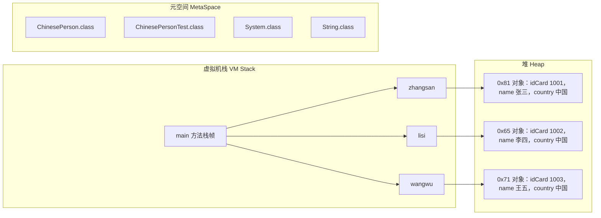
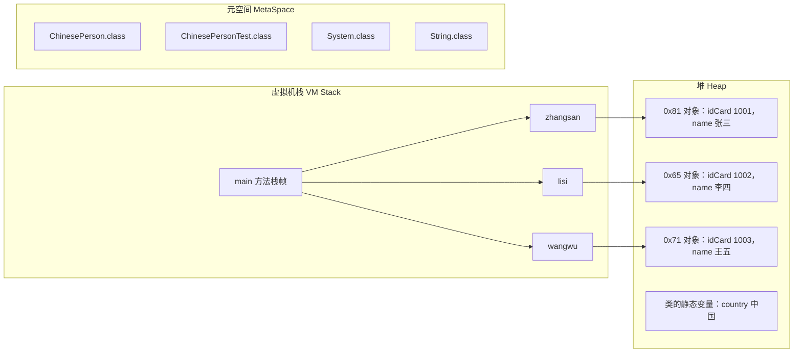
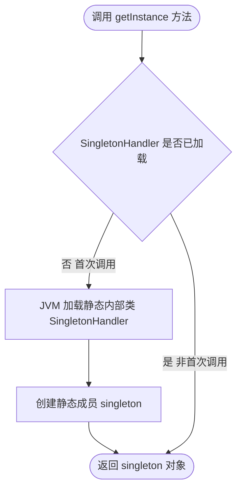

# static 关键字

static 是一个关键字，翻译成：静态的。下面我们来看看 static 关键字的特性：

- static 修饰的变量，叫做静态变量。当所有对象的某个属性的值是相同的，建议将该属性定义为静态变量，来节省内存开销。
- 静态变量在类加载时初始化，存储在堆中。
- static 修饰的方法叫做静态方法。
- 所有静态变量和静态方法，统一使用"类名."调用。虽然可以使用"引用."来调用，但实际运行时和对象无关，所以不建议这样写，因为这样写会给其他人造成疑惑。
- 使用"引用."访问静态相关的，即使引用为 null，也不会出现空指针异常。
- 静态方法中不能使用 this 关键字。因此无法直接访问实例变量和调用实例方法。
- 静态代码块在类加载时执行，一个类中可以编写多个静态代码块，遵循自上而下的顺序依次执行。
- 静态代码块代表了类加载时刻，如果你有代码需要在此时刻执行，可以将该代码放到静态代码块中。
- static 还可以修饰内部类，修饰内部类，它就是一个静态内部类。

---

## 1.1 static 关键字修饰变量

现在我们来看一个类（此时国籍还是实例变量）：

```java
package com.xq.demo1;

/**
 * static关键字：
 *       1. static翻译为静态的
 *       2. static修饰的变量：静态变量
 *       3. static修饰的方法：静态方法
 *       4. 所有static修饰的，访问的时候，直接采用“类名.”，不需要new对象。
 *       5. 什么情况下把成员变量定义为静态成员变量？
 *           当一个属性是对象级别的，这个属性通常定义为实例变量。（实例变量是一个对象一份。100个对象就应该有100个空间）
 */
public class ChinesePerson { // 中国人类

    /*int i; // 实例变量
    static int j; // 静态变量

    public static void main(String[] args) {
        int i; // 局部变量
    }*/

    // 身份证号
    String idCard;

    // 姓名
    String name;

    // 国籍
    String country = "中国";

    public ChinesePerson(String idCard, String name) {
        this.idCard = idCard;
        this.name = name;
    }

    public void display(){
        System.out.println("身份证号："+this.idCard+"，姓名："+this.name+"，国籍：" + this.country);
    }
}
```

现在我们来写一个测试类：

```java
package com.xq.demo1;

import java.util.concurrent.Callable;

/**
 * @author kriss
 * @version 1.0.0
 * @date 2025-06-09 16:52
 * @description TODO
 */
public class TestPerson {
    public static void main(String[] args) {
        // 创建三个中国人对象
        ChinesePerson zhangsan = new ChinesePerson("1001","张三");
        ChinesePerson lisi = new ChinesePerson("1002","李四");
        ChinesePerson wangwu = new ChinesePerson("1003","王五");

        // 使用实例对象调用display方法
        zhangsan.display();
        lisi.display();
        wangwu.display();

        System.out.println(ChinesePerson.country);

        // 不推荐使用对象调用静态变量，使用类名调用静态变量更加方便
        /*System.out.println(zhangsan.country);
        System.out.println(lisi.country);
        System.out.println(wangwu.country);*/

        // 静态方法的调用
        lisi.test();
       ChinesePerson c = null;
        // 使用一个空对象去访问静态方法，是不会报空指针异常的。因为静态方法的调用和对象无关。
        // 虽然我们通过对象进行静态方法的调用。在编译的时候，编译器会将对象替换成类名进行调用。
       c.test();
       // 使用类名调用静态方法
       ChinesePerson.test();
    }
}
```

> 💡 补充：课件里这个测试类叫 `ChineseTest`，配套源码中文件名为 `TestPerson.java`；源码是最终版本，还包含了后文才讲到的"用引用访问静态变量"与静态方法调用示例。

下面我们基于上面的代码，画出 3 个对象的内存图：



| 对象地址 | idCard | name | country |
| :--- | :--- | :--- | :--- |
| 0x81 | 1001 | 张三 | "中国" |
| 0x65 | 1002 | 李四 | "中国" |
| 0x71 | 1003 | 王五 | "中国" |

通过以上的内存图，我们发现什么问题：

当 country 国籍定义为实例变量的时候，每个对象中都有一个 country 变量，但是 country 的值永远都是"中国"，这个值不会因为对象的变化而发生变化。所有的 ChinesePerson 类型的对象的这个属性值都是一样的，如果还是将其定义为实例变量，有点浪费内存空间。

现在我们尝试对我们的代码进行优化：

**代码实现**

```java
package com.xq.demo1;

/**
 * static关键字:
 *   static可以修饰变量，这个变量就是静态变量
 *      访问静态变量的时候，我们可以直接使用类名.静态变量名去访问。
 *   小结： 什么时候用静态变量? 就是成员变量的值固定不变，我们可以将其设置成静态变量，因为在内存中不会占用过多的空间。静态变量只会
 *   在堆内存中维护一份数据。
 *         静态变量如何使用? 在数据类型前面加上一个static关键字。在调用的时候使用类名调用就可以了。
 *   在JDK8之后，静态变量是保存在堆内存中的。在类加载的时候初始化，并且只会被JVM加载1次。
 *
 *
 *   static修饰一个方法，这个方法就是静态方法。访问静态方法的时候，我们也可以使用类名直接访问
 *   小结：静态方法的声明：在方法的返回值前面加上一个static关键字
 *        静态方法的调用：
 *                     可以直接通过类名调用。也可以通过实例对象调用，但是不推荐。如果实例对象为null。使用空对象调用静态方法也不会报错，
 *                     因为静态方法的调用本身和对象是无关的。
 *                     在静态方法中不能使用非静态的资源(普通的变量、普通的方法)；在普通的方法中是可以直接访问静态的资源(静态的变量  静态的方法)
 *       为什么将一个方法声明称静态的方法:
 *                     一些具有工具性质的方法，我们可以使用静态关键字static修饰，将其描述称一个静态方法，方便调用。
 *                     比如: 读取项目中全局配置文件的方法。这个读取资源的方法在项目中的很多地方都用到了。为了避免写重复代码。我们将其定义成一个静态方法
 *                          这样不用写很多重复冗余的代码。并且通过类名调用即可。
 *                          在进行数据库的操作。 首先必须获取数据库连接。对数据表操作完毕之后，还需要关闭数据库连接资源。我们可以考虑将获取数据库连接的方法
 *                          关闭数据库连接的方法设置成静态方法。
 *
 */
public class ChinesePerson { // 中国人类

   /* int i; // 实例变量
    static int j; // 静态变量

    public static void main(String[] args) {
        int i = 0; //局部变量
    }*/

    // 身份证号
    String idCard;

    // 姓名
    String name;

    // 国籍
    static String country = "中国";

    public ChinesePerson(String idCard, String name) {
        this.idCard = idCard;
        this.name = name;
    }

    // 定义一个静态方法
    public static void test(){
        System.out.println("静态方法test执行了.....");

        // 报错，因为在静态方法中不能访问非静态的方法
        // display();
        // System.out.println(name);

        // 在静态方法中可以访问静态的资源(静态方法、静态变量)
        test02();
        System.out.println(country);
    }

    public static void test02(){
        System.out.println("这是test02静态方法");
    }

    // 展示用户信息的方法 这是一个非静态的方法
    public void display(){
        // 在普通方法的内部是可以直接访问静态的资源(静态变量、静态方法)
        test02();
        System.out.println(country);
        System.out.println("身份证编号:" + this.idCard + ",姓名:" + this.name + ",国籍:" + ChinesePerson.country);
    }
}
```

> 💡 补充：配套源码中的 `ChinesePerson.java` 是最终版本：`country` 已改为静态变量，并包含后文（1.2 节）才讲到的静态方法 `test()`、`test02()`；类注释也比课件里贴的更详细。

在测试类里面，我们对静态变量进行访问（完整测试类见上文）：

```java
System.out.println("国籍：" + ChinesePerson.country);
```

现在问题来了：静态变量存储在哪里？静态变量在什么时候初始化？（什么时候开辟空间）

答案：JDK8 之后：静态变量存储在堆内存当中。类加载时初始化，并且只会被 JVM 加载一次。

加了 static 变量的内存图怎么画呢：



当 country 变量声明为静态变量时，和对象就没有关系了。并且静态变量 country 在类加载时初始化。

**静态变量可以采用"引用."来访问吗？**

可以（但不建议：会给程序员造成困惑，程序员会认为 country 是一个实例变量。）建议还是使用"类名."来访问，这是正规的。

```java
System.out.println(zhangsan.country);
System.out.println(lisi.country);
System.out.println(wangwu.country);
```

静态变量也可以用"引用."访问，但是实际运行时和对象无关。所以以下程序也不会出现空指针异常。

```java
System.out.println(zhangsan.country);
System.out.println(lisi.country);
System.out.println(wangwu.country);
```

> 💡 补充：上面两段代码在课件里是完全相同的，按上下文第二段应当先把引用置空（如 `ChinesePerson zhangsan = null;`）再访问静态变量，以此说明"引用为 null 也不会空指针"。

什么时候会出现空指针异常？一个空引用访问实例相关的，都会出现空指针异常。

```java
System.out.println(zhangsan.name); // 会出现空指针异常
```

---

## 1.2 static 关键字修饰方法

在 ChinesePerson 中定义一个静态方法：

```java
public static void test(){
    System.out.println("静态方法test执行了");
}
```

静态方法也可以使用"引用."的方式来访问：

```java
zhangsan.test(); // 如果引用对象为null，也不会出现空指针异常。
```

但是这种访问是不建议的。静态方法就应该使用"类名."来访问。

```java
ChinesePerson.test();
```

在静态方法中，只能访问静态的资源，如果直接访问非静态的资源，会报错。课件里演示的静态方法如下（该类的最终完整版见 1.1 节）：

```java
// 静态方法
public static void test(){
    System.out.println("静态方法test执行了");

    // 这个不行
    //display();
    //System.out.println(name);

    // 这些可以
    System.out.println(ChinesePerson.country);
    System.out.println(country); // 在同一个类中，类名. 可以省略。

    // 这个可以
    //ChinesePerson.test02();
    test02();
}
```

> 💡 补充：课件这段片段把类名写作 `Chinese`、把方法写作 `test2()`，配套源码中统一为 `ChinesePerson` 和 `test02()`，这里按源码更正。

为什么？在 Java 中，静态资源在类加载的过程中被加载。当 JVM 加载一个类时，会先加载该类的静态资源，包括静态变量和静态方法，然后再加载非静态资源。

在静态方法中使用非静态资源，如果此时静态资源还没有被加载，这样调用就会有问题，所以在语法层面上，不允许在静态方法里面，直接访问非静态资源（除非你在静态方法中创建一个对象，通过对象进行调用）。

为了加深理解，我们再写一个例子，在 ChinesePerson 中定义如下：

```java
// 实例方法
public void doSome(){
    // 标准的访问方式
    /*  System.out.println(this.k);
    System.out.println(ChinesePerson.f);
    this.doOther1();
    ChinesePerson.doOther2();
    */

    // 省略的方式
    System.out.println(k);
    System.out.println(f);
    doOther1();
    doOther2();
}

// 实例变量
int k = 100;

// 静态变量
static int f = 1000;

// 实例方法
public void doOther1(){
    System.out.println("do other1....");
}

// 静态方法
public static void doOther2(){
    System.out.println("do other2....");
}
```

---

## 1.3 静态代码块

**语法格式**

```java
static{
    // 定义代码
}
```

下面我们来看一个例子：

```java
public class StaticTest01 {

    // 静态代码块
    static {
        System.out.println("静态代码块1执行了");
    }

    public static void main(String[] args) {
        System.out.println("main 方法执行了!");
    }

}
```

运行程序，程序的执行结果如下：

```text
静态代码块1执行了
main 方法执行了!
```

静态代码块在 main 方法之前执行，说明：静态代码块在类加载时执行，并且只执行一次。

静态代码块是可以写多个的，并且遵循自上而下的顺序，依次执行：

```java
public class StaticTest01 {

    // 静态代码块1
    static {
        System.out.println("静态代码块1执行了");
    }

    // 静态代码块2
    static {
        System.out.println("静态代码块2执行了");
    }

    public static void main(String[] args) {
        System.out.println("main 方法执行了!");
    }

    // 静态代码块3
    static {
        System.out.println("静态代码块3执行了");
    }

}
```

运行程序，程序的执行结果：

```text
静态代码块1执行了
静态代码块2执行了
静态代码块3执行了
main 方法执行了!
```

在静态代码块中能访问实例变量吗？不行，因为静态代码块在类加载的时候执行，此时实例对象还不存在。

```java
public class StaticTest01 {

    // 实例变量
    String name = "zhangsan";

    // 静态代码块1
    static {
        // 在静态代码块中访问实例对象
        // System.out.println(name); // 报错
        System.out.println("静态代码块1执行了");
    }

}
```

在静态代码块中是可以访问静态变量的，因为静态变量恰好在类加载时初始化的。下面是配套源码中的完整示例：

```java
package com.xq.demo2;

/**
 * 静态代码块的使用
 *   静态代码块在main方法之前执行 说明：静态代码块在类加载的时候执行，并且只执行1次
 *   在一个类中，我们可以定义多个静态代码块，多个静态代码块尊徐自上而下的执行顺序
 */
public class StaticTest {

    // 定义一个非静态的变量
    String name = "eric";

    // 声明一个静态的变量
    static int i = 100;

    static {
        // 不能在静态代码块中访问非静态的成员变量
        // System.out.println(name);
        System.out.println(i);
        // 定义代码
        System.out.println("静态代码块1执行了.....");
        // 报错，因为静态资源按照自上而下的加载顺序，此时静态变量j还没有初始化
        // System.out.println(j);
    }

    static int j = 101;

    static {
        System.out.println("静态代码块2执行了.....");
    }

    public static void main(String[] args) {
        System.out.println("main 方法执行了....");
    }

    static {
        System.out.println("静态代码块3执行了.....");
    }
    
}
```

> 💡 补充：课件里的示例类叫 `StaticTest01`、静态变量 `j` 取 100，配套源码中类名为 `StaticTest`、`j` 取 101，且加载顺序报错的那行已按注释关闭。

搞清楚静态代码块的用法之后，静态代码块什么时候用？

如果我们想要在类加载的时候，用于执行一次性的初始化操作。就可以使用静态代码块。比如读取配置文件、建立数据库连接等。静态代码块可以在类加载时预加载一些资源，以提高程序的性能。例如，可以在静态代码块中预加载一些常用的数据，减少后续操作的延迟。

---

## 1.4 静态内部类

static 关键字还可以修饰一个类。当在一个类的内部嵌套另外一个类的时候，这个内部类就可以使用 static 关键字修饰。我们也称为这个内部类是静态内部类。这意味着它不需要外部类的实例就可以被创建和使用。

静态内部类不能访问外部类的非静态成员（实例变量和实例方法），但可以访问外部类的静态成员（静态变量和静态方法）以及它自己的成员。

下面我们来看看其具体用法：

```java
package com.xq.demo3;

/**
 * 静态内部类的使用
 */
public class Outer {

    // 定义一个外部类的静态方法
    public static void out(){
        System.out.println("这是out外部类里面定义的静态方法");
    }

    // 定义一个外部类的非静态方法
    public void show(){
        System.out.println("这是out外部类里面定义的非静态方法");
    }

    static class Inner{ // 静态内部类

        static String username = "eric";

        // 在内部类里面定义一个非静态的方法
        public void inner(){ // 在内部类的普通方法中可以访问外部类的静态方法，但是不能访问外部类的普通方法
            out();
            // 报错
            // show();
        }

        // 在内部类里面定义一个静态的方法
        public static void staticInner(){ // 在内部类的静态方法中可以访问外部类的静态方法，不能访问外部类的普通方法
            out();
            // 报错
            // show();
        }
    }
}
```

定义一个测试类：

```java
package com.xq.demo3;

/**
 * 测试静态内部类的使用
 */
public class TestInnerClass {
    public static void main(String[] args) {
        // 调用静态内部类中的静态方法
        Outer.Inner.staticInner();
        // 访问静态内部类中的静态变量
        System.out.println(Outer.Inner.username);

        // 访问静态内部类中的非静态的方法
        Outer.Inner inner = new Outer.Inner();
        inner.inner();
    }
}
```

静态内部类的应用：实现单例设计模式

```java
package com.xq.demo3;

/**
 * 静态内部类的使用场景：创建单例对象
 *   在并发场景下面，单例对象的获取是线程安全的，并且实现了单例对象的创建是按需创建的。
 */
public class Singleton {

    private Singleton(){

    }

    static class SingletonHandler{
        private static Singleton singleton = new Singleton();
    }

    public static Singleton getInstance(){
        return SingletonHandler.singleton;
    }
}
```

测试：

```java
package com.xq.demo3;

/**
 * 测试单例对象
 */
public class TestSingleton {
    public static void main(String[] args) {
        Singleton o1 = Singleton.getInstance();
        Singleton o2 = Singleton.getInstance();
        System.out.println(o1 == o2);
    }
}
```

分析：

在这里，Singleton 的实例 singleton 被设置为静态内部类 SingletonHandler 的静态成员。当我们第一次调用 getInstance 方法，访问了 SingletonHandler.singleton，由于 SingletonHandler 是静态内部类，那么根据静态内部类的特性，就会触发该静态内部类的加载，即 JVM 就会帮我们完成静态成员 singleton 的创建，这样子，JVM 帮我们保证了线程安全，而且这还是懒加载的方式（需要才创建）。

后续再调用 getInstance 方法，由于实例已经创建好了，所以直接返回即可。

> 💡 补充：这段分析里前后分别把静态成员写成了 `singleton` 和 `INSTANCE`，配套源码中的字段名是 `singleton`。



> 💡 补充：课件把 `SingletonHandler` 写作 `private static class`，配套源码中是 `static class`（未加 private），核心逻辑一致。

这种实现单例设计模式的好处就是：在并发场景下面是线程安全的，并且实现了懒加载。
